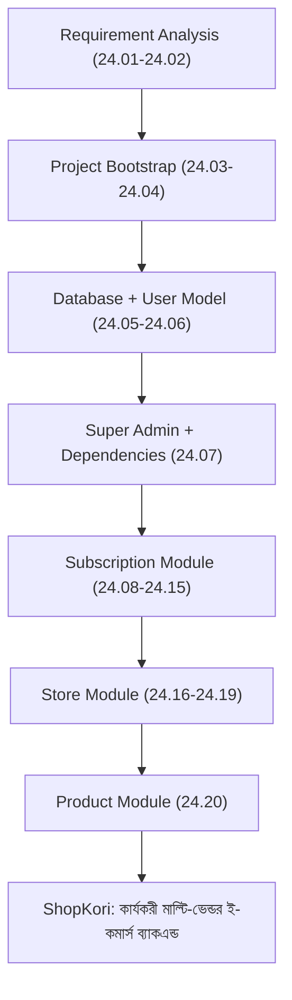

# ২৪.২০. Product Module Hands On

গত লেসনে আমরা প্রমাণ করেছি User, Subscription, আর Store — তিনটা মডিউল একসাথে সঠিকভাবে কাজ করছে। এখন এই মডিউলের শেষ ধাপ — **Product**, যেটাই আসলে ShopKori-এর আসল বিজনেস ভ্যালু। এতদিনের সব কাজ — সাবস্ক্রিপশন, স্টোর — এই মুহূর্তের প্রস্তুতি মাত্র, কারণ প্রোডাক্ট ছাড়া কোনো ই-কমার্স প্ল্যাটফর্মের কোনো অর্থই নেই।

Module 24.02-এর ERD অনুযায়ী মনে করিয়ে দেই — প্রোডাক্টের দুইটা সম্পর্ক থাকবে: `Store`-এর সাথে (মালিকানা) আর `Category`-এর সাথে (শ্রেণীবিন্যাস, ঐচ্ছিক)। প্রথমে `Category` মডেল বানাই, এটা সবচেয়ে সহজ, কোনো নির্ভরতা ছাড়া:

```python
# app/modules/product/models.py
import uuid
from datetime import datetime

from sqlalchemy import String, Numeric, Integer, ForeignKey, DateTime, func
from sqlalchemy.orm import Mapped, mapped_column, relationship

from app.database import Base


class Category(Base):
    __tablename__ = "categories"

    id: Mapped[uuid.UUID] = mapped_column(primary_key=True, default=uuid.uuid4)
    name: Mapped[str] = mapped_column(String(80), unique=True)

    products: Mapped[list["Product"]] = relationship(back_populates="category")


class Product(Base):
    __tablename__ = "products"

    id: Mapped[uuid.UUID] = mapped_column(primary_key=True, default=uuid.uuid4)
    store_id: Mapped[uuid.UUID] = mapped_column(
        ForeignKey("stores.id", ondelete="CASCADE")
    )
    category_id: Mapped[uuid.UUID | None] = mapped_column(
        ForeignKey("categories.id"), nullable=True
    )
    title: Mapped[str] = mapped_column(String(200))
    price: Mapped[float] = mapped_column(Numeric(10, 2))
    stock: Mapped[int] = mapped_column(Integer, default=0)
    created_at: Mapped[datetime] = mapped_column(
        DateTime(timezone=True), server_default=func.now()
    )

    store: Mapped["Store"] = relationship(back_populates="products")
    category: Mapped["Category | None"] = relationship(back_populates="products")
```

লক্ষ্য করো `category_id` `nullable=True` — Module 24.02-এর সিদ্ধান্ত অনুযায়ী, `store_id` বাধ্যতামূলক (মালিকানা ছাড়া প্রোডাক্ট থাকতেই পারে না) কিন্তু `category_id` ঐচ্ছিক (শ্রেণীবিন্যাস ছাড়াও প্রোডাক্ট থাকতে পারে)। `store` আর `category` relationship-এ স্ট্রিং টাইপ হিন্ট ব্যবহার করেছি (`"Store"`), কারণ `store/models.py` থেকে সরাসরি ইমপোর্ট করলে একটা সার্কুলার ইমপোর্ট তৈরি হতো — `store/models.py`-ও `Product`-এর রেফারেন্স রাখে (Module 24.17-এ দেখেছিলাম)। SQLAlchemy-এর string-based relationship resolution ঠিক এই সমস্যা সমাধানের জন্যই ডিজাইন করা।

Pydantic স্কিমা — `app/modules/product/schemas.py`:

```python
from decimal import Decimal
from uuid import UUID

from pydantic import BaseModel, ConfigDict, Field


class CreateProductSchema(BaseModel):
    title: str = Field(max_length=200)
    price: Decimal = Field(gt=0)
    stock: int = Field(ge=0)
    category_id: UUID | None = None


class ProductReadSchema(BaseModel):
    model_config = ConfigDict(from_attributes=True)

    id: UUID
    store_id: UUID
    category_id: UUID | None
    title: str
    price: Decimal
    stock: int
```

`ProductService`-এর সবচেয়ে গুরুত্বপূর্ণ কাজ হলো এই যাচাই করা — যে ইউজার প্রোডাক্ট যোগ করছে, সে আসলেই সেই স্টোরের মালিক কিনা। এটাই এই মডিউলের নিরাপত্তার মূল বিষয়, নাহলে যেকোনো স্টোর ওউনার অন্যের স্টোরে প্রোডাক্ট ঢুকিয়ে দিতে পারতো — এটা একটা ক্লাসিক **IDOR (Insecure Direct Object Reference)** vulnerability, যেখানে URL-এর `store_id` পাল্টে দিয়ে অন্যের রিসোর্সে অ্যাক্সেস পাওয়া যায় যদি ownership যাচাই না করা হয়:

```python
# app/modules/product/service.py
from uuid import UUID

from fastapi import HTTPException, status
from sqlalchemy import select
from sqlalchemy.orm import Session

from app.modules.product.models import Product
from app.modules.product.schemas import CreateProductSchema
from app.modules.store import repository as store_repository


def create_product(
    db: Session, owner_id: UUID, store_id: UUID, data: CreateProductSchema
) -> Product:
    owner_stores = store_repository.find_by_owner(db, owner_id)
    owns_store = any(store.id == store_id for store in owner_stores)

    if not owns_store:
        raise HTTPException(
            status_code=status.HTTP_403_FORBIDDEN,
            detail="এই স্টোরে প্রোডাক্ট যোগ করার অনুমতি তোমার নেই।",
        )

    product = Product(**data.model_dump(), store_id=store_id)
    db.add(product)
    db.commit()
    db.refresh(product)
    return product


def find_by_store(db: Session, store_id: UUID) -> list[Product]:
    stmt = select(Product).where(Product.store_id == store_id)
    return db.scalars(stmt).all()
```

`app/modules/product/router.py`:

```python
from uuid import UUID

from fastapi import APIRouter, Depends
from sqlalchemy.orm import Session

from app.common.dependencies import require_roles
from app.database import get_db
from app.modules.product import service
from app.modules.product.schemas import CreateProductSchema, ProductReadSchema
from app.modules.user.models import User, UserRole

router = APIRouter(prefix="/stores/{store_id}/products", tags=["products"])


@router.post("", response_model=ProductReadSchema, status_code=201)
def create_product(
    store_id: UUID,
    data: CreateProductSchema,
    db: Session = Depends(get_db),
    current_user: User = Depends(require_roles(UserRole.STORE_OWNER)),
):
    return service.create_product(db, current_user.id, store_id, data)


@router.get("", response_model=list[ProductReadSchema])
def list_by_store(store_id: UUID, db: Session = Depends(get_db)):
    return service.find_by_store(db, store_id)
```

`app/main.py`-তে রুটার রেজিস্টার করি, আর মডেলগুলো `alembic/env.py`-তে ইমপোর্ট করে দিই:

```python
from app.modules.product.router import router as product_router
app.include_router(product_router)
```

```python
# alembic/env.py
from app.modules.product.models import Product, Category  # noqa: F401
```

মাইগ্রেশন জেনারেট আর রান করে দিলে ডেটাবেজে `products` আর `categories` টেবিল তৈরি হয়ে যাবে:

```bash
alembic revision --autogenerate -m "create products and categories tables"
alembic upgrade head
```

**একটা শেষ, গুরুত্বপূর্ণ প্রোডাকশন-এজ কেস** — `stock: Mapped[int]`-এ `default=0` রাখা মানে নতুন প্রোডাক্ট ডিফল্টভাবে "স্টকে নেই" অবস্থায় তৈরি হয়। কিন্তু যখন কাস্টমার-সাইড অর্ডার-ফ্লো পরের মডিউলে যুক্ত হবে, `stock` কমানোর অপারেশনটা একটা ক্লাসিক **race condition** এলাকা — দুইজন কাস্টমার একই সময়ে একই প্রোডাক্টের শেষ ১টা ইউনিট কিনতে চাইলে, দুটো রিকোয়েস্টই যদি "stock > 0" চেক করে পাস করে যায় আগে থেকে ডিক্রিমেন্ট না করে, তাহলে স্টক নেগেটিভ হয়ে যেতে পারে (`-1` ইউনিট বিক্রি!)। এই সমস্যার সঠিক সমাধান হলো ডেটাবেজ-লেভেল atomic update — `UPDATE products SET stock = stock - 1 WHERE id = ? AND stock > 0`-এর মতো একটা single SQL স্টেটমেন্ট, যেখানে চেক আর আপডেট একই atomic অপারেশনে হয়, Python কোডে দুই ধাপে ভাগ না করে। আমরা এই মডিউলে `stock` ফিল্ড তৈরি করলাম, কিন্তু এই race-condition-নিরাপদ ডিক্রিমেন্ট লজিক আসবে পরের মডিউলে, যখন অর্ডার ফ্লো বানানো হবে — এখন থেকেই এই সতর্কতা মাথায় রাখা একজন lead ইঞ্জিনিয়ারের কাজ।

এখন Module 24.01-এ যে চারটা মডিউল রোডম্যাপে রাখা হয়েছিল — User, Subscription, Store, Product — সবগুলোই বাস্তবে দাঁড়িয়ে গেছে, একটার উপর আরেকটা নির্ভর করে, একটা সম্পূর্ণ, পরীক্ষিত সিস্টেম হিসেবে। পুরো যাত্রাটা একবার সংক্ষেপে দেখা যাক:



এই মডিউলে তুমি শুধু FastAPI-এর সিনট্যাক্স শেখোনি — তুমি দেখেছো কীভাবে একটা বাস্তব প্রজেক্ট রিকোয়ারমেন্ট থেকে শুরু হয়ে, ধাপে ধাপে, প্রতিটা সিদ্ধান্তের পেছনে যুক্তি রেখে (আর প্রতিটা ধাপে সম্ভাব্য প্রোডাকশন সমস্যা — connection pool exhaustion, N+1 কোয়েরি, race condition, IDOR — মাথায় রেখে) একটা কার্যকরী সিস্টেমে রূপান্তরিত হয়। এখনো বাকি আছে অনেক কিছু — প্রোডাক্ট সার্চ, অর্ডার ফ্লো, পেমেন্ট, রিভিউ, আরও গভীর অথেন্টিকেশন আর অথোরাইজেশন প্যাটার্ন। ঠিক এই জায়গা থেকেই পরবর্তী মডিউল শুরু হবে, যেখানে আমরা রাউটিং, মিডলওয়্যার, JWT-বেজড সম্পূর্ণ অথেন্টিকেশন সিস্টেম, আর RBAC আরও গভীরভাবে শিখবো, ঠিক এই ShopKori কোডবেসের উপরেই দাঁড়িয়ে।
