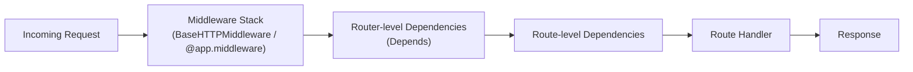

# ২৫.০১. Routing and Middleware in FastAPI

Module 24-এ আমরা একটা পুরো ই-কমার্স ব্যাকএন্ড বানিয়ে ফেলেছি — সুপার অ্যাডমিন API, সাবস্ক্রিপশন মডিউল, স্টোর মডিউল, প্রোডাক্ট মডিউল, সব মিলিয়ে একটা কাজ-করা সিস্টেম। কিন্তু একটা প্রজেক্ট "কাজ করে" আর "প্রোডাকশনে চালানোর যোগ্য" — এই দুইটার মধ্যে অনেক ফারাক। এই মডিউল থেকে আমরা ঠিক সেই ফারাকটা ঘোচানো শুরু করবো, একই ই-কমার্স প্রজেক্টকে ধাপে ধাপে "লেভেল আপ" করে — শুধু এবার FastAPI দিয়ে।

Module 4-এ আমরা `@app.get("/")`-এর মতো সিঙ্গেল-ফাইল রুট লিখেছিলাম। কিন্তু বাস্তবে একটা ই-কমার্স প্রজেক্টে অনেক ডোমেইন থাকে — auth, store, product, order। সবকিছু একটা `main.py`-তে লিখলে ফাইলটা কয়েক হাজার লাইনের একটা "স্প্যাগেটি" হয়ে যাবে। এই সমস্যার সমাধান হলো **APIRouter** — FastAPI-এর নিজস্ব উপায়, একটা বড় অ্যাপ্লিকেশনকে ছোট ছোট, স্বাধীনভাবে টেস্টযোগ্য টুকরায় ভাগ করার।

## APIRouter দিয়ে রুট ভাগ করা

```python
# store/router.py
from fastapi import APIRouter, Depends

router = APIRouter(
    prefix="/stores",
    tags=["stores"],
)


@router.get("/")
async def list_stores():
    return {"stores": []}


@router.post("/")
async def create_store(dto: CreateStoreDto):
    return {"message": "স্টোর তৈরি হলো"}
```

```python
# main.py
from fastapi import FastAPI
from store.router import router as store_router
from product.router import router as product_router

app = FastAPI()

app.include_router(store_router)
app.include_router(product_router)
```

লক্ষ্য করো, `prefix="/stores"` দেওয়ার ফলে `router.py`-এর ভেতরে `@router.get("/")` লিখলেই সেটা আসলে `/stores/` হয়ে যায় — প্রতিটা রুটে বারবার `/stores` লেখার দরকার নেই। `tags=["stores"]` অংশটা কোনো ফাংশনালিটি বদলায় না, কিন্তু `/docs`-এর Swagger UI-তে সব রুটকে গ্রুপ করে দেখায়, যেটা টিম বড় হলে ডকুমেন্টেশন পড়া সহজ করে দেয়।

এটাই NestJS-এর `@Module({ controllers: [StoreController] })`-এর FastAPI সমতুল্য — শুধু NestJS ক্লাস আর ডেকোরেটরে বাঁধা, FastAPI ফাংশন আর `APIRouter`-এ বাঁধা। কাঠামোগত সিদ্ধান্তটা একই: প্রতিটা ডোমেইন নিজের ফাইলে/ফোল্ডারে বাস করবে।

## Router-লেভেল Dependencies — একসাথে সব রুট প্রোটেক্ট করা

একটা গুরুত্বপূর্ণ সুবিধা হলো, `APIRouter`-এর নিজের `dependencies` প্যারামিটার দিয়ে পুরো রুটারের সব এন্ডপয়েন্টে একটা কমন চেক বসিয়ে দেয়া যায় — যেমন "এই পুরো রুটারের সব রুটেই লগইন করা থাকতে হবে":

```python
# admin/router.py
from fastapi import APIRouter, Depends
from auth.dependencies import get_current_user

router = APIRouter(
    prefix="/admin",
    tags=["admin"],
    dependencies=[Depends(get_current_user)],  # প্রতিটা রুটে স্বয়ংক্রিয়ভাবে চলবে
)
```

এটা NestJS-এর `@UseGuards()` কে কন্ট্রোলার-লেভেলে বসানোর সমতুল্য — পার্থক্য হলো FastAPI-তে `Depends()` শুধু auth-এর জন্য না, যেকোনো "রুট চালানোর আগে চালাতে হবে এমন লজিক"-এর একটা সার্বজনীন প্যাটার্ন, যেটা আমরা পরের কয়েকটা লেসনেই বারবার দেখবো।

## Middleware — ফাংশন-ভিত্তিক বনাম ক্লাস-ভিত্তিক

FastAPI-তে middleware লেখার দুটো পদ্ধতি আছে। প্রথমটা, ফাংশন-ভিত্তিক, সবচেয়ে বেশি দেখা যায়:

```python
import time
from fastapi import FastAPI, Request

app = FastAPI()


@app.middleware("http")
async def log_requests(request: Request, call_next):
    start = time.time()
    response = await call_next(request)
    duration = (time.time() - start) * 1000
    print(f"{request.method} {request.url.path} -> {response.status_code} ({duration:.1f}ms)")
    return response
```

দ্বিতীয় পদ্ধতি, ক্লাস-ভিত্তিক (`BaseHTTPMiddleware`), তখন দরকার হয় যখন middleware-টা reusable হতে হবে, একাধিক অ্যাপ্লিকেশনে বা কনফিগারযোগ্যভাবে ব্যবহার করতে হবে:

```python
# common/middleware.py
from starlette.middleware.base import BaseHTTPMiddleware
from starlette.requests import Request
import time
import logging

logger = logging.getLogger("request_logger")


class RequestLoggerMiddleware(BaseHTTPMiddleware):
    async def dispatch(self, request: Request, call_next):
        start = time.time()
        response = await call_next(request)
        duration = (time.time() - start) * 1000
        logger.info(f"{request.method} {request.url.path} -> {response.status_code} ({duration:.1f}ms)")
        return response
```

```python
# main.py
app.add_middleware(RequestLoggerMiddleware)
```

দুটোর ফলাফল একই, কিন্তু গঠনগত পার্থক্য মনে রাখার মতো। NestJS-এ middleware বলতে সবসময় একটা ক্লাস বোঝানো হয় (`implements NestMiddleware`), কারণ NestJS-এর পুরো ফিলোসফিই ক্লাস আর DI-কেন্দ্রিক। FastAPI-তে ফাংশন-ভিত্তিক `@app.middleware("http")` বেশি "Pythonic" এবং ছোট কাজের জন্য যথেষ্ট, কিন্তু `BaseHTTPMiddleware` ক্লাস ব্যবহার করলে কনস্ট্রাক্টরে প্যারামিটার (যেমন কোন পাথ স্কিপ করবে) পাস করা যায়, যা ফাংশন-ভিত্তিক পদ্ধতিতে অস্বস্তিকর হয়ে যায়।



## প্রোডাকশন নুয়ান্স — Middleware অর্ডার আর `call_next` ভুলে যাওয়া

একটা সাধারণ ভুল যেটা নতুন ডেভেলপাররা করে — `call_next(request)` কল করতে ভুলে যাওয়া বা তার রিটার্ন ভ্যালু রিটার্ন না করা। যদি middleware-এর ভেতরে কোনো শর্তে `return call_next(request)` না লিখে সরাসরি `return response_object` লেখা হয়, তাহলে রিকোয়েস্ট কখনো handler-এ পৌঁছায় না — অ্যাপ্লিকেশন সাইলেন্টলি আটকে যায়, কোনো এরর ছাড়াই, ডিবাগ করা কঠিন হয়ে পড়ে।

আরেকটা গুরুত্বপূর্ণ প্রোডাকশন গোচা — **middleware রেজিস্ট্রেশনের অর্ডার**। FastAPI-তে `add_middleware()` যেভাবে কল করা হয়, তার বিপরীত ক্রমে (reverse order) middleware-গুলো execute হয়। মানে তুমি যদি প্রথমে `CORSMiddleware` আর পরে `RequestLoggerMiddleware` যোগ করো, তাহলে রানটাইমে `RequestLoggerMiddleware` আগে চলবে, `CORSMiddleware` পরে। এটা ভুলে গিয়ে অনেকে দেখে যে তাদের authentication middleware আসলে CORS-এর preflight (`OPTIONS`) রিকোয়েস্টেও চলছে আর 401 রিটার্ন করছে, ব্রাউজার থেকে করা প্রতিটা রিকোয়েস্ট ব্যর্থ হচ্ছে — কারণ middleware অর্ডার তারা যেভাবে ভেবেছিল তার উল্টো ছিল। নিয়ম হলো: যেটা "সবচেয়ে বাইরের" স্তর হওয়া উচিত (যেমন CORS, বা সবচেয়ে বেসিক লগিং) সেটা কোডে **সবার শেষে** `add_middleware()` করতে হবে।

আরও একটা গুরুত্বপূর্ণ বিষয় — `BaseHTTPMiddleware` ব্যবহার করলে স্ট্রিমিং রেসপন্স (`StreamingResponse`) সামলানোর সময় সতর্ক থাকতে হয়, কারণ পুরনো Starlette ভার্সনে এটা রেসপন্স বডি সম্পূর্ণভাবে মেমরিতে বাফার করে ফেলতো, বড় ফাইল ডাউনলোড এন্ডপয়েন্টে এটা মেমরি সমস্যা তৈরি করতে পারতো। আধুনিক Starlette-এ এটা ঠিক হয়েছে, কিন্তু প্রোডাকশনে dependency ভার্সন লক করে রাখা এবং লোড টেস্ট করে দেখাটা জরুরি।

পরের লেসনে আমরা ঠিক এই পাইপলাইনের একটা গুরুত্বপূর্ণ স্তর — Authentication — নিয়ে কাজ শুরু করবো, JWT আর OAuth2 ব্যবহার করে আমাদের ই-কমার্স প্রজেক্টের লগইন সিস্টেম বানাবো।
