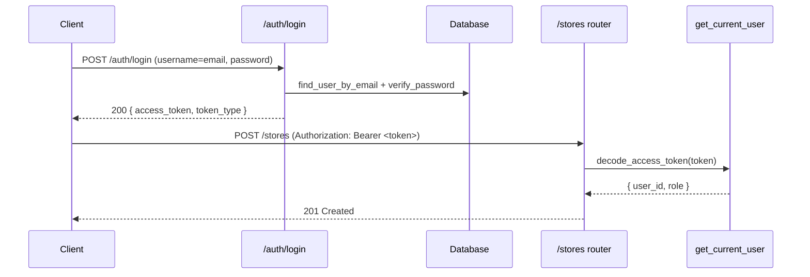

# ২৫.০২. Authentication with JWT and OAuth2

Module 12-এ তুমি JWT-এর মূল ধারণাটা শিখেছিলে — ইউজার লগইন করলে সার্ভার একটা টোকেন ইস্যু করে, ইউজার প্রতিটা পরের রিকোয়েস্টে সেই টোকেন সাথে নিয়ে আসে, সার্ভার সেটা ভেরিফাই করে বুঝে নেয় ইউজারটা কে। এখন প্রশ্ন হলো — আমাদের Module 24-এর ই-কমার্স প্রজেক্টে (যেখানে সুপার অ্যাডমিন, স্টোর মালিক, কাস্টমার — একাধিক ধরনের ইউজার আছে) এই জিনিসটা FastAPI-এর নিয়মে কীভাবে বসাবো?

NestJS-এর জগতে এই কাজটা করে Passport — একটা আলাদা, প্লাগেবল লাইব্রেরি, যেটা "স্ট্র্যাটেজি" প্যাটার্নে চলে। FastAPI-এর দর্শন এখানে ভিন্ন — এখানে কোনো আলাদা "Passport"-এর মতো ভারী লাইব্রেরি নেই, কারণ FastAPI নিজের ভেতরেই OAuth2-এর জন্য প্রয়োজনীয় বিল্ডিং ব্লক (`OAuth2PasswordBearer`, `OAuth2PasswordRequestForm`) নিয়ে আসে, আর বাকি কাজ — টোকেন সাইন করা, ভেরিফাই করা — তুমি নিজে সাধারণ Python ফাংশন দিয়ে লিখো, `python-jose` বা `PyJWT` লাইব্রেরি দিয়ে। এটা প্রথমে "কম রেডিমেড" মনে হতে পারে, কিন্তু বাস্তবে এটা বেশি স্বচ্ছতা দেয় — প্রতিটা ধাপ ঠিক কী করছে সেটা কোডেই দেখা যায়, কোনো "ম্যাজিক" ক্লাসের ভেতরে হারিয়ে যায় না।

## পাসওয়ার্ড হ্যাশ করা — passlib দিয়ে

লগইনের আগেই দরকার একটা নিরাপদ পাসওয়ার্ড হ্যাশিং মেকানিজম। কখনোই প্লেইন টেক্সট পাসওয়ার্ড ডেটাবেজে রাখা উচিত না।

```bash
pip install "passlib[bcrypt]" python-jose[cryptography] python-multipart
```

```python
# auth/security.py
from passlib.context import CryptContext

pwd_context = CryptContext(schemes=["bcrypt"], deprecated="auto")


def hash_password(plain_password: str) -> str:
    return pwd_context.hash(plain_password)


def verify_password(plain_password: str, hashed_password: str) -> bool:
    return pwd_context.verify(plain_password, hashed_password)
```

`CryptContext(schemes=["bcrypt"], deprecated="auto")` অংশটা গুরুত্বপূর্ণ — এটা ভবিষ্যতে হ্যাশিং অ্যালগরিদম বদলাতে হলে (যেমন `bcrypt` থেকে `argon2`-এ) পুরনো হ্যাশগুলোকে "deprecated" হিসেবে চিনে রাখে, নতুন লগইনের সময় স্বয়ংক্রিয়ভাবে নতুন অ্যালগরিদমে রি-হ্যাশ করার সুযোগ দেয়।

## JWT টোকেন তৈরি আর ভেরিফাই করা

```python
# auth/jwt_handler.py
from datetime import datetime, timedelta, timezone
from jose import jwt, JWTError

SECRET_KEY = "খুবই-গোপন-একটা-চাবি"  # প্রোডাকশনে .env থেকে আসবে
ALGORITHM = "HS256"
ACCESS_TOKEN_EXPIRE_MINUTES = 30


def create_access_token(data: dict) -> str:
    to_encode = data.copy()
    expire = datetime.now(timezone.utc) + timedelta(minutes=ACCESS_TOKEN_EXPIRE_MINUTES)
    to_encode.update({"exp": expire})
    return jwt.encode(to_encode, SECRET_KEY, algorithm=ALGORITHM)


def decode_access_token(token: str) -> dict:
    return jwt.decode(token, SECRET_KEY, algorithms=[ALGORITHM])
```

## OAuth2PasswordBearer — FastAPI-এর বিল্ট-ইন স্কিম

```python
# auth/dependencies.py
from fastapi import Depends, HTTPException, status
from fastapi.security import OAuth2PasswordBearer
from jose import JWTError

oauth2_scheme = OAuth2PasswordBearer(tokenUrl="auth/login")


async def get_current_user(token: str = Depends(oauth2_scheme)) -> dict:
    credentials_exception = HTTPException(
        status_code=status.HTTP_401_UNAUTHORIZED,
        detail="টোকেন যাচাই করা যায়নি",
        headers={"WWW-Authenticate": "Bearer"},
    )
    try:
        payload = decode_access_token(token)
        user_id: str = payload.get("sub")
        role: str = payload.get("role")
        if user_id is None:
            raise credentials_exception
    except JWTError:
        raise credentials_exception

    return {"user_id": user_id, "role": role}
```

`OAuth2PasswordBearer(tokenUrl="auth/login")` জিনিসটা লক্ষ্য করার মতো — এটা নিজে কোনো ভেরিফিকেশন করে না, শুধু FastAPI-কে বলে দেয় `Authorization: Bearer <token>` হেডার থেকে টোকেনটা কীভাবে বের করতে হবে, আর `/docs`-এর Swagger UI-তে একটা "Authorize" বাটন দেখায় যেখানে টেস্টের জন্য টোকেন বসানো যায়। আসল ভেরিফিকেশনের কাজ `get_current_user` ফাংশনটাই করছে — আর এই ফাংশনটাই এখন একটা **dependency**, যেটা যেকোনো রুটে `Depends(get_current_user)` লিখে বসিয়ে দেওয়া যাবে।

## লগইন এন্ডপয়েন্ট আর প্রোটেক্টেড রুট

```python
# auth/router.py
from fastapi import APIRouter, Depends, HTTPException, status
from fastapi.security import OAuth2PasswordRequestForm

router = APIRouter(prefix="/auth", tags=["auth"])


@router.post("/login")
async def login(form_data: OAuth2PasswordRequestForm = Depends()):
    user = await find_user_by_email(form_data.username)  # OAuth2 ফর্মে ইমেইলও "username" ফিল্ডে আসে
    if not user or not verify_password(form_data.password, user.hashed_password):
        raise HTTPException(
            status_code=status.HTTP_401_UNAUTHORIZED,
            detail="ভুল ইমেইল বা পাসওয়ার্ড",
        )

    token = create_access_token({"sub": user.id, "role": user.role})
    return {"access_token": token, "token_type": "bearer"}
```

```python
# store/router.py
from fastapi import APIRouter, Depends
from auth.dependencies import get_current_user

router = APIRouter(prefix="/stores", tags=["stores"])


@router.post("/")
async def create_store(dto: CreateStoreDto, current_user: dict = Depends(get_current_user)):
    return await store_service.create(current_user["user_id"], dto)
```



## NestJS-এর তুলনা

NestJS-এ `JwtStrategy.validate()` একটা ক্লাস-মেথড, যেটা `@nestjs/passport`-এর ভেতরে বাঁধা, আর `@UseGuards(AuthGuard('jwt'))` দিয়ে বসানো হয়। FastAPI-তে সমতুল্য কাজটা `get_current_user` নামের একটা প্লেইন async ফাংশন, `Depends()` দিয়ে বসানো — কোনো আলাদা "Guard" ক্লাস, কোনো `@Injectable()` ডেকোরেটর নেই। এই পার্থক্যটাই FastAPI-এর ডিজাইন ফিলোসফির একটা বড় উদাহরণ — dependency injection এখানে ফাংশন-কেন্দ্রিক, ক্লাস-কেন্দ্রিক নয়।

## প্রোডাকশন নুয়ান্স — টোকেন এক্সপায়ারি, রিফ্রেশ টোকেন, আর ক্লক স্কিউ

একটা সাধারণ ভুল হলো `ACCESS_TOKEN_EXPIRE_MINUTES` অনেক বড় (যেমন কয়েক দিন) রাখা "ইউজার এক্সপেরিয়েন্স ভালো করার" জন্য। এটা একটা নিরাপত্তা ঝুঁকি — টোকেন চুরি হয়ে গেলে (যেমন XSS অ্যাটাক দিয়ে লোকাল স্টোরেজ থেকে) অ্যাটাকার দীর্ঘদিন সেটা ব্যবহার করতে পারবে, কারণ JWT স্বভাবতই **stateless** — একবার সাইন হয়ে গেলে, এক্সপায়ার হওয়ার আগে সার্ভারের পক্ষে সেটা "বাতিল" করা সম্ভব নয় (কোনো ডেটাবেজ লুকআপ ছাড়া)। বাস্তব প্রোডাকশন সিস্টেমে এই সমস্যার সমাধান হলো ছোট-জীবনের **access token** (১৫-৩০ মিনিট) আর দীর্ঘ-জীবনের **refresh token** (ডেটাবেজে সংরক্ষিত, revoke করা যায়) — access token এক্সপায়ার হলে ক্লায়েন্ট refresh token দিয়ে নতুন access token চায়, আর refresh token চুরি হলে সেটা ডেটাবেজ থেকে ডিলিট করে দেওয়া যায়।

আরেকটা বাস্তব গোচা — **clock skew**। যদি তোমার সার্ভার একাধিক মেশিনে চলে (Module 11-এর স্কেলিং লেসনে আসবে) আর তাদের সিস্টেম ক্লক কয়েক সেকেন্ড আলাদা থাকে, তাহলে একটা মেশিনে ইস্যু করা টোকেন আরেকটা মেশিনে "এখনো ভবিষ্যতের" (`iat` টাইম এখনো আসেনি) বলে রিজেক্ট হতে পারে। `python-jose`-এ `leeway` প্যারামিটার দিয়ে কয়েক সেকেন্ডের সহনশীলতা যোগ করা এই সমস্যার একটা প্রচলিত সমাধান।

সবশেষে — `SECRET_KEY` কখনোই সোর্স কোডে হার্ডকোড করে রাখা উচিত না (উপরের উদাহরণে শুধু বোঝানোর জন্য রাখা হয়েছে)। এটা `.env` ফাইল থেকে আসা উচিত, আর প্রোডাকশনে অন্তত ৩২ বাইট লম্বা, র‍্যান্ডমলি জেনারেট করা একটা string হওয়া উচিত — ছোট বা অনুমানযোগ্য secret key দিয়ে সাইন করা টোকেন brute-force করে ভাঙা সম্ভব।

এখন আমাদের সিস্টেম জানে "কে" রিকোয়েস্ট করছে। কিন্তু শুধু "কে" জানলেই তো চলবে না — সুপার অ্যাডমিন যা করতে পারবে, স্টোর মালিক তা পারবে না। "কে" থেকে "সে কী করতে পারবে"-তে যাওয়াটাই হলো পরের লেসনের বিষয় — Authorization আর Role-Based Access Control।
