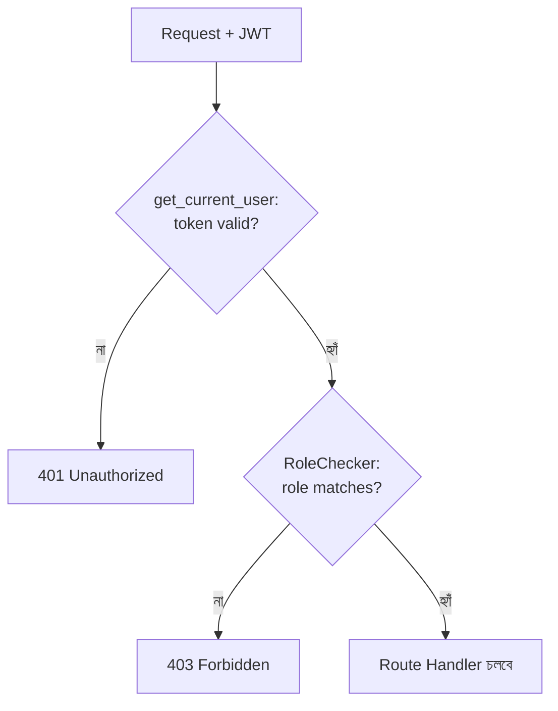

# ২৫.০৩. Authorization and Role-Based Access Control (RBAC)

Module 21-এ ডেটাবেজ স্তরে RBAC নিয়ে কথা হয়েছিলো — কীভাবে একটা ডেটাবেজ ইউজারকে নির্দিষ্ট টেবিলে GRANT/REVOKE দিয়ে অনুমতি দেয়া বা কেড়ে নেয়া যায়। এখন আমরা একই ধারণাটা অ্যাপ্লিকেশন স্তরে নিয়ে আসছি — আমাদের ই-কমার্স প্রজেক্টে তিন ধরনের ইউজার আছে ধরে নাও: `SUPER_ADMIN`, `STORE_OWNER`, `CUSTOMER`। প্রতিটা এন্ডপয়েন্টের একটা নিয়ম আছে কোন রোল সেটা অ্যাক্সেস করতে পারবে।

আগের লেসনে `get_current_user`-এর রিটার্ন ভ্যালুতে আমরা `role` বসিয়ে দিয়েছিলাম। এখন সেই রোলটা যাচাই করার জন্য FastAPI-তে সবচেয়ে প্রচলিত পদ্ধতি হলো একটা **dependency chain** বানানো — একটা dependency যেটা আরেকটা dependency-র উপর নির্ভর করে, আর নির্দিষ্ট রোলের জন্য কাস্টমাইজ করা যায়।

## সহজ পদ্ধতি — একটা factory ফাংশন

```python
# common/permissions.py
from fastapi import Depends, HTTPException, status
from auth.dependencies import get_current_user


def require_roles(*allowed_roles: str):
    async def role_checker(current_user: dict = Depends(get_current_user)) -> dict:
        if current_user["role"] not in allowed_roles:
            raise HTTPException(
                status_code=status.HTTP_403_FORBIDDEN,
                detail="এই কাজ করার অনুমতি তোমার নেই",
            )
        return current_user
    return role_checker
```

এখানে `require_roles` একটা **factory function** — এটা `Depends()`-এর জন্য উপযোগী একটা নতুন ফাংশন রিটার্ন করে, যেটার ভেতরে `allowed_roles` "মনে রাখা" আছে (একটা closure)। ব্যবহার করা হয় এভাবে:

```python
# admin/router.py
from fastapi import APIRouter, Depends
from common.permissions import require_roles

router = APIRouter(prefix="/admin", tags=["admin"])


@router.delete("/stores/{store_id}")
async def remove_store(
    store_id: str,
    current_user: dict = Depends(require_roles("SUPER_ADMIN")),
):
    return await admin_service.remove_store(store_id)
```

## আরও গোছানো পদ্ধতি — Dependency ক্লাস

NestJS-এ `RolesGuard` একটা ক্লাস, `canActivate()` মেথডসহ। FastAPI-তেও একই ধারণা একটা **callable ক্লাস** দিয়ে প্রকাশ করা যায় — যখন লজিক একটু জটিল হয়, বা কনস্ট্রাক্টরে একাধিক প্যারামিটার লাগে, তখন এই প্যাটার্নটা factory ফাংশনের চেয়ে বেশি পরিষ্কার:

```python
# common/permissions.py
class RoleChecker:
    def __init__(self, allowed_roles: list[str]):
        self.allowed_roles = allowed_roles

    def __call__(self, current_user: dict = Depends(get_current_user)) -> dict:
        if current_user["role"] not in self.allowed_roles:
            raise HTTPException(status_code=403, detail="অনুমতি নেই")
        return current_user


allow_super_admin = RoleChecker(["SUPER_ADMIN"])
allow_store_owner_or_admin = RoleChecker(["STORE_OWNER", "SUPER_ADMIN"])
```

```python
@router.delete("/stores/{store_id}")
async def remove_store(store_id: str, current_user: dict = Depends(allow_super_admin)):
    return await admin_service.remove_store(store_id)
```

`__call__` মেথড থাকার কারণে `RoleChecker`-এর একটা instance (`allow_super_admin`) সরাসরি একটা ফাংশনের মতো ব্যবহার করা যায় — এটাই Python-এর "callable object" প্যাটার্ন, যা FastAPI-এর `Depends()` সিস্টেম স্বাভাবিকভাবেই সাপোর্ট করে।



দুটো dependency চেইনে বসানো হলো — প্রথমে `get_current_user` যাচাই করবে ইউজারটা আসলেই লগইন করা কিনা (Authentication), তারপর `RoleChecker` যাচাই করবে তার অনুমতি আছে কিনা (Authorization)। FastAPI নিজে থেকেই বুঝে যায় `RoleChecker`-এর ভেতরের `Depends(get_current_user)` আগে resolve করতে হবে — dependency-দের ভেতরে dependency নেস্ট করাটা সম্পূর্ণ স্বাভাবিক এবং FastAPI এই গ্রাফটা নিজে থেকে সমাধান করে।

## Resource-level Authorization — ownership চেক

Role-based চেক ছাড়াও, বাস্তব ই-কমার্স সিস্টেমে আরেক স্তরের authorization লাগে — "STORE_OWNER" রোল থাকলেও, একজন স্টোর মালিক শুধু **নিজের** স্টোর এডিট করতে পারবে, অন্য মালিকের স্টোর না। এই চেকটা role-checker দিয়ে হয় না, কারণ এটা রিকোয়েস্টের path parameter-এর সাথে সম্পর্কিত ডেটা-নির্দিষ্ট লজিক।

```python
@router.patch("/stores/{store_id}")
async def update_store(
    store_id: str,
    dto: UpdateStoreDto,
    current_user: dict = Depends(allow_store_owner_or_admin),
):
    store = await store_service.find_by_id(store_id)
    if current_user["role"] != "SUPER_ADMIN" and store.owner_id != current_user["user_id"]:
        raise HTTPException(status_code=403, detail="এটা তোমার স্টোর নয়")
    return await store_service.update(store_id, dto)
```

এটাই একটা সাধারণ ভুল যেটা নতুন ডেভেলপাররা করে — শুধু role-based চেক করে ভাবে authorization সম্পূর্ণ হয়ে গেছে, কিন্তু ownership চেক ভুলে যায়। ফলাফল হলো একটা নিরাপত্তা ফাঁক (broken object-level authorization, OWASP API Security-এর টপ রিস্কগুলোর একটা) — যেকোনো লগইন করা STORE_OWNER, URL-এ শুধু `store_id` বদলে দিয়ে অন্য কারো স্টোর এডিট করতে পারবে যদি এই দ্বিতীয় চেকটা না থাকে।

## NestJS-এর তুলনা

NestJS-এ `@Roles('SUPER_ADMIN')` একটা ডেকোরেটর, যেটা `SetMetadata` দিয়ে মেটাডেটা বসায়, আর `RolesGuard` `Reflector` দিয়ে সেই মেটাডেটা রানটাইমে পড়ে। FastAPI-তে এই "মেটাডেটা পড়া"-র ধাপটাই লাগে না — কারণ `Depends(allow_super_admin)` সরাসরি ফাংশন সিগনেচারে বসানো, কোনো আলাদা রিফ্লেকশন লেয়ার ছাড়াই। এটা কম "ম্যাজিক", বেশি explicit — যেটা পড়ে বোঝা সহজ, কিন্তু একই dependency বহু জায়গায় কপি-পেস্ট হওয়ার ঝুঁকিও তৈরি করে যদি ঠিকভাবে reusable ভেরিয়েবলে (যেমন `allow_super_admin`) না রাখা হয়।

এখন আমাদের সিস্টেম জানে কে কী করতে পারবে। কিন্তু যদি কোনো ভুল হয় — টোকেন এক্সপায়ার হয়ে গেছে, ডেটাবেজ কানেকশন ফেইল করেছে, বা ভ্যালিডেশন ভুল — তখন ইউজারকে কীভাবে একটা সুন্দর, বোধগম্য এরর মেসেজ দেখাবো? পরের লেসনে আমরা FastAPI-এর এরর হ্যান্ডলিং আর লগিং সিস্টেমে ঢুকবো।
