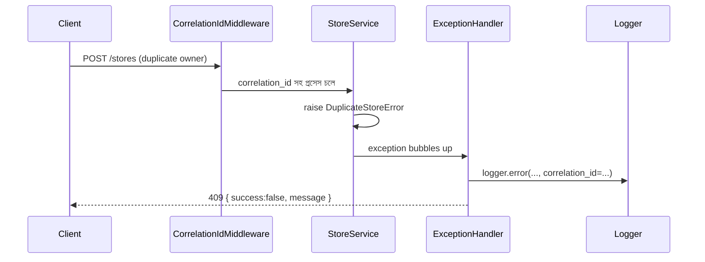

# ২৫.০৪. Error Handling and Logging in FastAPI

আমাদের ই-কমার্স প্রজেক্টে যত ফিচার যোগ হচ্ছে, ততই ভুল হওয়ার জায়গাও বাড়ছে — ইউজার ভুল ডেটা পাঠাতে পারে, ডেটাবেজ কানেকশন সাময়িকভাবে বন্ধ হতে পারে, নাই এমন প্রোডাক্ট আইডি দিয়ে রিকোয়েস্ট আসতে পারে। এই মডিউলের প্রথম তিন লেসনে আমরা "কে" আর "কী করার অনুমতি আছে" সামলেছি — এখন সামলাবো "যখন কিছু ভুল হয়, তখন কী হবে"।

FastAPI-এর ডিফল্ট আচরণ হলো, `HTTPException` ছুঁড়লে সেটা নিজে থেকেই একটা মানসম্মত JSON রেসপন্সে রূপান্তরিত হয়:

```python
from fastapi import HTTPException, status

if not store:
    raise HTTPException(status_code=status.HTTP_404_NOT_FOUND, detail="স্টোর পাওয়া যায়নি")
```

এটা `{"detail": "স্টোর পাওয়া যায়নি"}` রিটার্ন করবে, ৪০৪ স্ট্যাটাসসহ। ছোট প্রজেক্টে এটা যথেষ্ট, কিন্তু বড় প্রজেক্টে আমরা চাই একটা কনসিস্টেন্ট, কাস্টমাইজড এরর ফরম্যাট — যেটা সব এন্ডপয়েন্টে একই কাঠামোতে আসবে (`success`, `statusCode`, `path`, `timestamp`), আর সাথে সাথে লগও হবে।

## গ্লোবাল Exception Handler

FastAPI-তে এই ধারণাটার নাম **exception handler**, `@app.exception_handler()` দিয়ে রেজিস্টার করা হয়। NestJS-এর Exception Filter-এর প্রায় হুবহু সমতুল্য।

```python
# common/exception_handlers.py
import logging
from datetime import datetime, timezone
from fastapi import Request, HTTPException
from fastapi.responses import JSONResponse

logger = logging.getLogger("app")


async def http_exception_handler(request: Request, exc: HTTPException):
    logger.error(f"{request.method} {request.url.path} -> {exc.status_code}: {exc.detail}")
    return JSONResponse(
        status_code=exc.status_code,
        content={
            "success": False,
            "statusCode": exc.status_code,
            "path": request.url.path,
            "timestamp": datetime.now(timezone.utc).isoformat(),
            "message": exc.detail,
        },
    )


async def unhandled_exception_handler(request: Request, exc: Exception):
    logger.exception(f"{request.method} {request.url.path} -> অপ্রত্যাশিত এরর")
    return JSONResponse(
        status_code=500,
        content={
            "success": False,
            "statusCode": 500,
            "path": request.url.path,
            "timestamp": datetime.now(timezone.utc).isoformat(),
            "message": "অপ্রত্যাশিত সার্ভার এরর",
        },
    )
```

```python
# main.py
from fastapi import FastAPI, HTTPException
from common.exception_handlers import http_exception_handler, unhandled_exception_handler

app = FastAPI()
app.add_exception_handler(HTTPException, http_exception_handler)
app.add_exception_handler(Exception, unhandled_exception_handler)
```

`unhandled_exception_handler` অংশটা গুরুত্বপূর্ণ — এটা এমন সব এরর ধরে যেগুলো আমরা ইচ্ছাকৃতভাবে `HTTPException` দিয়ে ছুঁড়িনি (যেমন একটা `None.some_attribute` অ্যাক্সেস করার ফলে হওয়া `AttributeError`)। এটা না থাকলে, এই ধরনের অপ্রত্যাশিত এরর ইউজারকে raw Python traceback বা একটা খালি ৫০০ পেজ দেখাতে পারে — প্রোডাকশনে যেটা নিরাপত্তার দিক থেকেও ঝুঁকিপূর্ণ (traceback-এ ফাইল পাথ, ভ্যারিয়েবল নাম, ইনফ্রাস্ট্রাকচার তথ্য বেরিয়ে আসতে পারে)।

## Custom Exception ক্লাস — বিজনেস লজিকের জন্য

NestJS-এ `ConflictException`, `BadRequestException`-এর মতো বিল্ট-ইন এক্সেপশন ক্লাস আছে। FastAPI-তে `HTTPException` সরাসরি ব্যবহার করা যায়, কিন্তু বড় প্রজেক্টে নিজস্ব ডোমেইন এক্সেপশন বানানো ভালো অভ্যাস, কারণ এতে বিজনেস লজিক (সার্ভিস স্তর) HTTP স্ট্যাটাস কোড সম্পর্কে সরাসরি জানে না, যা সার্ভিস লেয়ারকে HTTP থেকে আলাদা রাখে (যেমন ভবিষ্যতে সেই সার্ভিস একটা CLI টুল বা background worker থেকেও কল হতে পারে):

```python
# common/exceptions.py
class DuplicateStoreError(Exception):
    def __init__(self, owner_id: str):
        self.owner_id = owner_id
        super().__init__(f"{owner_id}-এর অলরেডি একটা স্টোর আছে")


# main.py-তে হ্যান্ডলার রেজিস্টার
async def duplicate_store_handler(request: Request, exc: DuplicateStoreError):
    return JSONResponse(status_code=409, content={"success": False, "message": str(exc)})

app.add_exception_handler(DuplicateStoreError, duplicate_store_handler)
```

```python
# store/service.py
async def create_store(owner_id: str, dto: CreateStoreDto):
    existing = await store_repo.find_by_owner(owner_id)
    if existing:
        raise DuplicateStoreError(owner_id)
    return await store_repo.save({**dto.model_dump(), "owner_id": owner_id})
```

## Structured Logging আর Correlation ID

প্লেইন `print()` বা বেসিক `logging` কনসোলে একটা লাইনের টেক্সট দেয়, কিন্তু প্রোডাকশনে যখন হাজারো রিকোয়েস্ট একসাথে চলে, তখন একটা নির্দিষ্ট রিকোয়েস্টের সব লগ লাইন একসাথে খুঁজে বের করা কঠিন হয়ে যায়। এর সমাধান হলো **correlation ID** — প্রতিটা রিকোয়েস্টের শুরুতে একটা ইউনিক আইডি জেনারেট করে, সেই রিকোয়েস্টের প্রতিটা লগ লাইনে সেটা জুড়ে দেওয়া, যাতে পরে সব লগ ফিল্টার করে একসাথে দেখা যায়।

```python
# common/middleware.py
import uuid
import contextvars
from starlette.middleware.base import BaseHTTPMiddleware

correlation_id_var = contextvars.ContextVar("correlation_id", default=None)


class CorrelationIdMiddleware(BaseHTTPMiddleware):
    async def dispatch(self, request, call_next):
        correlation_id = request.headers.get("X-Correlation-ID", str(uuid.uuid4()))
        correlation_id_var.set(correlation_id)
        response = await call_next(request)
        response.headers["X-Correlation-ID"] = correlation_id
        return response
```

এখানে `contextvars.ContextVar` ব্যবহার করা হয়েছে সাধারণ গ্লোবাল ভ্যারিয়েবলের বদলে — কারণ FastAPI একসাথে অনেক রিকোয়েস্ট async-ভাবে হ্যান্ডল করে, আর একটা সাধারণ গ্লোবাল ভ্যারিয়েবল ব্যবহার করলে দুইটা concurrent রিকোয়েস্টের correlation ID একে অপরকে ওভাররাইট করে ফেলতে পারে — এই ভুলটা structured logging প্রয়োগ করতে যাওয়া নতুন ডেভেলপারদের মধ্যে খুবই সাধারণ, আর প্রোডাকশনে লগ দেখতে গিয়ে দুইটা আলাদা রিকোয়েস্টের লগ মিশে গেলে ডিবাগিং কার্যত অসম্ভব হয়ে যায়। `ContextVar` প্রতিটা asyncio টাস্কের জন্য নিজস্ব, বিচ্ছিন্ন কপি রাখে, তাই এই সমস্যা হয় না।

`structlog` লাইব্রেরি ব্যবহার করলে এই correlation ID স্বয়ংক্রিয়ভাবে প্রতিটা লগ এন্ট্রিতে JSON ফরম্যাটে যুক্ত করা যায় — যা log aggregation টুল (যেমন ELK stack বা Datadog) দিয়ে সার্চ করা অনেক সহজ করে দেয়, প্লেইন টেক্সট লগের চেয়ে।



## NestJS-এর তুলনা

NestJS-এ `@Catch()` দিয়ে চিহ্নিত একটা ক্লাস, `ExceptionFilter` ইন্টারফেস ইমপ্লিমেন্ট করে, গ্লোবালি `app.useGlobalFilters()` দিয়ে বসানো হয়। FastAPI-তে সমতুল্য কাজটা `@app.exception_handler(ExceptionType)` দিয়ে — পার্থক্য হলো FastAPI-তে exception type-ভিত্তিক আলাদা আলাদা হ্যান্ডলার রেজিস্টার করা যায় (একটা `HTTPException`-এর জন্য, একটা কাস্টম `DuplicateStoreError`-এর জন্য), যেখানে NestJS-এ একটা `@Catch()` ফিল্টারের ভেতরেই `instanceof` চেক দিয়ে টাইপ আলাদা করতে হয়। দুটোই কাজ করে, কিন্তু FastAPI-এর পদ্ধতিটা একটু বেশি "declarative"।

এখন এরর সামলানো হয়ে গেলো। কিন্তু আমাদের API-টা যেহেতু বাড়ছে, একদিন মোবাইল অ্যাপ আর পুরনো ওয়েব ক্লায়েন্ট একই সাথে ভিন্ন ভিন্ন সংস্করণের API ব্যবহার করবে — আর অনেক রিকোয়েস্ট একসাথে এলে সার্ভারকে রক্ষা করতেও হবে। পরের লেসনে আমরা API Versioning আর Rate Limiting নিয়ে কথা বলবো।
