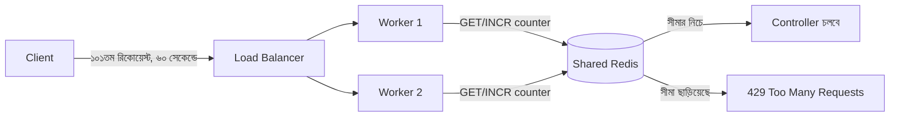

# ২৫.০৫. API Versioning and Rate Limiting

কল্পনা করো আমাদের ই-কমার্স API ছয় মাস চলার পর তুমি প্রোডাক্ট এন্ডপয়েন্টের রেসপন্স স্ট্রাকচার বদলাতে চাও — নতুন ফিল্ড যোগ করা, পুরনো একটা ফিল্ডের নাম বদলানো। কিন্তু ততদিনে একটা মোবাইল অ্যাপ আর একটা পুরনো ওয়েব ড্যাশবোর্ড পুরনো ফরম্যাটের উপর নির্ভর করে চলছে। এই সমস্যার সমাধান হলো **API Versioning** — একই সময়ে একাধিক সংস্করণ পাশাপাশি চালানো, যাতে পুরনো ক্লায়েন্ট ভেঙে না যায়।

NestJS-এ `app.enableVersioning()` একটা বিল্ট-ইন ফিচার। FastAPI-তে এমন কোনো বিল্ট-ইন "versioning মোড" নেই — কারণ FastAPI-এর দর্শন হলো, versioning মূলত রুটিং-এরই একটা প্রয়োগ, তাই এর জন্য আলাদা framework ফিচার লাগার বদলে `APIRouter`-এর `prefix` দিয়েই এটা সমাধান করা হয়।

## Path-based Versioning

```python
# product/v1/router.py
from fastapi import APIRouter

router = APIRouter(prefix="/v1/products", tags=["products-v1"])


@router.get("/{product_id}")
async def get_product_v1(product_id: str):
    product = await product_service.find_by_id(product_id)
    return {"id": product.id, "name": product.name, "price": product.price}
```

```python
# product/v2/router.py
from fastapi import APIRouter

router = APIRouter(prefix="/v2/products", tags=["products-v2"])


@router.get("/{product_id}")
async def get_product_v2(product_id: str):
    product = await product_service.find_by_id(product_id)
    return {
        "id": product.id,
        "name": product.name,
        "pricing": {"amount": product.price, "currency": "BDT"},  # নতুন, নেস্টেড ফরম্যাট
    }
```

```python
# main.py
app.include_router(v1_product_router)
app.include_router(v2_product_router)
```

লক্ষ্য করো, দুইটা ভিন্ন রুটার, ভিন্ন response shape, কিন্তু ভেতরে একই `product_service` কল হচ্ছে — বিজনেস লজিক ডুপ্লিকেট হচ্ছে না, শুধু presentation layer আলাদা। এটাই versioning-এর সঠিক প্র্যাকটিস — ডেটা অ্যাক্সেস আর বিজনেস রুল একবারই লেখা, শুধু বাইরের "শেপ" আলাদা।

## Header-based Versioning — বিকল্প পদ্ধতি

কিছু প্রজেক্টে path-এ ভার্সন লেখা পছন্দ না, বরং একটা custom header দিয়ে ভার্সন উল্লেখ করা হয় (যেমন `Accept: application/vnd.myapi.v2+json` বা একটা কাস্টম `X-API-Version` হেডার)। এটা FastAPI-তে একটা dependency দিয়ে সহজে করা যায়:

```python
from fastapi import Header, HTTPException


async def get_api_version(x_api_version: str = Header(default="1")) -> str:
    if x_api_version not in {"1", "2"}:
        raise HTTPException(status_code=400, detail="অসমর্থিত API ভার্সন")
    return x_api_version


@router.get("/products/{product_id}")
async def get_product(product_id: str, version: str = Depends(get_api_version)):
    product = await product_service.find_by_id(product_id)
    if version == "2":
        return {"id": product.id, "pricing": {"amount": product.price}}
    return {"id": product.id, "price": product.price}
```

এই পদ্ধতির সুবিধা হলো URL পরিষ্কার থাকে, কিন্তু অসুবিধা হলো `/docs`-এর Swagger UI-তে একই এন্ডপয়েন্টের দুটো ভার্সন আলাদাভাবে দেখানো কঠিন — path-based versioning-এ এই সমস্যা হয় না, কারণ `/v1/products` আর `/v2/products` স্বাভাবিকভাবেই আলাদা এন্ট্রি হিসেবে ডকুমেন্টেশনে দেখা যায়। এই কারণেই বেশিরভাগ পাবলিক API (Stripe, GitHub) path বা date-based versioning পছন্দ করে।

## Rate Limiting — slowapi দিয়ে

Module 7-তেই তুমি rate limiting মিডলওয়্যারের ধারণার সাথে পরিচিত হয়েছিলে। NestJS-এ `@nestjs/throttler` অফিসিয়াল প্যাকেজ, FastAPI-তে সবচেয়ে জনপ্রিয় সমতুল্য হলো `slowapi` (Flask-Limiter থেকে অনুপ্রাণিত)।

```bash
pip install slowapi
```

```python
# main.py
from slowapi import Limiter, _rate_limit_exceeded_handler
from slowapi.util import get_remote_address
from slowapi.errors import RateLimitExceeded

limiter = Limiter(key_func=get_remote_address)
app.state.limiter = limiter
app.add_exception_handler(RateLimitExceeded, _rate_limit_exceeded_handler)
```

```python
# auth/router.py
from slowapi.util import get_remote_address

@router.post("/login")
@limiter.limit("5/minute")  # ৬০ সেকেন্ডে মাত্র ৫ বার — ব্রুট-ফোর্স ঠেকানোর জন্য
async def login(request: Request, form_data: OAuth2PasswordRequestForm = Depends()):
    ...
```

`Limiter(key_func=get_remote_address)`-এর `key_func` অংশটা গুরুত্বপূর্ণ — এটা নির্ধারণ করে কীসের ভিত্তিতে সীমা গণনা হবে (এখানে IP address)। লগইন করা ইউজারের জন্য IP-ভিত্তিক সীমা যথেষ্ট না হতে পারে, কারণ একই অফিসের একাধিক কর্মী একই পাবলিক IP থেকে রিকোয়েস্ট পাঠাতে পারে — সেক্ষেত্রে `key_func`-কে কাস্টমাইজ করে `user_id` বা API key ভিত্তিক সীমা বসানো ভালো।

## প্রোডাকশন নুয়ান্স — In-memory Limiter বনাম Distributed Limiter

`slowapi`-এর ডিফল্ট স্টোরেজ **in-memory** — মানে রেট লিমিট কাউন্টার প্রসেসের নিজের মেমরিতে থাকে। এটা একটা মারাত্মক গোচা তৈরি করে যখন অ্যাপ্লিকেশন একাধিক worker/instance-এ চলে (যেমন Gunicorn দিয়ে ৪টা worker, বা Kubernetes-এ ৩টা pod, যেটা Module 11-এ বিস্তারিত আসবে) — প্রতিটা worker-এর নিজের আলাদা কাউন্টার থাকে, তাই "৬০ সেকেন্ডে ৫ বার" সীমা বাস্তবে "৬০ সেকেন্ডে worker সংখ্যা × ৫ বার" হয়ে যায়, কারণ লোড ব্যালেন্সার রিকোয়েস্টগুলো বিভিন্ন worker-এ ছড়িয়ে দেয় এবং কোনো worker জানে না অন্য worker-এ কী ঘটছে। এই সমস্যার একমাত্র নির্ভরযোগ্য সমাধান হলো একটা **shared, centralized store** — Redis — ব্যবহার করা, যেখানে সব worker একই কাউন্টার আপডেট করে:

```python
limiter = Limiter(key_func=get_remote_address, storage_uri="redis://localhost:6379")
```

এই ভুলটা এতই সাধারণ যে অনেক প্রজেক্ট প্রোডাকশনে গিয়ে দেখে তাদের "সিকিউর" লগইন এন্ডপয়েন্ট আসলে ব্রুট-ফোর্স অ্যাটাকের বিরুদ্ধে যতটা ভাবা হয়েছিল তার চেয়ে অনেক কম সুরক্ষিত — শুধু কারণ Redis-ভিত্তিক শেয়ার্ড স্টোরেজের বদলে ডিফল্ট in-memory স্টোরেজ থেকে গিয়েছিল।



লক্ষ্য করো, versioning আর rate limiting দুটোই আসলে একই দর্শনের অংশ — একটা API যখন প্রকৃত ইউজারদের হাতে চলে যায়, তখন সেটাকে শুধু "সঠিক কাজ করা" যথেষ্ট না, বরং "পরিবর্তনযোগ্য" আর "টেকসই" হতেও হয়।

কিন্তু এই নতুন নিয়মগুলো — dependency chain, throttling, versioning — সবকিছু ঠিকমতো কাজ করছে কিনা সেটা কীভাবে নিশ্চিত হবো, বিশেষ করে কোড যত বড় হচ্ছে? হাতে হাতে Postman দিয়ে চেক করা আর টেকসই নয়। পরের লেসনে আমরা FastAPI-তে ইউনিট টেস্টিং আর ইন্টিগ্রেশন টেস্টিং শিখবো।
