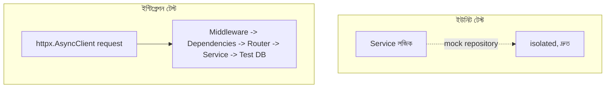

# ২৫.০৬. Unit Testing and Integration Testing in FastAPI

আমাদের ই-কমার্স প্রজেক্টে এতদিনে অথেন্টিকেশন, RBAC, এরর হ্যান্ডলিং, ভার্সনিং, রেট লিমিটিং — সব যোগ হয়ে গেছে। এখন একটা স্বাভাবিক ভয় তৈরি হয় — নতুন কিছু যোগ করতে গিয়ে পুরনো কিছু ভেঙে গেলো কিনা সেটা কীভাবে বুঝবো, প্রতিবার হাতে হাতে সব এন্ডপয়েন্ট চেক না করে? উত্তরটা হলো automated testing।

Python-এর জগতে সবচেয়ে জনপ্রিয় টেস্টিং ফ্রেমওয়ার্ক হলো **pytest**। NestJS-এ Jest ব্যবহার হয় ইউনিট আর e2e টেস্ট দুটোর জন্যই — FastAPI-তেও pytest একই দুই ভূমিকায় কাজ করে, সাথে `httpx.AsyncClient` বা `TestClient` দিয়ে HTTP লেভেলের টেস্টও।

```bash
pip install pytest pytest-asyncio httpx
```

## ইউনিট টেস্ট — সার্ভিস লজিক আলাদাভাবে

প্রথমে একটা **ইউনিট টেস্ট** দেখি — শুধু `store_service.create()` মেথড, বাকি সব কিছু (ডেটাবেজ রিপোজিটরি) মক করে।

```python
# tests/test_store_service.py
import pytest
from unittest.mock import AsyncMock
from store.service import create_store
from common.exceptions import DuplicateStoreError


@pytest.mark.asyncio
async def test_duplicate_owner_store_rejected():
    mock_repo = AsyncMock()
    mock_repo.find_by_owner.return_value = {"id": "1", "owner_id": "owner-1"}

    with pytest.raises(DuplicateStoreError):
        await create_store("owner-1", {"name": "নতুন স্টোর"}, repo=mock_repo)


@pytest.mark.asyncio
async def test_new_owner_store_created():
    mock_repo = AsyncMock()
    mock_repo.find_by_owner.return_value = None
    mock_repo.save.return_value = {"id": "2", "name": "নতুন স্টোর"}

    result = await create_store("owner-2", {"name": "নতুন স্টোর"}, repo=mock_repo)
    assert result["id"] == "2"
```

`unittest.mock.AsyncMock` জিনিসটা লক্ষ্য করার মতো — সাধারণ `Mock` async ফাংশন সিমুলেট করতে পারে না, তাই `await`-এর সাথে ব্যবহারযোগ্য মক দরকার হলে `AsyncMock` লাগবেই। এই সাধারণ ভুলটা — সাধারণ `Mock()` ব্যবহার করে একটা async ফাংশনকে মক করার চেষ্টা করা — একটা `TypeError: object MagicMock can't be used in 'await' expression` এরর দেয়, যা নতুন ডেভেলপারদের প্রায়ই কনফিউজ করে।

## dependency_overrides — FastAPI-এর টেস্টিং সুপারপাওয়ার

NestJS-এ `Test.createTestingModule({ providers: [...] })` দিয়ে DI কন্টেইনার তৈরি করে মক ইনজেক্ট করা হয় — এটা একটা শক্তিশালী প্যাটার্ন, কিন্তু তার জন্য NestJS-এর পুরো টেস্টিং মডিউল সিস্টেম বুঝতে হয়। FastAPI-তে সমতুল্য, কিন্তু আরও সরল একটা মেকানিজম আছে — **`app.dependency_overrides`** — যেটাকে এই ফ্রেমওয়ার্কের সবচেয়ে বড় টেস্টিং-বান্ধব ফিচার বলা যায়। যেকোনো `Depends()`-কে টেস্টের সময় এক লাইনে বদলে দেওয়া যায়, পুরো DI কন্টেইনার সেটআপ করার প্রয়োজন ছাড়াই।

```python
# tests/test_store_router.py
import pytest
from httpx import AsyncClient, ASGITransport
from main import app
from auth.dependencies import get_current_user


async def fake_current_user():
    return {"user_id": "owner-1", "role": "STORE_OWNER"}


@pytest.mark.asyncio
async def test_create_store_authenticated():
    app.dependency_overrides[get_current_user] = fake_current_user

    transport = ASGITransport(app=app)
    async with AsyncClient(transport=transport, base_url="http://test") as client:
        response = await client.post("/stores", json={"name": "টেস্ট স্টোর"})

    assert response.status_code == 201
    app.dependency_overrides.clear()  # পরের টেস্টে প্রভাব না ফেলার জন্য জরুরি


@pytest.mark.asyncio
async def test_create_store_without_token_returns_401():
    transport = ASGITransport(app=app)
    async with AsyncClient(transport=transport, base_url="http://test") as client:
        response = await client.post("/stores", json={"name": "টেস্ট স্টোর"})

    assert response.status_code == 401
```

লক্ষ্য করো, প্রথম টেস্টে আসল JWT টোকেন তৈরি করার কোনো দরকার নেই — `get_current_user` dependency-টাকেই সরাসরি একটা fake ফাংশন দিয়ে replace করে দেওয়া হয়েছে। এটা NestJS-এর `useValue`/`useClass` override-এর চেয়েও বেশি সরাসরি, কারণ এখানে কোনো মডিউল কম্পাইল করার দরকার নেই — সরাসরি dict-এর মতো `app.dependency_overrides[original] = replacement` লিখলেই হয়ে যায়।

## প্রোডাকশন নুয়ান্স — override পরিষ্কার না করার ফাঁদ

উপরের কোডে `app.dependency_overrides.clear()` লাইনটা ইচ্ছাকৃতভাবে হাইলাইট করা হলো, কারণ এটা ভুলে যাওয়া টেস্টিং-এর সবচেয়ে সাধারণ, বিরক্তিকর বাগগুলোর একটার কারণ — `app` অবজেক্টটা মডিউল-লেভেলে ইম্পোর্ট করা, তাই এর `dependency_overrides` dict-টা টেস্ট ফাইলগুলোর মধ্যে **শেয়ার্ড, mutable global state**। যদি একটা টেস্ট override বসিয়ে সেটা clear না করে, তাহলে তার পরের টেস্ট (এমনকি সম্পূর্ণ আলাদা একটা টেস্ট ফাইলে) সাইলেন্টলি সেই পুরনো override পেয়ে যায় — ফলাফলে এমন একটা টেস্ট যা আলাদাভাবে রান করলে ফেল করে, কিন্তু পুরো স্যুট একসাথে রান করলে "accidentally" পাস করে, নির্দিষ্ট অর্ডারে চলার কারণে। এই সমস্যার সঠিক সমাধান একটা pytest **fixture** বানানো, যেটা `yield`-এর পরে স্বয়ংক্রিয়ভাবে clear করে দেয়:

```python
# tests/conftest.py
import pytest
from main import app


@pytest.fixture
def override_current_user():
    def _override(fake_user: dict):
        async def fake_dependency():
            return fake_user
        app.dependency_overrides[get_current_user] = fake_dependency
    yield _override
    app.dependency_overrides.clear()
```

## ইন্টিগ্রেশন টেস্ট — সত্যিকারের টেস্ট ডেটাবেজসহ

`AsyncClient` দিয়ে HTTP-লেভেল টেস্ট করলেও উপরের উদাহরণে আসল ডেটাবেজ ছোঁয়া হচ্ছে না। একটা প্রকৃত **ইন্টিগ্রেশন টেস্ট**-এ আমরা চাই middleware, dependency, router, এমনকি একটা টেস্ট ডেটাবেজ (সাধারণত SQLite in-memory, বা একটা আলাদা Postgres টেস্ট স্কিমা) সবকিছু একসাথে যাচাই হোক:

```python
# tests/test_integration_store.py
@pytest.mark.asyncio
async def test_full_store_creation_flow(test_db_session):
    app.dependency_overrides[get_db] = lambda: test_db_session
    app.dependency_overrides[get_current_user] = fake_current_user

    transport = ASGITransport(app=app)
    async with AsyncClient(transport=transport, base_url="http://test") as client:
        response = await client.post("/stores", json={"name": "ইন্টিগ্রেশন টেস্ট স্টোর"})

    assert response.status_code == 201
    saved = await test_db_session.get(Store, response.json()["id"])
    assert saved is not None

    app.dependency_overrides.clear()
```



দুটো টেস্টের ভূমিকা আলাদা — ইউনিট টেস্ট দ্রুত চলে, নির্দিষ্ট লজিক আলাদাভাবে যাচাই করে; ইন্টিগ্রেশন টেস্ট ধীর কিন্তু নিশ্চিত করে পুরো সিস্টেম বাস্তবে একসাথে কাজ করছে। `pytest-asyncio`-এর `@pytest.mark.asyncio` ডেকোরেটর ছাড়া async টেস্ট ফাংশন লিখলে pytest সেটাকে সাইলেন্টলি স্কিপ করে দেয় বা "coroutine was never awaited" ওয়ার্নিং দেয় — এটাও একটা প্রচলিত ভুল যেটা নতুন ডেভেলপারদের বিভ্রান্ত করে, কারণ টেস্ট "পাস" দেখায় আসলে কিছুই যাচাই না করেই।

টেস্টিং দিয়ে আমরা নিশ্চিত হলাম কোড ঠিকভাবে কাজ করছে। কিন্তু কিছু কাজ আছে যেগুলো সরাসরি রিকোয়েস্ট-রেসপন্স চক্রের বাইরে ঘটা উচিত — যেমন অর্ডার হওয়ার পর ইমেইল পাঠানো, বা ইনভেন্টরি আপডেট হওয়ার খবর অন্য সার্ভিসকে জানানো। এই ধরনের কাজের জন্য দরকার ইভেন্ট-ভিত্তিক আর্কিটেকচার, যেটা পরের লেসনের বিষয় — Kafka দিয়ে Event-Driven Architecture।
