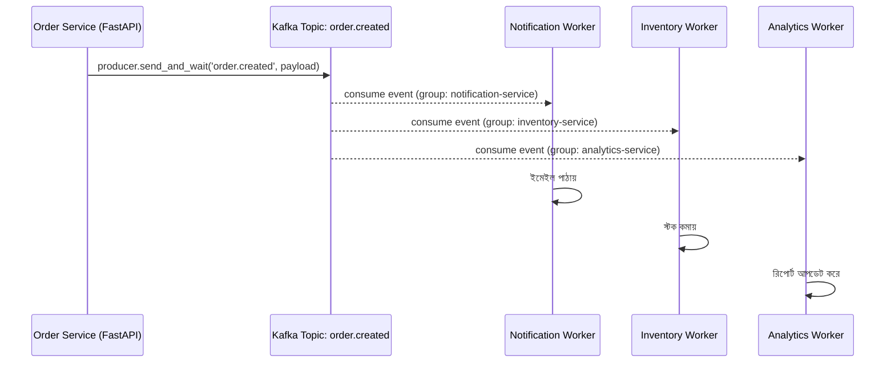

# ২৫.০৭. Event-Driven Architecture with Kafka

আমাদের ই-কমার্স প্রজেক্টে একটা কাস্টমার অর্ডার করলে আসলে অনেকগুলো কাজ ঘটা দরকার — ইনভেন্টরি কমানো, কনফার্মেশন ইমেইল পাঠানো, বিক্রেতাকে নোটিফাই করা, অ্যানালিটিক্সে রেকর্ড রাখা। এখন পর্যন্ত আমরা যেভাবে কোড লিখেছি, `create_order()`-এর ভেতরেই এই সবগুলো কাজ একে একে সরাসরি কল করতে হতো। সমস্যা হলো, এতে সার্ভিসগুলো একে অপরের সাথে শক্তভাবে জড়িয়ে যায় (tight coupling) — ইমেইল সার্ভিস ডাউন থাকলে পুরো অর্ডার তৈরিই আটকে যেতে পারে!

এখানেই দরকার পড়ে **Event-Driven Architecture** — যেখানে একটা সার্ভিস সরাসরি অন্য সার্ভিসকে কল না করে, শুধু "একটা ঘটনা ঘটেছে" এই বার্তাটা প্রকাশ করে দেয় (publish), আর যাদের আগ্রহ আছে তারা সেটা শোনে (subscribe) এবং নিজের কাজ করে। এটা অনেকটা রেডিও স্টেশনের মতো — স্টেশন শুধু সম্প্রচার করে, কে শুনছে সেটা তার জানার দরকার নেই।

**Kafka** হলো এমন একটা সিস্টেম যেটা এই "ঘটনা প্রকাশ ও শোনা"-র কাজটা নির্ভরযোগ্যভাবে, বড় স্কেলে করতে দেয়। Python-এর জগতে দুটো প্রধান লাইব্রেরি — **aiokafka** (asyncio-নেটিভ, FastAPI-এর সাথে সবচেয়ে স্বাভাবিকভাবে মেলে) এবং **confluent-kafka-python** (Kafka-এর নিজস্ব C লাইব্রেরির উপর তৈরি, বেশি performant কিন্তু sync API)। আমরা `aiokafka` ব্যবহার করবো, কারণ FastAPI-এর async ইকোসিস্টেমের সাথে এটাই সবচেয়ে ভালো খাপ খায়।

```bash
pip install aiokafka
```

## Producer — ইভেন্ট পাঠানো

```python
# order/kafka_producer.py
import json
from aiokafka import AIOKafkaProducer

producer: AIOKafkaProducer | None = None


async def start_producer():
    global producer
    producer = AIOKafkaProducer(
        bootstrap_servers="localhost:9092",
        value_serializer=lambda v: json.dumps(v).encode("utf-8"),
    )
    await producer.start()


async def stop_producer():
    await producer.stop()


async def publish_order_created(order_id: str, user_id: str):
    await producer.send_and_wait("order.created", {"order_id": order_id, "user_id": user_id})
```

```python
# order/service.py
async def create_order(dto: CreateOrderDto):
    order = await order_repo.save(dto)
    await publish_order_created(order.id, order.user_id)
    return order
```

FastAPI-এর `lifespan` ইভেন্ট দিয়ে অ্যাপ্লিকেশন চালু আর বন্ধ হওয়ার সময় producer কানেকশন সামলানো হয়:

```python
# main.py
from contextlib import asynccontextmanager
from fastapi import FastAPI
from order.kafka_producer import start_producer, stop_producer


@asynccontextmanager
async def lifespan(app: FastAPI):
    await start_producer()
    yield
    await stop_producer()


app = FastAPI(lifespan=lifespan)
```

## Consumer — ইভেন্ট শোনা

Consumer-টা একটা সম্পূর্ণ আলাদা প্রসেস হিসেবে চলে (একটা আলাদা `worker.py`, FastAPI অ্যাপ থেকে স্বাধীন), কারণ এটাকে অনির্দিষ্টকালের জন্য একটা লুপে ইভেন্ট শুনে থাকতে হয়:

```python
# notification/kafka_consumer.py
import asyncio
import json
from aiokafka import AIOKafkaConsumer


async def consume_order_created():
    consumer = AIOKafkaConsumer(
        "order.created",
        bootstrap_servers="localhost:9092",
        group_id="notification-service",
        value_deserializer=lambda v: json.loads(v.decode("utf-8")),
    )
    await consumer.start()
    try:
        async for message in consumer:
            data = message.value
            await send_order_confirmation_email(data["user_id"], data["order_id"])
    finally:
        await consumer.stop()


if __name__ == "__main__":
    asyncio.run(consume_order_created())
```



এই ডায়াগ্রামটা দেখাচ্ছে — `Order Service`-কে জানতেই হচ্ছে না যে তিনটা আলাদা worker তার ইভেন্ট শুনছে। ভবিষ্যতে চতুর্থ একটা worker (ধরো, লয়্যালটি পয়েন্ট সিস্টেম) যোগ করতে চাইলে `Order Service`-এর একটা লাইনও বদলাতে হবে না — শুধু নতুন worker গিয়ে একই টপিক সাবস্ক্রাইব করবে।

## NestJS-এর তুলনা

NestJS-এর `@nestjs/microservices` প্যাকেজ Kafka transport-টাকে ফ্রেমওয়ার্কের নিজস্ব `@EventPattern()` ডেকোরেটর আর `ClientKafka` দিয়ে wrap করে দেয় — producer আর consumer দুটোই NestJS-এর DI সিস্টেমের ভেতরে বাস করে, একই অ্যাপ্লিকেশনের অংশ হিসেবে। FastAPI-তে এই abstraction নেই — `aiokafka` একটা সরাসরি, low-level লাইব্রেরি, আর consumer সাধারণত FastAPI অ্যাপ থেকে সম্পূর্ণ আলাদা একটা প্রসেস হিসেবে চলে। এটা বেশি ম্যানুয়াল কাজ, কিন্তু বেশি স্বচ্ছতাও দেয় — ঠিক কোন প্রসেস কী শুনছে, সেটা প্রশ্নাতীতভাবে স্পষ্ট।

## প্রোডাকশন নুয়ান্স — Consumer Crash আর at-least-once ডেলিভারি

একটা মারাত্মক ভুল যেটা নতুন ডেভেলপাররা করে — ধরে নেয় যে Kafka থেকে একটা মেসেজ ঠিক **একবারই** প্রসেস হবে। বাস্তবে Kafka ডিফল্টভাবে **at-least-once delivery** গ্যারান্টি দেয় — মানে নেটওয়ার্ক সমস্যা বা consumer ক্র্যাশের কারণে একই মেসেজ দুইবার প্রসেস হয়ে যেতে পারে (consumer মেসেজ প্রসেস করে ফেলেছে কিন্তু offset commit করার আগেই ক্র্যাশ করলো, রিস্টার্টের পর সেই মেসেজ আবার আসবে)। যদি `send_order_confirmation_email()` এই ডুপ্লিকেশন সামলাতে না পারে, তাহলে একজন কাস্টমার একই অর্ডারের কনফার্মেশন ইমেইল দুইবার বা তিনবার পেতে পারে — এটা বাস্তব প্রোডাকশন সিস্টেমে ঘটা একটা খুবই সাধারণ বাগ।

এই সমস্যার সঠিক সমাধান হলো handler-কে **idempotent** বানানো — অর্থাৎ একই ইনপুট একাধিকবার প্রসেস হলেও ফলাফল একই থাকা উচিত। এটার একটা প্রচলিত প্যাটার্ন হলো একটা "processed_events" টেবিলে event ID রেখে চেক করা:

```python
async def send_order_confirmation_email(user_id: str, order_id: str):
    already_sent = await processed_events_repo.exists(order_id, "confirmation_email")
    if already_sent:
        return  # ডুপ্লিকেট মেসেজ, স্কিপ করো

    await email_client.send(user_id, order_id)
    await processed_events_repo.mark_processed(order_id, "confirmation_email")
```

আরও একটা বাস্তব গোচা — consumer worker ক্র্যাশ করলে বা ধীরগতির হয়ে গেলে (যেমন `send_order_confirmation_email` একটা স্লো external API কল করছে), Kafka topic-এর মেসেজ জমতে থাকে (**consumer lag**)। প্রোডাকশনে এই lag মনিটর করা জরুরি — নাহলে একটা সময় কাস্টমাররা তাদের অর্ডার কনফার্মেশন ইমেইল ঘণ্টাখানেক পরে পাবে, বাগ ছাড়াই, শুধু কারণ consumer পিছিয়ে পড়েছে।

অর্ডার তৈরির খবর আমরা এখন ব্যাকগ্রাউন্ডে ইভেন্ট দিয়ে ছড়িয়ে দিতে পারছি। কিন্তু ইউজারকে যদি রিয়েল-টাইমে তার অর্ডারের স্ট্যাটাস ("প্রসেসিং", "শিপড", "ডেলিভারড") সরাসরি স্ক্রিনে দেখাতে চাই, পেজ রিফ্রেশ ছাড়াই — তার জন্য দরকার আরেকটা প্রযুক্তি, যেটা পরের লেসনের বিষয় — WebSockets।
