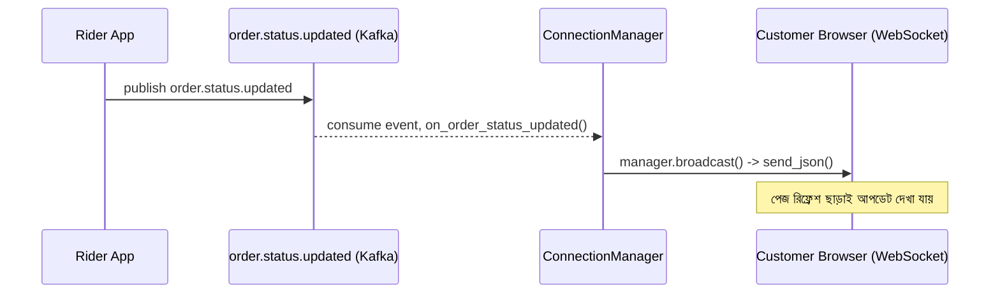

# ২৫.০৮. WebSockets in FastAPI for Real-Time Applications

এতদিন আমরা যত API বানিয়েছি, সবগুলোই একটা নির্দিষ্ট প্যাটার্ন মেনে চলেছে — ক্লায়েন্ট একটা রিকোয়েস্ট পাঠায়, সার্ভার একটা রেসপন্স দেয়, কানেকশন শেষ। এই মডেলটার নাম request-response, আর HTTP প্রোটোকল মূলত এভাবেই কাজ করে। কিন্তু আমাদের ই-কমার্স প্রজেক্টের একটা বাস্তব দৃশ্য কল্পনা করো — কাস্টমার তার অর্ডার ট্র্যাকিং পেজ খুলে বসে আছে, আর ডেলিভারি রাইডার লোকেশন আপডেট করছে প্রতি কয়েক সেকেন্ডে। এখানে কাস্টমারকে বারবার রিকোয়েস্ট পাঠিয়ে "নতুন কিছু আছে কিনা" জিজ্ঞেস করানো (একে বলে polling) অপচয়মূলক আর ধীরগতির।

এর সমাধান **WebSocket** — একটা প্রোটোকল যেখানে একবার কানেকশন তৈরি হলে সেটা খোলা থেকে যায়, আর সার্ভার-ক্লায়েন্ট দুই দিক থেকেই যেকোনো সময় বার্তা পাঠাতে পারে, নতুন করে রিকোয়েস্ট ছাড়াই। এটা ফোন কলের মতো — একবার লাইন কানেক্ট হলে দুই পক্ষই যখন খুশি কথা বলতে পারে।

FastAPI-তে WebSocket সাপোর্ট Starlette থেকে আসে, একদম বিল্ট-ইন — NestJS-এর মতো আলাদা কোনো `@nestjs/websockets` প্যাকেজ বা Socket.IO ইনস্টল করার দরকার নেই (চাইলে করা যায়, কিন্তু বেসিক ব্যবহারের জন্য দরকার নেই)।

## একটা বেসিক WebSocket এন্ডপয়েন্ট

```python
# order/websocket_router.py
from fastapi import APIRouter, WebSocket, WebSocketDisconnect

router = APIRouter()


@router.websocket("/ws/orders/{order_id}")
async def order_tracking_socket(websocket: WebSocket, order_id: str):
    await websocket.accept()
    try:
        while True:
            data = await websocket.receive_text()
            await websocket.send_text(f"তুমি পাঠালে: {data}")
    except WebSocketDisconnect:
        print(f"ক্লায়েন্ট অর্ডার {order_id}-এর ট্র্যাকিং থেকে ডিসকানেক্ট হলো")
```

এখানে `@router.websocket(...)` একটা সাধারণ `@router.get(...)`-এর মতোই দেখতে, কিন্তু ভেতরে একটা `while True` লুপ থাকে — কারণ WebSocket কানেকশন একবার খোলার পর বন্ধ না হওয়া পর্যন্ত চলতেই থাকে। `WebSocketDisconnect` এক্সেপশনটা তখন ছোঁড়া হয় যখন ক্লায়েন্ট (ব্রাউজার) কানেকশন বন্ধ করে দেয় — এটা ধরে রাখা জরুরি, নাহলে সার্ভারের লগে অনর্থক এরর ছড়িয়ে যায় প্রতিটা ক্লায়েন্ট ট্যাব বন্ধ করার সময়।

## Connection Manager — একাধিক ক্লায়েন্টকে ব্রডকাস্ট করা

বাস্তব প্রয়োজন হলো একজন নির্দিষ্ট কাস্টমারকে (বা একটা নির্দিষ্ট অর্ডারের সব সাবস্ক্রাইবারকে) ব্রডকাস্ট করা — এর জন্য একটা **connection manager** ক্লাস বানানো প্রচলিত প্যাটার্ন, যেটা active connection-গুলো ট্র্যাক করে রাখে।

```python
# order/connection_manager.py
from fastapi import WebSocket


class ConnectionManager:
    def __init__(self):
        self.active_connections: dict[str, list[WebSocket]] = {}

    async def connect(self, order_id: str, websocket: WebSocket):
        await websocket.accept()
        self.active_connections.setdefault(order_id, []).append(websocket)

    def disconnect(self, order_id: str, websocket: WebSocket):
        connections = self.active_connections.get(order_id, [])
        if websocket in connections:
            connections.remove(websocket)
        if not connections:
            self.active_connections.pop(order_id, None)

    async def broadcast(self, order_id: str, message: dict):
        for connection in self.active_connections.get(order_id, []):
            await connection.send_json(message)


manager = ConnectionManager()
```

```python
# order/websocket_router.py
@router.websocket("/ws/orders/{order_id}")
async def order_tracking_socket(websocket: WebSocket, order_id: str):
    await manager.connect(order_id, websocket)
    try:
        while True:
            await websocket.receive_text()  # কানেকশন খোলা রাখার জন্য শুনতে থাকা
    except WebSocketDisconnect:
        manager.disconnect(order_id, websocket)
```

এখন Kafka consumer worker থেকে (আগের লেসনের সাথে সংযোগ) অর্ডার স্ট্যাটাস বদলালে `manager.broadcast()` কল করে ব্রাউজারে থাকা সবাইকে জানানো যাবে:

```python
async def on_order_status_updated(order_id: str, status: str):
    await manager.broadcast(order_id, {"order_id": order_id, "status": status})
```



## NestJS-এর তুলনা

NestJS-এর `@WebSocketGateway()` ক্লাস-ভিত্তিক, Socket.IO-এর "room" কনসেপ্ট বিল্ট-ইন (`client.join()`, `server.to(room).emit()`)। FastAPI-এর raw WebSocket সাপোর্টে "room" নামের কোনো বিল্ট-ইন ধারণা নেই — উপরের `ConnectionManager`-এর `dict[str, list[WebSocket]]` কাঠামোটাই আসলে room-এর ম্যানুয়াল বাস্তবায়ন, `order_id`-কে room key ধরে। যদি Socket.IO-এর ফিচার সেট (rooms, namespaces, automatic fallback to polling) দরকার হয়, `python-socketio` লাইব্রেরি FastAPI-এর সাথে ASGI অ্যাপ্লিকেশন হিসেবে mount করা যায়, কিন্তু বেশিরভাগ ক্ষেত্রে raw WebSocket-ই যথেষ্ট এবং সরল।

## প্রোডাকশন নুয়ান্স — একাধিক Worker আর মেমরি-ভিত্তিক Connection Manager-এর সীমাবদ্ধতা

উপরের `ConnectionManager`-এ একটা গুরুত্বপূর্ণ সীমাবদ্ধতা আছে যা প্রোডাকশনে গিয়ে অনেককে বিভ্রান্ত করে — `active_connections` dict-টা প্রতিটা Uvicorn/Gunicorn worker প্রসেসের নিজের মেমরিতে থাকে (ঠিক আগের লেসনের rate limiter-এর মতোই সমস্যা)। যদি অ্যাপ্লিকেশন ৪টা worker নিয়ে চলে, আর একজন কাস্টমার worker-1-এর সাথে WebSocket কানেকশন খুলে বসে থাকে, কিন্তু Kafka consumer worker-3-এ চলছে — তাহলে worker-3 যখন `broadcast()` কল করে, worker-1-এর `active_connections` dict-এ সেই তথ্যই নেই, কারণ এটা আলাদা প্রসেস, আলাদা মেমরি স্পেস। ফলাফলে ব্রডকাস্ট "নীরবে" হারিয়ে যায় — কোনো এরর ছাড়াই, শুধু ক্লায়েন্ট কখনো আপডেট পায় না।

এই সমস্যার সমাধান হলো Redis-এর **Pub/Sub** ফিচার ব্যবহার করা — প্রতিটা worker Redis চ্যানেল সাবস্ক্রাইব করে রাখে, আর `broadcast()` কল হলে সেটা সরাসরি লোকাল `active_connections`-এ না পাঠিয়ে Redis-এ পাবলিশ করে, প্রতিটা worker সেটা রিসিভ করে তার নিজের লোকাল কানেকশনগুলোতে পাঠায়:

```python
async def broadcast(self, order_id: str, message: dict):
    await redis_client.publish(f"order:{order_id}", json.dumps(message))
    # প্রতিটা worker একটা ব্যাকগ্রাউন্ড টাস্কে এই চ্যানেল সাবস্ক্রাইব করে রাখে,
    # আর মেসেজ পেলে তার নিজের active_connections-এ পাঠায়
```

এই প্যাটার্নটা ছোট প্রজেক্টে (single worker, development, বা ছোট ট্র্যাফিক) অতিরিক্ত জটিলতা মনে হতে পারে, কিন্তু যেই মুহূর্তে অ্যাপ্লিকেশন একাধিক worker বা একাধিক সার্ভারে চলা শুরু করে, এটা ছাড়া real-time ফিচার আংশিকভাবে ভেঙে যায় — এবং সবচেয়ে বিপজ্জনক দিক হলো, ডেভেলপমেন্টে (single worker) এটা পুরোপুরি কাজ করে দেখায়, বাগটা কেবল প্রোডাকশন লোড-ব্যালেন্স হওয়ার পরেই প্রকাশ পায়।

রিয়েল-টাইম আপডেট তো হলো, কিন্তু প্রতিবার প্রোডাক্ট লিস্ট বা অর্ডার হিস্ট্রির মতো ডেটা ডেটাবেজ থেকে বারবার পড়া ব্যয়বহুল। পরের লেসনে আমরা FastAPI-তে Redis দিয়ে ক্যাশিং স্ট্র্যাটেজি বাস্তবে বসাবো।
