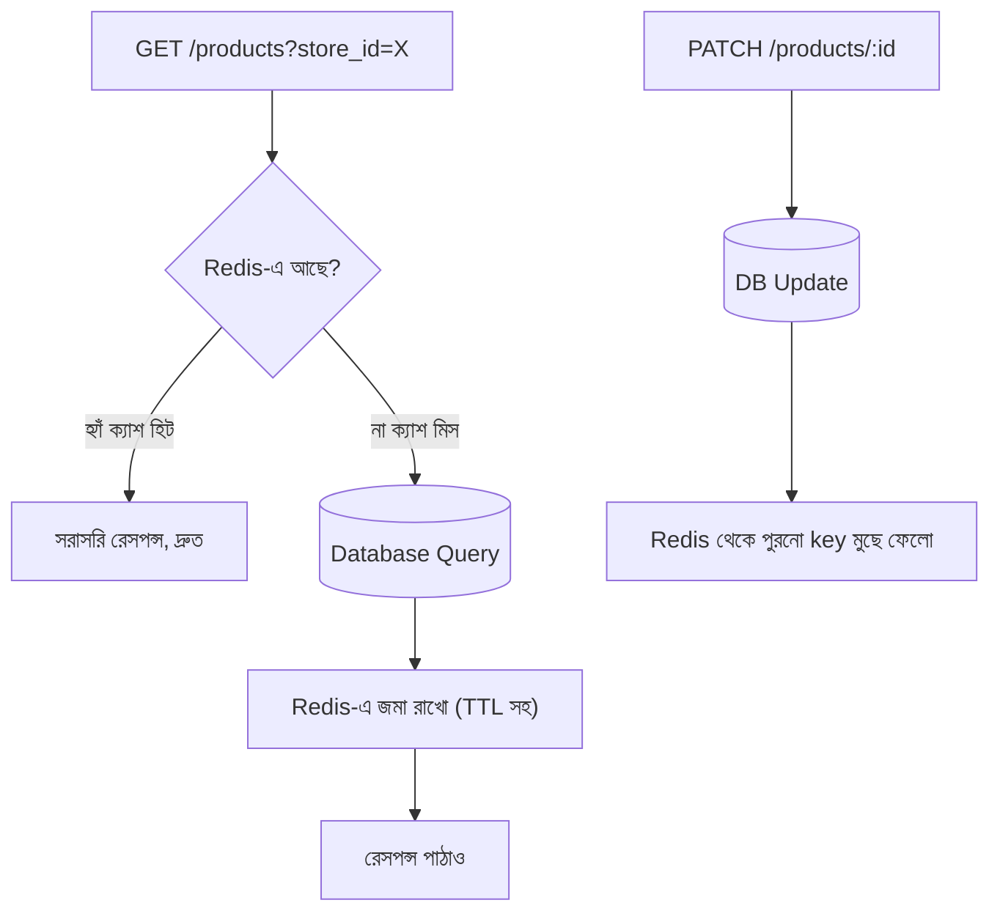

# ২৫.০৯. Caching Strategies with Redis in FastAPI

Module 21-এ ডেটাবেজ ক্যাশিং স্ট্র্যাটেজি নিয়ে ধারণা দেয়া হয়েছিলো — বারবার একই কোয়েরি চালানোর বদলে ফলাফলটা কোথাও সাময়িকভাবে জমা রেখে দেয়া, যাতে পরের বার দ্রুত পাওয়া যায়। আমাদের ই-কমার্স প্রজেক্টে প্রোডাক্ট লিস্টিং পেজটাই এর সবচেয়ে ভালো উদাহরণ — হাজার হাজার কাস্টমার একই প্রোডাক্ট ক্যাটালগ দেখছে, প্রতিটা রিকোয়েস্টে ডেটাবেজে গিয়ে জয়েন-সহ কোয়েরি চালানো অপ্রয়োজনীয় চাপ তৈরি করে, যেহেতু প্রোডাক্টের তথ্য প্রতি মিনিটে বদলায় না।

**Redis** একটা in-memory ডেটা স্টোর — মানে ডেটা হার্ড ডিস্কের বদলে RAM-এ রাখে, যার ফলে পড়াশোনার গতি সাধারণ ডেটাবেজের চেয়ে বহুগুণ দ্রুত। Python-এ Redis-এর সাথে কাজ করার জন্য `redis-py`-এর async ক্লায়েন্ট ব্যবহার করা হয় (v4.2+ থেকে `redis.asyncio` বিল্ট-ইন, আলাদা `aioredis` প্যাকেজ লাগে না)।

```bash
pip install redis
```

```python
# common/redis_client.py
import redis.asyncio as redis

redis_client = redis.Redis(host="localhost", port=6379, decode_responses=True)
```

## Cache-Aside প্যাটার্ন

NestJS-এর `@nestjs/cache-manager`-এর সমতুল্য কাজটা FastAPI-তে সরাসরি `redis-py` দিয়ে ম্যানুয়ালি লেখা হয় — প্রথমে ক্যাশে খোঁজা, না পেলে ডেটাবেজে যাওয়া, তারপর ফলাফল ক্যাশে বসিয়ে রাখা।

```python
# product/service.py
import json
from common.redis_client import redis_client

CACHE_TTL_SECONDS = 60


async def find_all_products(store_id: str) -> list[dict]:
    cache_key = f"products:store:{store_id}"
    cached = await redis_client.get(cache_key)
    if cached:
        return json.loads(cached)  # ক্যাশ হিট — ডেটাবেজে যাওয়ার দরকার নেই

    products = await product_repo.find_by_store(store_id)
    serialized = [p.model_dump() for p in products]
    await redis_client.set(cache_key, json.dumps(serialized), ex=CACHE_TTL_SECONDS)  # ক্যাশ মিস
    return serialized


async def update_product(product_id: str, dto: UpdateProductDto) -> dict:
    product = await product_repo.save(product_id, dto)
    await redis_client.delete(f"products:store:{product.store_id}")  # পুরনো ক্যাশ বাতিল
    return product.model_dump()
```

এখানে সবচেয়ে গুরুত্বপূর্ণ অংশটা হলো `update_product()` মেথডে — যখনই ডেটা বদলায়, পুরনো ক্যাশ মুছে ফেলা (invalidation) হয়। এটা না করলে কাস্টমার পুরনো, ভুল দাম বা স্টক দেখতে পারে।



## প্রোডাকশন নুয়ান্স ১ — Race Condition: Stale Read

উপরের `find_all_products` কোডে একটা সূক্ষ্ম race condition আছে যা উচ্চ-ট্র্যাফিক প্রোডাকশন সিস্টেমে বাস্তবিকভাবে ঘটে। কল্পনা করো দুটো রিকোয়েস্ট প্রায় একই সময়ে আসছে — একটা `update_product()` (দাম বদলাচ্ছে), আরেকটা `find_all_products()` (ক্যাশ মিস, ডেটাবেজ থেকে পড়ছে)। যদি টাইমিং এমন হয় যে:

1. Request A (`find_all_products`) ডেটাবেজ থেকে **পুরনো** দাম পড়ে ফেলেছে
2. Request B (`update_product`) ডেটাবেজে **নতুন** দাম সেভ করলো, আর ক্যাশ ডিলিট করলো
3. Request A এখন তার (পুরনো) ডেটা ক্যাশে লিখে ফেললো

তাহলে ক্যাশে পুরনো দামই থেকে যাবে, `update_product`-এর invalidation সত্ত্বেও — কারণ ডিলিট হওয়ার **পরে** পুরনো ডেটা আবার লেখা হয়েছে। এই সমস্যাটা এতই সূক্ষ্ম যে টেস্ট এনভায়রনমেন্টে কখনো ধরা পড়ে না, শুধু প্রোডাকশনে উচ্চ concurrency-তে মাঝেমধ্যে দেখা যায় — আর তখন ডিবাগ করা কঠিন হয়ে পড়ে কারণ এটা "কখনো কখনো" ঘটে, প্রতিবার নয়।

একটা প্রচলিত প্রশমন (mitigation) হলো ছোট, রক্ষণশীল TTL রাখা (যাতে stale ডেটা বেশিদিন না টিকে), আর গুরুত্বপূর্ণ ডেটার জন্য cache-aside-এর বদলে **write-through** প্যাটার্ন বিবেচনা করা, যেখানে ডেটাবেজ লেখার সাথে সাথেই ক্যাশও আপডেট হয়ে যায় (delete-এর বদলে সরাসরি নতুন ভ্যালু set করা), যা এই নির্দিষ্ট race window-টা ছোট করে দেয় কিন্তু সম্পূর্ণ দূর করে না। সম্পূর্ণ সমাধানের জন্য distributed lock বা versioned cache key দরকার হতে পারে, যা এই কোর্সের স্কোপের বাইরে কিন্তু production incident-এর একটা সাধারণ কারণ হিসেবে জানা জরুরি।

## প্রোডাকশন নুয়ান্স ২ — Thundering Herd (Cache Stampede)

আরেকটা বাস্তব সমস্যা — ধরো একটা জনপ্রিয় প্রোডাক্ট পেজের ক্যাশ ঠিক এক্সপায়ার হয়ে গেলো, আর ঠিক সেই মুহূর্তে হাজার হাজার কনকারেন্ট রিকোয়েস্ট আসছে। প্রতিটা রিকোয়েস্ট ক্যাশ মিস দেখে, আর একসাথে সবাই ডেটাবেজে গিয়ে একই কোয়েরি চালায় — যেটা ডেটাবেজের উপর একটা আকস্মিক, বিশাল লোড তৈরি করে, ঠিক সেই সময়ে যখন সিস্টেমের সবচেয়ে বেশি ট্র্যাফিক থাকে। এই সমস্যাটার নাম **thundering herd** বা **cache stampede**।

এর একটা সহজ প্রতিরোধ হলো একটা distributed lock ব্যবহার করা, যাতে শুধু একটা রিকোয়েস্ট ডেটাবেজে যায়, বাকিরা তার ফলাফল অপেক্ষা করে:

```python
import asyncio

async def find_all_products_with_lock(store_id: str) -> list[dict]:
    cache_key = f"products:store:{store_id}"
    cached = await redis_client.get(cache_key)
    if cached:
        return json.loads(cached)

    lock_key = f"lock:{cache_key}"
    got_lock = await redis_client.set(lock_key, "1", nx=True, ex=10)  # nx=True: একজনই lock নিতে পারবে

    if not got_lock:
        await asyncio.sleep(0.1)  # অন্য কেউ ইতিমধ্যে DB কল করছে, কিছুক্ষণ অপেক্ষা করে আবার চেক করো
        return await find_all_products_with_lock(store_id)

    try:
        products = await product_repo.find_by_store(store_id)
        serialized = [p.model_dump() for p in products]
        await redis_client.set(cache_key, json.dumps(serialized), ex=CACHE_TTL_SECONDS)
        return serialized
    finally:
        await redis_client.delete(lock_key)
```

`set(lock_key, "1", nx=True, ex=10)`-এর `nx=True` অংশটা গুরুত্বপূর্ণ — এটা নিশ্চিত করে শুধু একটা রিকোয়েস্ট lock পাবে, বাকিরা `False` পাবে আর অপেক্ষা করবে। `ex=10` অংশটাও জরুরি — lock নেওয়ার পরে যদি প্রসেস ক্র্যাশ করে, ১০ সেকেন্ড পরে lock নিজে থেকে এক্সপায়ার হয়ে যাবে, নাহলে lock স্থায়ীভাবে আটকে থেকে পরের সব রিকোয়েস্ট চিরকাল অপেক্ষা করতে থাকতো (deadlock)।

## NestJS-এর তুলনা

NestJS-এর `@nestjs/cache-manager` একটা abstraction layer দেয়, যা Redis-সহ একাধিক ব্যাকএন্ড সাপোর্ট করে (`CACHE_MANAGER` টোকেন দিয়ে ইনজেক্ট করা)। FastAPI-তে এমন কোনো অফিসিয়াল abstraction নেই — `redis-py` ক্লায়েন্ট সরাসরি ব্যবহার করা হয়, ফলে cache-aside লজিক, invalidation, আর lock-ভিত্তিক প্রতিরোধ — সবকিছু নিজে হাতে লিখতে হয়। এটা বেশি বয়লারপ্লেট, কিন্তু race condition আর stampede-এর মতো সমস্যাগুলো বোঝা এবং সমাধান করার নিয়ন্ত্রণ ডেভেলপারের হাতে বেশি থাকে।

এখন প্রশ্ন হলো — আমাদের পুরো ই-কমার্স সিস্টেমটা (order, product, notification, inventory) কি একটাই বিশাল অ্যাপ্লিকেশন হিসেবে থাকা উচিত, নাকি আলাদা আলাদা ছোট সার্ভিসে ভাগ করে দেয়া উচিত? পরের লেসনে আমরা Microservices Architecture নিয়ে কথা বলবো।
