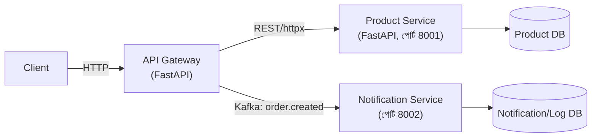

# ২৫.১০. Microservices Architecture with FastAPI

এতদিন আমরা যা বানিয়েছি সেটাকে বলে **Monolith** — একটাই অ্যাপ্লিকেশন, একটাই কোডবেজ, একটাই ডিপ্লয়মেন্ট, যার ভেতরে সুপার অ্যাডমিন, সাবস্ক্রিপশন, স্টোর, প্রোডাক্ট — সব মডিউল একসাথে থাকে। একটা প্রশ্ন স্বাভাবিকভাবেই আসে — যখন প্রজেক্ট আরও বড় হবে, একটা বড় টিম একসাথে কাজ করবে, তখন কি পুরো জিনিসটা একসাথে ডিপ্লয় করাই ভালো, নাকি আলাদা আলাদা সার্ভিসে ভাগ করা উচিত?

**Microservices Architecture**-এ পুরো সিস্টেমকে ছোট ছোট, স্বাধীনভাবে চলা সার্ভিসে ভাগ করে ফেলা হয় — যেমন একটা `order-service`, একটা `product-service`, একটা `notification-service` — প্রতিটা নিজের ডেটাবেজ, নিজের ডিপ্লয়মেন্ট, নিজের স্কেলিং নিয়ে আলাদাভাবে চলে। এটা অনেকটা একটা রেস্তোরাঁর কিচেনকে ভাগ ভাগ স্টেশনে ভাগ করার মতো — একজন শুধু গ্রিল সামলায়, একজন শুধু সালাদ, একজন শুধু ডেজার্ট।

## FastAPI-তে "মাইক্রোসার্ভিস" মানে কী

NestJS-এর `@nestjs/microservices` একটা নির্দিষ্ট, ফ্রেমওয়ার্ক-স্তরের abstraction দেয় (`@MessagePattern`, `ClientProxy`, `Transport.TCP`) — মাইক্রোসার্ভিস বলতে সেখানে একটা নির্দিষ্ট ধরনের NestJS অ্যাপ্লিকেশন বোঝানো হয়, যেটা `createMicroservice()` দিয়ে বুট হয়। FastAPI-তে এমন কোনো বিশেষ "মাইক্রোসার্ভিস মোড" নেই — একটা FastAPI মাইক্রোসার্ভিস আসলে শুধু **আরেকটা সাধারণ, স্বাধীন FastAPI অ্যাপ্লিকেশন**, যেটা নিজের পোর্টে চলে, আর অন্য সার্ভিসের সাথে সাধারণ HTTP (REST), gRPC, বা একটা মেসেজ ব্রোকার (আগের লেসনের Kafka) দিয়ে কথা বলে। এই সরলতাটাই FastAPI-এর একটা মূল দর্শন — মাইক্রোসার্ভিস হলো একটা স্থাপত্য সিদ্ধান্ত, ফ্রেমওয়ার্কের আলাদা বিশেষ মোড নয়।

## Service Boundary — REST দিয়ে ইন্টার-সার্ভিস কমিউনিকেশন

```python
# product-service/main.py — এটা এখন একটা আলাদা, স্বাধীন অ্যাপ্লিকেশন, নিজের পোর্টে
from fastapi import FastAPI

app = FastAPI(title="Product Service")


@app.get("/internal/products/{product_id}")
async def get_product(product_id: str):
    product = await product_repo.find_by_id(product_id)
    return {"id": product.id, "name": product.name, "price": product.price, "stock": product.stock}
```

```python
# api-gateway/order/service.py — মূল API গেটওয়ে, কাস্টমারের রিকোয়েস্ট সরাসরি গ্রহণ করে
import httpx

PRODUCT_SERVICE_URL = "http://product-service:8001"


async def create_order(dto: CreateOrderDto):
    async with httpx.AsyncClient(timeout=3.0) as client:
        response = await client.get(f"{PRODUCT_SERVICE_URL}/internal/products/{dto.product_id}")
        response.raise_for_status()
        product = response.json()

    if product["stock"] < dto.quantity:
        raise HTTPException(status_code=400, detail="স্টক নেই")

    return await order_repo.save(dto)
```

## gRPC — উচ্চ-পারফরম্যান্স ইন্টার-সার্ভিস কমিউনিকেশনের বিকল্প

সার্ভিস-টু-সার্ভিস কল যখন উচ্চ ফ্রিকোয়েন্সিতে হয় (প্রতি সেকেন্ডে হাজারো কল), REST-এর JSON serialization ওভারহেড একটা বাস্তব পারফরম্যান্স সমস্যা হয়ে দাঁড়াতে পারে। এই ক্ষেত্রে **gRPC** (Protocol Buffers-ভিত্তিক, বাইনারি প্রোটোকল) একটা দ্রুততর বিকল্প। `grpcio` লাইব্রেরি দিয়ে একটা `.proto` ফাইল থেকে টাইপ-সেফ ক্লায়েন্ট/সার্ভার কোড জেনারেট করা যায় — এটা একটা আলাদা টপিক, কিন্তু জানা জরুরি যে বড় মাইক্রোসার্ভিস সিস্টেমে ইন্টারনাল কমিউনিকেশনে REST-এর বদলে gRPC বেছে নেওয়া একটা সাধারণ প্র্যাকটিস, যখন কাস্টমার-facing API-টা এখনও REST থেকে যায় (বাইরের ক্লায়েন্টের জন্য সহজবোধ্যতা বজায় রাখতে)।

## API Gateway প্যাটার্ন



**API Gateway** প্যাটার্নে একটা একক এন্ট্রি পয়েন্ট (উপরের Gateway সার্ভিস) কাস্টমারের সব রিকোয়েস্ট গ্রহণ করে, প্রয়োজনে একাধিক ইন্টারনাল সার্ভিসকে কল করে ফলাফল একত্র করে, আর কাস্টমারকে একটা রেসপন্স দেয়। এভাবে কাস্টমারকে জানতেই হয় না যে ভেতরে কতগুলো আলাদা সার্ভিস আছে — এটাই encapsulation-এর একটা স্থাপত্য-স্তরের প্রয়োগ।

## প্রোডাকশন নুয়ান্স — Cascading Failure আর Timeout-এর অভাব

মাইক্রোসার্ভিস আর্কিটেকচারের সবচেয়ে বিপজ্জনক, বাস্তব-জগতের সমস্যা হলো **cascading failure**। উপরের `create_order()` কোডে লক্ষ্য করো `httpx.AsyncClient(timeout=3.0)` — এই টাইমআউট ইচ্ছাকৃতভাবে বসানো, কারণ এটা না থাকলে যা ঘটতে পারে তা ভয়াবহ: ধরো `product-service` কোনো কারণে ধীরগতির হয়ে গেছে (ডেটাবেজ লোড বেশি, বা নেটওয়ার্ক সমস্যা)। যদি `api-gateway`-এর HTTP ক্লায়েন্টের কোনো timeout না থাকে, তাহলে `create_order()`-এর প্রতিটা কল অনির্দিষ্টকালের জন্য অপেক্ষা করবে `product-service`-এর জবাবের জন্য। একের পর এক কাস্টমার অর্ডার দিতে থাকলে, `api-gateway`-এর প্রতিটা worker thread/connection ধীরে ধীরে এই "ঝুলে থাকা" রিকোয়েস্টে আটকে যাবে — এবং কিছুক্ষণ পরে `api-gateway`-ও অসাড় হয়ে যাবে, যদিও তার নিজের কোনো সমস্যা নেই। এভাবে একটা সার্ভিসের সমস্যা "cascade" করে পুরো সিস্টেমে ছড়িয়ে পড়ে — এই কারণেই মাইক্রোসার্ভিসে প্রতিটা ইন্টার-সার্ভিস কলে **timeout বসানো আবশ্যিক**, বিকল্প নয়।

এর সাথে আরও একটা প্রচলিত প্রতিরক্ষামূলক প্যাটার্ন হলো **circuit breaker** — যদি `product-service` পরপর কয়েকবার ব্যর্থ হয় বা টাইমআউট হয়, তাহলে গেটওয়ে কিছু সময়ের জন্য সেই সার্ভিসে নতুন কল পাঠানো বন্ধ করে দ্রুত একটা fallback রেসপন্স দেয় (যেমন "স্টক তথ্য সাময়িকভাবে অনুপলব্ধ"), ব্যর্থ কলে বারবার সময় নষ্ট না করে। Python-এ `pybreaker` বা `purgatory` লাইব্রেরি দিয়ে এটা বাস্তবায়ন করা যায়।

## Monolith বনাম Microservices — ট্রেড-অফ

মাইক্রোসার্ভিস আর্কিটেকচারের সুবিধা স্পষ্ট — প্রতিটা টিম স্বাধীনভাবে নিজের সার্ভিস ডেভেলপ, টেস্ট, ডিপ্লয় করতে পারে; একটা সার্ভিস ক্র্যাশ করলে (সঠিক timeout/circuit breaker সহ) পুরো সিস্টেম বন্ধ হয় না; আর যে সার্ভিসে বেশি লোড আসে সেটাকে আলাদাভাবে স্কেল করা যায়। কিন্তু দাম দিতে হয় জটিলতায় — নেটওয়ার্ক কল ব্যর্থ হতে পারে, ডেটা কনসিস্টেন্সি সামলানো কঠিন (দুটো আলাদা ডেটাবেজে একসাথে একটা transaction করা সম্ভব না, distributed transaction বা saga pattern লাগে), ডিবাগিং করতে একাধিক সার্ভিসের লগ একসাথে দেখতে হয় (correlation ID-র গুরুত্ব এখানেই, লেসন ৪-এ যেটা দেখেছি)। তাই ছোট বা মাঝারি প্রজেক্টে monolith-ই যথেষ্ট এবং বাস্তবসম্মত — আমাদের ই-কমার্স প্রজেক্টও সেই যুক্তিতেই একটা সুগঠিত monolith হিসেবে শুরু হয়েছিলো, যেটাকে দরকার হলে ভবিষ্যতে ধাপে ধাপে মাইক্রোসার্ভিসে ভাঙা যায়।

এখন প্রশ্ন হলো, আমরা যেভাবেই আর্কিটেকচার সাজাই না কেন — monolith বা মাইক্রোসার্ভিস — একটা প্রজেক্টকে সত্যিকারের বড় স্কেলে চালানোর জন্য কোড অর্গানাইজেশন, এনভায়রনমেন্ট কনফিগারেশন, আর গ্রেসফুল গ্রোথের পরিকল্পনা দরকার। পরের লেসনে আমরা ঠিক সেই বিষয়টা নিয়ে কথা বলবো — কীভাবে একটা FastAPI প্রজেক্টকে স্কেলযোগ্য করে বানানো হয়।
