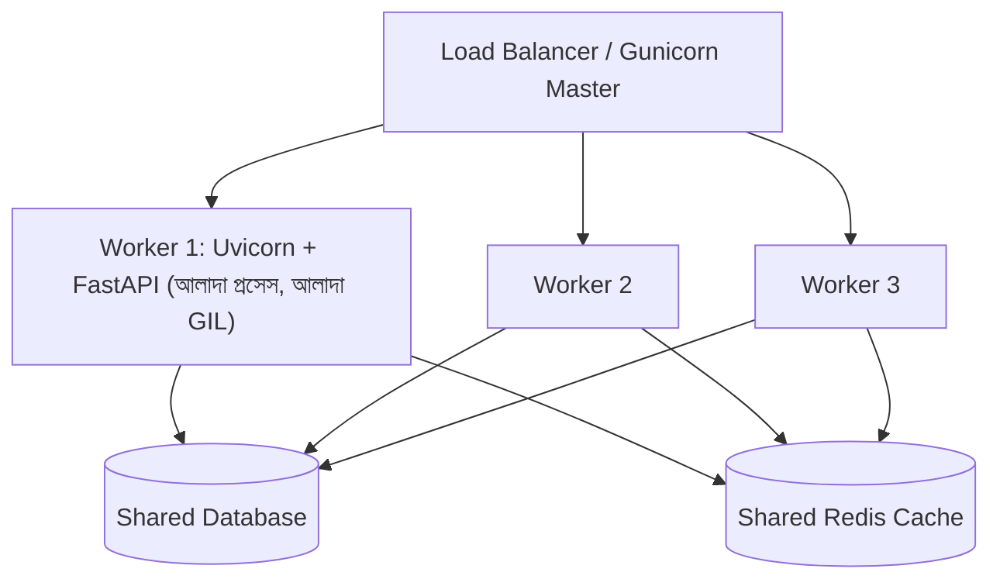

# ২৫.১১. Building a Scalable Project with FastAPI

আমরা এই মডিউলে একে একে JWT অথেন্টিকেশন, RBAC, এরর হ্যান্ডলিং, ভার্সনিং, রেট লিমিটিং, টেস্টিং, Kafka, WebSocket, Redis ক্যাশিং, আর মাইক্রোসার্ভিসের ধারণা যোগ করেছি আমাদের ই-কমার্স প্রজেক্টে। এখন সময় এসেছে থেমে পেছনে তাকানোর — এই সব টুকরো একসাথে জুড়ে একটা **স্কেলযোগ্য** প্রজেক্ট গঠন আসলে কেমন দেখতে হয়?

"স্কেলযোগ্য" শব্দটার দুইটা মানে আছে, দুটোই সমান গুরুত্বপূর্ণ। একটা হলো টেকনিক্যাল স্কেলিং — বেশি ইউজার, বেশি রিকোয়েস্ট সামলানো। আরেকটা হলো টিম স্কেলিং — বেশি ডেভেলপার একসাথে কাজ করলেও কোডবেজ গোলমেলে না হয়ে যাওয়া।

## ফোল্ডার স্ট্রাকচার

NestJS-এ মডিউল সিস্টেম (`@Module()`) জোরপূর্বক একটা কাঠামো চাপায়। FastAPI-তে এমন কোনো বাধ্যবাধকতা নেই, তাই স্কেল করার সময় কাঠামো নিজে ঠিক করে রাখাটা টিমের দায়িত্ব। একটা প্রচলিত, প্রমাণিত প্যাটার্ন হলো "domain-first" স্ট্রাকচার — Module 24-এর প্রজেক্টেরই স্বাভাবিক বিবর্তন:

```
app/
  common/
    dependencies.py      (get_current_user, RoleChecker)
    exceptions.py         (DuplicateStoreError)
    exception_handlers.py
    middleware.py         (CorrelationIdMiddleware, RequestLoggerMiddleware)
  config/
    settings.py           (pydantic Settings)
  modules/
    auth/
      router.py
      service.py
      schemas.py           (Pydantic মডেল — DTO-এর সমতুল্য)
    store/
      router.py
      service.py
      schemas.py
      models.py            (ORM মডেল)
    product/
    order/
    notification/
  main.py
```

এই স্ট্রাকচারটা প্রতিটা ডোমেইনকে (`store`, `product`, `order`) একটা স্বয়ংসম্পূর্ণ ফোল্ডারে রাখে — router, service, schema সব একসাথে, যাতে নতুন কেউ প্রজেক্টে যোগ দিলে দ্রুত বুঝতে পারে কোথায় কী খুঁজতে হবে। `common/` আর `config/` আলাদা রাখা হয়েছে, যাতে এই cross-cutting জিনিসগুলো সব ডোমেইনের জন্য একবারই লেখা হয়।

## Configuration Management — pydantic Settings

হার্ডকোড করা মান (যেমন ডেটাবেজ পাসওয়ার্ড, JWT সিক্রেট) কখনোই সোর্স কোডে থাকা উচিত না। NestJS-এর `@nestjs/config`-এর সমতুল্য FastAPI-তে হলো Pydantic-এর `BaseSettings` — যেটা শুধু environment variable পড়েই না, টাইপ ভ্যালিডেশনও করে দেয়:

```python
# config/settings.py
from pydantic_settings import BaseSettings


class Settings(BaseSettings):
    port: int = 8000
    jwt_secret: str
    redis_host: str = "localhost"
    database_url: str
    kafka_bootstrap_servers: str = "localhost:9092"

    class Config:
        env_file = ".env"


settings = Settings()
```

এখানে `jwt_secret: str` (কোনো ডিফল্ট মান ছাড়া) মানে হলো — যদি `.env` ফাইলে বা environment-এ `JWT_SECRET` না থাকে, তাহলে অ্যাপ্লিকেশন **চালু হওয়ার সময়ই** ভ্যালিডেশন এরর দিয়ে ক্র্যাশ করবে, রানটাইমে কোনো এক জায়গায় গিয়ে `None`-related এরর দেওয়ার বদলে। এই "fail fast at startup" আচরণটা একটা গুরুত্বপূর্ণ প্রোডাকশন প্র্যাকটিস — মিসিং কনফিগারেশন যত আগে ধরা পড়ে, তত ভালো, কারণ প্রোডাকশনে deploy হওয়ার পরে এই ভুল ধরা পড়া অনেক বেশি ক্ষতিকর।

## Performance Scaling — GIL, Worker, আর Async ফাঁদ

NestJS/Node.js-এর একটা সীমাবদ্ধতা হলো এটা সিঙ্গেল-থ্রেডেড — তাই PM2 বা `cluster` মডিউল দিয়ে একাধিক worker প্রসেস চালানো হয়, প্রতিটা আলাদা CPU কোরে। Python-এর ক্ষেত্রেও ধারণাটা একই থাকে, কিন্তু কারণটা আলাদা — Python-এর **GIL (Global Interpreter Lock)** একটা সময়ে একটা প্রসেসের ভেতরে একটাই থ্রেড আসলে Python bytecode চালাতে দেয়। এর মানে, একটা মাত্র Uvicorn প্রসেস, তার ভেতরে যতই async endpoint থাকুক, একসাথে একটার বেশি CPU কোর ব্যবহার করতে পারে না CPU-bound কাজের জন্য।

এই সীমাবদ্ধতা কাটানোর জন্য প্রোডাকশনে **Gunicorn** ব্যবহার করা হয় Uvicorn-এর "worker manager" হিসেবে — প্রতিটা worker আলাদা প্রসেস, আলাদা CPU কোরে:

```bash
gunicorn main:app --workers 4 --worker-class uvicorn.workers.UvicornWorker --bind 0.0.0.0:8000
```



লক্ষ্য করো, প্রতিটা worker আলাদা প্রসেস হলেও তারা একই ডেটাবেজ আর একই Redis শেয়ার করে — এই কারণেই আগের লেসনগুলোর rate limiter আর WebSocket connection manager-কে Redis-ভিত্তিক করা এত জরুরি ছিল, কারণ প্রতিটা worker-এর নিজের আলাদা in-memory স্টেট থাকে।

## প্রোডাকশন নুয়ান্স — Async Endpoint-এর ভেতরে Blocking Code

FastAPI-তে স্কেল করার সময় সবচেয়ে ভয়ংকর, সাইলেন্ট পারফরম্যান্স বাগ হলো একটা `async def` endpoint-এর ভেতরে একটা **blocking, sync কল** চালানো। FastAPI-এর পুরো async মডেলটা কাজ করে একটা একক event loop-এর উপর — একটা রিকোয়েস্ট যখন `await` করে, event loop অন্য রিকোয়েস্ট প্রসেস করতে পারে। কিন্তু যদি কেউ একটা sync, blocking লাইব্রেরি কল করে ফেলে (যেমন `requests.get()`, বা একটা sync ডেটাবেজ ড্রাইভার, বা `time.sleep()`) সরাসরি একটা `async def` ফাংশনের ভেতরে, তাহলে সেই কলটা **পুরো event loop-কে ব্লক করে ফেলে** — মানে সেই সময় ওই একটা worker-এর সব অন্য concurrent রিকোয়েস্ট থমকে থাকে, একজনও এগোতে পারে না, যতক্ষণ না blocking কলটা শেষ হয়।

```python
# ভুল — async def-এর ভেতরে sync, blocking লাইব্রেরি
@router.get("/products/{product_id}")
async def get_product(product_id: str):
    response = requests.get(f"http://product-service/{product_id}")  # পুরো worker ব্লক!
    return response.json()
```

```python
# ঠিক — async-compatible লাইব্রেরি ব্যবহার করা
@router.get("/products/{product_id}")
async def get_product(product_id: str):
    async with httpx.AsyncClient() as client:
        response = await client.get(f"http://product-service/{product_id}")
    return response.json()
```

এই বাগটা লোকাল ডেভেলপমেন্টে (এক-দুইটা রিকোয়েস্ট, দ্রুত) চোখেই পড়ে না — শুধু প্রোডাকশনে, একসাথে অনেক ইউজার থাকলে, পুরো সার্ভার ধীর হয়ে যায় বলে টের পাওয়া যায়, আর একটা প্রোফাইলার (যেমন `py-spy`) ছাড়া root cause খুঁজে পাওয়াও কঠিন। যদি কোনো ভারী, অনিবার্যভাবে sync একটা লাইব্রেরি (যেমন কিছু পুরনো ML মডেল লোডার) ব্যবহার করতেই হয়, তাহলে সেটাকে `run_in_threadpool` বা `asyncio.to_thread()` দিয়ে একটা আলাদা থ্রেডে চালাতে হবে, যাতে মূল event loop মুক্ত থাকে।

এখন আমাদের প্রজেক্ট কোড স্তরে গোছানো, কনফিগারেশন-নিরাপদ, আর একাধিক worker-এ চলার উপযোগী। শেষ ধাপ বাকি — এই কোডটাকে আসলে একটা সার্ভারে তুলে, পাবলিক ইন্টারনেটে জীবন্ত করা। পরের এবং এই মডিউলের শেষ লেসনে আমরা FastAPI অ্যাপ্লিকেশন প্রোডাকশনে ডিপ্লয় করার প্রক্রিয়া দেখবো।
