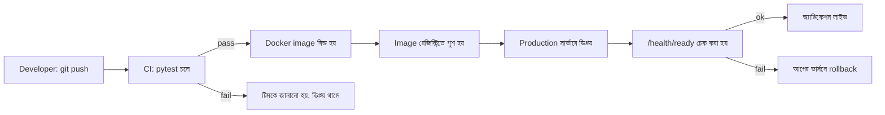

# ২৫.১২. Deploying a FastAPI Application to Production

আমাদের ই-কমার্স প্রজেক্টের যাত্রা এখানে একটা গুরুত্বপূর্ণ মাইলফলকে পৌঁছাচ্ছে — এখন পর্যন্ত সবকিছু আমাদের নিজের কম্পিউটারে (localhost) চলেছে। কিন্তু একটা প্রজেক্ট ততক্ষণ পর্যন্ত "সত্যিকারের প্রোডাক্ট" না, যতক্ষণ না সেটা ইন্টারনেটে থাকা মানুষ ব্যবহার করতে পারে।

## Docker — Multi-stage Build

প্রোডাকশনে ডিপ্লয় করার সবচেয়ে নির্ভরযোগ্য পদ্ধতি হলো অ্যাপ্লিকেশনকে একটা "কন্টেইনারে" প্যাক করা, যাতে ডেভেলপারের কম্পিউটারে যা চলে, সার্ভারেও ঠিক একইভাবে চলে — কোনো "আমার মেশিনে তো কাজ করছিলো" সমস্যা থাকে না।

```dockerfile
# Dockerfile
FROM python:3.12-slim AS build
WORKDIR /app
COPY requirements.txt .
RUN pip install --no-cache-dir --user -r requirements.txt

FROM python:3.12-slim
WORKDIR /app
COPY --from=build /root/.local /root/.local
COPY . .
ENV PATH=/root/.local/bin:$PATH
EXPOSE 8000
CMD ["gunicorn", "main:app", "--workers", "4", "--worker-class", "uvicorn.workers.UvicornWorker", "--bind", "0.0.0.0:8000"]
```

এখানে **multi-stage build** ব্যবহার করা হয়েছে — প্রথম স্টেজে dependency ইনস্টল করা হচ্ছে, দ্বিতীয় স্টেজে শুধু ইনস্টল হওয়া প্যাকেজ আর অ্যাপ্লিকেশন কোড রাখা হচ্ছে, বিল্ড-টাইম টুলস (compiler, cache) ছাড়া — এতে ফাইনাল ইমেজের সাইজ ছোট থাকে, যা ডিপ্লয়মেন্টকে দ্রুত করে আর নিরাপত্তার দিক থেকেও ভালো (কম সারফেস এরিয়া)। NestJS-এর Dockerfile-এ TypeScript compile করার আলাদা স্টেজ লাগে (`npm run build`); Python-এ কোনো compile step লাগে না, তাই এখানে স্টেজ ভাগ হচ্ছে মূলত dependency ইনস্টলেশনকে final image থেকে আলাদা রাখার জন্য।

## docker-compose — পুরো সিস্টেম একসাথে

আমাদের প্রজেক্ট শুধু FastAPI অ্যাপ না — সাথে PostgreSQL ডেটাবেজ, Redis ক্যাশ, আর Kafka ব্রোকারও লাগবে।

```yaml
# docker-compose.yml
services:
  api:
    build: .
    ports: ["8000:8000"]
    env_file: .env
    depends_on: [postgres, redis]
  postgres:
    image: postgres:16
    environment:
      POSTGRES_DB: ecommerce
      POSTGRES_PASSWORD: ${DB_PASSWORD}
    volumes: ["pgdata:/var/lib/postgresql/data"]
  redis:
    image: redis:7-alpine
volumes:
  pgdata:
```

## Environment Config আর Health Check

আগের লেসনে দেখা pydantic `Settings` ক্লাসটাই এখানে secret ম্যানেজমেন্টের ভিত্তি — সব সিক্রেট `.env` থেকে আসবে, কখনো Docker ইমেজের ভেতরে বেক করা থাকবে না। এর সাথে একটা **health check endpoint** দরকার, যাতে লোড ব্যালেন্সার বা orchestrator (Kubernetes) বুঝতে পারে সার্ভার জীবিত আছে কিনা।

```python
# health/router.py
from fastapi import APIRouter
from datetime import datetime, timezone

router = APIRouter()


@router.get("/health")
async def health_check():
    return {"status": "ok", "timestamp": datetime.now(timezone.utc).isoformat()}


@router.get("/health/ready")
async def readiness_check():
    db_ok = await check_database_connection()
    redis_ok = await check_redis_connection()
    if not (db_ok and redis_ok):
        raise HTTPException(status_code=503, detail="dependency not ready")
    return {"status": "ready"}
```

লক্ষ্য করো দুটো আলাদা এন্ডপয়েন্ট — `/health` (liveness: প্রসেসটা চলছে কিনা) আর `/health/ready` (readiness: এটা এখন ট্র্যাফিক নেওয়ার জন্য প্রস্তুত কিনা, ডেটাবেজ/Redis কানেকশন কাজ করছে কিনা)। এই পার্থক্যটা Kubernetes-এর মতো orchestrator-এ গুরুত্বপূর্ণ — liveness ফেইল করলে কন্টেইনার রিস্টার্ট হয়, readiness ফেইল করলে শুধু ট্র্যাফিক পাঠানো বন্ধ হয় (রিস্টার্ট ছাড়াই), যা স্টার্টআপ সময়ে ডেটাবেজ মাইগ্রেশন চলার মতো পরিস্থিতিতে অপ্রয়োজনীয় রিস্টার্ট এড়ায়।

## Graceful Shutdown

একটা গুরুত্বপূর্ণ, প্রায়ই ভুলে যাওয়া প্রোডাকশন বিষয় — যখন Kubernetes বা Docker একটা কন্টেইনার বন্ধ করতে চায় (নতুন ডিপ্লয়মেন্টের জন্য, বা স্কেল-ডাউনের জন্য), এটা প্রথমে একটা `SIGTERM` সিগন্যাল পাঠায়, তারপর কিছু সময় (সাধারণত ৩০ সেকেন্ড) অপেক্ষা করে, তারপর জোর করে `SIGKILL` দিয়ে বন্ধ করে দেয়। যদি অ্যাপ্লিকেশন `SIGTERM` পেয়ে সাথে সাথে বন্ধ হয়ে যায়, তাহলে যে রিকোয়েস্টগুলো তখন চলছিল সেগুলো **অসম্পূর্ণ অবস্থায় কাটা পড়ে** — একজন কাস্টমার হয়তো ঠিক তখন অর্ডার সাবমিট করছিল, আর তার রিকোয়েস্ট মাঝপথে বিচ্ছিন্ন হয়ে গেলো।

FastAPI-এর `lifespan` (আগের লেসনে Kafka producer শুরু/বন্ধ করতে দেখা হয়েছে) এখানেও কাজে আসে — শাটডাউনের সময় চলমান কাজ শেষ হওয়ার জন্য সময় দেওয়া যায়:

```python
@asynccontextmanager
async def lifespan(app: FastAPI):
    await start_producer()
    yield
    print("শাটডাউন শুরু — চলমান রিকোয়েস্ট শেষ হওয়ার অপেক্ষা করা হচ্ছে...")
    await stop_producer()  # Kafka producer-এর বাফারে থাকা মেসেজ ফ্লাশ করে তারপর বন্ধ হয়
```

Uvicorn/Gunicorn নিজেই `SIGTERM` পেলে নতুন রিকোয়েস্ট নেওয়া বন্ধ করে দেয় আর চলমান রিকোয়েস্ট শেষ হওয়ার জন্য একটা গ্রেস পিরিয়ড দেয় — কিন্তু Kubernetes-এর ডিফল্ট গ্রেস পিরিয়ড (৩০ সেকেন্ড) কিছু ভারী অপারেশনের (যেমন একটা বড় রিপোর্ট জেনারেট করা) জন্য যথেষ্ট না হতে পারে, তাই `terminationGracePeriodSeconds` কাস্টমাইজ করাটা মনে রাখা জরুরি প্রোডাকশন কনফিগারেশনে।

## CI/CD Pipeline



## NestJS-এর তুলনা

NestJS/Node.js-এর Dockerfile-এ `npm run build` দিয়ে TypeScript কম্পাইল করা একটা আবশ্যিক স্টেজ, আর `node dist/main.js` দিয়ে চালানো হয়। FastAPI/Python-এ কোনো কম্পাইল স্টেপ নেই — সরাসরি ইন্টারপ্রেট হয় — কিন্তু এর বদলে Python-এ Gunicorn+Uvicorn worker কনফিগারেশন (`--workers 4`) একটা গুরুত্বপূর্ণ, ম্যানুয়ালি ঠিক করার বিষয়, যেখানে Node.js-এ ক্লাস্টারিং প্রায়ই PM2-এর মতো আলাদা প্রসেস ম্যানেজার দিয়ে হ্যান্ডল হয়। দুটো ইকোসিস্টেমেই মূল দর্শন একই — সিঙ্গেল-থ্রেড/GIL সীমাবদ্ধতা কাটানোর জন্য একাধিক প্রসেস দরকার, শুধু টুল আলাদা।

এই লেসন দিয়ে আমাদের FastAPI Advanced মডিউল শেষ হলো — routing/middleware থেকে শুরু করে authentication, RBAC, error handling, versioning, testing, event-driven architecture, WebSocket, caching, microservices, scalability, আর শেষে deployment পর্যন্ত, পুরো একটা enterprise-grade ব্যাকএন্ড সিস্টেম বানানোর সম্পূর্ণ পথ পাড়ি দেয়া হলো। কিন্তু আমাদের API আরও উন্নত করার জায়গা এখনও বাকি — এখন পর্যন্ত আমরা মূলত GET আর POST নিয়ে কাজ করেছি বেশি। পরের মডিউলে আমরা ফিরে যাবো POST রিকোয়েস্ট আর ফাইল আপলোডের খুঁটিনাটি নিয়ে, আরও গভীরভাবে।
