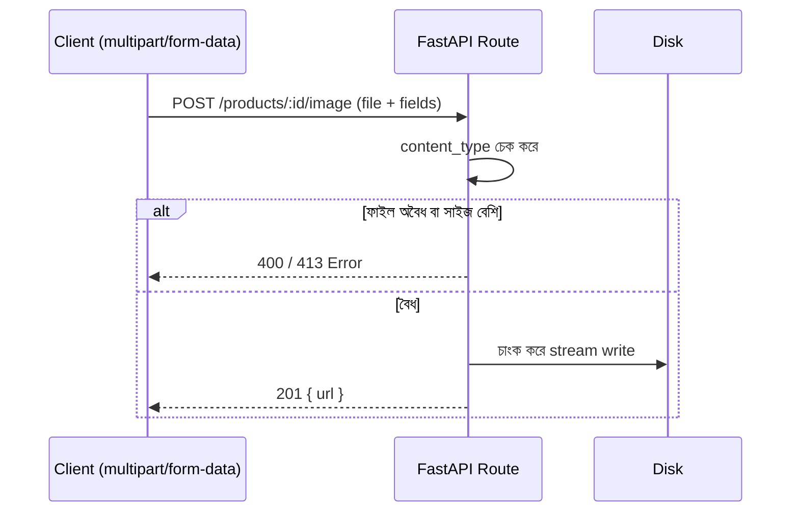

# ২৬.০১. Form Submission and File Upload Handling

Module 6-এ POST রিকোয়েস্টের অ্যানাটমি শেখার সময় আমরা ধরে নিয়েছিলাম ক্লায়েন্ট শুধু সাধারণ JSON ডেটা পাঠাচ্ছে — নাম, ইমেইল, দাম, এই ধরনের টেক্সট আর সংখ্যা। কিন্তু বাস্তব অ্যাপ্লিকেশনে ইউজার প্রায়ই একটা ছবি বা ফাইলও পাঠায় — প্রোফাইল পিকচার, প্রোডাক্টের ছবি, রিজিউম। এই লেসনে আমরা দেখবো FastAPI-তে এই কাজটা কীভাবে হয়।

সমস্যাটা প্রথমে বুঝি — সাধারণ JSON রিকোয়েস্ট বডি `Content-Type: application/json` হিসেবে পাঠানো হয়, যেটা FastAPI-এর Pydantic মডেল সরাসরি পার্স করে (Module 6)। কিন্তু ফাইল পাঠাতে হলে ব্রাউজার `multipart/form-data` নামের একটা ভিন্ন ফরম্যাট ব্যবহার করে, যেখানে টেক্সট ফিল্ড আর বাইনারি ফাইল ডেটা একসাথে, আলাদা আলাদা "অংশে" (part) ভাগ করে পাঠানো হয়। এই ফরম্যাটটা JSON বডি পার্স করার মতো সহজ নয় — এর জন্য FastAPI-এ বিল্ট-ইন সাপোর্ট আছে, `python-multipart` লাইব্রেরির উপর ভিত্তি করে, আর দুটো বিশেষ টাইপ ব্যবহার করে — `Form()` আর `UploadFile`।

```bash
pip install python-multipart
```

```python
# routers/products.py
import os
import uuid
from fastapi import APIRouter, UploadFile, File, Form, HTTPException, status

router = APIRouter(prefix="/products", tags=["products"])

UPLOAD_DIR = "uploads/products"
ALLOWED_TYPES = {"image/jpeg", "image/png", "image/webp"}
MAX_FILE_SIZE = 5 * 1024 * 1024  # ৫ মেগাবাইট


@router.post("/{product_id}/image", status_code=status.HTTP_201_CREATED)
async def upload_product_image(product_id: str, image: UploadFile = File(...)):
    if image.content_type not in ALLOWED_TYPES:
        raise HTTPException(status_code=400, detail="শুধু JPEG, PNG, WEBP ফাইল অনুমোদিত")

    extension = os.path.splitext(image.filename)[1]
    unique_name = f"{uuid.uuid4().hex}{extension}"
    destination = os.path.join(UPLOAD_DIR, unique_name)

    os.makedirs(UPLOAD_DIR, exist_ok=True)

    size = 0
    with open(destination, "wb") as buffer:
        while chunk := await image.read(1024 * 1024):  # ১ মেগাবাইট করে চাংক
            size += len(chunk)
            if size > MAX_FILE_SIZE:
                buffer.close()
                os.remove(destination)
                raise HTTPException(status_code=413, detail="ফাইল সাইজ ৫MB সীমার বেশি")
            buffer.write(chunk)

    return {"success": True, "data": {"url": f"/uploads/products/{unique_name}"}}
```

এখানে তিনটা গুরুত্বপূর্ণ সিদ্ধান্ত নেয়া হয়েছে, যেগুলো নিরাপত্তার দিক থেকে জরুরি। প্রথমত, ফাইলের নাম জেনারেট করার সময় ইউজারের দেয়া আসল ফাইলের নাম সরাসরি ব্যবহার না করে `uuid4()` দিয়ে একটা র‍্যান্ডম নাম বসানো হয়েছে — কারণ ইউজার এমন ফাইলের নামও দিতে পারে যেটা সার্ভারে আগে থেকেই থাকা কোনো গুরুত্বপূর্ণ ফাইলের নাম ওভাররাইট করে দিতে পারে, বা path traversal (`../../etc/passwd` ধরনের নাম) ঘটাতে পারে। দ্বিতীয়ত, ফাইল সাইজ ম্যানুয়ালি গুনে গুনে সীমাবদ্ধ করা হয়েছে, যাতে কেউ বিশাল ফাইল পাঠিয়ে সার্ভারের ডিস্ক বা মেমোরি শেষ করে দিতে না পারে। তৃতীয়ত, `content_type` চেক করে শুধু নির্দিষ্ট ধরনের ফাইল গ্রহণ করা হচ্ছে — এক্সিকিউটেবল বা স্ক্রিপ্ট ফাইল আপলোড ঠেকানোর প্রথম স্তর এটাই (এই চেকটা কতটা বিশ্বাসযোগ্য, সেটা পরের লেসনের সিকিউরিটি আলোচনায় আরও গভীরে যাবো)।

একাধিক ফাইল (যেমন প্রোডাক্টের গ্যালারি) নিতে হলে টাইপ হিন্ট বদলে `list[UploadFile]` ব্যবহার করা হয়:

```python
@router.post("/{product_id}/images")
async def upload_product_images(product_id: str, images: list[UploadFile] = File(...)):
    if len(images) > 5:
        raise HTTPException(status_code=400, detail="সর্বোচ্চ ৫টা ছবি একসাথে পাঠানো যাবে")
    # ... একইভাবে লুপে প্রতিটা ফাইল প্রসেস করা
```

আর যদি ফাইলের পাশাপাশি সাধারণ টেক্সট ফিল্ডও (যেমন প্রোডাক্টের নাম) একই ফর্মে পাঠানো হয়, তাহলে `Form()` ব্যবহার করতে হয় — এটা `multipart/form-data`-এর টেক্সট পার্ট পড়ে, Pydantic বডি মডেলের মতো নয় (কারণ multipart রিকোয়েস্টে JSON বডি থাকে না):

```python
@router.post("/{product_id}/image-with-caption", status_code=201)
async def upload_with_caption(
    product_id: str,
    caption: str = Form(...),
    image: UploadFile = File(...),
):
    return {"success": True, "data": {"caption": caption, "filename": image.filename}}
```



এখানে একটা গুরুত্বপূর্ণ প্রোডাকশন সূক্ষ্মতা লক্ষ্য করার মতো — উপরের কোডে আমরা `image.read(1024 * 1024)` দিয়ে ফাইলটা **চাংক করে করে (streaming)** ডিস্কে লিখছি, পুরো ফাইল একবারে মেমোরিতে না তুলে। অনেক শুরুর দিকের টিউটোরিয়াল সরলভাবে লেখে:

```python
contents = await image.read()  # ⚠️ পুরো ফাইল একবারে মেমোরিতে
with open(destination, "wb") as f:
    f.write(contents)
```

এটা ছোট ফাইলের জন্য কাজ করে, কিন্তু একজন ইউজার যদি ২ গিগাবাইটের একটা ফাইল পাঠায় (এমনকি `fileFilter`-এর আগেই, কারণ পুরো বডি প্রথমে মেমোরিতে লোড হয়ে যায়), তাহলে সেই একটা রিকোয়েস্টই সার্ভারের RAM শেষ করে দিতে পারে — আর যদি একসাথে কয়েকজন ইউজার এমন করে, পুরো সার্ভার ক্র্যাশ করে যেতে পারে। এটা একটা ক্লাসিক denial-of-service ভেক্টর, যেটা শুধু "ফাইল সাইজ লিমিট চেক করলাম" ভেবে সন্তুষ্ট হওয়া ডেভেলপারদের প্রায়ই ফাঁকি দিয়ে যায় — কারণ লিমিট চেক করার আগেই ফাইলটা মেমোরিতে পুরো লোড হয়ে গেছে। তাই স্ট্রিমিং পড়া-লেখা (`read(chunk_size)` লুপে) real production সিস্টেমে অত্যন্ত জরুরি একটা প্র্যাকটিস, বিশেষ করে বড় ফাইল (ভিডিও, ডকুমেন্ট) হ্যান্ডল করার সময়।

ফাইল আপলোড হ্যান্ডলিং শেষ, কিন্তু এখানে অনেক জায়গায় ভুল হতে পারে — ভুল ফাইল টাইপ, সাইজ সীমা ছাড়ানো, ডিস্ক ফুল হয়ে যাওয়া। এই এররগুলো ইউজারকে কীভাবে পরিষ্কারভাবে জানাবো, সেটাই পরের লেসনের বিষয় — POST API-তে Error Handling।
