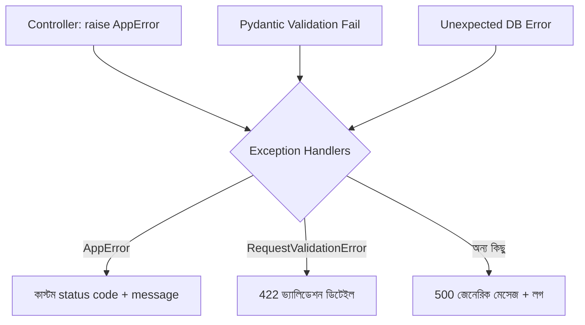

# ২৬.০২. Error Handling in POST APIs

আগের লেসনে আমরা ফাইল আপলোড বসিয়েছিলাম, কিন্তু একটা জিনিস উহ্য রেখে দিয়েছিলাম — যদি ফাইল টাইপ ভুল হয় বা সাইজ বেশি হয়ে যায়, তাহলে সেটা ঠিক কীভাবে সুসংগঠিতভাবে ইউজারের কাছে পৌঁছায়? এই লেসনে আমরা POST API-এর এরর হ্যান্ডলিংটা পুরোপুরি সাজাবো, Module 7-এ শেখা কাস্টম মিডলওয়্যার আর dependency-এর ধারণাটাকে আরেকটু বিস্তৃত করে।

POST রিকোয়েস্টে এরর হওয়ার সুযোগ GET-এর চেয়ে অনেক বেশি, কারণ POST মানেই নতুন ডেটা তৈরি করা — আর ডেটা তৈরি করতে গেলে ভ্যালিডেশন, ডুপ্লিকেট চেক, বিজনেস রুল, ডেটাবেজ কনস্ট্রেইন্ট — এই সবকিছু ভুল হওয়ার সুযোগ তৈরি করে। FastAPI-তে এই এররগুলোকে তিন স্তরে ভাগ করে দেখা ভালো — ভ্যালিডেশন এরর (ইউজারের ভুল ইনপুট, যা FastAPI নিজেই Pydantic দিয়ে ধরে ফেলে, HTTP 422), বিজনেস লজিক এরর (যেমন ডুপ্লিকেট ইমেইল, HTTP 400/409), আর আনএক্সপেক্টেড এরর (ডেটাবেজ ডাউন, কোড বাগ, HTTP 500)।

## FastAPI-এর বিল্ট-ইন `HTTPException`

সবচেয়ে সহজ পথ — FastAPI-এর নিজস্ব `HTTPException` ব্যবহার করা, যেটা সরাসরি একটা স্ট্যাটাস কোড আর মেসেজ বহন করতে পারে।

```python
# routers/products.py
from fastapi import APIRouter, HTTPException, status
from pydantic import BaseModel

router = APIRouter(prefix="/products", tags=["products"])


class ProductIn(BaseModel):
    name: str
    price: float


@router.post("", status_code=status.HTTP_201_CREATED)
async def create_product(payload: ProductIn):
    exists = await Product.find_one({"name": payload.name})
    if exists:
        raise HTTPException(
            status_code=status.HTTP_409_CONFLICT,
            detail="এই নামে প্রোডাক্ট আগে থেকেই আছে",
        )

    product = await Product.create(payload.model_dump())
    return {"success": True, "data": product}
```

লক্ষ্য করো — এখানে `name`, `price`-এর টাইপ বা "আছে কিনা" ভ্যালিডেশন আমাদের নিজে চেক করতে হয়নি, কারণ `ProductIn` Pydantic মডেলটা যদি ভুল ডেটা পায় (যেমন `price` স্ট্রিং পাঠানো), FastAPI নিজেই স্বয়ংক্রিয়ভাবে `422 Unprocessable Entity` রিটার্ন করে দেয়, রুট ফাংশন চালানোর আগেই। এটাই Express.js-এর সাথে বড় পার্থক্য — সেখানে ভ্যালিডেশন আলাদা মিডলওয়্যার দিয়ে ম্যানুয়ালি করতে হতো, এখানে টাইপ হিন্ট থেকেই সেটা "ফ্রি"-তে চলে আসে।

## কাস্টম Business Error আর Global Exception Handler

কিন্তু সব প্রোজেক্টে `HTTPException` ছড়িয়ে ছিটিয়ে ব্যবহার করলে একটা সমস্যা হয় — প্রতিটা এরর রেসপন্সের শেপ (shape) হুবহু এক না হতে পারে, কারণ প্রতিটা ডেভেলপার নিজের ইচ্ছামতো `detail` সাজায়। তাই একটা কাস্টম এরর ক্লাস আর কেন্দ্রীয় exception handler বানানো ভালো অভ্যাস।

```python
# common/errors.py
class AppError(Exception):
    def __init__(self, status_code: int, message: str, details: dict | None = None):
        self.status_code = status_code
        self.message = message
        self.details = details
```

```python
# main.py
from fastapi import FastAPI, Request, status
from fastapi.responses import JSONResponse
from fastapi.exceptions import RequestValidationError
from common.errors import AppError

app = FastAPI()


@app.exception_handler(AppError)
async def app_error_handler(request: Request, exc: AppError):
    return JSONResponse(
        status_code=exc.status_code,
        content={"success": False, "message": exc.message, "details": exc.details},
    )


@app.exception_handler(RequestValidationError)
async def validation_error_handler(request: Request, exc: RequestValidationError):
    return JSONResponse(
        status_code=status.HTTP_422_UNPROCESSABLE_ENTITY,
        content={"success": False, "message": "ইনপুট ভ্যালিডেশন ব্যর্থ হয়েছে", "details": exc.errors()},
    )


@app.exception_handler(Exception)
async def unhandled_error_handler(request: Request, exc: Exception):
    print(f"Unhandled error: {exc}")  # আসল প্রোজেক্টে proper logger ব্যবহার করা উচিত
    return JSONResponse(
        status_code=status.HTTP_500_INTERNAL_SERVER_ERROR,
        content={"success": False, "message": "সার্ভারে একটা সমস্যা হয়েছে"},
    )
```

এখন কন্ট্রোলারে `AppError` ছোঁড়া যায়, আর FastAPI নিজেই সেটা ধরে সঠিক হ্যান্ডলারে পাঠিয়ে দেয় — Express.js-এর `next(err)` কল করার মতো কিছু ম্যানুয়ালি করতে হয় না, শুধু `raise` করলেই চলে:

```python
@router.post("")
async def create_product(payload: ProductIn):
    if not payload.name or payload.price is None:
        raise AppError(400, "name এবং price আবশ্যক")

    exists = await Product.find_one({"name": payload.name})
    if exists:
        raise AppError(409, "এই নামে প্রোডাক্ট আগে থেকেই আছে")

    product = await Product.create(payload.model_dump())
    return {"success": True, "data": product}
```



## Common Mistake: এরর রেসপন্সের ইনকনসিস্টেন্ট শেপ

একটা প্রায়ই দেখা ভুল — আলাদা আলাদা এন্ডপয়েন্টে আলাদা আলাদা এরর শেপ ফেরত দেওয়া। যেমন কোনো এক এন্ডপয়েন্টে `raise HTTPException(status_code=400, detail="...")` লেখা হলো (যার আউটপুট হয় `{"detail": "..."}`), আর আরেক এন্ডপয়েন্টে ম্যানুয়ালি `{"success": False, "message": "..."}` শেপে JSONResponse রিটার্ন করা হলো। ফলাফল — ফ্রন্টএন্ড ডেভেলপারকে প্রতিটা এন্ডপয়েন্টের জন্য আলাদা এরর-পার্সিং লজিক লিখতে হয়, যা বাগের একটা বড় সোর্স হয়ে দাঁড়ায়। এই সমস্যা এড়ানোর উপায় হলো — `HTTPException` সরাসরি ব্যবহার না করে সবসময় `AppError` (বা তার সমতুল্য একটা কাস্টম ক্লাস) ব্যবহার করা, আর একটা একক global handler-এর মধ্য দিয়েই সব এরর একই শেপে বের হওয়া নিশ্চিত করা। এমনকি চাইলে `HTTPException`-এর জন্যও একটা কাস্টম হ্যান্ডলার বসিয়ে দেওয়া যায়, যাতে কেউ ভুলে `HTTPException` ব্যবহার করলেও রেসপন্স শেপ ভেঙে না যায়:

```python
from fastapi import HTTPException as FastAPIHTTPException


@app.exception_handler(FastAPIHTTPException)
async def http_exception_handler(request: Request, exc: FastAPIHTTPException):
    return JSONResponse(
        status_code=exc.status_code,
        content={"success": False, "message": exc.detail},
    )
```

এই সেফটি-নেটটা থাকলে টিমের কেউ ভুলবশত সরাসরি `HTTPException` ব্যবহার করলেও ক্লায়েন্ট সবসময় একই, প্রেডিক্টেবল এরর শেপ পায়।

লক্ষ্য করার মতো আরেকটা নীতি — আনএক্সপেক্টেড এরর (যেমন কোড বাগ বা ডেটাবেজ ক্র্যাশ) কখনো তার আসল, টেকনিক্যাল মেসেজ (যেমন স্ট্যাক ট্রেস বা ডেটাবেজ কানেকশন স্ট্রিং) সরাসরি ইউজারকে দেখানো উচিত না, কারণ এতে সিস্টেমের অভ্যন্তরীণ গঠন ফাঁস হতে পারে, যা আক্রমণকারীর কাজে লাগতে পারে। ইউজারকে জেনেরিক মেসেজ দেয়া হয়, কিন্তু সার্ভারের লগে পুরো বিস্তারিত রাখা হয় — এটাই এরর হ্যান্ডলিং-এর একটা গুরুত্বপূর্ণ নিরাপত্তা নীতি, যেটা পরের লেসনে আমরা আরও বিস্তৃতভাবে দেখবো — POST API Security Best Practices।
