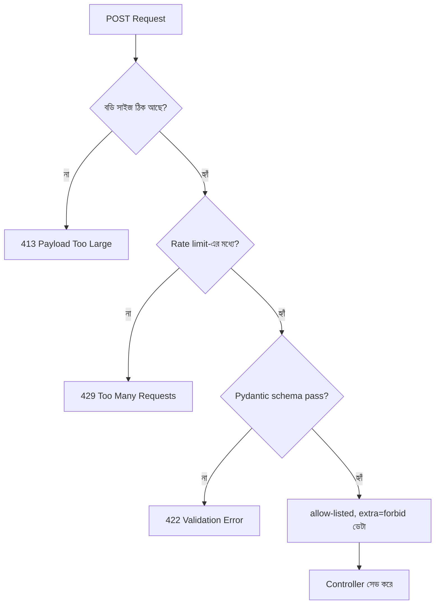

# ২৬.০৩. POST API Security Best Practices

আমাদের POST API এখন ফাইল আপলোড আর গোছানো এরর হ্যান্ডলিং পেয়ে গেছে। এই লেসনে আমরা প্রশ্নটা উল্টো দিক থেকে করবো — যদি কেউ ইচ্ছাকৃতভাবে ক্ষতি করার চেষ্টা করে, তাহলে কোথায় কোথায় ফাঁক থেকে যেতে পারে? POST এন্ডপয়েন্ট যেহেতু নতুন ডেটা তৈরি করে, তাই এটা আক্রমণকারীদের প্রিয় জায়গা — এখানেই সবচেয়ে বেশি "লিখে ফেলার" সুযোগ থাকে।

প্রথম এবং সবচেয়ে গুরুত্বপূর্ণ নীতি — **ইনপুট কখনো বিশ্বাস করা যাবে না**, সে যত "নিরাপদ" ক্লায়েন্ট থেকেই আসুক না কেন। ফ্রন্টএন্ডে ভ্যালিডেশন থাকলেও, একজন আক্রমণকারী সরাসরি Postman বা কার্ল দিয়ে API কল করতে পারে, ফ্রন্টএন্ড এড়িয়ে। তাই সার্ভার-সাইড ভ্যালিডেশন সবসময় বাধ্যতামূলক। FastAPI-তে এটা Pydantic মডেলের মাধ্যমে স্বাভাবিকভাবেই আসে।

```python
# schemas/product.py
from pydantic import BaseModel, Field, ConfigDict


class ProductCreate(BaseModel):
    model_config = ConfigDict(extra="forbid")  # অতিরিক্ত ফিল্ড থাকলে রিজেক্ট

    name: str = Field(min_length=2, max_length=100)
    price: float = Field(gt=0)
    description: str | None = Field(default=None, max_length=2000)
```

দ্বিতীয়, **Mass Assignment** নামের একটা সূক্ষ্ম কিন্তু বিপজ্জনক সমস্যা। ধরো তোমার `User` মডেলে একটা `role` ফিল্ড আছে। যদি তুমি রিকোয়েস্ট বডি থেকে সরাসরি ডিকশনারি বানিয়ে ডেটাবেজে পাঠিয়ে দাও, আর ভ্যালিডেশন স্কিমা `role` ফিল্ড বাদ না দেয়, তাহলে একজন আক্রমণকারী রেজিস্ট্রেশনের সময় এক্সট্রা ফিল্ড হিসেবে `"role": "admin"` পাঠিয়ে নিজেকে অ্যাডমিন বানিয়ে ফেলতে পারে! উপরের `ProductCreate` স্কিমাটায় `model_config = ConfigDict(extra="forbid")` ঠিক এই কারণেই বসানো হয়েছে — এটা শুধু নির্দিষ্ট ফিল্ড allow করে, আর অতিরিক্ত কোনো ফিল্ড এলে পুরো রিকোয়েস্টটাই `422` দিয়ে রিজেক্ট করে দেয় (`extra="ignore"` দিলে FastAPI ডিফল্টভাবে অতিরিক্ত ফিল্ড নিরবে বাদ দিয়ে দিতো, যা কম সেফ — কারণ ভুল বোঝাবুঝি চাপা পড়ে যায়)।

তৃতীয়, **Rate Limiting** — Module 7-তে শেখা ধারণাটা POST এন্ডপয়েন্টে আরও জরুরি, কারণ POST দিয়ে বারবার রিসোর্স তৈরি করলে ডেটাবেজ ভরে যেতে পারে, বা রেজিস্ট্রেশন/লগইন এন্ডপয়েন্টে ব্রুট-ফোর্স অ্যাটাক চলতে পারে। FastAPI-তে `slowapi` লাইব্রেরি দিয়ে এটা সহজে করা যায়।

```python
from slowapi import Limiter
from slowapi.util import get_remote_address

limiter = Limiter(key_func=get_remote_address)
app.state.limiter = limiter


@router.post("/products")
@limiter.limit("20/15minutes")
async def create_product(request: Request, payload: ProductCreate):
    ...
```

চতুর্থ, **Content-Type, CSRF, এবং সাইজ সীমা**। খুব বড় বডি পাঠিয়ে সার্ভারকে ব্যস্ত রাখা (denial-of-service-এর একটা সহজ রূপ) ঠেকাতে বডি সাইজ সীমাবদ্ধ রাখা দরকার। FastAPI-তে এটা একটা কাস্টম মিডলওয়্যার দিয়ে করা যায়, কারণ Starlette-এর ডিফল্ট বিহেভিয়ারে কোনো বিল্ট-ইন হার্ড লিমিট নেই।

```python
from starlette.middleware.base import BaseHTTPMiddleware

MAX_BODY_SIZE = 100 * 1024  # ১০০ কিলোবাইট


class BodySizeLimitMiddleware(BaseHTTPMiddleware):
    async def dispatch(self, request: Request, call_next):
        content_length = request.headers.get("content-length")
        if content_length and int(content_length) > MAX_BODY_SIZE:
            return JSONResponse(
                status_code=413,
                content={"success": False, "message": "রিকোয়েস্ট বডি সাইজ সীমার বেশি"},
            )
        return await call_next(request)


app.add_middleware(BodySizeLimitMiddleware)
```

আর CSRF (Cross-Site Request Forgery) নিয়ে একটা গুরুত্বপূর্ণ কথা — যদি তোমার API cookie-ভিত্তিক সেশন অথেন্টিকেশন ব্যবহার করে (JWT Authorization হেডারের বদলে), তাহলে ব্রাউজার স্বয়ংক্রিয়ভাবে cookie পাঠিয়ে দেয় অন্য সাইট থেকে আসা রিকোয়েস্টেও, যেটা একজন আক্রমণকারী কাজে লাগাতে পারে ইউজারের নামে POST রিকোয়েস্ট পাঠাতে। এই ঝুঁকি ঠেকাতে `fastapi-csrf-protect`-এর মতো লাইব্রেরি দিয়ে একটা CSRF টোকেন ব্যবহার করা হয়, যেটা ফর্মের সাথে বা হেডারে পাঠাতে হয় আর সার্ভার সেশনের সাথে মিলিয়ে দেখে। যদি Authorization হেডার-ভিত্তিক JWT ব্যবহার করা হয় (এই কোর্সের বেশিরভাগ উদাহরণে যেমন), CSRF ঝুঁকি স্বাভাবিকভাবেই কম থাকে, কারণ ব্রাউজার হেডার স্বয়ংক্রিয়ভাবে পাঠায় না।



## Edge Case: `Content-Length` হেডার বিশ্বাস করা বনাম আসলে যাচাই করা

ফাইল আপলোডের প্রসঙ্গে ফিরে আসা যাক, কারণ এখানে একটা সূক্ষ্ম কিন্তু বিপজ্জনক নিরাপত্তা ফাঁক আছে। অনেকে ধরে নেয় ক্লায়েন্টের পাঠানো `Content-Type: image/png` হেডার বা ফাইলের `.png` এক্সটেনশন দেখলেই বোঝা যায় ফাইলটা আসলেই একটা ছবি। কিন্তু এই দুটোই সম্পূর্ণভাবে ক্লায়েন্টের কন্ট্রোলে থাকা মেটাডেটা — একজন আক্রমণকারী সহজেই একটা এক্সিকিউটেবল বা ম্যালিশিয়াস স্ক্রিপ্ট ফাইলকে `.png` এক্সটেনশন দিয়ে, আর `Content-Type` হেডারে `image/png` বসিয়ে আপলোড করতে পারে (একে বলা হয় **MIME sniffing bypass** বা content-type spoofing)। যদি সার্ভার শুধু হেডার আর এক্সটেনশনের উপর ভিত্তি করে ফাইলটা "নিরাপদ" বলে বিশ্বাস করে ফেলে, আর সেটা এমন একটা ডিরেক্টরিতে সেভ করে যেখান থেকে সার্ভার স্ট্যাটিক ফাইল সার্ভ করে (যেমন কোনো misconfigured web server যা `.png` ফাইলকেও এক্সিকিউট করার চেষ্টা করে, বা ইউজার সেই ফাইল আবার ডাউনলোড করে চালায়), তাহলে সেটা একটা মারাত্মক নিরাপত্তা ঝুঁকি তৈরি করতে পারে।

এর সমাধান হলো ফাইলের **আসল বাইনারি কন্টেন্ট** পরীক্ষা করে ফাইল টাইপ নিশ্চিত করা (file signature বা "magic bytes" চেক), শুধু হেডার বিশ্বাস না করে।

```python
import filetype

async def verify_actual_file_type(file: UploadFile) -> bool:
    header = await file.read(261)  # magic bytes পড়ার জন্য যথেষ্ট বাইট
    await file.seek(0)  # পয়েন্টার শুরুতে ফিরিয়ে আনো, নাহলে পরের read() খালি আসবে
    kind = filetype.guess(header)
    return kind is not None and kind.mime in ALLOWED_TYPES
```

একইভাবে, `Content-Length` হেডারও ক্লায়েন্ট নিজেই সেট করে, আর সেটা মিথ্যা হতে পারে — কেউ `Content-Length: 1000` পাঠিয়ে আসলে ১ গিগাবাইট ডেটা স্ট্রিম করতে পারে। তাই আগের লেসনে দেখানো চাংক-ভিত্তিক স্ট্রিমিং রিডের সাথে প্রতিটা চাংকের পর ম্যানুয়ালি সাইজ গুনে সীমা চেক করাটাই একমাত্র বিশ্বাসযোগ্য উপায় — `Content-Length` হেডারকে কখনো একমাত্র নিরাপত্তা-নিশ্চয়তা হিসেবে ধরা উচিত না, এটা শুধু একটা "আশাবাদী তথ্য" (hint), প্রকৃত গ্যারান্টি না।

এই স্তরগুলো — সাইজ সীমা, রেট লিমিট, কড়া ভ্যালিডেশন (allow-list ভিত্তিক, block-list না), ফাইলের আসল কন্টেন্ট যাচাই, আর সঠিক এরর হ্যান্ডলিং (আগের লেসন) — একসাথে POST এন্ডপয়েন্টকে অনেকটাই নিরাপদ করে তোলে। এই একই নীতিগুলো পরে Module 30-এ আমরা আরও বিস্তৃতভাবে দেখবো, যখন পুরো API-এর নিরাপত্তা নিয়ে গভীরে যাবো।

এই মডিউলে আমরা শুধু "তৈরি করা" (Create/POST) নিয়ে কাজ করলাম। কিন্তু একটা রিসোর্স তৈরির পর সেটা বদলানো বা মুছে ফেলাও দরকার হয় — আর সেখানে PUT, PATCH, DELETE-এর নিজস্ব নিয়ম আর সূক্ষ্মতা আছে। পরের মডিউলে আমরা ঠিক সেই বিষয়ে ঢুকবো — Beyond CRUD Operations।
