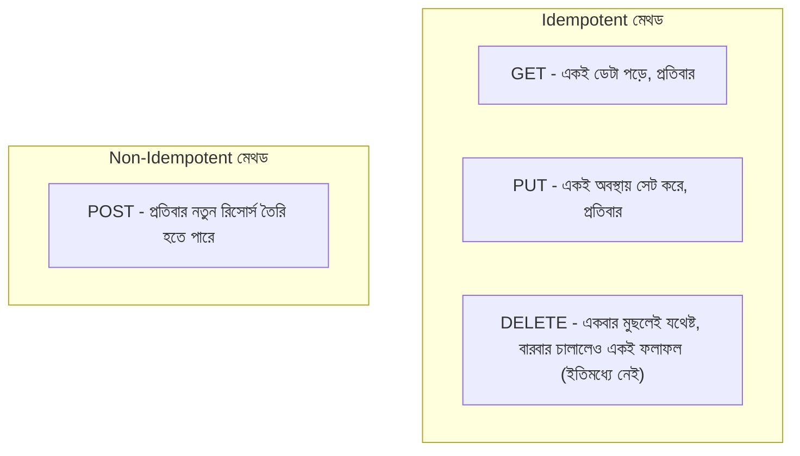

# ২৭.০১. Understanding HTTP PUT and DELETE Methods

Module 6-এ আমরা POST দিয়ে নতুন রিসোর্স তৈরি করা শিখেছিলাম, আর তার আগে Module 4-এ GET দিয়ে ডেটা পড়া শিখেছিলাম। CRUD-এর চারটা অক্ষরের মধ্যে C (Create) আর R (Read) এতদিন কভার হয়েছে। এখন সময় বাকি দুইটার — U (Update) আর D (Delete)।

HTTP প্রোটোকল ডিজাইন করার সময় প্রতিটা মেথডকে একটা নির্দিষ্ট "উদ্দেশ্য" দেয়া হয়েছিলো, যাতে যেকেউ একটা API দেখেই বুঝতে পারে সেটা কী করে, ডকুমেন্টেশন পড়ার আগেই। এই ধারণাটাকে বলে **HTTP সিমান্টিক্স**। PUT-এর উদ্দেশ্য হলো — "এই নির্দিষ্ট রিসোর্সটাকে সম্পূর্ণভাবে এই নতুন অবস্থায় প্রতিস্থাপন করো"। DELETE-এর উদ্দেশ্য পরিষ্কার — "এই রিসোর্সটা সরিয়ে ফেলো"।

এখানে একটা গুরুত্বপূর্ণ কারিগরি ধারণা আছে যেটা GET/POST-এর সাথে PUT/DELETE-কে আলাদা করে — **Idempotency** (স্থিতিস্থাপকতা)। একটা অপারেশনকে idempotent বলা হয় যদি সেটা একবার চালাও বা দশবার চালাও, ফলাফল একই থাকে। PUT আর DELETE দুটোই idempotent হওয়ার কথা — যদি তুমি `PUT /products/5` দিয়ে একটা প্রোডাক্টের দাম ৫০০ টাকা বসাও, সেটা একবার চালালেও দাম ৫০০ হবে, তিনবার চালালেও দাম ৫০০-ই থাকবে। কিন্তু POST idempotent না — একই POST রিকোয়েস্ট দুইবার পাঠালে দুইটা আলাদা রিসোর্স তৈরি হয়ে যেতে পারে।



এই idempotency-র ধারণাটা শুধু তাত্ত্বিক না — এর বাস্তব প্রভাব আছে। ধরো একটা মোবাইল অ্যাপে নেটওয়ার্ক দুর্বল, আর ইউজারের রিকোয়েস্ট টাইমআউট হওয়ার কারণে অ্যাপ স্বয়ংক্রিয়ভাবে আবার রিট্রাই করে। যদি এটা একটা PUT রিকোয়েস্ট হয় (যেমন প্রোফাইল আপডেট), রিট্রাই করাটা নিরাপদ। কিন্তু যদি POST হয় (যেমন অর্ডার তৈরি), রিট্রাই করলে ডুপ্লিকেট অর্ডার তৈরি হয়ে যেতে পারে — এই কারণেই পেমেন্ট সিস্টেমে "idempotency key" পাঠানোর প্রচলন আছে, যেটা নিয়ে আমরা পরে বিস্তারিত আসবো।

FastAPI-তে এই মেথডগুলো রাউট করা Module 7-এ শেখা রাউটিং সিস্টেমেরই সম্প্রসারণ — শুধু ডেকোরেটরের নামটা বদলায়:

```python
# main.py
@app.get("/products/{product_id}")      # Read
def get_product(product_id: int): ...

@app.post("/products")                  # Create
def create_product(product: ProductCreate): ...

@app.put("/products/{product_id}")      # Update (সম্পূর্ণ প্রতিস্থাপন)
def replace_product(product_id: int, product: ProductReplace): ...

@app.patch("/products/{product_id}")    # Update (আংশিক)
def update_product(product_id: int, product: ProductUpdate): ...

@app.delete("/products/{product_id}")   # Delete
def delete_product(product_id: int): ...
```

লক্ষ্য করো এখানে PATCH-ও যোগ করা হয়েছে, যদিও প্রশ্নটা ছিলো শুধু PUT আর DELETE নিয়ে — কারণ বাস্তবে PUT আর PATCH প্রায়ই একসাথে আলোচনা করতে হয়, তাদের মধ্যেকার সূক্ষ্ম পার্থক্যটা বোঝা জরুরি। DELETE মেথডে সাধারণত রিকোয়েস্ট বডি লাগে না, শুধু URL-এর path parameter-ই যথেষ্ট — কারণ ডিলিট করার জন্য শুধু "কোনটা" জানা দরকার, "কী দিয়ে বদলাবে" জানার দরকার নেই।

```python
from fastapi import HTTPException, status

@app.delete("/products/{product_id}", status_code=status.HTTP_204_NO_CONTENT)
def delete_product(product_id: int, db: Session = Depends(get_db)):
    product = db.query(Product).filter(Product.id == product_id).first()
    if not product:
        raise HTTPException(status_code=404, detail="প্রোডাক্ট পাওয়া যায়নি")
    db.delete(product)
    db.commit()
    # 204 No Content — খালি বডি রিটার্ন করলেই FastAPI বাকিটা সামলে নেয়
```

`204 No Content` স্ট্যাটাস কোডটা লক্ষ্য করার মতো — Module 6-এ স্ট্যাটাস কোড শেখার সময় এটা হয়তো তেমন গুরুত্ব পায়নি, কিন্তু DELETE অপারেশনের জন্য এটাই প্রচলিত সঠিক কোড, কারণ ডিলিট সফল হলে ফেরত দেয়ার মতো নতুন কোনো ডেটা থাকে না। FastAPI-তে `@app.delete(..., status_code=status.HTTP_204_NO_CONTENT)` লিখে দিলে ফাংশন থেকে কিছু রিটার্ন না করলেও FastAPI নিজেই খালি বডি সহ ঠিক স্ট্যাটাস কোডটা পাঠায় — এটা একটা সাধারণ ভুল জায়গা, কারণ অনেকে ভুলে `return {"message": "deleted"}` লিখে ফেলে, আর ক্লায়েন্ট কনফিউজড হয় কেন 204 রেসপন্সেও বডি এসেছে (স্পেসিফিকেশন অনুযায়ী 204-এ বডি থাকা উচিতই না)।

এখন আমরা জানি PUT আর DELETE কেন আলাদা, কীভাবে সেমান্টিক্যালি ভিন্ন আচরণ করে। পরের লেসনে আমরা FastAPI-তে বাস্তবে PUT আর PATCH এন্ডপয়েন্ট ইমপ্লিমেন্ট করবো, আর দেখবো কীভাবে দুটোর লজিক আলাদা লিখতে হয়।
</content>
