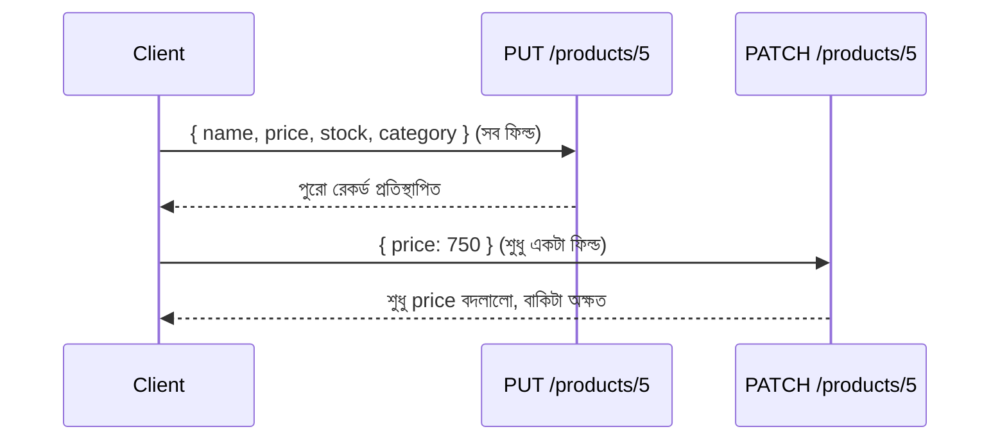

# ২৭.০২. Implementing PUT/PATCH Endpoints in FastAPI

আগের লেসনে আমরা তাত্ত্বিকভাবে দেখেছি PUT আর PATCH দুটোই "আপডেট" করে, কিন্তু ভিন্নভাবে। এই লেসনে আমরা সেটা কোড দিয়ে বাস্তবায়ন করবো, আর ঠিক এখানেই তাদের পার্থক্যটা স্পষ্ট হবে।

ধরো আমাদের একটা প্রোডাক্ট আছে এমন:

```json
{ "id": 5, "name": "ওয়্যারলেস মাউস", "price": 800, "stock": 50, "category": "Electronics" }
```

**PUT** দিয়ে আপডেট করার নিয়ম হলো — ক্লায়েন্ট পুরো অবজেক্টটাই পাঠাবে, আর সার্ভার সেটাকেই নতুন সত্য হিসেবে ধরে নেবে। যদি ক্লায়েন্ট `category` ফিল্ডটা বাদ দিয়ে পাঠায়, তাহলে যুক্তিসম্মতভাবে `category`-কে ফাঁকা/null করে দেয়া উচিত, কারণ PUT-এর প্রতিশ্রুতি হলো "সম্পূর্ণ প্রতিস্থাপন"।

```python
# schemas.py
from pydantic import BaseModel

class ProductReplace(BaseModel):
    name: str
    price: float
    stock: int
    category: str
    # PUT-এ সব ফিল্ড বাধ্যতামূলক, কারণ এটা সম্পূর্ণ প্রতিস্থাপন — কোনো Optional নেই
```

```python
# main.py
@app.put("/products/{product_id}")
def replace_product(product_id: int, body: ProductReplace, db: Session = Depends(get_db)):
    product = db.query(Product).filter(Product.id == product_id).first()
    if not product:
        raise HTTPException(status_code=404, detail="প্রোডাক্ট পাওয়া যায়নি")

    # পুরনো রেকর্ডের সবগুলো ফিল্ড নতুন ভ্যালু দিয়ে সম্পূর্ণ প্রতিস্থাপিত হচ্ছে
    product.name = body.name
    product.price = body.price
    product.stock = body.stock
    product.category = body.category

    db.commit()
    db.refresh(product)
    return {"success": True, "data": product}
```

লক্ষ্য করো — এখানে `body`-র প্রতিটা ফিল্ড এক্সপ্লিসিটলি রেকর্ডে বসানো হচ্ছে, বাদ পড়া কোনো ফিল্ড থাকার সুযোগই নেই কারণ Pydantic স্কিমাতেই সব ফিল্ড `required`। এটাই PUT-এর "সম্পূর্ণ প্রতিস্থাপন" আচরণকে সঠিকভাবে প্রতিফলিত করে। SQL-ভিত্তিক ডেটাবেজে (Module 16-17-এ শেখা) এটার সমতুল্য একটা `UPDATE` কোয়েরি যেখানে সবগুলো কলাম এক্সপ্লিসিটলি সেট করা হয় — কোনো কলাম "যেমন আছে থাকুক" বলে বাদ দেয়া হয় না।

**PATCH** এর নিয়ম সম্পূর্ণ ভিন্ন — ক্লায়েন্ট শুধু যে ফিল্ডগুলো বদলাতে চায় সেগুলোই পাঠাবে, বাকিগুলো অপরিবর্তিত থাকবে। এখানেই একটা ক্লাসিক ভুল হয় — অনেকে PATCH এন্ডপয়েন্টেই PUT-এর মতো একই স্কিমা ব্যবহার করে ফেলে, ভাবে "আপডেট তো আপডেটই"। ফলাফল: ক্লায়েন্ট শুধু `{ "price": 750 }` পাঠালে বাকি ফিল্ডগুলো (যেগুলো বডিতে ছিলোই না) ডিফল্ট বা `None` হিসেবে সেট হয়ে গিয়ে আসল ডেটা মুছে যায় — এটাকে বলে "accidental nulling", আর এটা প্রোডাকশনে ডেটা হারানোর একটা সবচেয়ে সাধারণ কারণ।

```python
# schemas.py
from pydantic import BaseModel
from typing import Optional

class ProductUpdate(BaseModel):
    name: Optional[str] = None
    price: Optional[float] = None
    stock: Optional[int] = None
    category: Optional[str] = None
    # সব ফিল্ড Optional, কারণ PATCH-এ যা আসেনি তা বদলাবে না
```

```python
# main.py
@app.patch("/products/{product_id}")
def update_product(product_id: int, body: ProductUpdate, db: Session = Depends(get_db)):
    product = db.query(Product).filter(Product.id == product_id).first()
    if not product:
        raise HTTPException(status_code=404, detail="প্রোডাক্ট পাওয়া যায়নি")

    # শুধু যে ফিল্ডগুলো ক্লায়েন্ট আসলে পাঠিয়েছে, সেগুলোই আপডেট হবে
    updates = body.dict(exclude_unset=True)
    if not updates:
        raise HTTPException(status_code=400, detail="আপডেট করার মতো কোনো ফিল্ড দেয়া হয়নি")

    for field, value in updates.items():
        setattr(product, field, value)

    db.commit()
    db.refresh(product)
    return {"success": True, "data": product}
```

এখানে `exclude_unset=True` অংশটাই পুরো প্যাটার্নের হৃদয় — এটা শুধু সেই ফিল্ডগুলো ফেরত দেয় যেগুলো রিকোয়েস্ট বডিতে আসলে উপস্থিত ছিলো, বাকিগুলো `dict`-এ ঢোকেই না (এমনকি তাদের ডিফল্ট মান `None` হলেও)। এটা Module 26-এ শেখা Mass Assignment সমস্যার প্রতিরোধের মতোই একটা সাবধানতা, তবে উদ্দেশ্যটা সামান্য ভিন্ন — এখানে লক্ষ্য অনির্দিষ্ট ফিল্ড ব্লক করা না, বরং "না-পাঠানো" আর "খালি পাঠানো" ফিল্ডের মধ্যে পার্থক্য বজায় রাখা।



বাস্তবে বেশিরভাগ ফ্রন্টএন্ড টিম PATCH-কেই পছন্দ করে, কারণ এটা নেটওয়ার্ক ব্যান্ডউইথ বাঁচায় (শুধু বদলানো ফিল্ড পাঠাতে হয়) আর accidental data loss-এর ঝুঁকি কমায় (ভুলে কোনো ফিল্ড বাদ পড়ে গেলে সেটা মুছে যায় না)। কিন্তু PUT দরকারি হয় যখন তুমি নিশ্চিত করতে চাও রিসোর্সটা ঠিক একটা নির্দিষ্ট অবস্থায় আছে, আংশিক অবস্থায় না।

এখন প্রশ্ন হলো — "সম্পূর্ণ" আর "আংশিক" আপডেটের এই পার্থক্যটা ঠিক কোন কোন বাস্তব পরিস্থিতিতে গুরুত্বপূর্ণ হয়ে ওঠে? পরের লেসনে আমরা এই তুলনাটা আরও গভীরে নিয়ে যাবো।
</content>
