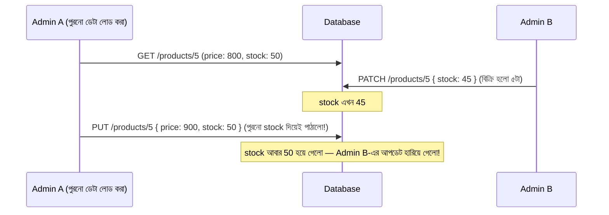

# ২৭.০৩. Resource Updates - Full vs Partial Updates

আগের লেসনে আমরা কোড দিয়ে দেখেছি PUT আর PATCH কীভাবে ভিন্নভাবে কাজ করে। এখন এই সিদ্ধান্তটা — "পুরো নাকি আংশিক আপডেট" — একটা প্রোডাক্ট ডিজাইন প্রশ্ন হিসেবে দেখি, কারণ শুধু টেকনিক্যালি সঠিকভাবে ইমপ্লিমেন্ট করলেই চলবে না, সঠিক পরিস্থিতিতে সঠিক পদ্ধতি বেছে নেয়াটাও একটা দক্ষতা।

ফুল আপডেট (PUT) সবচেয়ে ভালো কাজ করে যখন ফ্রন্টএন্ড ফর্মটা নিজেই একটা "সম্পূর্ণ রিসোর্স এডিট ফর্ম" — যেমন একটা প্রোফাইল এডিট পেজ, যেখানে ইউজার সব ফিল্ড একসাথে দেখে, একসাথে বদলায়, একবারে সেভ করে। এখানে পুরো অবজেক্টটা ফর্ম থেকে ফেরত পাঠানো স্বাভাবিক, কারণ ফ্রন্টএন্ডের কাছে ইতিমধ্যে সব ডেটা আছে।

আংশিক আপডেট (PATCH) সবচেয়ে ভালো কাজ করে যখন একটা নির্দিষ্ট, ছোট অ্যাকশন ঘটছে — যেমন একটা "টগল" বাটনে ক্লিক করে প্রোডাক্ট অ্যাক্টিভ/ইনঅ্যাক্টিভ করা, বা ইনভেন্টরি কাউন্ট এক ক্লিকে বাড়ানো-কমানো। এই ধরনের ছোট অ্যাকশনে পুরো অবজেক্ট আবার পাঠানো অপ্রয়োজনীয়, এমনকি বিপজ্জনকও — কারণ যদি দুইজন অ্যাডমিন একই সময়ে একই প্রোডাক্ট দেখছে, আর একজন PUT দিয়ে পুরো অবজেক্ট পাঠায় পুরনো ডেটা নিয়ে, তাহলে অন্যজনের করা পরিবর্তন হারিয়ে যেতে পারে। একে বলে **lost update problem**।



এই সমস্যাটা দেখায় কেন আংশিক, নির্দিষ্ট-উদ্দেশ্যের অপারেশনে PATCH বেশি নিরাপদ — কারণ এটা শুধু যে ফিল্ডটা বদলাতে চায় সেটাই টাচ করে, বাকি ফিল্ডের "পুরনো" মান নিয়ে ভুল করার সুযোগ থাকে না। এই সমস্যা সমাধানের আরেকটা প্রচলিত কৌশল হলো **optimistic locking** — প্রতিটা রেকর্ডে একটা `version` নম্বর রাখা, আর আপডেটের সময় সেই ভার্সন মিলিয়ে দেখা।

```python
# schemas.py
from pydantic import BaseModel
from typing import Optional

class ProductUpdateSafe(BaseModel):
    version: int
    name: Optional[str] = None
    price: Optional[float] = None
    stock: Optional[int] = None
    category: Optional[str] = None
```

```python
# main.py
from fastapi import HTTPException

@app.patch("/products/{product_id}")
def update_product_safely(product_id: int, body: ProductUpdateSafe, db: Session = Depends(get_db)):
    updates = body.dict(exclude_unset=True, exclude={"version"})

    product = (
        db.query(Product)
        .filter(Product.id == product_id, Product.version == body.version)
        .first()
    )

    if not product:
        # হয় প্রোডাক্ট নেই, নয়তো version মেলেনি — অর্থাৎ ইতিমধ্যে অন্য কেউ বদলে ফেলেছে
        raise HTTPException(
            status_code=409,
            detail="ডেটা ইতিমধ্যে অন্য কেউ বদলে ফেলেছে, আবার লোড করে চেষ্টা করো",
        )

    for field, value in updates.items():
        setattr(product, field, value)
    product.version += 1

    db.commit()
    db.refresh(product)
    return {"success": True, "data": product}
```

`409 Conflict` স্ট্যাটাস কোডটা ঠিক এই ধরনের পরিস্থিতির জন্যই তৈরি — যখন রিকোয়েস্টটা নিজে বৈধ, কিন্তু বর্তমান সার্ভার স্টেটের সাথে সাংঘর্ষিক। ই-কমার্স সিস্টেমে (Module 24-এর প্রজেক্টে) এই প্যাটার্নটা বিশেষভাবে গুরুত্বপূর্ণ ইনভেন্টরি স্টক আপডেটের ক্ষেত্রে, যেখানে একাধিক অর্ডার একই সময়ে একই প্রোডাক্টের স্টক কমাতে চাইতে পারে।

সংক্ষেপে — ফুল বনাম আংশিক আপডেট বেছে নেয়া একটা কারিগরি সিদ্ধান্তের চেয়ে বেশি একটা ডিজাইন সিদ্ধান্ত: "এই অপারেশনটা আসলে কী প্রতিনিধিত্ব করছে — একটা সম্পূর্ণ রিসোর্স প্রতিস্থাপন, নাকি একটা নির্দিষ্ট, ছোট পরিবর্তন?" এই প্রশ্নের উত্তরই ঠিক করে দেয় PUT না PATCH।

কিন্তু আপডেট রিকোয়েস্টে যদি ভুল বা অসম্পূর্ণ ডেটা আসে, সেটা যাচাই করা কীভাবে হবে, বিশেষ করে PATCH-এ যেখানে "কোন ফিল্ড আসবে" আগে থেকে জানা যায় না? পরের লেসনে আমরা ঠিক এই ভ্যালিডেশন সমস্যাটা সমাধান করবো।
</content>
