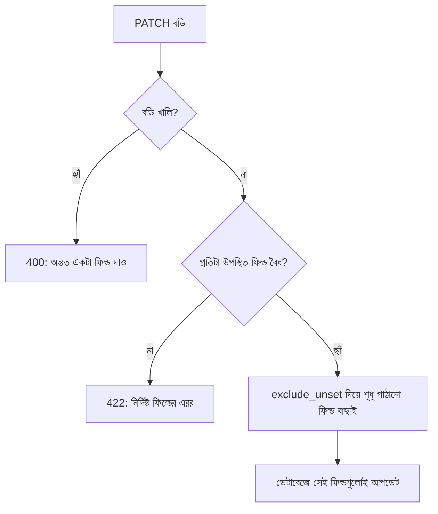

# ২৭.০৪. Handling PUT/PATCH Request Validation

Module 26-এ আমরা POST রিকোয়েস্টের জন্য Pydantic দিয়ে স্কিমা-ভিত্তিক ভ্যালিডেশন শিখেছিলাম, যেখানে সব ফিল্ড বাধ্যতামূলক ছিলো। কিন্তু আগের লেসনে দেখা PATCH-এর প্রকৃতি অনুযায়ী একটা সমস্যা তৈরি হয় — PATCH-এ কোন ফিল্ড আসবে সেটা আগে থেকে নিশ্চিত না, তাহলে ভ্যালিডেশন স্কিমা কীভাবে লিখবো?

PUT-এর ভ্যালিডেশন তুলনামূলক সহজ, কারণ সব ফিল্ড বাধ্যতামূলক — এটা অনেকটা POST-এর স্কিমার মতোই।

```python
# schemas.py
from pydantic import BaseModel, field_validator
from enum import Enum

class Category(str, Enum):
    electronics = "Electronics"
    fashion = "Fashion"
    grocery = "Grocery"
    books = "Books"

class ProductReplace(BaseModel):
    name: str
    price: float
    stock: int
    category: Category

    @field_validator("name")
    @classmethod
    def name_length(cls, v: str) -> str:
        if not (2 <= len(v) <= 100):
            raise ValueError("name অবশ্যই 2 থেকে 100 অক্ষরের মধ্যে হতে হবে")
        return v

    @field_validator("price")
    @classmethod
    def price_positive(cls, v: float) -> float:
        if v <= 0:
            raise ValueError("price শূন্যের বেশি হতে হবে")
        return v

    @field_validator("stock")
    @classmethod
    def stock_nonnegative(cls, v: int) -> int:
        if v < 0:
            raise ValueError("stock ঋণাত্মক হতে পারবে না")
        return v
```

PATCH-এর জন্য Pydantic-এর একটা বিশেষ প্যাটার্ন কাজে লাগে — একই যাচাই-নিয়মগুলো রেখে সবগুলো ফিল্ডকে `Optional` বানানো, ঠিক Module 26-এ দেখা মতোই টাইপ হিন্ট বদলে দেয়া। এখানে গুরুত্বপূর্ণ হলো — ফিল্ড `Optional` হওয়া মানে "ফিল্ডটা না দিলে চলবে", কিন্তু "ফিল্ডটা দিলে যেকোনো মান চলবে" — এই দুইটা আলাদা জিনিস, আর `field_validator` এখনও কার্যকর থাকবে যদি ফিল্ড আসে।

```python
# schemas.py
from typing import Optional
from pydantic import BaseModel, field_validator, model_validator

class ProductUpdate(BaseModel):
    name: Optional[str] = None
    price: Optional[float] = None
    stock: Optional[int] = None
    category: Optional[Category] = None

    @field_validator("name")
    @classmethod
    def name_length(cls, v: Optional[str]) -> Optional[str]:
        if v is not None and not (2 <= len(v) <= 100):
            raise ValueError("name অবশ্যই 2 থেকে 100 অক্ষরের মধ্যে হতে হবে")
        return v

    @field_validator("price")
    @classmethod
    def price_positive(cls, v: Optional[float]) -> Optional[float]:
        if v is not None and v <= 0:
            raise ValueError("price শূন্যের বেশি হতে হবে")
        return v

    @model_validator(mode="after")
    def at_least_one_field(self):
        # খালি বডি (`{}`) পাঠানো হলে সেটাকেও প্রত্যাখ্যান করা, কারণ একটা
        # PATCH রিকোয়েস্টে অন্তত একটা পরিবর্তন থাকতেই হবে, নয়তো রিকোয়েস্টটাই অর্থহীন
        if self.model_dump(exclude_unset=True) == {}:
            raise ValueError("কমপক্ষে একটা ফিল্ড দিতে হবে আপডেটের জন্য")
        return self
```

```python
# main.py
@app.put("/products/{product_id}")
def replace_product(product_id: int, body: ProductReplace, db: Session = Depends(get_db)):
    ...

@app.patch("/products/{product_id}")
def update_product(product_id: int, body: ProductUpdate, db: Session = Depends(get_db)):
    ...
```

একটা সূক্ষ্ম কিন্তু গুরুত্বপূর্ণ সমস্যা এখানে দেখা দেয় — যদি PATCH-এ `price: -50` এর মতো একটা ভুল মান আসে, `field_validator` এটা ধরে ফেলবে কারণ `price` ফিল্ডটা এলে সেটা এখনও নিয়ম মেনে চলতে হবে। কিন্তু যদি ফিল্ডটাই না আসে, ভ্যালিডেটর `None`-কে পাস করে দেবে, কোনো এরর দেবে না। এটাই ঠিক আচরণ — "না দেয়া" আর "ভুল দেয়া" দুটো ভিন্ন জিনিস, আর ভ্যালিডেশনকে এই পার্থক্যটা বুঝতে হবে।

এই জায়গাতেই একটা সাধারণ কনফিউশন হয় — `exclude_unset=True` বনাম `exclude_none=True`। `exclude_unset=True` শুধু সেই ফিল্ডগুলো বাদ দেয় যেগুলো রিকোয়েস্ট বডিতেই ছিলো না (client পাঠায়নি), কিন্তু যদি ক্লায়েন্ট এক্সপ্লিসিটলি `{ "category": null }` পাঠায়, তাহলে সেটা `dict()`-এ থেকে যাবে কারণ ফিল্ডটা "সেট" করা হয়েছিলো, যদিও মান `None`। উল্টোদিকে `exclude_none=True` ব্যবহার করলে সব `None` মানের ফিল্ড বাদ পড়ে যাবে, তাতে ক্লায়েন্ট ইচ্ছাকৃতভাবে কোনো ফিল্ড `null` করতে চাইলেও সেটা আর আপডেট হবে না — এই দুটো মিশিয়ে ফেলা একটা প্রোডাকশন বাগের সাধারণ কারণ, কারণ "field পাঠানো হয়নি" আর "field-কে null করতে চাওয়া হয়েছে" সেমান্টিক্যালি সম্পূর্ণ ভিন্ন দুটো ইনটেন্ট।



আরেকটা গুরুত্বপূর্ণ বিষয় — টাইপ কনভার্সন। HTML ফর্ম বা কুয়েরি স্ট্রিং থেকে আসা মান প্রায়ই স্ট্রিং হিসেবে আসে (যেমন `"price": "800"`), সংখ্যা হিসেবে না। Pydantic v2 ডিফল্টভাবেই "lenient" মোডে কিছু কমন কনভার্সন করে দেয় (যেমন numeric string থেকে int/float), তবে strict টাইপ দরকার হলে `Field(strict=True)` বা `pydantic.types.StrictInt` ব্যবহার করে সেই আচরণ নিয়ন্ত্রণ করা যায়, যাতে ভ্যালিডেশন অযথা ব্যর্থ না হয় শুধু টাইপ মিসম্যাচের কারণে, অথচ ভুল টাইপের ডেটা silently accept-ও না হয়ে যায়।

এই ভ্যালিডেশন স্তরগুলো নিশ্চিত করে যে আপডেট রিকোয়েস্ট নিরাপদ আর সঠিক ডেটা নিয়ে আসছে। কিন্তু ডিলিট অপারেশনে একটা সম্পূর্ণ ভিন্ন প্রশ্ন উঠে আসে — যখন একটা প্রোডাক্ট "ডিলিট" করা হয়, সেটা কি সত্যিই ডেটাবেজ থেকে মুছে ফেলা উচিত, নাকি শুধু "লুকিয়ে" রাখা উচিত? পরের লেসনে আমরা Soft Delete বনাম Hard Delete নিয়ে কথা বলবো।
</content>
