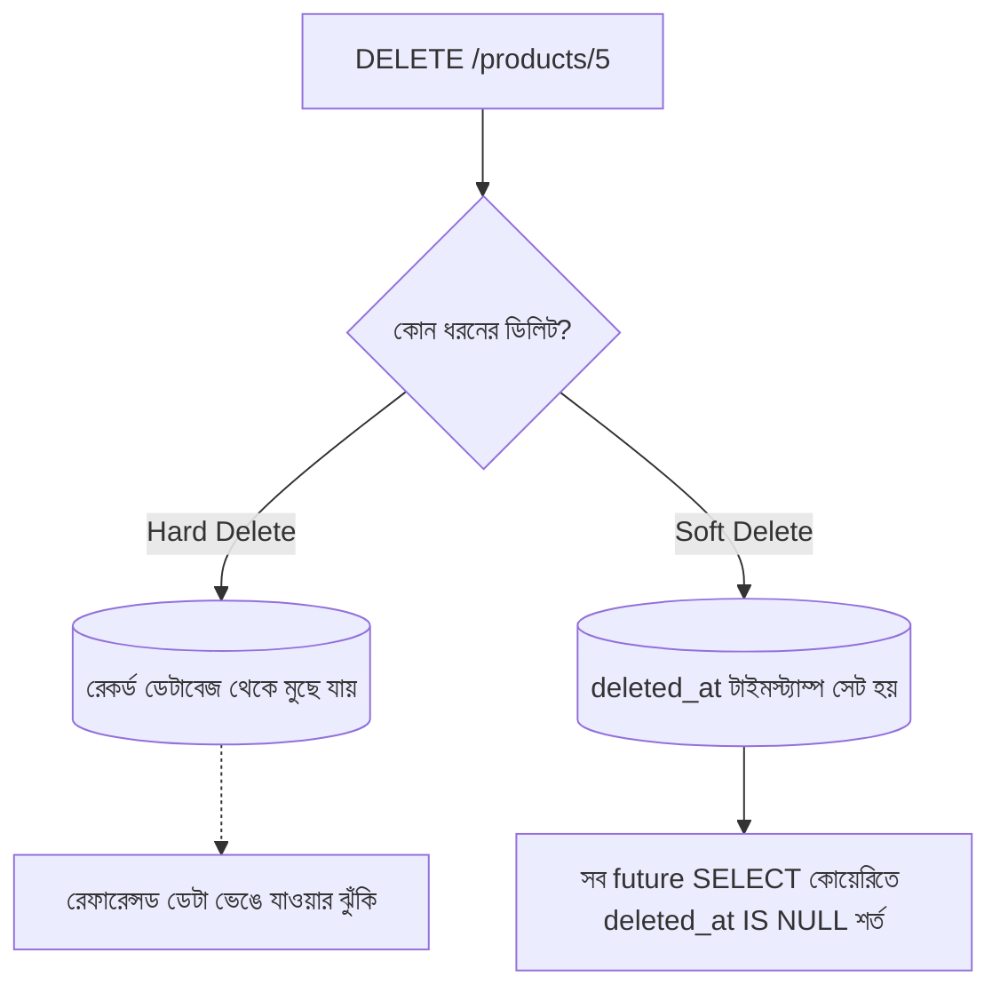

# ২৭.০৫. Soft Delete vs Hard Delete Implementation

আগের লেসনগুলোতে আমরা তৈরি ও আপডেট নিয়ে সতর্ক থেকেছি — ভুল ডেটা যেন না ঢোকে, পুরনো ডেটা যেন হারিয়ে না যায়। ডিলিটের বেলাতেও একই সতর্কতা দরকার, কারণ ডিলিট হলো সবচেয়ে অপরিবর্তনীয় (irreversible) অপারেশন — একবার ডেটা মুছে গেলে সাধারণত সেটা আর ফেরত পাওয়া যায় না, যদি না আলাদা ব্যাকআপ থাকে (Module 21-এ ব্যাকআপ স্ট্র্যাটেজি নিয়ে কথা হয়েছিলো)।

**Hard Delete** মানে সহজ — রেকর্ডটা ডেটাবেজ থেকে সত্যিই মুছে ফেলা। SQL-এ এটা `DELETE FROM products WHERE id = ?`, SQLAlchemy-তে `db.delete(product)`। একবার এই কমান্ড চললে, ডেটা চিরতরে চলে যায়।

```python
# hard delete — সরাসরি, ফেরতযোগ্য নয়
@app.delete("/products/{product_id}", status_code=204)
def hard_delete_product(product_id: int, db: Session = Depends(get_db)):
    product = db.query(Product).filter(Product.id == product_id).first()
    if not product:
        raise HTTPException(status_code=404, detail="প্রোডাক্ট পাওয়া যায়নি")
    db.delete(product)
    db.commit()
```

কিন্তু বাস্তব ব্যবসায়িক অ্যাপ্লিকেশনে hard delete অনেক সময় বিপজ্জনক এবং অবাস্তব। আমাদের ই-কমার্স প্রজেক্টে ভাবো — একটা প্রোডাক্ট যদি হার্ড ডিলিট হয়ে যায়, কিন্তু সেই প্রোডাক্টটা আগে কেউ অর্ডার করে থাকে, তাহলে সেই পুরনো অর্ডার হিস্ট্রিতে প্রোডাক্টের ফরেন কী রেফারেন্স ভেঙে যাবে (Module 18-19-এ শেখা রিলেশনশিপ নষ্ট হবে)। এছাড়া, ব্যবসায়িক প্রয়োজনে অনেক সময় "ডিলিট করা" ডেটা রিপোর্টিং বা অডিটের জন্য রাখা দরকার হয়, বা ভুলবশত ডিলিট হলে ফিরিয়ে আনার সুযোগ রাখা দরকার হয়।

এখানেই আসে **Soft Delete** — রেকর্ডটা আসলে না মুছে, শুধু একটা টাইমস্ট্যাম্প বসিয়ে "ডিলিটেড" হিসেবে চিহ্নিত করা। এখানে একটা ডিজাইন সিদ্ধান্ত আছে — একটা সাধারণ বুলিয়ান ফ্ল্যাগ (`is_deleted: bool`) ব্যবহার করা যেতো, কিন্তু `deleted_at` টাইমস্ট্যাম্প বেশি তথ্যবহুল — এটা শুধু "ডিলিটেড কিনা" বলে না, "কখন ডিলিট হয়েছে" সেটাও বলে দেয়, যা অডিট লগ বা "৩০ দিন পর স্থায়ীভাবে মুছে ফেলো" এর মতো রিটেনশন পলিসির জন্য কাজে লাগে।

```python
# models.py
from sqlalchemy import Column, Integer, String, Float, DateTime
from datetime import datetime
from database import Base

class Product(Base):
    __tablename__ = "products"

    id = Column(Integer, primary_key=True, index=True)
    name = Column(String, nullable=False)
    price = Column(Float, nullable=False)
    deleted_at = Column(DateTime, nullable=True, default=None)
    # None মানে অ্যাক্টিভ, টাইমস্ট্যাম্প মানে ডিলিটেড
```

```python
# main.py
@app.delete("/products/{product_id}", status_code=204)
def soft_delete_product(product_id: int, db: Session = Depends(get_db)):
    product = (
        db.query(Product)
        .filter(Product.id == product_id, Product.deleted_at.is_(None))
        .first()
    )
    if not product:
        raise HTTPException(status_code=404, detail="প্রোডাক্ট পাওয়া যায়নি")

    product.deleted_at = datetime.utcnow()
    db.commit()
```

এখন সবচেয়ে গুরুত্বপূর্ণ অংশ — soft delete করলে বাকি সব কোয়েরিতেও `deleted_at IS NULL` শর্তটা যোগ করতে ভুলে গেলে ডিলিট করা প্রোডাক্ট আবার তালিকায় ফিরে আসে। এটাকে বলা হয় **"ghost record" বাগ** — খুবই সাধারণ কিন্তু মারাত্মক, কারণ এটা সাধারণত টেস্ট এনভায়রনমেন্টে ধরাই পড়ে না (কারণ টেস্ট ডেটা কম, আর কেউ খেয়াল করে না একটা "ডিলিটেড" আইটেম লিস্টে দেখা যাচ্ছে), কিন্তু প্রোডাকশনে হাজার হাজার রেকর্ডের মধ্যে ডিলিট করা প্রোডাক্ট আচমকা সার্চ রেজাল্ট বা ইনভেন্টরি রিপোর্টে ফিরে আসে।

```python
# সব "সক্রিয়" প্রোডাক্ট খোঁজার সময় সবসময় এই শর্ত লাগবে
@app.get("/products")
def get_all_products(db: Session = Depends(get_db)):
    products = db.query(Product).filter(Product.deleted_at.is_(None)).all()
    return {"success": True, "data": products}
```

এই ভুল এড়ানোর একটা পরিষ্কার উপায় হলো SQLAlchemy-তে একটা helper query method বা reusable filter বানিয়ে রাখা, যাতে প্রতিটা ফাইলে আলাদা করে `filter(Product.deleted_at.is_(None))` লিখতে গিয়ে কোথাও ভুলে না যায়:

```python
# crud.py
def active_products_query(db: Session):
    return db.query(Product).filter(Product.deleted_at.is_(None))

# ব্যবহার:
def get_all_products(db: Session = Depends(get_db)):
    return active_products_query(db).all()
```

এই প্যাটার্নটাই বড় প্রজেক্টে একটা "default scope"-এর কাজ করে — প্রতিটা প্রয়োজনীয় জায়গায় ম্যানুয়ালি শর্ত লেখার বদলে, একটা কেন্দ্রীয় ফাংশন দিয়ে filter করা, যাতে নতুন কোনো এন্ডপয়েন্ট লেখার সময় এই শর্তটা ভুলে যাওয়ার সুযোগ কমে যায়।



সংক্ষেপে বলা যায়, hard delete ব্যবহার করা উচিত শুধু তখনই যখন ডেটা সত্যিই স্থায়ীভাবে মুছে ফেলার প্রয়োজন আছে (যেমন GDPR-এর মতো আইনি বাধ্যবাধকতায় ইউজারের ব্যক্তিগত তথ্য মোছা), অন্যথায় soft delete-ই বেশিরভাগ ব্যবসায়িক অ্যাপ্লিকেশনের জন্য নিরাপদ ডিফল্ট পছন্দ।

এখন আমরা জানি কীভাবে সঠিকভাবে আপডেট আর ডিলিট বাস্তবায়ন করতে হয়। এই মডিউলের শেষ লেসনে আমরা এই সবকিছুকে একসাথে নিয়ে একটা সংক্ষিপ্ত, প্রয়োগযোগ্য বেস্ট-প্র্যাকটিস চেকলিস্ট তৈরি করবো।
</content>
