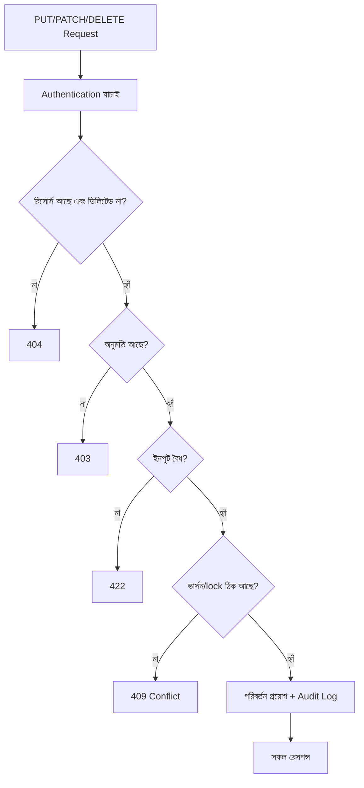

# ২৭.০৬. Best Practices for Update and Delete Operations

এই মডিউলে আমরা PUT, PATCH, DELETE-এর সেমান্টিক্স, ইমপ্লিমেন্টেশন, ভ্যালিডেশন, আর soft/hard delete নিয়ে বিস্তারিত দেখেছি। এই শেষ লেসনে আমরা সবকিছুকে একটা প্রয়োগযোগ্য চেকলিস্টে গুছিয়ে আনবো, যাতে ভবিষ্যতে যেকোনো আপডেট বা ডিলিট এন্ডপয়েন্ট বানানোর সময় এই লিস্টটা মাথায় রাখা যায়।

**প্রথম নীতি — সঠিক মেথড বেছে নেয়া।** সম্পূর্ণ প্রতিস্থাপনের জন্য PUT, আংশিক পরিবর্তনের জন্য PATCH। যদি নিশ্চিত না থাকো, PATCH-ই সাধারণত নিরাপদ ডিফল্ট, কারণ এটা accidental data loss-এর ঝুঁকি কম রাখে।

**দ্বিতীয় নীতি — অস্তিত্ব যাচাই করা আগে, পরিবর্তন করা পরে।** কোনো আপডেট বা ডিলিট চালানোর আগে নিশ্চিত হও রিসোর্সটা আসলেই আছে (soft delete থাকলে এটাও দেখো যে সেটা আগেই ডিলিটেড না), আর সেই ইউজারের সেটা বদলানোর অনুমতি আছে (Module 25-এ শেখা RBAC-এর নীতি এখানে সরাসরি প্রযোজ্য)।

```python
# একটা সাধারণ, পুনঃব্যবহারযোগ্য প্যাটার্ন
from fastapi import Depends, HTTPException
from sqlalchemy.orm import Session

@app.patch("/products/{product_id}")
def update_product(
    product_id: int,
    body: ProductUpdate,
    db: Session = Depends(get_db),
    current_user: User = Depends(get_current_user),
):
    product = (
        db.query(Product)
        .filter(Product.id == product_id, Product.deleted_at.is_(None))
        .first()
    )
    if not product:
        raise HTTPException(status_code=404, detail="প্রোডাক্ট পাওয়া যায়নি")

    if product.owner_id != current_user.id and current_user.role != "SUPER_ADMIN":
        raise HTTPException(status_code=403, detail="এই প্রোডাক্ট বদলানোর অনুমতি তোমার নেই")

    updates = body.dict(exclude_unset=True)
    for field, value in updates.items():
        setattr(product, field, value)

    db.commit()
    db.refresh(product)
    return {"success": True, "data": product}
```

**তৃতীয় নীতি — idempotency মেনে চলা।** একই PUT/DELETE রিকোয়েস্ট একাধিকবার চালালেও সিস্টেমের চূড়ান্ত অবস্থা একই থাকা উচিত। DELETE-এর ক্ষেত্রে, যদি রিসোর্সটা ইতিমধ্যে ডিলিট হয়ে থাকে, দ্বিতীয়বার DELETE কল করলে এরর না দিয়ে `204` বা `404`-এর মধ্যে কনসিস্টেন্ট একটা আচরণ বেছে নেয়া উচিত, প্রজেক্ট জুড়ে একই নিয়ম মেনে।

**চতুর্থ নীতি — কনকারেন্সি সামলানো।** আগের লেসনে দেখা lost-update সমস্যা এড়াতে যেখানে দরকার সেখানে optimistic locking বা `version` ফিল্ড ব্যবহার করা, বিশেষ করে ইনভেন্টরি বা ব্যালেন্সের মতো সংবেদনশীল সংখ্যায়।

**পঞ্চম নীতি — অডিট ট্রেইল রাখা।** কে, কখন, কী বদলালো — এই তথ্য অনেক সিস্টেমে আইনগতভাবেই রাখা বাধ্যতামূলক, আর ডিবাগিং-এর জন্যও অমূল্য।

```python
# audit log — প্রতিটা আপডেট/ডিলিটের পরে
audit_entry = AuditLog(
    action="PRODUCT_UPDATED",
    resource_id=product.id,
    performed_by=current_user.id,
    changes=updates,
    timestamp=datetime.utcnow(),
)
db.add(audit_entry)
db.commit()
```

এই প্যাটার্নটা Module 7-এ শেখা Audit Logger প্রজেক্টেরই একটা পরিণত রূপ — তখন আমরা শুধু রিকোয়েস্ট লগ করেছিলাম, এখন আমরা "কী বদলালো" সেই সেমান্টিক তথ্যও রাখছি।



এই ফ্লোচার্টটা আসলে একটা "চেকলিস্ট ইন অ্যাকশন" — প্রতিটা ধাপ একটা নির্দিষ্ট প্রশ্নের উত্তর দেয়, আর ভুল হলে সঠিক স্ট্যাটাস কোড সহ থেমে যায় (লক্ষ্য করো, ভ্যালিডেশন ব্যর্থ হলে FastAPI-তে এটা `422 Unprocessable Entity`, Express-এর প্রচলিত `400`-এর বদলে — এটা FastAPI/Pydantic-এর একটা নিজস্ব কনভেনশন)। এই একই কাঠামো তুমি ভবিষ্যতে যেকোনো আপডেট/ডিলিট এন্ডপয়েন্ট বানানোর সময় টেমপ্লেট হিসেবে ব্যবহার করতে পারো।

আমরা এখন CRUD-এর প্রতিটা অক্ষর গভীরভাবে বুঝি — Create, Read, Update, Delete। কিন্তু "Read" নিয়ে এখনও একটা বড় প্রশ্ন বাকি — যখন হাজার হাজার রেকর্ড থাকে, সবগুলো একসাথে ফেরত দেয়া অবাস্তব। পরের মডিউলে আমরা রেসপন্স ফরম্যাটিং আর পেজিনেশন নিয়ে কথা বলবো।
</content>
