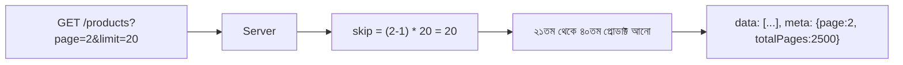

# ২৮.০১. API Response Formatting and Pagination

আমাদের ই-কমার্স প্রজেক্টের প্রোডাক্ট ক্যাটালগে ধরো ৫০,০০০টা প্রোডাক্ট আছে। যদি `GET /products` কল করলে সবগুলো একসাথে ফেরত দেয়া হয়, তাহলে কী হবে? সার্ভারকে বিশাল পরিমাণ ডেটা মেমোরিতে লোড করতে হবে, নেটওয়ার্কে বিশাল JSON পাঠাতে হবে, আর ক্লায়েন্ট ডিভাইস (বিশেষ করে মোবাইল) সেই বিশাল লিস্ট প্রসেস করতে গিয়ে ধীর হয়ে যাবে বা ক্র্যাশ করবে। এই সমস্যার সমাধান হলো **Pagination** — ডেটাকে ছোট ছোট "পাতায়" ভাগ করে একবারে অল্প পরিমাণ পাঠানো।

কিন্তু pagination-এ যাওয়ার আগে, একটা মৌলিক বিষয় ঠিক করা দরকার — API-এর রেসপন্স ফরম্যাট কেমন হবে, সেটা সামঞ্জস্যপূর্ণ (consistent) কিনা। এতদিনের লেসনগুলোতে আমরা মাঝে মাঝে `{success, data}` ফরম্যাট ব্যবহার করেছি, কিন্তু এখন এটাকে একটা প্রাতিষ্ঠানিক নিয়মে পরিণত করা দরকার — একটা **response envelope**। আর FastAPI-এ এই কাজটা করার সবচেয়ে ভালো উপায় হলো Pydantic মডেল দিয়ে — কারণ তখন FastAPI নিজেই যাচাই করে দেয় যে রেসপন্স সত্যিই সেই আকৃতি মেনে যাচ্ছে কিনা, আর `/docs`-এ সেই আকৃতিটাও স্বয়ংক্রিয়ভাবে ডকুমেন্টেড হয়ে যায়।

```python
# common/schemas.py
from typing import Generic, TypeVar, Optional
from pydantic import BaseModel

T = TypeVar("T")


class PaginationMeta(BaseModel):
    page: int
    limit: int
    total_items: int
    total_pages: int


class ApiResponse(BaseModel, Generic[T]):
    success: bool = True
    data: Optional[T] = None
    meta: Optional[PaginationMeta] = None
    message: Optional[str] = None
```

এই envelope-টা প্রতিটা এন্ডপয়েন্টে একই আকৃতি বজায় রাখে, যাতে ফ্রন্টএন্ড ডেভেলপার একটা সাধারণ, পূর্বানুমানযোগ্য নিয়ম মেনে রেসপন্স পার্স করতে পারে — আলাদা আলাদা এন্ডপয়েন্টের জন্য আলাদা লজিক লেখার দরকার হয় না। এটা Module 8-এ শেখা JSON ডেটা মডেলিং-এর ধারণারই একটা প্রয়োগ, যেখানে আমরা শিখেছিলাম গোছানো, পূর্বানুমানযোগ্য ডেটা স্ট্রাকচার কতটা গুরুত্বপূর্ণ।

এখন pagination-এর মূল ধারণাটা — ক্লায়েন্ট বলবে "আমাকে কত নম্বর পাতা দাও, প্রতি পাতায় কতগুলো আইটেম" আর সার্ভার সেই অনুযায়ী একটা নির্দিষ্ট অংশ কেটে পাঠাবে, সাথে "মোট কতগুলো আইটেম আছে, মোট কত পাতা আছে" — এই মেটাডেটাও।

```python
# products/router.py
from fastapi import APIRouter, Query, Depends
from sqlalchemy.orm import Session
from sqlalchemy import func, select

from database import get_db
from models import Product
from common.schemas import ApiResponse, PaginationMeta
from products.schemas import ProductOut

router = APIRouter(prefix="/products")


@router.get("", response_model=ApiResponse[list[ProductOut]])
def get_all_products(
    page: int = Query(1, ge=1),
    limit: int = Query(20, ge=1, le=100),  # সর্বোচ্চ সীমা
    db: Session = Depends(get_db),
):
    skip = (page - 1) * limit

    total_items = db.scalar(
        select(func.count()).select_from(Product).where(Product.deleted_at.is_(None))
    )
    products = db.scalars(
        select(Product)
        .where(Product.deleted_at.is_(None))
        .offset(skip)
        .limit(limit)
    ).all()

    return ApiResponse(
        data=products,
        meta=PaginationMeta(
            page=page,
            limit=limit,
            total_items=total_items,
            total_pages=-(-total_items // limit),  # ceil division
        ),
    )
```

লক্ষ্য করো `limit`-এর জন্য `Query(20, ge=1, le=100)` — এখানে `le=100` মানে সর্বোচ্চ সীমা ১০০, আর এটা FastAPI নিজেই যাচাই করে দেয়, ম্যানুয়ালি `min()` বা `max()` লেখার দরকার নেই। এটা একটা গুরুত্বপূর্ণ নিরাপত্তা অভ্যাস, কারণ ইউজার চাইলে `?limit=999999` পাঠিয়ে সার্ভারকে ওভারলোড করার চেষ্টা করতে পারে — Express-এ এই কাজটা আমরা হাতে করে `Math.min(100, ...)` লিখে করতাম, FastAPI-তে এটা `Query`-এর ভ্যালিডেশন কনস্ট্রেন্ট হিসেবেই ঘোষণা করে দেয়া যায়, আর ভুল ভ্যালু আসলে FastAPI স্বয়ংক্রিয়ভাবে ৪২২ এরর রিটার্ন করে।



এই প্যাটার্নটাকে বলে **offset-based pagination** (`.offset()`/`.limit()` ব্যবহার করে), যেটা এই মডিউলে আমরা পরের লেসনে আরও বিস্তারিতভাবে দেখবো — এর সুবিধা, অসুবিধা, আর এটা ঠিক কোন পরিস্থিতিতে ব্যবহার করা উচিত।
