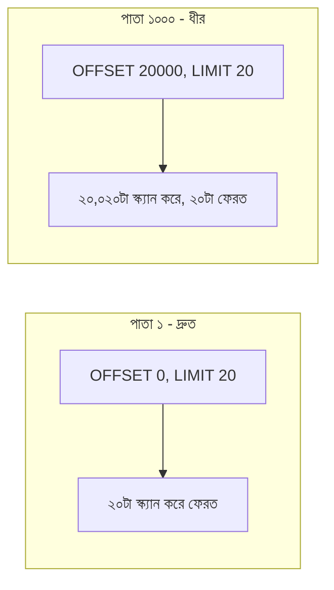

# ২৮.০২. Pagination Implementation with Limit and Offset

আগের লেসনে আমরা `offset`/`limit` (যেটাকে SQL-এর ভাষায় `OFFSET`/`LIMIT` বলে) দিয়ে একটা সাধারণ pagination বাস্তবায়ন করেছি। এই লেসনে আমরা এই পদ্ধতিটা SQL ডেটাবেজে (Module 16-17-এ শেখা) কীভাবে কাজ করে সেটা দেখবো, আর এর ভেতরের কারিগরি সীমাবদ্ধতাগুলো বুঝবো।

SQL-এ offset/limit pagination দেখতে এমন:

```sql
SELECT * FROM products
WHERE deleted_at IS NULL
ORDER BY created_at DESC
LIMIT 20 OFFSET 40; -- তৃতীয় পাতা, প্রতি পাতায় ২০টা
```

`OFFSET 40` মানে ডেটাবেজ ইঞ্জিনকে প্রথম ৪০টা রেকর্ড "গুনে" বাদ দিতে হবে, তারপর পরের ২০টা রিটার্ন করতে হবে। এখানেই সমস্যাটা লুকিয়ে — ডেটাবেজকে ঐ ৪০টা রেকর্ড সত্যিই স্ক্যান করতে হয়, শুধু বাদ দেয়ার জন্যই। যখন `OFFSET` ছোট (পাতা ২, পাতা ৩), সমস্যা নেই। কিন্তু যদি ইউজার পাতা ৫০,০০০-এ যেতে চায় (`OFFSET 1000000`), ডেটাবেজকে দশ লক্ষ রেকর্ড স্ক্যান করে তারপর বাদ দিতে হবে — এটা ক্রমশ ধীর হতে থাকে যত পেছনের পাতায় যাওয়া হয়। Module 21-এ ইনডেক্সিং শেখার সময় আমরা দেখেছিলাম ইনডেক্স কীভাবে "কোন রেকর্ড দরকার" সেটা দ্রুত বের করতে সাহায্য করে, কিন্তু `OFFSET`-এর এই "গুনে বাদ দেয়া" সমস্যাটা ইনডেক্স দিয়েও পুরোপুরি সমাধান হয় না — ইনডেক্স থাকলে ডেটাবেজ রেকর্ডগুলো র‍্যান্ডম জায়গা থেকে খুঁজে বের করার বদলে সিরিয়ালি পড়তে পারে, কিন্তু ৪০টা রেকর্ড তো তখনও পড়তে হচ্ছে, শুধু ফেলে দেয়ার জন্য।



FastAPI আর SQLAlchemy-তে সম্পূর্ণ implementation, সঠিক এজ-কেস হ্যান্ডলিং সহ:

```python
# common/pagination.py
from fastapi import Query
from pydantic import BaseModel


class PageParams(BaseModel):
    page: int
    limit: int

    @property
    def offset(self) -> int:
        return (self.page - 1) * self.limit


def page_params(
    page: int = Query(1, ge=1),
    limit: int = Query(20, ge=1, le=100),
) -> PageParams:
    return PageParams(page=page, limit=limit)
```

```python
# products/router.py
from fastapi import APIRouter, Depends
from sqlalchemy.orm import Session
from sqlalchemy import func, select

from database import get_db
from models import Product
from common.pagination import PageParams, page_params
from common.schemas import ApiResponse, PaginationMeta
from products.schemas import ProductOut

router = APIRouter(prefix="/products")


@router.get("", response_model=ApiResponse[list[ProductOut]])
def get_all_products(
    pg: PageParams = Depends(page_params),
    db: Session = Depends(get_db),
):
    products = db.scalars(
        select(Product)
        .where(Product.deleted_at.is_(None))
        .order_by(Product.created_at.desc())
        .offset(pg.offset)
        .limit(pg.limit)
    ).all()

    total_items = db.scalar(
        select(func.count()).select_from(Product).where(Product.deleted_at.is_(None))
    )

    return ApiResponse(
        data=products,
        meta=PaginationMeta(
            page=pg.page,
            limit=pg.limit,
            total_items=total_items,
            total_pages=-(-total_items // pg.limit),
        ),
    )
```

লক্ষ্য করো `page_params` একটা আলাদা **dependency** ফাংশন হিসেবে লেখা হয়েছে, `Depends()` দিয়ে ইনজেক্ট করা হচ্ছে — এটা Module 8-এ শেখা dependency injection-এর প্যাটার্নই, যেটা এখন pagination-এর মতো পুনরাবৃত্তিমূলক (repetitive) লজিককে একবার লিখে সব এন্ডপয়েন্টে পুনরায় ব্যবহারযোগ্য করে তোলে। আর যেহেতু SQLAlchemy-এর `.offset()`/`.limit()` ভেতরে ভেতরে সবসময় parameterized SQL জেনারেট করে, ইউজারের `page`/`limit` কখনো সরাসরি স্ট্রিং কনক্যাটেনেশন দিয়ে কোয়েরিতে বসছে না — এটা Module 21-এ শেখা SQL Injection প্রতিরোধের ধারাবাহিকতা।

Offset pagination-এর প্রধান সুবিধা হলো সরলতা — ইউজার সহজেই "পাতা ৫-এ যাও" বলতে পারে, পেজ নাম্বার দেখানো UI-তে (যেমন ১, ২, ৩ ... ৫০) এটা স্বাভাবিকভাবে মানানসই। এই কারণে অ্যাডমিন ড্যাশবোর্ড বা ছোট-মাঝারি ডেটাসেটের জন্য এটাই যথেষ্ট এবং সবচেয়ে সহজবোধ্য সমাধান।

কিন্তু যখন ডেটাসেট বিশাল (লক্ষ লক্ষ রেকর্ড), আর ইউজার একটানা স্ক্রল করে যাচ্ছে (যেমন সোশ্যাল মিডিয়া ফিড বা প্রোডাক্ট ফিড) — সেখানে offset pagination-এর পারফরম্যান্স সমস্যা বাস্তব হয়ে ওঠে। পরের লেসনে আমরা এই সমস্যার সমাধান হিসেবে Cursor-based Pagination শিখবো।
