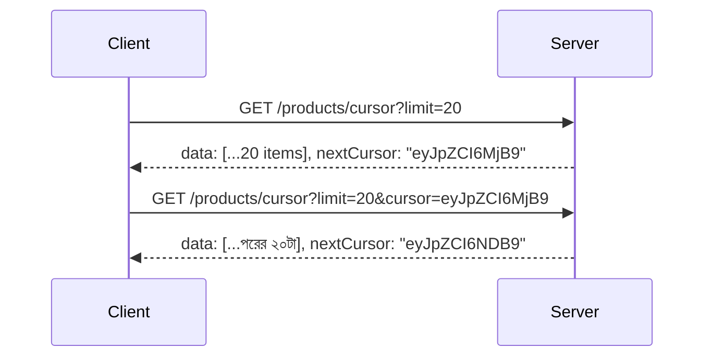

# ২৮.০৩. Cursor-based Pagination for Large Datasets

আগের লেসনের শেষে আমরা দেখেছি offset pagination-এর একটা বাস্তব সমস্যা আছে — গভীর পাতায় (deep pages) যাওয়ার সময় ডেটাবেজকে অনেক রেকর্ড "গুনে বাদ দিতে" হয়, যা ধীরগতির। আরেকটা সূক্ষ্ম সমস্যাও আছে — যদি ইউজার পাতা ২ দেখার সময় নতুন একটা প্রোডাক্ট যোগ হয়, তাহলে পাতা ৩-এ গিয়ে ইউজার একটা প্রোডাক্ট দুইবার দেখতে পারে, বা একটা মিস করতে পারে, কারণ "পজিশন" নম্বর দিয়ে হিসাব করা হচ্ছে, যেটা ডেটা বদলালে শিফট হয়ে যায়।

**Cursor-based Pagination** এই দুইটা সমস্যাই সমাধান করে। এর মূল ধারণা হলো — "কততম আইটেম" দিয়ে না গুনে, বরং "শেষ যে আইটেমটা দেখেছো, তার পরের আইটেমগুলো দাও" — এভাবে হিসাব করা। এই "শেষ দেখা আইটেম"-এর একটা ইউনিক, ক্রমবর্ধমান শনাক্তকারী (যেমন `id` বা `created_at`) হলো cursor।

```sql
-- প্রথম পাতা
SELECT * FROM products
WHERE deleted_at IS NULL
ORDER BY id ASC
LIMIT 20;

-- পরের পাতা — cursor হলো আগের পাতার শেষ id (ধরো ১২৩৪৫৬৭)
SELECT * FROM products
WHERE deleted_at IS NULL AND id > 1234567
ORDER BY id ASC
LIMIT 20;
```

লক্ষ্য করো, এখানে `OFFSET` নেই — ডেটাবেজ সরাসরি `id > 1234567` শর্ত মেনে ইনডেক্স ব্যবহার করে সরাসরি সঠিক জায়গা থেকে পড়া শুরু করতে পারে (Module 21-এ B-Tree ইনডেক্স শেখার সময় এই "সরাসরি সঠিক জায়গায় লাফ দেয়া" ক্ষমতাটাই ইনডেক্সের আসল শক্তি হিসেবে দেখেছিলে)। তাই cursor pagination ডেটাসেট যত বড়ই হোক না কেন, পারফরম্যান্স প্রায় একই থাকে — পাতা ২ আর পাতা ২০,০০০ প্রায় সমান গতিতে লোড হয়।

বাস্তব প্রজেক্টে cursor-টা সাধারণত raw id হিসেবে ক্লায়েন্টকে দেখানো হয় না — বরং base64-এ এনকোড করে একটা "opaque" (অস্বচ্ছ) স্ট্রিং হিসেবে পাঠানো হয়, যাতে ক্লায়েন্ট এটাকে নিজে থেকে বদলে জালিয়াতি করতে না পারে, আর সামনে দরকার হলে cursor-এর ভেতরের গঠন (যেমন একসাথে `id` আর `created_at` রাখা) বদলালেও ক্লায়েন্টের কোড ভাঙে না।

```python
# common/cursor.py
import base64
import json


def encode_cursor(last_id: int) -> str:
    payload = json.dumps({"id": last_id}).encode("utf-8")
    return base64.urlsafe_b64encode(payload).decode("utf-8")


def decode_cursor(cursor: str) -> int:
    payload = base64.urlsafe_b64decode(cursor.encode("utf-8"))
    return json.loads(payload)["id"]
```

```python
# products/router.py
from fastapi import APIRouter, Query, Depends, HTTPException
from sqlalchemy.orm import Session
from sqlalchemy import select
from typing import Optional

from database import get_db
from models import Product
from common.cursor import encode_cursor, decode_cursor
from common.schemas import ApiResponse
from products.schemas import ProductOut, CursorMeta

router = APIRouter(prefix="/products")


@router.get("/cursor", response_model=ApiResponse[list[ProductOut]])
def get_products_cursor(
    limit: int = Query(20, ge=1, le=100),
    cursor: Optional[str] = Query(None),
    db: Session = Depends(get_db),
):
    stmt = select(Product).where(Product.deleted_at.is_(None))

    if cursor:
        try:
            last_id = decode_cursor(cursor)
        except Exception:
            raise HTTPException(status_code=400, detail="অকার্যকর cursor")
        stmt = stmt.where(Product.id > last_id)

    products = db.scalars(
        stmt.order_by(Product.id.asc()).limit(limit)
    ).all()

    next_cursor = encode_cursor(products[-1].id) if len(products) == limit else None

    return ApiResponse(data=products, meta=CursorMeta(limit=limit, next_cursor=next_cursor))
```

ক্লায়েন্ট প্রথম রিকোয়েস্টে কোনো cursor পাঠাবে না, রেসপন্স থেকে `next_cursor` পাবে, পরের রিকোয়েস্টে সেটা `?cursor=<value>` হিসেবে পাঠাবে — এভাবেই এগিয়ে যাওয়া।



এখানে একটা সূক্ষ্ম কিন্তু গুরুত্বপূর্ণ শর্ত মনে রাখতে হয় — যে কলামটাকে cursor হিসেবে ব্যবহার করা হচ্ছে (এখানে `id`), সেটা অবশ্যই **ইউনিক আর স্থিতিশীল (stable) সর্টিং কী** হতে হবে। ধরো, কেউ যদি ভুল করে `created_at`-কে একমাত্র cursor বানায়, আর দুইটা প্রোডাক্ট ঠিক একই মিলিসেকেন্ডে তৈরি হয় (bulk insert-এ এটা অসম্ভব না) — তাহলে `created_at > last_seen` শর্তে সেই দুইটার একটা হারিয়ে যেতে পারে, বা `created_at >= last_seen` দিলে একটা রেকর্ড বারবার রিপিট হতে পারে। এই সমস্যা এড়াতে সবসময় cursor-এ একটা ইউনিক কলাম (`id`) রাখা উচিত — প্রয়োজনে `(created_at, id)` জোড়া মিলিয়ে কম্পোজিট cursor বানানো, যাতে টাই (tie) হলেও `id`-এর সাহায্যে নির্দিষ্টভাবে "পরের" রেকর্ড ঠিক হয়।

Cursor pagination-এর একটা সীমাবদ্ধতা হলো — এটা "পাতা ৫০-এ সরাসরি লাফ দাও" জাতীয় UI-এর জন্য উপযুক্ত না, কারণ প্রতিটা cursor শুধু তার ঠিক আগের পাতার উপর নির্ভরশীল, র‍্যান্ডম-অ্যাক্সেস করা যায় না। এই কারণে এটা মূলত ব্যবহার হয় "infinite scroll" ধরনের UI-তে (সোশ্যাল মিডিয়া ফিড, প্রোডাক্ট ফিড), যেখানে ইউজার শুধু নিচের দিকে স্ক্রল করতে থাকে, নির্দিষ্ট পাতা নম্বরে যাওয়ার দরকার হয় না। আর অ্যাডমিন ড্যাশবোর্ডের মতো জায়গায়, যেখানে পাতা নম্বর দেখানো দরকার, সেখানে আগের লেসনের offset pagination-ই বেশি মানানসই।

দুটো পদ্ধতিই এখন আমাদের হাতে আছে, আর কখন কোনটা ব্যবহার করতে হবে সেটাও পরিষ্কার। কিন্তু pagination একা যথেষ্ট না — বাস্তব ইউজার প্রায়ই চায় নির্দিষ্ট শর্ত অনুযায়ী ফিল্টার করা ডেটা (যেমন শুধু "Electronics" ক্যাটাগরির, ৫০০-১০০০ টাকার মধ্যে প্রোডাক্ট)। পরের এবং এই মডিউলের শেষ লেসনে আমরা একাধিক প্যারামিটার দিয়ে ফিল্টারিং শিখবো।
