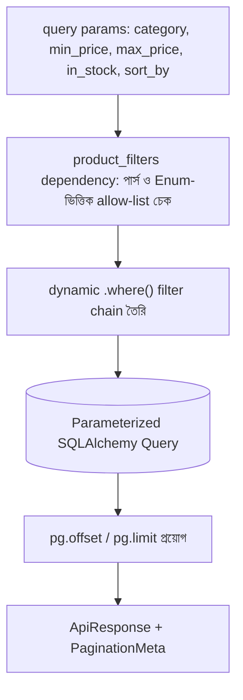

# ২৮.০৪. Advanced Filtering with Multiple Parameters

আমাদের ই-কমার্স প্রজেক্টে একজন কাস্টমার শুধু "সব প্রোডাক্ট পৃষ্ঠায় পৃষ্ঠায় দেখতে চায়" এমনটা না — সে চায় "Electronics ক্যাটাগরির, ৫০০ থেকে ২০০০ টাকার মধ্যে, স্টকে আছে এমন প্রোডাক্ট, দাম অনুযায়ী সাজানো"। এটাই **advanced filtering** — একাধিক শর্ত একসাথে প্রয়োগ করে ডেটা খোঁজা, যেটা Module 17-এ শেখা `WHERE`, `ORDER BY` ক্লজের বাস্তব, প্রোডাকশন-লেভেল প্রয়োগ।

প্রথম চ্যালেঞ্জ হলো — কুয়েরি স্ট্রিং থেকে এই শর্তগুলো নিরাপদভাবে পার্স করা।

```
GET /products?category=Electronics&min_price=500&max_price=2000&in_stock=true&sort_by=price&order=asc&page=1&limit=20
```

FastAPI-তে এই কাজটা সবচেয়ে ভালোভাবে হয় একটা Pydantic মডেলকে dependency হিসেবে ব্যবহার করে — তাহলে প্রতিটা প্যারামিটারের টাইপ, ডিফল্ট ভ্যালু, আর ভ্যালিডেশন একজায়গায় ঘোষণা করা যায়, আর FastAPI নিজে থেকেই ভুল ইনপুট প্রত্যাখ্যান করে।

```python
# products/schemas.py
from enum import Enum
from typing import Optional
from fastapi import Query
from pydantic import BaseModel


class SortBy(str, Enum):
    price = "price"
    name = "name"
    created_at = "created_at"


class SortOrder(str, Enum):
    asc = "asc"
    desc = "desc"


class ProductFilters(BaseModel):
    category: Optional[str] = None
    min_price: Optional[float] = None
    max_price: Optional[float] = None
    in_stock: Optional[bool] = None
    sort_by: SortBy = SortBy.created_at
    order: SortOrder = SortOrder.asc


def product_filters(
    category: Optional[str] = Query(None),
    min_price: Optional[float] = Query(None, ge=0),
    max_price: Optional[float] = Query(None, ge=0),
    in_stock: Optional[bool] = Query(None),
    sort_by: SortBy = Query(SortBy.created_at),
    order: SortOrder = Query(SortOrder.asc),
) -> ProductFilters:
    return ProductFilters(
        category=category,
        min_price=min_price,
        max_price=max_price,
        in_stock=in_stock,
        sort_by=sort_by,
        order=order,
    )
```

এখানে `sort_by`-এর জন্য একটা `Enum` (`SortBy`) ব্যবহার করা হয়েছে, ইউজারের দেয়া যেকোনো স্ট্রিং সরাসরি না মেনে। এটা Express-এর ভার্শনে যে allow-list array (`['price', 'name', 'createdAt']`) দিয়ে করা হতো, তার FastAPI-সুলভ, আরও কঠোর সংস্করণ — Enum-এর বাইরের কোনো ভ্যালু আসলে FastAPI নিজেই রিকোয়েস্ট পৌঁছানোর আগে ৪২২ এরর দিয়ে দেবে, কন্ট্রোলারের কোড পর্যন্ত পৌঁছাবেই না। এই allow-list-টা এত গুরুত্বপূর্ণ কারণ যদি ইউজারের ইনপুট সরাসরি SQL-এর `ORDER BY` কলামের নামে বসানো হয়, সেটা একটা SQL Injection-এর সুযোগ তৈরি করতে পারে — parameterized query দিয়ে ভ্যালুর ইনজেকশন ঠেকানো যায় (যেমন `WHERE price > :min_price`), কিন্তু কলামের নাম বা `ASC`/`DESC` দিক নির্দেশনা প্যারামিটারাইজ করা যায় না, কারণ SQL সিনট্যাক্সে এগুলো আইডেন্টিফায়ার/কীওয়ার্ড, ভ্যালু নয়। তাই allow-list (এখানে Enum)-ই এখানে একমাত্র নিরাপদ পথ।

এখন এই ফিল্টার দিয়ে ডাইনামিক কোয়েরি বানানো:

```python
# products/service.py
from sqlalchemy import select
from sqlalchemy.orm import Session

from models import Product
from products.schemas import ProductFilters


def find_products(db: Session, filters: ProductFilters, page: int, limit: int):
    stmt = select(Product).where(Product.deleted_at.is_(None))

    if filters.category:
        stmt = stmt.where(Product.category == filters.category)
    if filters.min_price is not None:
        stmt = stmt.where(Product.price >= filters.min_price)
    if filters.max_price is not None:
        stmt = stmt.where(Product.price <= filters.max_price)
    if filters.in_stock:
        stmt = stmt.where(Product.stock > 0)

    sort_column = getattr(Product, filters.sort_by.value)  # ইতিমধ্যে Enum দিয়ে যাচাই করা
    sort_column = sort_column.desc() if filters.order == "desc" else sort_column.asc()
    stmt = stmt.order_by(sort_column)

    stmt = stmt.offset((page - 1) * limit).limit(limit)
    return db.scalars(stmt).all()
```

এই ফাংশনটা একটা **dynamic filter chain** — যে শর্তগুলো আসলেই দেয়া হয়েছে, শুধু সেগুলোই `.where()` চেইনে যোগ হচ্ছে, বাকি সব ঐচ্ছিক। এখানে একটা সাধারণ ভুল খেয়াল রাখা জরুরি — SQLAlchemy-এর ORM ফিল্টার মেথড (`.where(Product.category == value)`) ব্যবহার করলে SQLAlchemy নিজেই ভেতরে ভেতরে parameterized SQL জেনারেট করে, ভ্যালুটা কখনো সরাসরি SQL স্ট্রিং-এর ভেতর বসে না। কিন্তু কেউ যদি সুবিধার্থে (বা পারফরম্যান্স টিউনিং-এর নাম করে) সরাসরি f-string বা `%`-ফরম্যাটিং দিয়ে `text(f"category = '{category}'")` জাতীয় raw SQL বানায়, তাহলে সেটা আবার SQL Injection-এর পুরনো ঝুঁকিটাই ফিরিয়ে আনে — তাই dynamic filter হলেও প্রতিটা ভ্যালু সবসময় ORM-এর filter মেথড বা parameterized `text()` বাইন্ডিং দিয়েই পাস করা উচিত, স্ট্রিং কনক্যাটেনেশন দিয়ে কখনো না। এই প্যাটার্নটা বড় প্রজেক্টে এতটাই সাধারণ যে অনেক প্রজেক্ট এর জন্য আলাদা কোয়েরি-বিল্ডার হেল্পার লাইব্রেরি তৈরি করে রাখে, ঠিক এই লজিকটাই আরও সহজ সিনট্যাক্সে করার জন্য।

```python
# products/router.py
from fastapi import APIRouter, Depends
from sqlalchemy.orm import Session
from sqlalchemy import func, select

from database import get_db
from models import Product
from common.pagination import PageParams, page_params
from common.schemas import ApiResponse, PaginationMeta
from products.schemas import ProductOut, ProductFilters, product_filters
from products.service import find_products

router = APIRouter(prefix="/products")


@router.get("", response_model=ApiResponse[list[ProductOut]])
def get_all_products(
    filters: ProductFilters = Depends(product_filters),
    pg: PageParams = Depends(page_params),
    db: Session = Depends(get_db),
):
    products = find_products(db, filters, pg.page, pg.limit)
    total_items = db.scalar(
        select(func.count()).select_from(Product).where(Product.deleted_at.is_(None))
    )

    return ApiResponse(
        data=products,
        meta=PaginationMeta(
            page=pg.page,
            limit=pg.limit,
            total_items=total_items,
            total_pages=-(-total_items // pg.limit),
        ),
    )
```

লক্ষ্য করো `product_filters` আর `page_params` — দুটোই আলাদা `Depends()` — একই এন্ডপয়েন্টে একসাথে বসছে, একটা ফিল্টারিং সামলাচ্ছে, আরেকটা pagination। এই বিভাজনটাই FastAPI-এর dependency injection-এর সৌন্দর্য — প্রতিটা concern আলাদা, পুনরায় ব্যবহারযোগ্য ফাংশনে থাকছে, আর এন্ডপয়েন্ট শুধু সেগুলো একসাথে জোড়া দিচ্ছে।



এই মডিউলে আমরা রেসপন্স ফরম্যাটিং, offset আর cursor pagination, আর মাল্টি-প্যারামিটার ফিল্টারিং — এই তিনটা মিলিয়ে একটা সম্পূর্ণ, প্রোডাকশন-রেডি "লিস্টিং API" বানানোর কৌশল শিখে ফেললাম, যেটা Module 24-এর ই-কমার্স প্রজেক্টের প্রোডাক্ট, স্টোর, অর্ডার — সব ধরনের লিস্টিং এন্ডপয়েন্টে সরাসরি প্রয়োগযোগ্য।

আমাদের API এখন ডেটা ভালোভাবে ফেরত দিতে পারে, বদলাতে পারে, মুছতে পারে। কিন্তু এই পুরো সময় ধরে আমরা ধরে নিয়েছি "ইউজার লগইন করা আছে, তার রোল জানা আছে" — পরের মডিউলে আমরা এই অথেন্টিকেশন আর অথরাইজেশনের ভিত্তিটা আরও গভীরভাবে, প্রথম থেকে শেষ পর্যন্ত একসাথে ঝালিয়ে নেবো।
