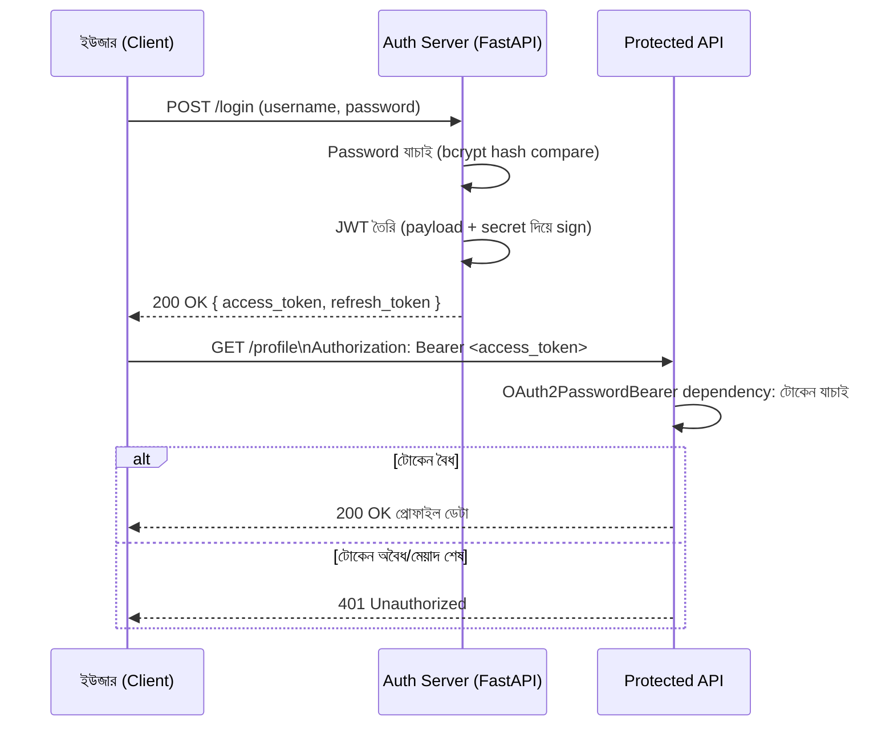

# ২৯.০১. Token-based Authentication Flow and Security

এতদিন আমরা authentication-এর গল্পটা টুকরো টুকরো করে শিখেছি। Module 11-এ আমরা দেখেছি Cookie আর Session কীভাবে একজন ইউজারকে "মনে রাখে", আর সেখানেই একটা সমস্যাও চোখে পড়েছিল — Session-ভিত্তিক পদ্ধতিতে সার্ভারকে প্রতিটা লগইন করা ইউজারের তথ্য নিজের মেমরিতে বা ডেটাবেজে জমা রাখতে হয়, যেটা একাধিক সার্ভার (স্কেলিং) এর জগতে বেশ ঝামেলার। ঠিক সেই সমস্যার সমাধান হিসেবে Module 12-তে আমরা পরিচিত হয়েছিলাম JWT — JSON Web Token-এর সাথে। এই মডিউলে আমরা সেই জ্ঞানকে এক জায়গায় নিয়ে এসে, আরেকটু গভীরে গিয়ে বুঝবো একটা প্রোডাকশন-মানের token-based authentication system FastAPI-তে ঠিক কীভাবে কাজ করে, আর Module 25-এ FastAPI-র advanced OAuth2/JWT বাস্তবায়নের সাথে এই স্থাপত্যিক চিত্রটা কীভাবে মেলে।

তার আগে একটা প্রশ্নের উত্তর পরিষ্কার করে নেই — "token-based authentication" জিনিসটা আসলে কী সমস্যার সমাধান করে? Session-ভিত্তিক পদ্ধতিতে সার্ভার নিজে একটা "state" রাখে — কে লগইন করে আছে, তার তালিকা। কিন্তু JWT-ভিত্তিক পদ্ধতিতে সার্ভার কোনো state রাখে না; বরং ইউজারের পরিচয় আর অধিকারের তথ্য (payload) নিজেই টোকেনের ভেতরে সিল করে ইউজারকে দিয়ে দেয়, একটা ডিজিটাল স্বাক্ষর (signature) সহ। পরে ইউজার যখন কোনো অনুরোধ পাঠায়, সে টোকেনটা সাথে নিয়ে আসে, আর সার্ভার শুধু স্বাক্ষরটা যাচাই করেই বুঝে ফেলে টোকেনটা আসল কিনা এবং তার ভেতরের তথ্য বিশ্বাসযোগ্য কিনা। এই বৈশিষ্ট্যকে বলে **stateless authentication** — এটাই আধুনিক API আর মাইক্রোসার্ভিস জগতের মূল ভিত্তি, কারণ এখানে যেকোনো সার্ভার ইনস্ট্যান্স, এমনকি সম্পূর্ণ ভিন্ন একটা সার্ভিসও, শুধু একটা shared secret বা public key দিয়ে টোকেন যাচাই করতে পারে, কোনো shared session store ছাড়াই।

পুরো ফ্লো-টা একটা গল্পের মতো করে দেখা যাক।



লক্ষ্য করো, এখানে দুটো ধাপ সম্পূর্ণ আলাদা দায়িত্বে বিভক্ত — একটা হলো **issuing** (টোকেন বানানো, লগইনের সময়), আরেকটা হলো **verifying** (টোকেন যাচাই করা, প্রতিটা protected রিকোয়েস্টে)। FastAPI-তে এই দুটো অংশ আমরা আলাদা মডিউলে সাজাবো, কারণ বাস্তব প্রজেক্টে এই বিভাজনটাই কোডকে পরিষ্কার রাখে।

প্রথমে issuing অংশ — লগইন রুট, যেখানে পাসওয়ার্ড যাচাই করে টোকেন ইস্যু করা হচ্ছে:

```python
# auth/tokens.py
from datetime import datetime, timedelta, timezone
from jose import jwt
from passlib.context import CryptContext

ACCESS_SECRET = "your-access-secret"  # বাস্তবে .env থেকে আসবে
ALGORITHM = "HS256"
pwd_context = CryptContext(schemes=["bcrypt"], deprecated="auto")


def verify_password(plain: str, hashed: str) -> bool:
    return pwd_context.verify(plain, hashed)


def create_access_token(payload: dict) -> str:
    to_encode = payload.copy()
    expire = datetime.now(timezone.utc) + timedelta(minutes=15)  # ছোট আয়ু, security-র জন্য গুরুত্বপূর্ণ
    to_encode.update({"exp": expire, "iss": "our-api"})
    return jwt.encode(to_encode, ACCESS_SECRET, algorithm=ALGORITHM)
```

```python
# routes/auth.py
from fastapi import APIRouter, HTTPException, status
from schemas.auth import LoginRequest, TokenResponse
from db.user_repository import find_user_by_username
from auth.tokens import verify_password, create_access_token

router = APIRouter()


@router.post("/login", response_model=TokenResponse)
async def login(payload: LoginRequest):
    user = await find_user_by_username(payload.username)

    if not user or not verify_password(payload.password, user.password_hash):
        raise HTTPException(
            status_code=status.HTTP_401_UNAUTHORIZED,
            detail="ভুল username অথবা password",
        )

    access_token = create_access_token({"sub": str(user.id), "role": user.role})
    return TokenResponse(access_token=access_token)
```

খেয়াল করলে দেখবে, পাসওয়ার্ড কখনও plain text-এ ডেটাবেজে থাকছে না — Module 12-তে শেখা hashing (bcrypt/passlib) এখানেও ব্যবহার হচ্ছে। পাসওয়ার্ড hash করার যুক্তিটা একই থেকে যায়, শুধু এখন সেটা একটা পূর্ণাঙ্গ auth সিস্টেমের প্রথম ধাপ হিসেবে বসছে।

এবার verifying অংশ — FastAPI-তে এটা একটা **dependency**, `OAuth2PasswordBearer` স্কিম ব্যবহার করে। এই স্কিমটা মূলত FastAPI-কে বলে দেয় "টোকেন কোন হেডার থেকে খুঁজতে হবে, আর কোন URL-এ গেলে লগইন ফর্ম পাওয়া যাবে" (এটা মূলত Swagger UI-র জন্য দরকারি, তাই `tokenUrl` লাগে):

```python
# auth/dependencies.py
from fastapi import Depends, HTTPException, status
from fastapi.security import OAuth2PasswordBearer
from jose import jwt, JWTError

ACCESS_SECRET = "your-access-secret"
ALGORITHM = "HS256"

oauth2_scheme = OAuth2PasswordBearer(tokenUrl="/login")


async def get_current_user(token: str = Depends(oauth2_scheme)) -> dict:
    credentials_exception = HTTPException(
        status_code=status.HTTP_401_UNAUTHORIZED,
        detail="টোকেন অবৈধ অথবা মেয়াদ শেষ",
        headers={"WWW-Authenticate": "Bearer"},
    )
    try:
        payload = jwt.decode(token, ACCESS_SECRET, algorithms=[ALGORITHM])
    except JWTError:
        raise credentials_exception

    return {"sub": payload.get("sub"), "role": payload.get("role")}
```

```python
# routes/profile.py
from fastapi import APIRouter, Depends
from auth.dependencies import get_current_user

router = APIRouter()


@router.get("/profile")
async def get_profile(current_user: dict = Depends(get_current_user)):
    return {"user_id": current_user["sub"], "role": current_user["role"]}
```

এই প্যাটার্নটা Module 7-এ শেখা middleware চেইনের ধারণার একটা ভিন্ন কিন্তু সমতুল্য প্রকাশ — সেখানে middleware রিকোয়েস্ট গ্লোবালি ইন্টারসেপ্ট করতো, এখানে `Depends()` একটা এক্সপ্লিসিট ফাংশন প্যারামিটার হিসেবে ঘোষিত হয়, যেটা route চালানোর আগেই resolve হয়ে যায়। দুটোর "এক্সিকিউশন অর্ডার" ধারণাগতভাবে একই — যাচাইকারী স্তর আগে চলে, শুধু FastAPI-তে এটা রুট-স্তরে declarative, Express-এর মতো গ্লোবাল implicit চেইন না। এই পার্থক্যটা আরও বিস্তারিতভাবে Module 7-এ middleware বনাম dependency নিয়ে আলোচনা করা হয়েছে।

একটা জিনিস এখানে বিশেষভাবে গুরুত্বপূর্ণ, নিরাপত্তার দৃষ্টিকোণ থেকে। Access token-এর মেয়াদ ইচ্ছাকৃতভাবে ছোট রাখা হয় (উপরে ১৫ মিনিট), কারণ যদি কোনোভাবে টোকেন চুরি হয়ে যায় (যেমন XSS আক্রমণে, যেটা আমরা Module 30-এ বিস্তারিত দেখবো), তাহলে ক্ষতির সময়সীমা সীমিত থাকে। কিন্তু ইউজারকে প্রতি ১৫ মিনিটে লগইন করতে বলাটা বাজে অভিজ্ঞতা — তাই বাস্তব সিস্টেমে একটা দীর্ঘ-মেয়াদী **refresh token** থাকে (সাধারণত কয়েক দিন বা সপ্তাহ মেয়াদ), যেটা httpOnly cookie-তে (Module 11-এর শেখা কৌশল কাজে লাগিয়ে) সংরক্ষিত থাকে এবং শুধু নতুন access token চাওয়ার জন্য ব্যবহার হয়, কখনও সরাসরি API অ্যাক্সেসের জন্য না।

এখানে একটা সাধারণ, কিন্তু গুরুত্বপূর্ণ প্রোডাকশন ভুল উল্লেখ করার মতো — অনেক শুরুর দিকের প্রজেক্ট শুধু access token বানিয়েই থেমে যায়, আর সেই access token-এর মেয়াদ "ইউজার-বান্ধবতার" জন্য বাড়িয়ে দেয় (যেমন ৭ দিন বা ৩০ দিন), যাতে বারবার লগইন করতে না হয়। এটা একটা মারাত্মক নিরাপত্তা ঝুঁকি তৈরি করে — কারণ access token চুরি হলে আক্রমণকারী পুরো মেয়াদ ধরেই সরাসরি API অ্যাক্সেস পেয়ে যায়, আর কোনো revocation মেকানিজম ছাড়া (যেটা লেসন ৫-এ আলোচনা করা হবে) সেটা থামানোর কোনো সহজ উপায় থাকে না। সঠিক সমাধান হলো access token ছোট রাখা, আর refresh token দিয়ে "নীরবে" নতুন access token জেনারেট করার একটা `/refresh` endpoint বানানো — এভাবে দুই স্তরের টোকেন সিস্টেম security আর ব্যবহারযোগ্যতার ভারসাম্য তৈরি করে, refresh token বাস্তবায়ন না করা এই ভারসাম্যটাই ভেঙে দেয়।

এই লেসনে আমরা টোকেন ইস্যু আর যাচাইয়ের মূল ফ্লো শিখলাম। কিন্তু টোকেনের ভেতরের `role` তথ্যটা দিয়ে আমরা কী করবো — মানে কে কী করতে পারবে, সেটা কীভাবে নিয়ন্ত্রণ করা যায় — সেই প্রশ্নের উত্তর খুঁজবো পরের লেসনে, যেখানে আমরা Role-based Access Control (RBAC)-এর স্থাপত্য নিয়ে বিস্তারিত আলোচনা করবো।
