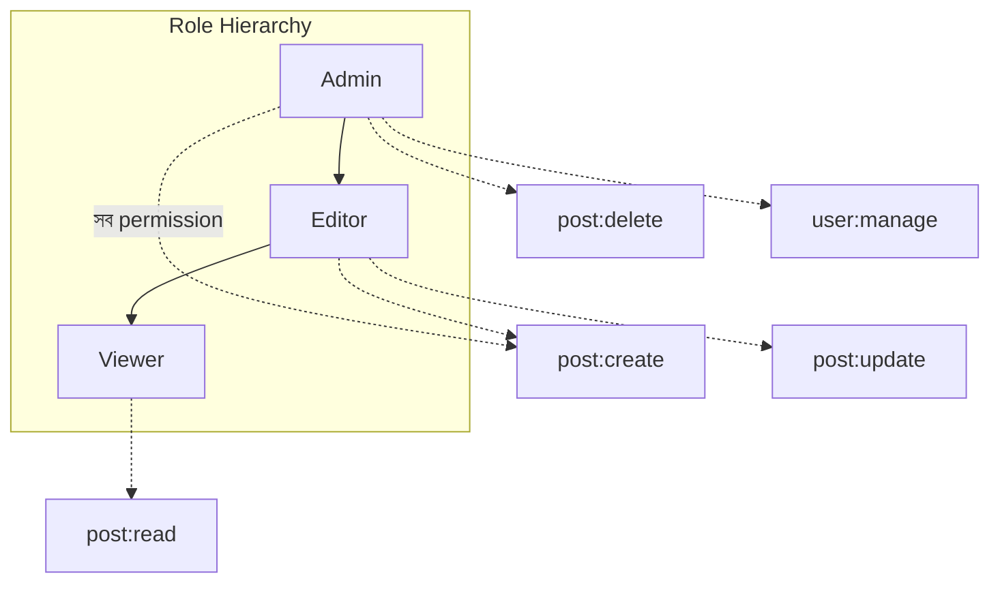

# ২৯.০২. Role-based Access Control (RBAC) Architecture

আগের লেসনের শেষে আমরা একটা টোকেনের ভেতরে `role` নামের একটা তথ্য বহন করছিলাম, কিন্তু সেটা দিয়ে বাস্তবে কিছু করিনি। এই লেসনে আমরা ঠিক সেই ফাঁকটা পূরণ করবো — "কে লগইন করেছে" (authentication) থেকে "সে কী করার অনুমতি রাখে" (authorization) এই ধাপে যাবো। এই দুটো শব্দ প্রায়ই গুলিয়ে ফেলা হয়, তাই শুরুতেই পার্থক্যটা স্পষ্ট করে নেওয়া ভালো — authentication উত্তর দেয় "তুমি কে", আর authorization উত্তর দেয় "তুমি কী করতে পারো"। আগের লেসনের `get_current_user` dependency আমাদের authentication দিয়েছে; এই লেসনে আমরা authorization-এর একটা সুশৃঙ্খল মডেল বানাবো, যার নাম **Role-Based Access Control**, সংক্ষেপে RBAC।

এই ধারণাটা আসলে আমাদের কাছে একেবারে নতুন না। Module 21-এ, ডেটাবেজ ইনডেক্সিং আর পারফরম্যান্স নিয়ে আলোচনার সময় ডেটাবেজ ইঞ্জিনের নিজস্ব অ্যাক্সেস কন্ট্রোল (`GRANT`/`REVOKE`) কীভাবে কাজ করে সেটার ধারণা এসেছিল। আমরা এখন যেটা বানাবো সেটা একই দর্শনের, কিন্তু ডেটাবেজ ইঞ্জিন লেভেলে না, বরং আমাদের নিজেদের FastAPI অ্যাপ্লিকেশনের লেভেলে — কোন API endpoint কোন role-এর ইউজার কল করতে পারবে সেটা নিয়ন্ত্রণ করা। Module 25-এ FastAPI-র advanced RBAC নিয়ে আমরা আরও গভীরে যাবো (একাধিক permission সোর্স, dynamic role লোডিং); এখানে আমরা মূল স্থাপত্যিক চিত্রটা বুঝবো।

RBAC-এর মূল ধারণাটা তিনটা সত্তার সম্পর্ক দিয়ে গঠিত: **User**, **Role**, আর **Permission**। একজন ইউজারকে সরাসরি অনুমতি না দিয়ে, তাকে একটা role দেওয়া হয় (যেমন "admin", "editor", "viewer"), আর প্রতিটা role-এর সাথে বাঁধা থাকে একগুচ্ছ permission (যেমন "post:create", "post:delete")। এই পরোক্ষ (indirect) সম্পর্কটাই RBAC-কে শক্তিশালী করে — কারণ নতুন ইউজার এলে তাকে শুধু একটা role অ্যাসাইন করলেই চলে, প্রতিটা আলাদা permission ম্যানুয়ালি বসাতে হয় না।



এখানে একটা গুরুত্বপূর্ণ স্থাপত্যগত সিদ্ধান্ত হলো role-গুলোকে "hierarchy" বা স্তরবিন্যাস আকারে সাজানো — Admin, Editor-এর সব ক্ষমতা পায় প্লাস কিছু বাড়তি ক্ষমতা, আর Editor, Viewer-এর সব ক্ষমতা পায় প্লাস বাড়তি কিছু। এই ধরনের hierarchy ছোট থেকে মাঝারি সিস্টেমের জন্য যথেষ্ট, কিন্তু বড়, জটিল প্রতিষ্ঠানে (যেখানে হয়তো "Editor-but-cannot-delete" এর মতো সূক্ষ্ম কম্বিনেশন দরকার হয়) মানুষ প্রায়ই **Permission-based** মডেলে চলে যায়, যেখানে role গুলো শুধু কিছু permission-এর named group মাত্র, hierarchy নয়। আমরা এই মডিউলে দুটোরই সমন্বয় দেখবো — role দিয়ে দ্রুত broad-level নিয়ন্ত্রণ, আর permission দিয়ে সূক্ষ্ম নিয়ন্ত্রণ, যেটা আমরা লেসন ৪-এ বিস্তারিত দেখবো।

এখন এই মডেলটাকে Python-এ প্রকাশ করি। প্রথমে role আর permission-এর টাইপ আর তাদের সম্পর্কের একটা static ম্যাপ বানাই — বাস্তব প্রজেক্টে এটা ডেটাবেজেও থাকতে পারে (লেসন ৪-এ `roles` আর `permissions` টেবিল বানিয়ে), কিন্তু ছোট সিস্টেমে একটা in-memory ডিকশনারিও যথেষ্ট:

```python
# auth/rbac.py
from enum import Enum


class Role(str, Enum):
    ADMIN = "admin"
    EDITOR = "editor"
    VIEWER = "viewer"


class Permission(str, Enum):
    POST_CREATE = "post:create"
    POST_UPDATE = "post:update"
    POST_DELETE = "post:delete"
    POST_READ = "post:read"
    USER_MANAGE = "user:manage"


# প্রতিটা role কোন কোন permission পায়, তার ম্যাপ
ROLE_PERMISSIONS: dict[Role, list[Permission]] = {
    Role.ADMIN: [
        Permission.POST_CREATE,
        Permission.POST_UPDATE,
        Permission.POST_DELETE,
        Permission.POST_READ,
        Permission.USER_MANAGE,
    ],
    Role.EDITOR: [Permission.POST_CREATE, Permission.POST_UPDATE, Permission.POST_READ],
    Role.VIEWER: [Permission.POST_READ],
}


def role_has_permission(role: Role, permission: Permission) -> bool:
    return permission in ROLE_PERMISSIONS.get(role, [])
```

এই ফাংশনটাই RBAC-এর "ব্রেইন" — যেকোনো জায়গা থেকে জিজ্ঞেস করা যায় "এই role-এর কি এই permission আছে?" আর একটা true/false উত্তর পাওয়া যায়। পরের লেসনে আমরা এই ব্রেইনটাকে একটা FastAPI dependency factory-র ভেতরে বসাবো, যাতে এটা সত্যিকারের route protection-এ রূপ নেয়।

FastAPI-তে user model-এ role সংরক্ষণের একটা টিপিক্যাল রূপ দেখা যাক — SQLAlchemy মডেল আর তার সাথে জোড়া Pydantic স্কিমা:

```python
# models/user.py
from sqlalchemy import Column, Integer, String
from database import Base


class User(Base):
    __tablename__ = "users"

    id = Column(Integer, primary_key=True)
    username = Column(String(50), unique=True, nullable=False)
    password_hash = Column(String(255), nullable=False)
    role = Column(String(20), nullable=False, default="viewer")  # "admin" | "editor" | "viewer"
```

```python
# schemas/user.py
from pydantic import BaseModel
from auth.rbac import Role


class UserOut(BaseModel):
    id: int
    username: str
    role: Role

    class Config:
        from_attributes = True
```

একটা বাস্তব প্রশ্ন আসা স্বাভাবিক — role-এর তথ্যটা কোথায় রাখা উচিত, JWT-এর ভেতরে নাকি ডেটাবেজে প্রতিবার লুকআপ করে? আগের লেসনে আমরা দেখেছি role টোকেনের payload-এই রাখা হয়েছিল, যাতে প্রতিটা রিকোয়েস্টে আলাদা ডেটাবেজ কল ছাড়াই role জানা যায় — এটা performance-এর জন্য ভালো। কিন্তু এর একটা মূল্য আছে — যদি কোনো admin-এর role ডেটাবেজে বদলে "viewer" করে দেওয়া হয়, পুরনো টোকেনটা তার মেয়াদ শেষ না হওয়া পর্যন্ত এখনও পুরনো role বহন করবে। এই কারণেই আগের লেসনে access token-এর মেয়াদ ছোট (১৫ মিনিট) রাখা হয়েছিল — এটা শুধু token চুরি হওয়ার ঝুঁকি কমায় না, role পরিবর্তনও দ্রুত কার্যকর করে।

এখানে একটা প্রোডাকশন নুয়ান্স মাথায় রাখা জরুরি, যাকে বলা হয় **role explosion**। একটা সিস্টেম বড় হতে থাকলে টিম প্রায়ই প্রতিটা সূক্ষ্ম প্রয়োজনের জন্য নতুন role বানাতে শুরু করে — "editor-without-delete", "editor-for-blog-only", "senior-editor", "junior-viewer" — এভাবে কয়েক ডজন role তৈরি হয়ে যায়, যেগুলোর মধ্যে পার্থক্য বোঝা আর বজায় রাখা কঠিন হয়ে পড়ে। এটাই role explosion — role-কে "named permission bundle" ভাবার বদলে "প্রতিটা কাজের জন্য একটা নতুন role" বানানোর ফাঁদে পড়া। এই সমস্যার সমাধান হলো role আর permission-কে আলাদা রাখা (যেটা লেসন ৪-এ দেখবো) — role-এর সংখ্যা সীমিত রেখে (৩-৬টার মধ্যে), আর সূক্ষ্ম নিয়ন্ত্রণের জন্য নতুন role না বানিয়ে বরং বিদ্যমান role-এ নতুন permission যুক্ত/বাদ দেওয়া, বা প্রয়োজনে সরাসরি permission-based checks ব্যবহার করা।

এখন আমাদের হাতে আছে role আর permission-এর একটা সুস্পষ্ট মডেল। পরের লেসনে আমরা এই মডেলটাকে বাস্তব FastAPI dependency হিসেবে বাস্তবায়ন করবো, যাতে এটা সত্যিকারের route-কে সুরক্ষা দিতে পারে।
