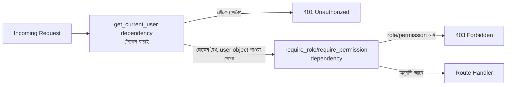

# ২৯.০৩. Implementing Authorization Middleware

আগের লেসনে আমরা RBAC-এর মডেলটা কাগজে-কলমে (মানে Python এনাম আর একটা ডিকশনারিতে) সাজিয়েছি। এখন সময় এসেছে সেই মডেলটাকে জীবন্ত করার — একটা যাচাইকারী স্তর বানানো, যেটা প্রতিটা protected route-এর সামনে দাঁড়িয়ে বলবে "তুমি ভেতরে যেতে পারবে" অথবা "তুমি পারবে না"।

শুরুতেই একটা পরিভাষাগত বিষয় স্পষ্ট করা দরকার — এই লেসনের নাম "Authorization Middleware" হলেও, FastAPI-তে আমরা যা বাস্তবায়ন করবো সেটা টেকনিক্যালি middleware না, বরং **dependency**। Module 7-এ middleware চেইনের ধারণাটা যেখানে শেখা হয়েছিল, সেখানেই এই পার্থক্যটা বিস্তারিতভাবে আলোচিত হয়েছে — middleware প্রতিটা রিকোয়েস্টে গ্লোবালভাবে প্রয়োগ হয় আর route-নির্দিষ্ট কনটেক্সট (যেমন কোন নির্দিষ্ট role লাগবে) সহজে জানে না, কিন্তু dependency route-নির্দিষ্টভাবে ঘোষিত হয় আর route-এর প্যারামিটার/context-এ সরাসরি অ্যাক্সেস পায়। authorization-এর জন্য dependency অনেক বেশি স্বাভাবিক ফিট, কারণ "কোন role লাগবে" এই তথ্যটা route-ভেদে আলাদা হয় — এটা একটা গ্লোবাল middleware-এর কাজ না, বরং প্রতিটা route ঘোষণা করার সময়েই নির্দিষ্ট করে দেওয়ার মতো জিনিস।

লক্ষ্য করার বিষয় হলো, authorization dependency সবসময় authentication dependency-র *পরে* চলে — কারণ এটা কাজ করার জন্য আগেই জানা দরকার ইউজার কে, যেটা লেসন ১-এর `get_current_user` dependency রিটার্ন করে। এই ক্রমটা ভাঙলে পুরো নিরাপত্তা মডেল ভেঙে পড়ে।



এখানে একটা সূক্ষ্ম কিন্তু গুরুত্বপূর্ণ পার্থক্য খেয়াল করার মতো — টোকেন না থাকলে বা অবৈধ হলে আমরা ফেরত দিই **401 Unauthorized** ("তুমি কে সেটাই আমরা জানি না"), কিন্তু টোকেন বৈধ হওয়া সত্ত্বেও প্রয়োজনীয় role না থাকলে ফেরত দিই **403 Forbidden** ("তোমাকে চিনি, কিন্তু তোমার এই কাজের অনুমতি নেই")। সঠিক status code ক্লায়েন্ট অ্যাপকে সঠিক প্রতিক্রিয়া (যেমন লগইন পেজে পাঠানো বনাম "অনুমতি নেই" বার্তা দেখানো) দিতে সাহায্য করে।

চলো এবার কোড লিখি। FastAPI-তে role-ভিত্তিক নিয়ন্ত্রণের প্রচলিত প্যাটার্নটা একটা **dependency factory** — একটা ফাংশন, যেটা কল করলে একটা নতুন dependency ফেরত দেয়, প্যারামিটার অনুযায়ী কাস্টমাইজড:

```python
# auth/require_role.py
from fastapi import Depends, HTTPException, status
from auth.dependencies import get_current_user
from auth.rbac import Role


def require_role(*allowed_roles: Role):
    def dependency(current_user: dict = Depends(get_current_user)) -> dict:
        user_role = current_user.get("role")

        if not user_role:
            raise HTTPException(
                status_code=status.HTTP_401_UNAUTHORIZED,
                detail="লগইন করা প্রয়োজন",
            )

        if user_role not in [r.value for r in allowed_roles]:
            raise HTTPException(
                status_code=status.HTTP_403_FORBIDDEN,
                detail=f"এই কাজের জন্য প্রয়োজনীয় role নেই। প্রয়োজন: {', '.join(r.value for r in allowed_roles)}",
            )

        return current_user

    return dependency
```

লক্ষ্য করো, `require_role` নিজে একটা dependency ফেরত দিচ্ছে না — বরং একটা **dependency factory**, মানে একটা ফাংশন যেটা কল করলে ভেতরের `dependency` ফাংশনটা তৈরি হয়, ক্লোজারের মাধ্যমে `allowed_roles`-কে ধরে রেখে। এই প্যাটার্নটা দরকারি, কারণ আমরা চাই ভিন্ন ভিন্ন route-এ ভিন্ন ভিন্ন role বসাতে:

```python
# routes/posts.py
from fastapi import APIRouter, Depends
from auth.require_role import require_role
from auth.rbac import Role

router = APIRouter()


@router.post("/posts")
async def create_post(current_user: dict = Depends(require_role(Role.ADMIN, Role.EDITOR))):
    ...


@router.delete("/posts/{post_id}")
async def delete_post(post_id: int, current_user: dict = Depends(require_role(Role.ADMIN))):
    ...


@router.get("/posts")
async def list_posts(current_user: dict = Depends(require_role(Role.ADMIN, Role.EDITOR, Role.VIEWER))):
    ...
```

এই তিনটা রুট পড়লেই বোঝা যায় প্রতিটা endpoint-এর অনুমতির নিয়ম কী — এটাই ভালো authorization dependency-র একটা বড় সুবিধা: নিয়মগুলো ছড়িয়ে-ছিটিয়ে না থেকে route signature-এর ঠিক পাশে, পড়ার মতো ভাষায় লেখা থাকে।

তবে role-ভিত্তিক চেক অনেক সময় যথেষ্ট সূক্ষ্ম না। ধরো তুমি চাও শুধু "যে ইউজার নিজের পোস্ট এডিট করছে, অথবা যে admin" তাকেই অনুমতি দিতে — এখানে শুধু role যথেষ্ট না, ডেটার সাথে ইউজারের সম্পর্কও (ownership) বিবেচনা করতে হয়। আগের লেসনে বানানো `role_has_permission` ফাংশন কাজে লাগিয়ে আমরা আরেকটু নমনীয় একটা permission-based dependency বানাতে পারি:

```python
# auth/require_permission.py
from fastapi import Depends, HTTPException, status
from auth.dependencies import get_current_user
from auth.rbac import Permission, Role, role_has_permission


def require_permission(permission: Permission):
    def dependency(current_user: dict = Depends(get_current_user)) -> dict:
        role = current_user.get("role")

        if not role:
            raise HTTPException(status_code=status.HTTP_401_UNAUTHORIZED, detail="লগইন করা প্রয়োজন")

        if not role_has_permission(Role(role), permission):
            raise HTTPException(status_code=status.HTTP_403_FORBIDDEN, detail=f"অনুমতি নেই: {permission.value}")

        return current_user

    return dependency
```

```python
@router.delete("/posts/{post_id}")
async def delete_post(
    post_id: int,
    current_user: dict = Depends(require_permission(Permission.POST_DELETE)),
):
    ...
```

আর ownership-এর মতো ডেটা-নির্ভর নিয়মের জন্য, একটা কাস্টম dependency লেখাই সবচেয়ে পরিষ্কার সমাধান, যেখানে আমরা ডেটাবেজ থেকে রিসোর্সটা খুঁজে বের করে owner আর current user তুলনা করি:

```python
# auth/require_owner_or_admin.py
from fastapi import Depends, HTTPException, status
from auth.dependencies import get_current_user
from db.post_repository import find_post_by_id


async def require_owner_or_admin(post_id: int, current_user: dict = Depends(get_current_user)):
    post = await find_post_by_id(post_id)

    if not post:
        raise HTTPException(status_code=status.HTTP_404_NOT_FOUND, detail="পোস্ট পাওয়া যায়নি")

    is_owner = post.author_id == int(current_user["sub"])
    is_admin = current_user["role"] == "admin"

    if not is_owner and not is_admin:
        raise HTTPException(status_code=status.HTTP_403_FORBIDDEN, detail="এই পোস্ট এডিট করার অনুমতি নেই")

    return post
```

এখানে একটা সাধারণ ভুল উল্লেখ করা জরুরি, যা নতুন FastAPI ডেভেলপাররা প্রায়ই করে — role বা permission চেক করাটা `Depends()`-এর বদলে সরাসরি route handler-এর body-র ভেতরে `if` স্টেটমেন্ট দিয়ে লিখে ফেলা:

```python
# ভুল প্যাটার্ন — route handler-এর ভেতরে চেক
@router.delete("/posts/{post_id}")
async def delete_post(post_id: int, current_user: dict = Depends(get_current_user)):
    if current_user["role"] != "admin":  # এটা এখানে লেখা বিপজ্জনক
        raise HTTPException(status_code=403, detail="অনুমতি নেই")
    ...
```

এটা প্রথম নজরে কাজ করে মনে হলেও, বড় কোডবেসে এটা মারাত্মক অসংগত (inconsistent) সুরক্ষা তৈরি করে — কারণ প্রতিটা নতুন endpoint লেখার সময় ডেভেলপারকে মনে করে করে এই `if` লিখতে হয়, আর একটা মাত্র endpoint-এ ভুলে গেলে (বা কপি-পেস্ট করার সময় বাদ পড়লে) সেটা সম্পূর্ণ unprotected থেকে যায়, অথচ কোড রিভিউয়ে ধরাও পড়ে না সহজে। `Depends(require_role(...))` কে function signature-এর অংশ বানানোর সুবিধা হলো, এটা route ঘোষণার সময়েই দৃশ্যমান, আর OpenAPI ডকুমেন্টেশনেও প্রতিফলিত হয় — অথচ handler body-র ভেতরের `if` কখনও ডকুমেন্টেশনে বা রুট লিস্টিং-এ দেখা যায় না। এই বিষয়টা লেসন ৫-এ `APIRouter`-level dependencies নিয়ে আলোচনার সময় আরও স্পষ্ট হবে।

এই লেসনে আমরা authorization-এর কার্যকরী স্তরটা বানালাম। কিন্তু এখনো একটা গুরুত্বপূর্ণ প্রশ্ন বাকি — এই role আর permission-এর ডেটা আসলে কোথা থেকে আসে, আর ইউজার ম্যানেজমেন্ট সিস্টেমে সেগুলো কীভাবে নিয়ন্ত্রণ করা হয়? সেটাই আমরা দেখবো পরের লেসনে, যেখানে আমরা user roles আর permissions ম্যানেজমেন্টের পূর্ণাঙ্গ চিত্র আঁকবো।
