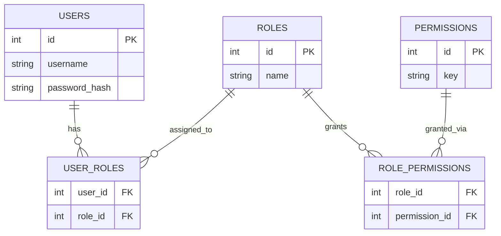

# ২৯.০৪. User Roles and Permissions Management

আগের দুটো লেসনে আমরা role আর permission-কে একটা in-memory ডিকশনারিতে (`ROLE_PERMISSIONS`) রেখে কাজ চালিয়েছি — শেখার জন্য এটা যথেষ্ট ছিল, কারণ এতে মনোযোগ ছিল dependency-এর যুক্তির উপর। কিন্তু বাস্তব একটা প্রোডাকশন সিস্টেমে role আর permission স্থির (hardcoded) থাকে না — একজন super-admin হয়তো চাইবে নতুন role বানাতে ("moderator"), অথবা কোনো নির্দিষ্ট role-এর কাছ থেকে একটা permission কেড়ে নিতে, অ্যাপ পুনরায় ডিপ্লয় না করেই। এই ধরনের নমনীয়তার জন্য role আর permission-কে ডেটাবেজে মডেল করতে হয়। এই লেসনে আমরা ঠিক সেই কাজটাই করবো, SQLAlchemy মডেল আর Pydantic স্কিমা দিয়ে।

Module 18-তে আমরা শিখেছিলাম many-to-many সম্পর্ক কীভাবে কাজ করে — একজন স্টুডেন্ট অনেকগুলো কোর্সে ভর্তি হতে পারে, আবার একটা কোর্সে অনেক স্টুডেন্ট থাকতে পারে, আর এই সম্পর্কটা প্রকাশ করতে দরকার হয় একটা মাঝের (junction/pivot) টেবিল। User-Role-Permission-এর সম্পর্কটাও ঠিক একই প্যাটার্নের — একজন ইউজারের একাধিক role থাকতে পারে (কেউ হয়তো একইসাথে "editor" আর "support-agent"), আর একটা role-এর একাধিক permission থাকতে পারে, আবার একটা permission একাধিক role-এ ব্যবহার হতে পারে। তাই আমাদের দরকার দুটো many-to-many সম্পর্ক, যার মানে দুটো junction টেবিল।



এই ডিজাইনটা SQLAlchemy-তে model আর association table দিয়ে বাস্তবায়ন করা যায়:

```python
# models/rbac.py
from sqlalchemy import Column, Integer, String, ForeignKey, Table
from sqlalchemy.orm import relationship
from database import Base

user_roles = Table(
    "user_roles",
    Base.metadata,
    Column("user_id", Integer, ForeignKey("users.id", ondelete="CASCADE"), primary_key=True),
    Column("role_id", Integer, ForeignKey("roles.id", ondelete="CASCADE"), primary_key=True),
)

role_permissions = Table(
    "role_permissions",
    Base.metadata,
    Column("role_id", Integer, ForeignKey("roles.id", ondelete="CASCADE"), primary_key=True),
    Column("permission_id", Integer, ForeignKey("permissions.id", ondelete="CASCADE"), primary_key=True),
)


class Role(Base):
    __tablename__ = "roles"

    id = Column(Integer, primary_key=True)
    name = Column(String(50), unique=True, nullable=False)

    permissions = relationship("Permission", secondary=role_permissions, back_populates="roles")
    users = relationship("User", secondary=user_roles, back_populates="roles")


class Permission(Base):
    __tablename__ = "permissions"

    id = Column(Integer, primary_key=True)
    key = Column(String(100), unique=True, nullable=False)  # যেমন 'post:delete'

    roles = relationship("Role", secondary=role_permissions, back_populates="permissions")
```

আর সংশ্লিষ্ট Pydantic স্কিমা, যা API রেসপন্সে role/permission-কে সিরিয়ালাইজ করার জন্য দরকার:

```python
# schemas/rbac.py
from pydantic import BaseModel


class PermissionOut(BaseModel):
    id: int
    key: str

    class Config:
        from_attributes = True


class RoleOut(BaseModel):
    id: int
    name: str
    permissions: list[PermissionOut] = []

    class Config:
        from_attributes = True
```

এখন FastAPI-তে, একজন ইউজারের সব permission বের করতে হলে আমাদের দুটো JOIN দরকার — user থেকে role, আর role থেকে permission (Module 20-তে শেখা JOIN অপারেশনের বাস্তব ব্যবহার)। SQLAlchemy-তে relationship ব্যবহার করলে এটা কোডে অনেক সহজ দেখায়:

```python
# db/permission_repository.py
async def get_user_permissions(db: AsyncSession, user_id: int) -> list[str]:
    result = await db.execute(
        select(User).options(selectinload(User.roles).selectinload(Role.permissions)).where(User.id == user_id)
    )
    user = result.scalar_one_or_none()
    if not user:
        return []

    permissions = {perm.key for role in user.roles for perm in role.permissions}
    return list(permissions)
```

খেয়াল করো, এখানে ORM-এর `select()`/`where()` ব্যবহার হয়েছে সরাসরি স্ট্রিং জোড়া লাগানোর বদলে — SQLAlchemy নিজেই parameterized query জেনারেট করে, যেটা SQL Injection ঠেকায়। এই বিষয়টা নিয়ে আমরা Module 30-তে অনেক গভীরে যাবো, কিন্তু এখানেই মনে রাখা ভালো — যেকোনো জায়গায় ইউজারের ইনপুট query-তে যাচ্ছে, সেটা সবসময় parameterized হতে হবে, raw string interpolation না।

এখন প্রশ্ন হলো — প্রতিটা রিকোয়েস্টে কি এই ডেটাবেজ কোয়েরি চালানো উচিত? সরাসরি হ্যাঁ বললে performance-এর একটা মূল্য দিতে হয়, কারণ প্রতিটা protected route hit করলেই একটা extra JOIN কোয়েরি চলবে। বাস্তব সিস্টেমে সাধারণত দুটো কৌশলের মিশ্রণ ব্যবহার হয়। প্রথমত, লগইনের সময় ইউজারের role আর মূল permission-গুলো JWT payload-এ বসিয়ে দেওয়া (যেটা আমরা লেসন ১-এ করেছি), যাতে বেশিরভাগ রিকোয়েস্টে ডেটাবেজ কল ছাড়াই কাজ চলে। দ্বিতীয়ত, যেসব খুব sensitive অপারেশন (যেমন কাউকে delete করা, বা কারো role পাল্টানো), সেখানে সবসময় সরাসরি ডেটাবেজ থেকে সবচেয়ে সাম্প্রতিক permission ফেরত পড়ে নেওয়া, যাতে সদ্য revoke করা কোনো অনুমতি এখনো কাজ না করে।

তবে role বা permission ঠিক থাকা মানেই যে অনুমতি সঠিকভাবে চেক হয়েছে, এমনটা ধরে নেওয়া একটা বিপজ্জনক ভুল — এখানে একটা গুরুত্বপূর্ণ নুয়ান্স আছে যা প্রায়ই উপেক্ষা করা হয়। ধরো একজন "editor" role-এর ইউজারের `post:update` permission আছে, তাই তার কাছে `PUT /posts/{id}` endpoint অ্যাক্সেস আছে। কিন্তু শুধু role-level permission চেক করলে সে **যেকোনো** পোস্ট এডিট করতে পারবে — এমনকি অন্য কোনো ইউজারের লেখা পোস্টও, যদিও তার উদ্দেশ্য ছিল শুধু নিজের পোস্ট এডিট করা। এটাকেই বলে object-level authorization-এর অভাব, বা **IDOR (Insecure Direct Object Reference)** — role-level permission ("তুমি পোস্ট আপডেট করতে পারো") আর object-level permission ("তুমি *এই নির্দিষ্ট* পোস্টটা আপডেট করতে পারো") সম্পূর্ণ আলাদা দুটো প্রশ্ন, আর দুটোই আলাদাভাবে যাচাই করা জরুরি। লেসন ৩-এ দেখানো `require_owner_or_admin` dependency-টা ঠিক এই ফাঁকটাই পূরণ করে — role চেক পাস হওয়ার পরেও, resource-নির্দিষ্ট ownership আলাদাভাবে যাচাই করা হয়। এই সূক্ষ্মতাটা মিস করলে role-based সিস্টেম "নিরাপদ" মনে হলেও বাস্তবে একটা বড় ফাঁক থেকে যায়।

Role আর permission ম্যানেজ করার জন্য আমাদের একটা অ্যাডমিন-only API-ও দরকার হবে, যেটা নিজেই RBAC দিয়ে সুরক্ষিত — এখানে একটা সুন্দর "self-referencing" ব্যাপার আছে, RBAC সিস্টেম নিজেকে সুরক্ষা দিচ্ছে RBAC দিয়েই:

```python
# routes/admin_roles.py
from fastapi import APIRouter, Depends
from auth.require_permission import require_permission
from auth.rbac import Permission
from schemas.rbac import RoleAssignRequest
from db.role_repository import assign_role_to_user

router = APIRouter()


@router.post("/admin/users/{user_id}/roles")
async def assign_role(
    user_id: int,
    payload: RoleAssignRequest,
    current_user: dict = Depends(require_permission(Permission.USER_MANAGE)),
):
    await assign_role_to_user(user_id, payload.role_name)
    return {"message": "Role সফলভাবে অ্যাসাইন করা হয়েছে"}
```

এখন পর্যন্ত আমরা authentication (কে তুমি) আর authorization (তুমি কী পারো) দুটোই বানিয়ে ফেলেছি, একটা টেকসই, ডেটাবেজ-ব্যাকড role/permission মডেল সহ। শেষ ধাপ বাকি — এই সব টুকরো একসাথে জোড়া দিয়ে একটা সম্পূর্ণ API-কে কীভাবে end-to-end সুরক্ষিত করা হয়, সেটাই আমরা দেখবো পরের, এই মডিউলের শেষ লেসনে।
