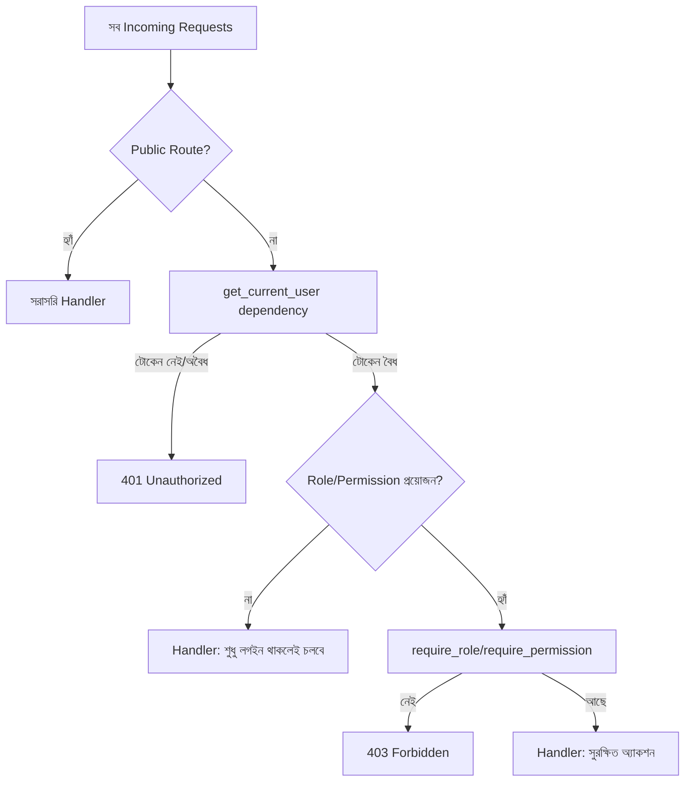

# ২৯.০৫. Securing API Routes with Authentication

এই মডিউলের চারটা লেসনে আমরা টুকরো টুকরো করে একটা সম্পূর্ণ auth সিস্টেমের প্রতিটা অংশ বানিয়েছি — টোকেন ইস্যু আর যাচাই (লেসন ১), role আর permission-এর মডেল (লেসন ২), সেই মডেল কার্যকর করার dependency (লেসন ৩), আর role/permission-এর ডেটাবেজ-ব্যাকড ম্যানেজমেন্ট (লেসন ৪)। এই শেষ লেসনে আমরা এই সবগুলো টুকরো একসাথে জোড়া দিয়ে দেখবো, একটা বাস্তব FastAPI অ্যাপ্লিকেশনে পুরো route protection strategy কেমন দেখতে হয় — আর কোন কোন সাধারণ ভুল এড়িয়ে চলা উচিত।

প্রথমে ভাবা যাক, একটা API-এর সব endpoint আসলে একই রকম সুরক্ষা চায় না। কিছু endpoint সম্পূর্ণ পাবলিক (যেমন `/login`, `/register`, অথবা একটা পাবলিক ব্লগের `/posts` লিস্ট)। কিছু endpoint শুধু "লগইন করা থাকলেই চলবে" (যেমন `/profile`)। আবার কিছু endpoint নির্দিষ্ট role বা permission দাবি করে (যেমন `/admin/users`)। এই তিন স্তরের differentiation স্পষ্টভাবে বোঝা এবং route সাজানোর সময় সচেতনভাবে প্রয়োগ করা — এটাই "securing routes"-এর মূল কাজ।



FastAPI-তে এই তিন স্তরকে আলাদা করার সবচেয়ে পরিষ্কার আর নিরাপদ উপায় হলো `APIRouter`-level-এ `dependencies=[...]` প্যারামিটার ব্যবহার করা, প্রতিটা রুটে আলাদা করে `Depends()` না লিখে:

```python
# main.py
from fastapi import FastAPI, Depends
from routes import public, profile, admin
from auth.dependencies import get_current_user
from auth.require_role import require_role
from auth.rbac import Role

app = FastAPI()

# স্তর ১: সম্পূর্ণ পাবলিক — কোনো dependency নেই
app.include_router(public.router, prefix="/api/public")

# স্তর ২: লগইন থাকলেই চলবে
app.include_router(
    profile.router,
    prefix="/api/profile",
    dependencies=[Depends(get_current_user)],
)

# স্তর ৩: নির্দিষ্ট role দরকার
app.include_router(
    admin.router,
    prefix="/api/admin",
    dependencies=[Depends(require_role(Role.ADMIN))],
)
```

এভাবে router-লেভেলে `dependencies=[...]` বসালে, প্রতিটা আলাদা রুটে বারবার `Depends(get_current_user)` লেখার দরকার পড়ে না — পুরো গ্রুপের জন্য একবারেই নিয়মটা বসানো হয়ে যায়। তবে সতর্ক থাকা দরকার, `admin.router`-এর ভেতরেও যদি কোনো sub-route শুধু "viewer"-ও দেখতে পারা উচিত এমন কিছু থাকে, সেখানে আলাদাভাবে সেই route-এ বাড়তি অনুমতি বসাতে হবে — router-লেভেল dependency একটা "বেসলাইন" মাত্র, চূড়ান্ত কথা না।

এখন কিছু বাস্তব প্রজেক্টে দেখা সাধারণ ভুল নিয়ে কথা বলা যাক, কারণ এগুলো জানাটা dependency লেখা জানার চেয়ে কম গুরুত্বপূর্ণ না।

প্রথম ভুল হলো **রুট প্রোটেক্ট করতে ভুলে যাওয়া** — অর্থাৎ একটা নতুন endpoint লেখার সময় `Depends(get_current_user)` বা `require_role(...)` যুক্ত করতে ভুলে যাওয়া। এটা এত বেশি ঘটে যে এটাকে সবচেয়ে সাধারণ ভুল বলা যায়, কারণ FastAPI ডিফল্টভাবে সবকিছু পাবলিক রাখে — কোনো route explicit dependency ঘোষণা না করলে সেটা যেকেউ কল করতে পারবে। একটা বড় প্রজেক্টে যেখানে শত শত endpoint আছে, নতুন প্রতিটাতে ম্যানুয়ালি `Depends()` যুক্ত করতে মনে রাখাটা একটা মানবিক ভুলের জায়গা — কোনো এক ব্যস্ত দিনে একজন ডেভেলপার হয়তো `/admin/export-all-users` বানালো, কিন্তু কপি-পেস্ট করা টেমপ্লেটে dependency অংশটা বাদ পড়ে গেলো, আর সেটা প্রোডাকশনে সম্পূর্ণ unprotected চলে গেলো। এই ঝুঁকি কমানোর সবচেয়ে নিরাপদ উপায় হলো **default-secure** নকশা — অর্থাৎ পুরো `APIRouter` বা পুরো অ্যাপ ডিফল্টভাবে protected রাখা (router-level `dependencies=[...]` দিয়ে, ঠিক উপরের উদাহরণের মতো), আর পাবলিক route-গুলোকে explicit ব্যতিক্রম হিসেবে আলাদা একটা router-এ (`dependencies=[]` সহ) রাখা। এভাবে "ভুলে যাওয়া" ডিফল্টভাবে বন্ধ হয়ে যায়, উল্টোটা বরং ইচ্ছাকৃতভাবে করতে হয়।

দ্বিতীয় ভুল হলো **client-side নির্ভরতা** — ফ্রন্টএন্ডে যদি "Delete" বাটনটা admin না হলে লুকিয়ে রাখা হয়, কিন্তু backend-এ কোনো role চেক dependency না থাকে, তাহলে যে কেউ সরাসরি API কল করে (Postman দিয়ে, যেটা আমরা Module 4-এ ব্যবহার শিখেছিলাম) ডিলিট করে ফেলতে পারবে। **Authorization সবসময় backend-এ enforce হতে হবে, frontend-এ শুধু ভালো UX দেখানোর জন্য UI লুকানো যায়, কিন্তু সেটা কখনও নিরাপত্তার একমাত্র স্তর হতে পারবে না।**

তৃতীয় ভুল হলো **object-level authorization ভুলে যাওয়া**। ধরো `/api/orders/{id}` একটা route, আর এতে `get_current_user` বসানো আছে — কিন্তু যদি কোনো ইউজার শুধু তার নিজের অর্ডার আইডি না দিয়ে অন্য কারো অর্ডার আইডি বসিয়ে দেয়, আর handler-এ owner চেক না থাকে, তাহলে সে অন্যের ডেটা দেখে ফেলতে পারবে — এটাকে বলে **Broken Object Level Authorization (BOLA)**, এবং এটা আধুনিক API-গুলোর অন্যতম সবচেয়ে সাধারণ দুর্বলতা। লেসন ৩-এ দেখানো `require_owner_or_admin` প্যাটার্নটা, আর লেসন ৪-এ আলোচিত IDOR-এর নুয়ান্সটা, ঠিক এই সমস্যা সমাধানের জন্যই বানানো হয়েছিল:

```python
# routes/orders.py
from fastapi import APIRouter, Depends, HTTPException, status
from auth.dependencies import get_current_user
from db.order_repository import find_order_by_id

router = APIRouter()


@router.get("/orders/{order_id}")
async def get_order(order_id: int, current_user: dict = Depends(get_current_user)):
    order = await find_order_by_id(order_id)
    if not order:
        raise HTTPException(status_code=status.HTTP_404_NOT_FOUND, detail="পাওয়া যায়নি")

    # শুধু authentication যথেষ্ট না — ownership যাচাই বাধ্যতামূলক
    if order.user_id != int(current_user["sub"]) and current_user["role"] != "admin":
        raise HTTPException(status_code=status.HTTP_403_FORBIDDEN, detail="অনুমতি নেই")

    return order
```

চতুর্থ, এবং শেষ ভুল — **টোকেন revocation-এর কথা না ভাবা**। JWT stateless বলে সার্ভার নিজে থেকে জানে না কোনো টোকেন এখনো "বৈধ" আছে কিনা তার মেয়াদ শেষ হওয়ার আগেই — যেমন ইউজার লগ-আউট করলে, বা তার অ্যাকাউন্ট ব্যান করা হলে। এই সমস্যার সাধারণ সমাধান একটা ছোট **blocklist** (সাধারণত Redis-এ, দ্রুত lookup-এর জন্য) রাখা, যেখানে revoke করা টোকেনের id (jti) জমা থাকে, আর `get_current_user` dependency প্রতিবার সেই blocklist-ও চেক করে।

এই পাঁচটা লেসন মিলিয়ে আমরা এখন FastAPI-তে একটা সম্পূর্ণ, স্তরবিন্যস্ত authentication ও authorization ব্যবস্থা কীভাবে দাঁড় করাতে হয় তা শিখে ফেললাম — টোকেন ইস্যু থেকে শুরু করে fine-grained permission আর object-level সুরক্ষা পর্যন্ত। কিন্তু "কে ভেতরে ঢুকতে পারবে" প্রশ্নের উত্তর দেওয়াটা নিরাপত্তার শুধু একটা অংশ। এখনো বাকি আছে আরও বড় প্রশ্ন — যে ইউজার বৈধভাবে ভেতরে ঢুকেছে, সেও কি তোমার API-কে ক্ষতিগ্রস্ত করতে পারে ভুল ইনপুট দিয়ে, ক্রস-সাইট আক্রমণ দিয়ে, বা তোমার সার্ভারকে অতিরিক্ত রিকোয়েস্টে ডুবিয়ে দিয়ে? সেই বিস্তৃত প্রশ্নের উত্তর নিয়েই শুরু হচ্ছে পরবর্তী মডিউল — Module 30: API Security।
