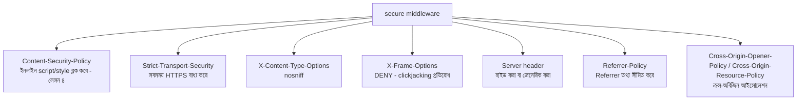

# ৩০.০৬. Enhanced Security Headers with the `secure` Library

গত চারটা লেসনে আমরা একের পর এক নিরাপত্তা header আর মিডলওয়্যার হাতে-কলমে লিখেছি — CORS-এর পাশাপাশি `X-Content-Type-Options`, `X-Frame-Options`, `Strict-Transport-Security`, `Content-Security-Policy`, আর cookie-র `httponly`/`samesite` flag। এই প্রতিটাই আলাদা আলাদাভাবে গুরুত্বপূর্ণ, কিন্তু বাস্তব প্রজেক্টে এতগুলো header হাতে মনে রেখে, সঠিক মান দিয়ে, প্রতিটা প্রজেক্টে নতুন করে বসানো — এটা ভুল হওয়ার একটা বড় সুযোগ তৈরি করে। Node.js জগতে এই কাজটা করে **Helmet.js**; Python/FastAPI জগতে সবচেয়ে পরিচিত সমতুল্য টুল হলো **`secure`** লাইব্রেরি। এই লেসনে আমরা দেখবো এটা কীভাবে কাজ করে, আর প্রয়োজনে নিজের একটা কাস্টম security-headers middleware কীভাবে লিখতে হয় (Helmet-এর মতো কোনো লাইব্রেরি ছাড়াই)।

`secure`-এর পেছনের দর্শনটা Helmet-এর মতোই — এটা একটামাত্র "জাদু" মিডলওয়্যার না, বরং কয়েকটা ভালোভাবে বাছাই করা security header-এর একটা সংকলন (bundle), যেটা এক লাইনে বসানো যায়। এই গঠনটা বোঝা গুরুত্বপূর্ণ, কারণ এতে বোঝা যায় এই লাইব্রেরি "জাদু" কিছু করছে না — বরং আমরা যা এতক্ষণ হাতে লিখেছি, সেটাই সুসংগঠিতভাবে, ভালো ডিফল্ট সহ প্যাকেজ করা।

```bash
pip install secure
```

```python
# main.py
from fastapi import FastAPI, Request
from secure import Secure

app = FastAPI()
secure_headers = Secure.with_default_headers()

@app.middleware("http")
async def set_secure_headers(request: Request, call_next):
    response = await call_next(request)
    secure_headers.framework.fastapi(response)
    return response
```

এই মিডলওয়্যারটা ভেতরে ভেতরে প্রায় ডজনখানেক আলাদা header একসাথে সক্রিয় করে দেয়। চলো একে একে দেখি এগুলো কী করে, যাতে ডিফল্ট ব্যবহার করলেও তুমি জানো ঠিক কী ঘটছে।



**`Content-Security-Policy`** ঠিক সেই CSP header বসায় যা আমরা XSS-এর লেসনে (লেসন ৪) নিজে হাতে লিখেছিলাম — ব্রাউজারকে নির্দেশ দেয় কোন উৎস থেকে script, style, image লোড করা নিরাপদ। **`Strict-Transport-Security`** (HSTS) ব্রাউজারকে মনে করিয়ে রাখতে বলে যে এই ডোমেইনে ভবিষ্যতে সবসময় HTTPS ব্যবহার করতে হবে, এমনকি ইউজার ভুলে `http://` টাইপ করলেও। **`X-Content-Type-Options: nosniff`** ব্রাউজারকে বাধা দেয় response-এর content-type অনুমান করতে — এটা গুরুত্বপূর্ণ কারণ ভুল অনুমান কখনো কখনো একটা নিরীহ ফাইলকে script হিসেবে execute করিয়ে ফেলতে পারে। **`X-Frame-Options: DENY`** নিশ্চিত করে তোমার পেজ অন্য কোনো সাইটের `<iframe>`-এর ভেতরে লুকিয়ে বসিয়ে ইউজারকে প্রতারণা করা (clickjacking) যাবে না। FastAPI-এর `Server` header-এ ডিফল্টভাবে `uvicorn` লেখা থাকে — সেটাও লুকিয়ে বা জেনেরিক করে রাখা ভালো অভ্যাস, যাতে আক্রমণকারী সহজে বুঝতে না পারে তুমি ঠিক কোন ফ্রেমওয়ার্ক/সার্ভার ব্যবহার করছো — আক্রমণের পরিধি কমানোর একটা ছোট কিন্তু কার্যকর কৌশল, যাকে বলে **security through obscurity**-এর একটা সহায়ক (কখনো একমাত্র নয়) স্তর।

`secure`-এর প্রতিটা header আলাদাভাবেও কনফিগার করা যায়, যখন ডিফল্ট মান তোমার প্রজেক্টের জন্য যথেষ্ট না। ধরো তোমার একটা প্রজেক্টে third-party ফন্ট বা ইমেজ CDN থেকে আসছে — ডিফল্ট কড়া CSP সেগুলো ব্লক করে দেবে, তাই নির্দিষ্ট উৎস অনুমতি দিতে হয়:

```python
from secure import Secure, ContentSecurityPolicy, StrictTransportSecurity

csp = (
    ContentSecurityPolicy()
    .default_src("'self'")
    .script_src("'self'")
    .style_src("'self'", "https://fonts.googleapis.com")
    .font_src("'self'", "https://fonts.gstatic.com")
    .img_src("'self'", "https://cdn.myapp.com", "data:")
)

hsts = StrictTransportSecurity().max_age(63072000).include_subdomains().preload()

secure_headers = Secure(csp=csp, hsts=hsts)
```

এখানে গুরুত্বপূর্ণ একটা শিক্ষা লুকিয়ে আছে — এই ধরনের লাইব্রেরি ব্যবহার করলেও নিরাপত্তা "স্বয়ংক্রিয়" হয়ে যায় না, বরং এটা তোমাকে একটা ভালো, নিরাপদ ডিফল্ট থেকে শুরু করতে দেয়, যেটা তোমার নির্দিষ্ট প্রজেক্টের প্রয়োজন অনুযায়ী সচেতনভাবে সামঞ্জস্য করতে হয়। ডিফল্ট CSP অনেক সময় বাস্তব প্রজেক্টে কিছু জিনিস ভেঙে দেয় (যেমন কোনো inline script ব্যবহার করলে) — তখন সমাধান হওয়া উচিত directive ঠিকঠাক কনফিগার করা, CSP পুরোপুরি বন্ধ করে দেওয়া না। একটা সাধারণ ভুল, যা প্রোডাকশনে বহু টিম করে ফেলে — CSP নিয়ে dev environment-এ ঝামেলা হলে পুরো middleware কমেন্ট করে ফেলে দেওয়া, আর সেটা কখনো আর ফিরে বসানো হয় না।

এই security-headers মিডলওয়্যারটাকে middleware চেইনে ঠিক কোথায় বসানো উচিত, তা নিয়েও একটা ভালো অভ্যাস আছে — এটা সবচেয়ে আগে বসানো উচিত, CORS মিডলওয়্যারের ঠিক আগে বা পরে, যাতে প্রতিটা response (এরর হলেও) নিরাপত্তা header পায়:

```python
from fastapi import FastAPI
from fastapi.middleware.cors import CORSMiddleware

app = FastAPI()

app.middleware("http")(set_secure_headers)
app.add_middleware(CORSMiddleware, allow_origins=allowed_origins, allow_credentials=True)

app.include_router(public_router, prefix="/api/public")
app.include_router(profile_router, prefix="/api/profile", dependencies=[Depends(authenticate)])
app.include_router(
    admin_router,
    prefix="/api/admin",
    dependencies=[Depends(authenticate), Depends(require_role("admin"))],
)
```

FastAPI-এর middleware রেজিস্ট্রেশনের একটা লক্ষণীয় আচরণ — যেভাবে middleware যুক্ত করা হয়, request প্রসেসিং-এ সেগুলো ঠিক সেই ক্রম উল্টো দিকেও কাজ করতে পারে (LIFO-এর মতো), তাই ঠিক কোন middleware কোন ক্রমে বসছে তা প্রজেক্ট বড় হওয়ার সাথে সাথে পরীক্ষা করে নেওয়া ভালো অভ্যাস, ধরে নেওয়া উচিত না।

`secure` লাইব্রেরিটা আমাদের ব্রাউজার-লেভেল আর header-লেভেল সুরক্ষা প্রায় স্বয়ংক্রিয় করে দিয়েছে। কিন্তু এখনো একটা গুরুত্বপূর্ণ প্রশ্ন বাকি — সার্ভার নিজে কীভাবে অতিরিক্ত ট্র্যাফিক, ভুল ইনপুট, আর সাধারণ অপব্যবহারের বিরুদ্ধে সুরক্ষিত থাকবে? এই মডিউলের শেষ লেসনে আমরা rate limiting, input validation, আর আরও কিছু Python/FastAPI API নিরাপত্তার সাধারণ সেরা অভ্যাস নিয়ে সবকিছু একসাথে গুছিয়ে নেবো।
