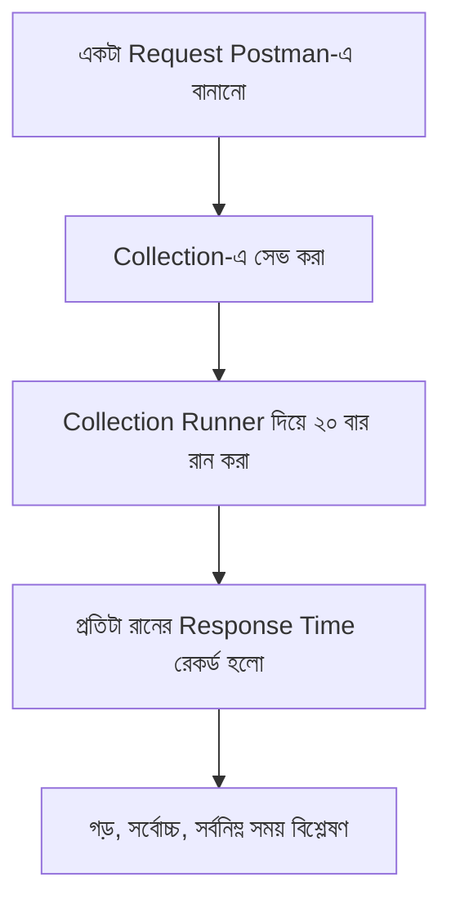

# ৩১.০২. Using Postman for API Testing and Performance Monitoring

Module 4-এ আমরা প্রথম Postman/Thunder Client-এর পরিচয় পেয়েছিলাম — তখন সেটাকে শুধু একটা "রিকোয়েস্ট পাঠানোর টুল" হিসেবে ব্যবহার করেছিলাম, GET/POST রিকোয়েস্ট টেস্ট করার জন্য। কিন্তু Postman আসলে তার চেয়ে অনেক বেশি কিছু করতে পারে — এটার ভেতরেই আছে response time মাপা, automated test script লেখা, আর এমনকি বারবার একই রিকোয়েস্ট চালিয়ে সাধারণ performance monitoring করার সুবিধা।

## Response সময়ের দিকে চোখ রাখা

যখনই তুমি Postman-এ একটা রিকোয়েস্ট পাঠাও, response আসার পর ডান দিকে একটা সংখ্যা দেখায়, যেমন `245 ms` — এটাই সেই রিকোয়েস্টের round-trip time, মানে তোমার কম্পিউটার থেকে রিকোয়েস্ট বের হয়ে সার্ভারে গিয়ে জবাব নিয়ে ফিরে আসতে যে সময় লাগলো। এই একটা সংখ্যা অনেক তথ্য দেয়, কিন্তু একবারের রিডিং দিয়ে সিদ্ধান্ত নেয়া বিপজ্জনক — নেটওয়ার্কের কারণে একবার ৫০ms লাগতে পারে, আবার একই রিকোয়েস্ট পরের বার ৩০০ms লাগতে পারে। তাই আমরা Postman-এর **Collection Runner** ব্যবহার করে একই রিকোয়েস্ট বহুবার চালিয়ে গড় (average) সময় বের করবো।



## Postman Test Script দিয়ে Response Time যাচাই করা

Postman-এর প্রতিটা রিকোয়েস্টের একটা "Tests" ট্যাব আছে, যেখানে আমরা JavaScript-এ ছোট assertion লিখতে পারি। ধরো আমরা চাই আমাদের FastAPI `/api/products` endpoint সবসময় ৫০০ মিলিসেকেন্ডের মধ্যে জবাব দিক — এটা আমরা কোড দিয়ে যাচাই করতে পারি:

```js
// Postman-এর "Tests" ট্যাবে লেখা কোড
pm.test("Response time ৫০০ms-এর কম হতে হবে", function () {
    pm.expect(pm.response.responseTime).to.be.below(500);
});

pm.test("Status code 200 হতে হবে", function () {
    pm.response.to.have.status(200);
});

pm.test("Response-এ data array আছে", function () {
    const jsonData = pm.response.json();
    pm.expect(jsonData.data).to.be.an('array');
});
```

এই স্ক্রিপ্টটা প্রতিবার রিকোয়েস্ট চালানোর পর স্বয়ংক্রিয়ভাবে চেক করবে — যদি কখনো response time ৫০০ms পার হয়ে যায়, Postman লাল রঙে ফেইলড টেস্ট দেখাবে। এটা একটা early warning system-এর মতো কাজ করে — প্রোডাকশনে যাওয়ার আগেই তুমি টের পাবে কোন endpoint স্লো হয়ে যাচ্ছে।

## Postman Monitor দিয়ে নিয়মিত পারফরম্যান্স চেক

Postman-এর একটা ফিচার আছে যাকে বলে **Monitor** — এটা তোমার নির্দিষ্ট করা Collection-কে নির্দিষ্ট সময় পরপর (যেমন প্রতি ঘণ্টায়) স্বয়ংক্রিয়ভাবে চালায় এবং রেজাল্ট ট্র্যাক করে। এভাবে তুমি সময়ের সাথে সাথে দেখতে পারো তোমার API ধীর হয়ে যাচ্ছে কিনা, বা কোথাও ফেইল করছে কিনা — অনেকটা ডাক্তার যেমন রোগীর রক্তচাপ প্রতিদিন মেপে ট্রেন্ড দেখেন, তেমনই।

## Postman-এর সীমাবদ্ধতা — কেন কোড দিয়েও টেস্ট লেখা দরকার

Postman খুবই ভালো একটা টুল **manual আর exploratory** টেস্টিংয়ের জন্য — একটা নতুন endpoint বানানোর পর হাতে-কলমে চেক করা, বা কারো সাথে API demo করা। কিন্তু বাস্তব প্রজেক্টে একটা বড় সমস্যা আছে: Postman collection সাধারণত কোড রিপোজিটরির বাইরে থাকে (বা আলাদাভাবে export/sync করতে হয়), CI/CD pipeline-এ চালানো একটু ঝামেলার, আর টেস্ট লজিক JavaScript-এ লেখা হয় যখন তোমার আসল অ্যাপ্লিকেশন Python-এ। এই কারণেই প্রফেশনাল FastAPI প্রজেক্টে **pytest + httpx** ব্যবহার করা হয় automated regression testing-এর মূল টুল হিসেবে — Postman বাতিল হয়ে যায় না, বরং দুটো টুল দুই কাজে ব্যবহৃত হয়।

FastAPI-এর নিজস্ব ডকুমেন্টেশনই `TestClient` (যা `httpx`-এর উপর ভিত্তি করে বানানো) সুপারিশ করে। চলো একই `/api/products` endpoint-এর জন্য একটা pytest টেস্ট লিখি:

```python
# test_products.py
import pytest
from httpx import AsyncClient, ASGITransport
from main import app


@pytest.mark.asyncio
async def test_get_products_response_time_and_shape():
    transport = ASGITransport(app=app)
    async with AsyncClient(transport=transport, base_url="http://test") as client:
        response = await client.get("/api/products")

    assert response.status_code == 200
    data = response.json()
    assert isinstance(data["data"], list)
```

লক্ষ্য করো, এখানে আমরা `ASGITransport` ব্যবহার করছি — এটা মানে হলো, টেস্টের সময় কোনো আসল সার্ভার (uvicorn) চালু করার দরকার নেই, `httpx` সরাসরি FastAPI অ্যাপের ভেতরেই রিকোয়েস্ট পাঠায় ইন-মেমরিতে। এটা টেস্ট চালানোকে অনেক দ্রুত করে, আর এই টেস্ট ফাইলটা তোমার প্রজেক্টেই থাকে, তাই `git commit` হয়, PR review-তে দেখা যায়, এবং CI pipeline-এ প্রতিটা push-এর সাথে স্বয়ংক্রিয়ভাবে চলে — যা Postman collection দিয়ে সহজে করা যায় না।

**একটা কমন ভুল** — অনেকে pytest টেস্টে `response.elapsed`-এর উপর ভিত্তি করে কড়া assertion বসিয়ে দেয় (যেমন `assert response.elapsed.total_seconds() < 0.1`)। সমস্যা হলো CI সার্ভার প্রায়ই শেয়ার্ড, ধীরগতির মেশিনে চলে, আর নেটওয়ার্ক/ইন-মেমরি latency ডেভ মেশিন আর CI-তে ভিন্ন হতে পারে। ফলে টেস্ট মাঝেমধ্যে "flaky" হয়ে ফেইল করে, যদিও কোডে আসলে কোনো সমস্যা নেই। এই কারণে response-time assertion CI-এর সাধারণ pytest সুইটে না রেখে, আলাদা load-testing টুল (JMeter, Locust) দিয়ে নির্দিষ্টভাবে করা ভালো — pytest দিয়ে আমরা মূলত correctness (status code, data shape) যাচাই করি, আর performance-এর কড়া threshold রাখি dedicated টুলে।

এই লেসনে আমরা শিখলাম Postman দিয়ে ম্যানুয়ালি অল্প কিছু রিকোয়েস্ট টেস্ট করা যায়, আর pytest + httpx দিয়ে automated regression suite বানানো যায়। কিন্তু বাস্তব লোড (হাজার হাজার একসাথে ইউজার) সিমুলেট করার জন্য আমাদের দরকার আরও শক্তিশালী একটা টুল — পরের লেসনে আমরা সেই টুল, Apache JMeter (আর তার Python-native বিকল্প Locust), নিয়ে কাজ শুরু করবো।
