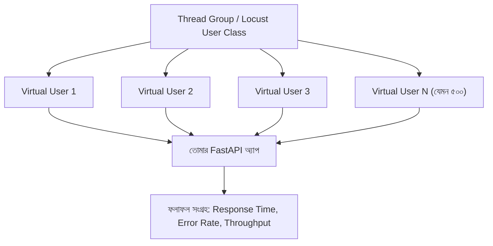

# ৩১.০৩. Load Testing with Apache JMeter (and Locust)

আগের লেসনে আমরা Postman আর pytest দিয়ে একটা করে রিকোয়েস্ট পাঠিয়ে সঠিকতা আর response time দেখেছি। কিন্তু বাস্তবে যখন তোমার অ্যাপ প্রোডাকশনে যাবে, একজন ইউজার না, হয়তো একসাথে হাজার জন ইউজার তোমার সার্ভারে রিকোয়েস্ট পাঠাবে। একজন ইউজারের জন্য যেই endpoint ২০০ms-এ জবাব দেয়, সেটাই ১০০০ জন একসাথে ব্যবহার করলে ১০ সেকেন্ড সময় নিতে পারে, অথবা সার্ভার একদমই সাড়া দেয়া বন্ধ করে দিতে পারে। এই "একসাথে অনেক ইউজার" পরিস্থিতি সিমুলেট করার জন্য দরকার একটা লোড টেস্টিং টুল — এখানে আমরা দুটো দেখবো: **Apache JMeter** (ভাষা-নিরপেক্ষ, ইন্ডাস্ট্রি-স্ট্যান্ডার্ড) আর **Locust** (Python-এ লেখা, তাই তোমার FastAPI স্ট্যাকের সাথে আরও স্বাভাবিকভাবে মেলে)।

## লোড টেস্টিং টুল আসলে কী করে

কল্পনা করো তুমি একটা ব্রিজের ভার-ধারণক্ষমতা পরীক্ষা করতে চাও। একজন মানুষ ব্রিজে হাঁটলে সেটা কিছুই বলে না — তোমাকে জানতে হবে ১০০, ৫০০, বা ১০০০ জন মানুষ একসাথে হাঁটলে ব্রিজ কেমন আচরণ করে। JMeter বা Locust ঠিক এই কাজটা করে সার্ভারের জন্য — এটা একসাথে অনেকগুলো "ভার্চুয়াল ইউজার" তৈরি করে, যারা সবাই মিলে তোমার API-তে রিকোয়েস্ট পাঠাতে থাকে, এবং ফলাফল (সময়, সফল/ব্যর্থ) রেকর্ড করে।



## Apache JMeter দিয়ে Test Plan বানানো

JMeter-এ কাজ করার সময় তুমি একটা "Test Plan" বানাও, যার তিনটা মূল অংশ থাকে। **Thread Group** ঠিক করে দেয় কতজন ভার্চুয়াল ইউজার থাকবে, তারা কত সময় ধরে ধীরে ধীরে যোগ হবে (ramp-up period), আর কতবার পুরো টেস্ট রিপিট হবে। **HTTP Request Sampler** বলে দেয় কোন endpoint-এ, কোন মেথডে (GET/POST) রিকোয়েস্ট যাবে — ঠিক Postman-এ যেমন তুমি একটা রিকোয়েস্ট বানাও, এখানেও তেমন। আর **Listener** হলো ফলাফল দেখার জায়গা — যেমন "View Results Tree" বা "Summary Report", যেখানে গ্রাফ আর সংখ্যা আকারে ফলাফল দেখা যায়।

ধরো আমরা আগের লেসনের `/api/products` endpoint-টাই টেস্ট করতে চাই। JMeter-এ আমরা এভাবে সেটআপ করবো:

- Thread Group: 500 users, ramp-up 10 seconds, loop count 5
- HTTP Request: `GET http://localhost:8000/api/products`
- Listener: Summary Report

এই সেটআপ চালালে JMeter একদম বাস্তব পরিস্থিতির মতো ১০ সেকেন্ডের মধ্যে ৫০০ জন ইউজার তৈরি করে, প্রত্যেকে ৫ বার করে রিকোয়েস্ট পাঠাবে — মোট ২৫০০টা রিকোয়েস্ট। JMeter টেস্ট শেষে একটা রিপোর্ট দেখাবে, যাতে থাকে **Average Response Time**, **Min/Max**, আর **Error %** (কতগুলো রিকোয়েস্ট ব্যর্থ হয়েছে বা টাইমআউট হয়েছে)।

## Locust — একটা Python-native বিকল্প

JMeter একটা GUI-ভিত্তিক টুল, আর তার Test Plan XML ফাইলে সেভ হয় — এটা শক্তিশালী, কিন্তু কোড-হিসেবে পড়া বা রিভিউ করা কষ্টকর। **Locust** একই কাজ করে, কিন্তু Test Plan-এর বদলে তুমি সাধারণ Python কোড লেখো, যেটা তোমার FastAPI প্রজেক্টের বাকি কোডের সাথে ভাষাগতভাবে মিলে যায়, একই `requirements.txt`-এ থাকতে পারে, আর `git diff`-এ সহজে রিভিউ করা যায়। ইনস্টল করা সহজ:

```bash
pip install locust
```

তারপর একটা `locustfile.py` লেখো:

```python
from locust import HttpUser, task, between


class ProductAPIUser(HttpUser):
    wait_time = between(1, 3)  # প্রতি রিকোয়েস্টের মাঝে ১-৩ সেকেন্ড অপেক্ষা, বাস্তব ইউজারের মতো

    @task
    def get_products(self):
        self.client.get("/api/products")
```

চালানোর জন্য:

```bash
locust -f locustfile.py --host=http://localhost:8000
```

এটা একটা ওয়েব ইন্টারফেস চালু করে (ডিফল্টে `http://localhost:8089`), যেখানে তুমি কতজন ভার্চুয়াল ইউজার (JMeter-এর Thread Group-এর মতো) আর ramp-up rate ঠিক করে দিতে পারো, আর রিয়েল-টাইমে response time-এর গ্রাফ দেখতে পারো। JMeter আর Locust দুটোই সমানভাবে গ্রহণযোগ্য — বড় এন্টারপ্রাইজ টিম, বা যেখানে একাধিক ভাষার ব্যাকএন্ড টেস্ট করতে হয়, সেখানে JMeter বেশি প্রচলিত; আর একটা Python-centric টিমে, যেখানে টেস্ট স্ক্রিপ্টও কোড-রিভিউয়ের অংশ হওয়া দরকার, Locust বেশি স্বাভাবিক পছন্দ।

## সার্ভার সাইড থেকে দেখা

লোড টেস্ট চলার সময় আমাদের FastAPI সার্ভার সাইডেও একটু নজর রাখা দরকার। Module 10-এ আমরা Process আর CPU নিয়ে শিখেছিলাম — এই লোড টেস্টের সময় `top` বা `htop` কমান্ড দিয়ে দেখা যায় uvicorn প্রসেসটা কতটুকু CPU/মেমরি ব্যবহার করছে:

```bash
# টার্মিনালে সার্ভার চলাকালীন আলাদা একটা টার্মিনালে
top -p $(pgrep -f "uvicorn")
```

যদি দেখো লোড বাড়ার সাথে সাথে CPU ১০০%-এ চলে যাচ্ছে আর response time হু হু করে বাড়ছে, তার মানে তোমার সার্ভার তার সীমায় পৌঁছে গেছে — এটাই সেই "breaking point" যেটা খুঁজে বের করাই load testing-এর আসল লক্ষ্য।

**একটা কমন ভুল** — `uvicorn main:app` ডিফল্টভাবে একটা মাত্র worker process নিয়ে চলে (single event loop)। লোড টেস্টে যদি দেখো CPU একটা কোরেই আটকে আছে (বাকি কোরগুলো অলস বসে আছে) আর response time বাড়ছে, তার মানে সমস্যা তোমার কোডে না-ও হতে পারে, বরং তুমি single-worker সেটআপে টেস্ট করছো। প্রোডাকশনে `uvicorn main:app --workers 4` বা Gunicorn-এর সাথে multiple worker চালানো হয় — লোড টেস্ট চালানোর আগে নিশ্চিত করো তুমি প্রোডাকশনের মতোই worker count নিয়ে টেস্ট করছো, নাহলে ফলাফল বিভ্রান্তিকর হবে।

এখন আমরা জানি লোড কীভাবে সিমুলেট করতে হয় আর ফলাফল কীভাবে দেখতে হয়। পরের লেসনে আমরা এই ফলাফলের সংখ্যাগুলো — response time-এর percentile, throughput ইত্যাদি — গভীরভাবে বিশ্লেষণ করা শিখবো।
