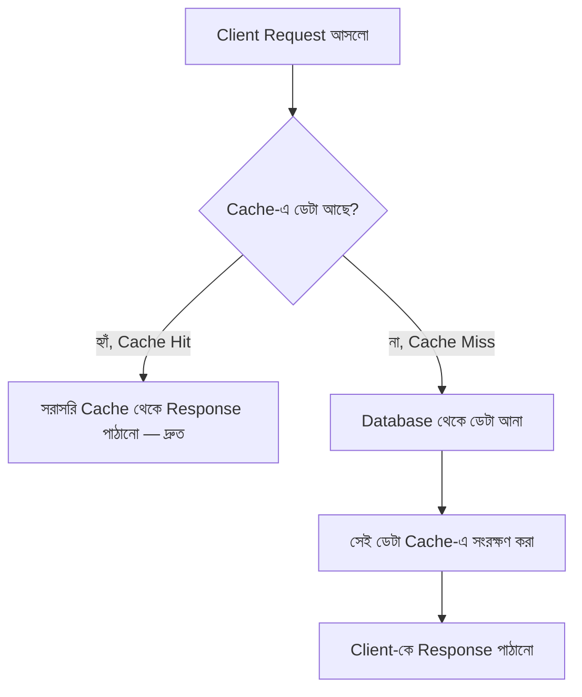

# ৩১.০৫. API Performance Optimization - Caching Strategies

আগের লেসনে আমরা মাপতে শিখেছি একটা API কতটা ধীর, আর কোথায় সমস্যা। এখন প্রশ্ন হলো — সমাধান কী? সবচেয়ে সহজ আর সবচেয়ে কার্যকর সমাধানগুলোর একটা হলো **caching** — একই উত্তর বারবার নতুন করে তৈরি না করে, একবার তৈরি করা উত্তর সংরক্ষণ করে রাখা, আর পরের বার সরাসরি সেটাই ফেরত দেয়া।

## Caching-এর মূল ধারণা: লাইব্রেরির উপমা

ধরো একটা লাইব্রেরিতে কেউ একটা বই খুঁজতে চাইলে, প্রতিবার পুরো গুদাম হাতড়ে বের করা লাগে — এটা ধীর। কিন্তু যদি সবচেয়ে বেশি চাওয়া বইগুলো লাইব্রেরিয়ানের ডেস্কের পাশে একটা ছোট শেলফে রাখা থাকে, তাহলে সেই বইগুলোর জন্য গুদামে যাওয়ারই দরকার হয় না — সরাসরি ডেস্ক থেকে দিয়ে দেয়া যায়। এই "ডেস্কের পাশের শেলফ"-ই হলো cache — দ্রুত অ্যাক্সেসযোগ্য একটা জায়গা, যেখানে ঘনঘন চাওয়া ডেটা আগে থেকেই তৈরি করে রাখা থাকে।

Module 21-এ আমরা ডেটাবেজ ক্যাশিং নিয়ে সংক্ষেপে কথা বলেছিলাম — এখন আমরা সেটাকে API লেভেলে প্রয়োগ করবো, বাস্তব কোড দিয়ে।



## In-Memory Cache: সবচেয়ে সহজ শুরু

সবচেয়ে সাধারণ ক্যাশ হলো একটা সাধারণ Python dict, যা সার্ভারের মেমরিতেই থাকে। চলো আগের মডিউলগুলোর `/api/products` endpoint-এ একটা সহজ ক্যাশ যোগ করি:

```python
import time
from fastapi import FastAPI

app = FastAPI()

cache: dict = {}
CACHE_TTL_SECONDS = 60  # ৬০ সেকেন্ড পর্যন্ত ক্যাশ বৈধ থাকবে


@app.get("/api/products")
async def get_products():
    cache_key = "all-products"
    cached = cache.get(cache_key)

    if cached and (time.monotonic() - cached["timestamp"]) < CACHE_TTL_SECONDS:
        print("Cache HIT — সরাসরি মেমরি থেকে পাঠানো হলো")
        return {"data": cached["data"], "source": "cache"}

    print("Cache MISS — ডেটাবেজ থেকে আনতে হচ্ছে")
    products = await get_products_from_db()
    cache[cache_key] = {"data": products, "timestamp": time.monotonic()}

    return {"data": products, "source": "database"}
```

এখানে লক্ষণীয় ব্যাপার হলো **TTL (Time To Live)** — আমরা ক্যাশকে চিরকাল বৈধ রাখছি না, ৬০ সেকেন্ড পর সেটা "বাসি" (stale) হয়ে যাচ্ছে আর নতুন করে ডেটাবেজ থেকে আনা হচ্ছে। এটা জরুরি, কারণ প্রোডাক্ট আপডেট হলে পুরনো ক্যাশ দেখানো ঠিক হবে না — caching-এর সবচেয়ে বড় challenge-ই হলো এই **cache invalidation** (কখন পুরনো ডেটা ফেলে দিতে হবে) ঠিক করা। কম্পিউটার সায়েন্সে একটা প্রচলিত রসিকতা আছে: "There are only two hard problems in computer science: cache invalidation, naming things, and off-by-one errors" — আর এটা রসিকতা হলেও পুরোপুরি মিথ্যা না। বাস্তবে বেশিরভাগ caching bug আসে TTL ভুল হিসাব করা থেকে না, বরং কখন cache-কে বাসি ধরতে হবে সেটা ভুল বোঝা থেকে।

## Redis: প্রোডাকশন-গ্রেড Cache (Async)

উপরের in-memory cache-এর একটা বড় সমস্যা আছে — যদি তোমার একাধিক সার্ভার ইনস্ট্যান্স চলে (যেমন লোড ব্যালান্সারের পেছনে, বা `uvicorn --workers 4` দিয়ে একাধিক worker process), প্রতিটা ইনস্ট্যান্সের নিজের আলাদা মেমরি থাকে, তাই ক্যাশ শেয়ার হয় না — একটা worker cache করলেও বাকিরা এখনো cache MISS দেখাবে। এই সমস্যা সমাধানের জন্য ব্যবহার হয় **Redis** — একটা আলাদা, দ্রুতগতির ডেটাবেজ যা শুধু key-value ডেটা মেমরিতে রাখার জন্য ডিজাইন করা। FastAPI যেহেতু async-first, তাই আমরা `redis.asyncio` ব্যবহার করি, যাতে Redis-এর সাথে যোগাযোগের সময় ইভেন্ট লুপ ব্লক না হয়:

```bash
pip install redis
```

```python
import json
import redis.asyncio as redis
from fastapi import FastAPI

app = FastAPI()
redis_client = redis.from_url("redis://localhost:6379")


@app.get("/api/products")
async def get_products():
    cache_key = "all-products"
    cached_data = await redis_client.get(cache_key)

    if cached_data:
        return {"data": json.loads(cached_data), "source": "redis-cache"}

    products = await get_products_from_db()
    await redis_client.setex(cache_key, 60, json.dumps(products))  # ৬০ সেকেন্ড TTL
    return {"data": products, "source": "database"}
```

এখানে `setex` মেথডের দ্বিতীয় প্যারামিটারই হলো TTL (সেকেন্ডে) — Redis নিজেই সময় শেষ হলে ডেটা মুছে ফেলে, আমাদের ম্যানুয়ালি timestamp চেক করতে হয় না। যেহেতু Redis একটা আলাদা প্রসেস (এমনকি আলাদা সার্ভারেও থাকতে পারে), তোমার সব FastAPI ইনস্ট্যান্স/worker একই ক্যাশ শেয়ার করতে পারে।

**stale-cache bug-এর একটা চিরচেনা উদাহরণ** — ধরো একজন অ্যাডমিন একটা প্রোডাক্টের দাম আপডেট করলো (একটা আলাদা `PUT /api/products/{id}` endpoint দিয়ে), কিন্তু সেই endpoint-এর কোডে `all-products` cache key ডিলিট করার কথা ভুলে যাওয়া হলো। পরের ৬০ সেকেন্ড ধরে (TTL শেষ না হওয়া পর্যন্ত) সব ইউজার পুরনো দাম দেখতে থাকবে — এটা এমন একটা bug যেটা "randomly" মনে হয়, কারণ কিছু ইউজার নতুন দাম দেখে (cache miss হলে), কিছু ইউজার পুরনো দাম দেখে (cache hit হলে), আর এই অসামঞ্জস্যতা ডিবাগ করা কষ্টকর। সঠিক প্র্যাক্টিস হলো — যেকোনো write operation-এর (create/update/delete) পর সংশ্লিষ্ট cache key-কে সাথে সাথেই `await redis_client.delete(cache_key)` দিয়ে invalidate করে দেয়া, TTL-এর উপর একা নির্ভর না করা।

Caching দিয়ে আমরা response time নাটকীয়ভাবে কমাতে পারি — কিন্তু কখন কতটা কাজ করলো, কোন request cache hit হলো আর কোনটা miss হলো, সেটা ট্র্যাক না করলে আমরা বুঝবোই না caching আসলে কাজ করছে কিনা। পরের লেসনে আমরা দেখবো কীভাবে টেস্টিং, লগিং, আর পারফরম্যান্স মনিটরিং — এই তিনটাকে একসাথে একটা সিস্টেমে বেঁধে ফেলা যায়।
