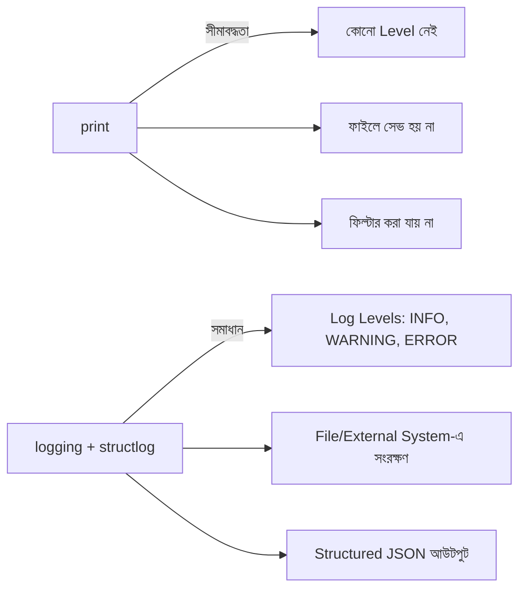

# ৩২.০১. Implementing Logging with Python `logging` and `structlog`

Module 31-এর শেষ লেসনে আমরা একটা সাধারণ `print()` দিয়ে logging middleware বানিয়েছিলাম, আর একটা প্রশ্ন রেখে গিয়েছিলাম — বাস্তব প্রোডাকশন অ্যাপ্লিকেশনে `print()` কেন যথেষ্ট না? এই লেসনে আমরা সেই ফাঁকটা পূরণ করবো Python-এর বিল্ট-ইন `logging` মডিউল আর `structlog` নামের একটা জনপ্রিয় structured logging লাইব্রেরি দিয়ে।

## `print()`-এর সীমাবদ্ধতা

`print()` ছোট স্ক্রিপ্টে ঠিক আছে, কিন্তু প্রোডাকশনে এর কয়েকটা বড় সমস্যা আছে। প্রথমত, এটা সব লগকে সমান গুরুত্ব দেয় — একটা সাধারণ তথ্য (info) আর একটা মারাত্মক এরর (error) দেখতে একই রকম, আলাদা করার উপায় নেই। দ্বিতীয়ত, এটা লগকে কোথাও সংরক্ষণ (persist) করে না — সার্ভার রিস্টার্ট হলে বা টার্মিনাল বন্ধ হলে সব লগ হারিয়ে যায়। তৃতীয়ত, `print()`-এর কোনো লেভেল-ভিত্তিক ফিল্টারিং নেই — প্রোডাকশনে debug লগ বন্ধ রেখে শুধু warning/error দেখতে চাইলে কোনো উপায় নেই, পুরো কোড থেকে হাতে খুঁজে মুছতে হবে। এই সমস্যাগুলো সমাধানের জন্যই তৈরি হয়েছে dedicated logging system।



## Python-এর বিল্ট-ইন `logging` মডিউল দিয়ে শুরু করা

Python-এর সাথেই আসে একটা পূর্ণাঙ্গ logging সিস্টেম, `logging` মডিউল — এটা ইনস্টল করার দরকার নেই, সরাসরি `import logging` করলেই ব্যবহার করা যায়। এটা নমনীয় (flexible), মানে তুমি কনফিগার করে ঠিক করতে পারো লগ কোথায় যাবে (কনসোলে, ফাইলে, নাকি দুই জায়গাতেই)।

```python
import logging

logging.basicConfig(
    level=logging.INFO,  # এই লেভেল বা তার চেয়ে গুরুত্বপূর্ণ লগই দেখাবে
    format="%(asctime)s %(levelname)s %(message)s",
    handlers=[
        logging.StreamHandler(),                     # টার্মিনালে দেখানো
        logging.FileHandler("combined.log"),          # সব লগ একসাথে ফাইলে
    ],
)

logger = logging.getLogger("order-api")

logger.info("সার্ভার শুরু হয়েছে")
logger.warning("Cache miss ঘটেছে /api/products-এ")
logger.error("ডেটাবেজ কানেকশন ব্যর্থ হয়েছে")
```

এখানে `handlers` হলো `logging`-এর মূল ধারণা — এটা বলে দেয় লগ কোথায় কোথায় পাঠানো হবে। চাইলে দুটো আলাদা `FileHandler` বসিয়ে `setLevel(logging.ERROR)` দিয়ে শুধু error-level লগ আলাদা ফাইলে পাঠানো যায় — এভাবে গুরুত্বপূর্ণ এরর আলাদা ফাইলে সহজে খুঁজে পাওয়া যায়, বাকি সব লগের মধ্যে হারিয়ে যায় না।

## `structlog`: Structured Output-এর জন্য ডিজাইন করা

বিল্ট-ইন `logging` দিয়ে টেক্সট লগ লেখা সহজ, কিন্তু প্রোডাকশনে আমরা চাই লগ যেন মেশিন-পড়ার-যোগ্য JSON হয় (কেন, সেটা পরের লেসনে বিস্তারিত দেখবো)। এই কাজটা সহজ করার জন্য **structlog** নামের লাইব্রেরিটা তৈরি হয়েছে — এটা `logging`-এর উপরেই কাজ করে, কিন্তু context data আর JSON ফরম্যাটিং হ্যান্ডেল করা অনেক সহজ করে দেয়।

```bash
pip install structlog
```

```python
import structlog

structlog.configure(
    processors=[
        structlog.processors.TimeStamper(fmt="iso"),
        structlog.processors.add_log_level,
        structlog.processors.JSONRenderer(),  # JSON আউটপুট
    ],
)

logger = structlog.get_logger()

logger.info("সার্ভার শুরু হয়েছে")
logger.warning("cache_miss", endpoint="/api/products")
logger.error("db_connection_failed", error="DB timeout")
```

এখানে `logger.warning("cache_miss", endpoint="/api/products")`-এর মতো কল করলে structlog স্বয়ংক্রিয়ভাবে একটা JSON লাইন তৈরি করে, যেখানে `endpoint` একটা আলাদা ফিল্ড হিসেবে থাকে — কোনো ম্যানুয়াল string formatting লাগে না। structlog-এর আউটপুট ডিফল্টভাবে raw JSON, যা মানুষের চোখে পড়তে একটু কঠিন — কিন্তু এটাই ইচ্ছাকৃত, কারণ ধরে নেয়া হয় এই লগ কোনো মেশিন (log aggregator) দিয়ে পড়া হবে, মানুষ দিয়ে না। ডেভেলপমেন্টে সুন্দর করে দেখতে চাইলে `structlog.dev.ConsoleRenderer()` প্রসেসর ব্যবহার করা যায়।

## কোনটা কখন বেছে নেবে

| বিবেচ্য বিষয় | বিল্ট-ইন `logging` | `structlog` |
|---|---|---|
| সেটআপ | কিছুই ইনস্টল করার দরকার নেই | আলাদা প্যাকেজ ইনস্টল করতে হয় |
| Structured/JSON আউটপুট | ম্যানুয়ালি কনফিগার করতে হয় | বিল্ট-ইন, সহজ |
| উপযুক্ত | ছোট স্ক্রিপ্ট, সাধারণ প্রয়োজন | প্রোডাকশন API, structured logging আবশ্যক |

দুটোই "log level" নামের একটা ধারণার উপর দাঁড়িয়ে আছে — DEBUG, INFO, WARNING, ERROR ইত্যাদি। পরের লেসনে আমরা এই level আর logging-এর গঠন (structure) নিয়ে আরও গভীরে যাবো, আর দেখবো কেন শুধু টেক্সট মেসেজ লেখার বদলে **structured logging** এত গুরুত্বপূর্ণ।
