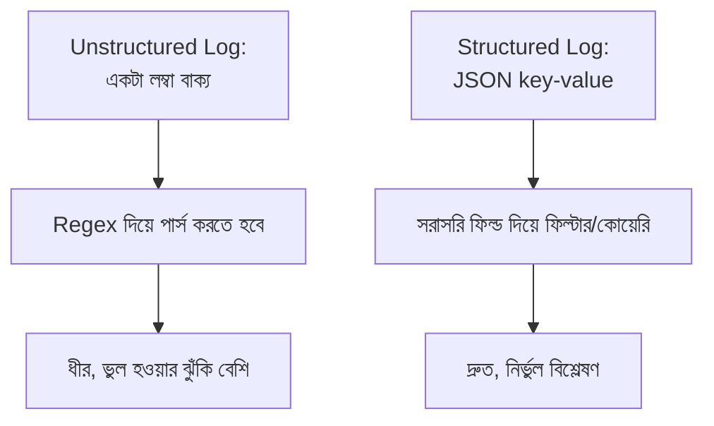

# ৩২.০২. Structured Logging Best Practices

আগের লেসনে আমরা `structlog` দিয়ে JSON ফরম্যাটে লগ লিখেছিলাম, কিন্তু কেন সরাসরি একটা সাধারণ বাক্য না লিখে JSON-এ লিখলাম, সেটা বিস্তারিত বলিনি। এই লেসনে আমরা বুঝবো **structured logging** কী, আর কেন এটা প্রোডাকশন সিস্টেমে প্রায় বাধ্যতামূলক।

## Unstructured বনাম Structured Log

ধরো তোমার লগ ফাইলে এরকম একটা লাইন আছে:

```
সার্ভার এ ইউজার ১২৩ /api/orders এ POST রিকোয়েস্ট পাঠিয়েছে, সময় লেগেছে ৩৪২ms, স্ট্যাটাস ৫০০
```

এটা মানুষের পড়তে সহজ, কিন্তু কল্পনা করো তোমার কাছে এমন ১০ লক্ষ লাইন আছে, আর তুমি জানতে চাও: "গত এক ঘণ্টায় কতগুলো POST /api/orders রিকোয়েস্ট ৫০০ স্ট্যাটাস দিয়ে ব্যর্থ হয়েছে, এবং তাদের গড় সময় কত?" এই টেক্সট থেকে এই তথ্য বের করতে তোমাকে জটিল regex লিখে প্রতিটা লাইন পার্স করতে হবে — ধীর, আর ভুল হওয়ার সম্ভাবনা বেশি। এই একই তথ্য যদি structured (JSON) আকারে থাকে, তাহলে সেটা সরাসরি ফিল্টার আর কোয়েরি করা যায়, ঠিক যেমন ডেটাবেজ টেবিলে কোয়েরি করা যায়:

```json
{
  "timestamp": "2026-08-08T10:15:32.120Z",
  "level": "error",
  "user_id": 123,
  "method": "POST",
  "path": "/api/orders",
  "status_code": 500,
  "duration_ms": 342,
  "event": "order_creation_failed"
}
```



## ভালো Structured Log-এর গঠন

একটা ভালো লগ এন্ট্রিতে সাধারণত এই ফিল্ডগুলো থাকা উচিত — timestamp (কখন ঘটলো), level (কতটা গুরুত্বপূর্ণ), event/message (মানুষের পড়ার জন্য সংক্ষিপ্ত বিবরণ), আর context (user_id, request_id, path-এর মতো প্রাসঙ্গিক ডেটা যা পরে ফিল্টার করতে কাজে লাগবে)। চলো `structlog` দিয়ে এই প্যাটার্ন অনুসরণ করে একটা reusable logger বানাই, যা এই মডিউলের বাকি লেসনগুলোতেও ব্যবহার করবো:

```python
# logger.py
import logging
import os
import structlog

structlog.configure(
    processors=[
        structlog.processors.TimeStamper(fmt="iso"),
        structlog.processors.add_log_level,
        structlog.processors.StackInfoRenderer(),
        structlog.processors.format_exc_info,  # Exception-এর stack trace ধরে রাখা
        structlog.processors.JSONRenderer(),
    ],
    wrapper_class=structlog.make_filtering_bound_logger(
        logging.getLevelName(os.getenv("LOG_LEVEL", "INFO"))
    ),
)

logger = structlog.get_logger(service="order-api")  # প্রতিটা লগে এই মেটাডেটা যোগ হবে
```

```python
# ব্যবহার — event name-এর সাথে context keyword argument পাঠানো
from logger import logger

logger.info("order_created", user_id=123, order_id="ORD-9981", amount=1500)

logger.error(
    "order_creation_failed",
    user_id=123,
    error_code="PAYMENT_DECLINED",
    duration_ms=342,
)
```

লক্ষ করো, প্রথম আর্গুমেন্টে শুধু একটা সংক্ষিপ্ত, স্থির **event name** রাখছি (`"order_created"`), আর বাকি সব ডাইনামিক তথ্য (user_id, order_id) আলাদা keyword argument হিসেবে পাঠাচ্ছি। এটাই মূল নিয়ম — event name-এর ভেতরে ভ্যারিয়েবল বসিয়ে বাক্য বানানো (`f"Order {order_id} created for user {user_id}"`) এড়িয়ে চলা উচিত, কারণ তাহলে প্রতিটা লগের message ভিন্ন ভিন্ন হয়ে যায়, আর একই ধরনের ঘটনাগুলো গ্রুপ করে গণনা করা কঠিন হয়ে পড়ে।

## Log Level সঠিকভাবে বেছে নেয়া

Module 31-এ আমরা দেখেছিলাম স্লো রিকোয়েস্ট আলাদা করে চিহ্নিত করতে হয়। Log level ব্যবহার করে আমরা এই গুরুত্বের ভিত্তিতে লগকে ভাগ করতে পারি:

- **error** — সিস্টেম ভেঙে গেছে বা কাজ সম্পূর্ণ করতে পারেনি (পেমেন্ট ব্যর্থ, ডেটাবেজ কানেকশন হারানো)
- **warning** — সমস্যা এখনো হয়নি, কিন্তু সতর্ক হওয়া দরকার (cache miss বেশি হচ্ছে, response time threshold ছাড়িয়ে গেছে)
- **info** — স্বাভাবিক, গুরুত্বপূর্ণ ঘটনা (সার্ভার চালু হলো, নতুন অর্ডার তৈরি হলো)
- **debug** — ডেভেলপমেন্টের সময় বিস্তারিত ট্রেসিং-এর জন্য, প্রোডাকশনে সাধারণত বন্ধ রাখা হয়

প্রোডাকশনে `LOG_LEVEL=INFO` সেট করে রাখলে debug লগগুলো স্বয়ংক্রিয়ভাবে বাদ পড়ে যায় — এভাবে দরকারি সময়ে (ডিবাগিং করার সময়) `LOG_LEVEL=DEBUG` সেট করে বিস্তারিত লগ চালু করা যায়, আবার স্বাভাবিক সময়ে অপ্রয়োজনীয় noise কমানো যায়।

## প্রোডাকশনের সবচেয়ে সাধারণ ভুল: স্পর্শকাতর ডেটা লগ করা ফেলা

Structured logging-এ একটা খুবই বাস্তব আর বিপজ্জনক ভুল হলো — অজান্তেই পাসওয়ার্ড, টোকেন, বা অন্য স্পর্শকাতর তথ্য লগে ঢুকিয়ে দেয়া। ধরো তুমি ডিবাগিং সহজ করার জন্য পুরো request body-টাই context হিসেবে লগ করে দিলে:

```python
# বিপজ্জনক — এটা করা উচিত না
logger.info("login_attempt", **request_body)
# যদি request_body = {"email": "...", "password": "secret123"}
# তাহলে password সরাসরি লগ ফাইলে চলে যাবে!
```

এটা সমস্যা কারণ, এক, লগ ফাইল সাধারণত অনেক মানুষ (ডেভেলপার, DevOps, এমনকি third-party log aggregator সার্ভিস) দেখতে পারে, যেখানে raw password/token দেখার কোনো প্রয়োজন নেই। দুই, লগ সাধারণত অনেকদিন ধরে সংরক্ষিত থাকে (পরের লেসনে দেখবো), তাই একটা পুরনো লগ ফাইল লিক হলে সেই পুরনো পাসওয়ার্ডও এক্সপোজ হয়ে যায়। এর সমাধান হলো লগ করার আগে স্পর্শকাতর ফিল্ড explicitly বাদ দেয়া বা মাস্ক করা:

```python
SENSITIVE_KEYS = {"password", "token", "authorization", "credit_card"}

def redact(data: dict) -> dict:
    return {
        k: ("***REDACTED***" if k.lower() in SENSITIVE_KEYS else v)
        for k, v in data.items()
    }

logger.info("login_attempt", **redact(request_body))
```

অনেক প্রোডাকশন সিস্টেমে এই redaction একটা কেন্দ্রীয় processor হিসেবে বসানো হয় (যেমন structlog-এর processor chain-এ), যাতে ডেভেলপার ভুলবশত কোনো নতুন sensitive field যোগ করলেও সেটা স্বয়ংক্রিয়ভাবে মাস্ক হয়ে যায় — একটা একটা `logger.info()` কলে মনে রেখে redact করার উপর নির্ভর করা ঝুঁকিপূর্ণ।

এখন আমাদের কাছে একটা structured logger তৈরি আছে। পরের লেসনে আমরা দেখবো কীভাবে এই logger-কে একটা FastAPI middleware-এর মধ্যে বসিয়ে প্রতিটা HTTP request আর response স্বয়ংক্রিয়ভাবে লগ করা যায়।
