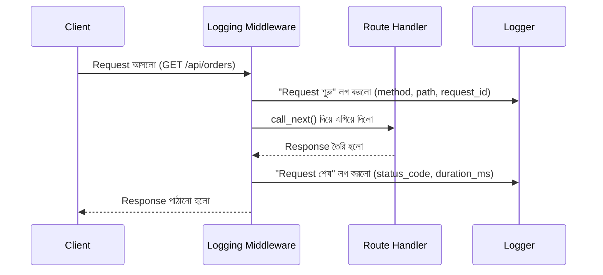

# ৩২.০৩. Request and Response Logging Middleware

আগের লেসনে আমরা একটা structured logger বানিয়েছিলাম, কিন্তু সেটা এখনো ম্যানুয়ালি প্রতিটা route-এ বসিয়ে ব্যবহার করতে হচ্ছে। Module 31-এর শেষ লেসনে আমরা একটা ছোট performance logging middleware-এর আভাসও পেয়েছিলাম। এই লেসনে আমরা সেই দুটো ধারণা একসাথে করে একটা সম্পূর্ণ, প্রফেশনাল request/response logging middleware বানাবো, যা প্রতিটা রিকোয়েস্টের জন্য স্বয়ংক্রিয়ভাবে চলে — আলাদা করে প্রতিটা route-এ কিছু লিখতে হয় না।

## কেন Middleware-এই এই কাজ করা উচিত

FastAPI-তে middleware হলো এমন কোড যা প্রতিটা রিকোয়েস্টের পথে বসে, route handler-এ পৌঁছানোর আগে বা response পাঠানোর সময়/পরে কিছু কাজ করে। Logging-এর জন্য এটা আদর্শ জায়গা, কারণ তুমি একবার middleware লিখলে সেটা তোমার অ্যাপ্লিকেশনের প্রতিটা endpoint-এর জন্য কাজ করবে — প্রতিটা route handler-এ আলাদা করে `logger.info(...)` লেখার দরকার নেই।



## সম্পূর্ণ Middleware কোড

চলো আগের লেসনের logger ব্যবহার করে একটা middleware বানাই, যাতে প্রতিটা রিকোয়েস্টের একটা ইউনিক আইডি (**request_id**) থাকে — এটা খুবই গুরুত্বপূর্ণ, কারণ একটা রিকোয়েস্ট যদি একাধিক লগ লাইন তৈরি করে (শুরু, মাঝে কিছু ঘটনা, শেষ), তাহলে request_id দিয়ে সেই লাইনগুলোকে একসাথে সাজানো যায়।

```python
# middleware/request_logger.py
import time
import uuid

from fastapi import FastAPI, Request
from logger import logger


def add_request_logging(app: FastAPI) -> None:
    @app.middleware("http")
    async def request_logger(request: Request, call_next):
        request_id = str(uuid.uuid4())  # প্রতিটা রিকোয়েস্টের জন্য ইউনিক আইডি
        request.state.request_id = request_id
        start = time.perf_counter()

        logger.info(
            "request_started",
            request_id=request_id,
            method=request.method,
            path=request.url.path,
            client_ip=request.client.host if request.client else None,
        )

        response = await call_next(request)

        duration_ms = round((time.perf_counter() - start) * 1000, 2)
        log_level = (
            "error" if response.status_code >= 500
            else "warning" if response.status_code >= 400
            else "info"
        )

        getattr(logger, log_level)(
            "request_completed",
            request_id=request_id,
            method=request.method,
            path=request.url.path,
            status_code=response.status_code,
            duration_ms=duration_ms,
        )

        response.headers["X-Request-ID"] = request_id
        return response
```

এখানে একটা গুরুত্বপূর্ণ প্যাটার্ন দেখো — আমরা `response.status_code` অনুযায়ী log level বদলে দিচ্ছি। ৫০০-এর বেশি স্ট্যাটাস কোড (সার্ভার এরর) হলে `error` লেভেলে, ৪০০-এর বেশি (ক্লায়েন্ট এরর, যেমন 404 বা 401) হলে `warning` লেভেলে, আর বাকি সব স্বাভাবিক ক্ষেত্রে `info` লেভেলে লগ হচ্ছে। এভাবে পরে যখন আমরা শুধু error লগ ফিল্টার করে দেখতে চাইবো, শুধু আসল সমস্যাগুলোই দেখা যাবে।

## অ্যাপ্লিকেশনে বসানো

```python
from fastapi import FastAPI
from middleware.request_logger import add_request_logging

app = FastAPI()
add_request_logging(app)  # সবার আগে রেজিস্টার করাই ভালো, যাতে সব রিকোয়েস্ট এর ভেতর দিয়ে যায়


@app.get("/api/orders")
async def get_orders(request: Request):
    # request.state.request_id এখানেও অ্যাক্সেস করা যায়, দরকার হলে বিজনেস লজিকের লগেও ব্যবহার করা যায়
    return {"data": []}
```

FastAPI-তে middleware রেজিস্টার করার ক্রম গুরুত্বপূর্ণ — যে middleware সবার আগে যুক্ত হয়, সেটা রিকোয়েস্টের ক্ষেত্রে সবার বাইরের স্তরে থাকে, তাই logging middleware প্রথমে যুক্ত না করলে অন্য middleware-এ ঘটা কিছু সমস্যা লগ হবে না।

## রিকোয়েস্ট/রেসপন্স বডি লগ করা নিয়ে সতর্কতা

একটা লোভনীয় কিন্তু বিপজ্জনক ব্যাপার হলো পুরো request বা response body লগ করে ফেলা (`await request.body()` দিয়ে সহজেই এটা করা যায়)। এটা এড়িয়ে চলা উচিত কয়েকটা কারণে:

- **স্পর্শকাতর তথ্য**: login/signup-এর মতো এন্ডপয়েন্টে request body-তে পাসওয়ার্ড বা টোকেন থাকে; response body-তে থাকতে পারে ব্যক্তিগত তথ্য (email, ঠিকানা, payment info)। পুরো body raw ভাবে লগ করলে এই স্পর্শকাতর ডেটা লগ ফাইলে স্থায়ীভাবে থেকে যায় — আগের লেসনে যে redaction সমস্যাটা দেখেছি, এখানেও ঠিক সেটাই ঘটে।
- **সাইজ সমস্যা**: ফাইল আপলোড এন্ডপয়েন্টে request body কয়েক মেগাবাইট, এমনকি গিগাবাইটও হতে পারে। পুরো body লগ করলে একটা মাত্র রিকোয়েস্ট লগ ফাইলকে বিশালাকার করে ফেলতে পারে, আর `await request.body()` কল করলে stream-ভিত্তিক ফাইল আপলোডের পুরো সুবিধাটাই নষ্ট হয়ে যায় (পুরো ফাইল মেমোরিতে লোড হয়ে যায়)।

যদি ডিবাগিংয়ের জন্য body লগ করাই লাগে, তাহলে সাইজ-লিমিট (যেমন প্রথম ১KB) আর content-type চেক (শুধু `application/json`, ফাইল আপলোড নয়) বসিয়ে, আর sensitive field রিডাক্ট করে করা উচিত — কখনোই raw, unconditional body log না করে।

আমাদের এখন একটা কাজ করা middleware আছে যা প্রতিটা রিকোয়েস্ট-রেসপন্স লগ করে। কিন্তু এখনো একটা প্রশ্ন বাকি — যখন সত্যিই একটা exception থ্রো হয়, তখন সেটা কীভাবে সঠিকভাবে ধরে, লগ করে, ইউজারকে একটা ভদ্র জবাব দেয়া যায়? সেটাই পরের লেসনের বিষয়।
