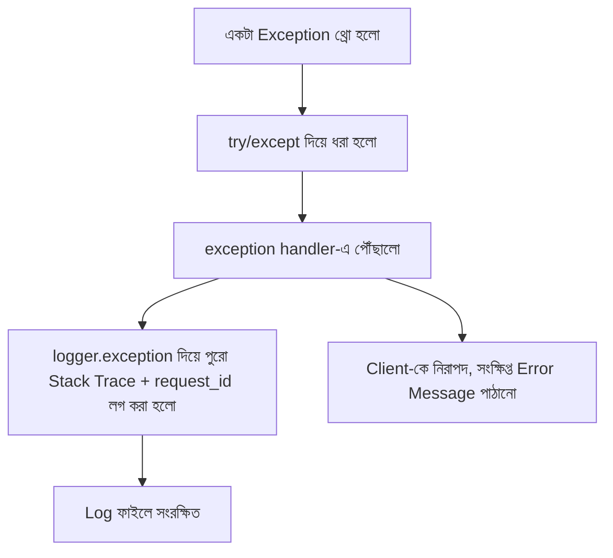

# ৩২.০৪. Error Logging and Stack Trace Management

আগের লেসনে আমরা প্রতিটা request/response লগ করা শিখেছি, আর দেখেছি ৫০০ স্ট্যাটাস কোড আসলে সেটাকে `error` লেভেলে লগ করা হচ্ছে। কিন্তু একটা এরর শুধু "স্ট্যাটাস কোড ৫০০" বললেই যথেষ্ট না — আমাদের জানা দরকার *ঠিক কোথায়*, *কোন লাইনে*, *কী কারণে* এররটা ঘটলো। এই তথ্যই থাকে **stack trace**-এ, আর এই লেসনে আমরা শিখবো কীভাবে এটা সঠিকভাবে ধরতে, লগ করতে হয়।

## Stack Trace আসলে কী

যখন Python-এ একটা exception তৈরি হয়, সেটা নিজের সাথে একটা "ভ্রমণপথ" বহন করে — exception কোন ফাংশন থেকে শুরু হয়ে কোন কোন ফাংশন হয়ে উপরে উঠে এসেছে, তার একটা তালিকা। এটা অনেকটা ডাক পার্সেলের ট্র্যাকিং হিস্ট্রির মতো — শুধু "পার্সেল হারিয়ে গেছে" জানলে চলে না, জানা দরকার ঠিক কোন গুদামে গিয়ে হারিয়েছে।

```python
def get_product_price(product: dict) -> float:
    return product["price"]["amount"]  # যদি "price" key না থাকে, এখানে ক্র্যাশ করবে


def calculate_total(cart: dict) -> float:
    return sum(get_product_price(item) for item in cart["items"])


# calculate_total({"items": [{"name": "Book"}]}) কল করলে:
# Traceback (most recent call last):
#   File "cart.py", line 6, in calculate_total
#     return sum(get_product_price(item) for item in cart["items"])
#   File "cart.py", line 2, in get_product_price
#     return product["price"]["amount"]
# KeyError: 'price'
```

এই traceback থেকে আমরা ঠিক বুঝতে পারি এরর `get_product_price` ফাংশনের ভেতরে, `cart.py` ফাইলের ২ নম্বর লাইনে ঘটেছে, আর সেটা `calculate_total`-এর ভেতর থেকে কল হয়েছিলো। এই তথ্য ছাড়া শুধু "KeyError হয়েছে" জানলে হাজার লাইনের কোডবেসে সমস্যাটা খুঁজে বের করা প্রায় অসম্ভব হয়ে যেতো। Python-এর বিল্ট-ইন `traceback` মডিউল এই তথ্যকে string আকারে বের করতে সাহায্য করে, যা আমরা লগে সংরক্ষণ করতে পারি।

## FastAPI-তে Centralized Exception Handling

FastAPI-তে একটা বিশেষ ধরনের handler আছে যা পুরো অ্যাপ্লিকেশনের জন্য নির্দিষ্ট exception টাইপ (বা সব exception) কেন্দ্রীয়ভাবে ধরে — এটাই **exception handler**। এটাকেই আমরা ব্যবহার করবো সব এরর এক জায়গায় ধরে, সঠিকভাবে লগ করার জন্য।

```python
# exception_handlers.py
from fastapi import FastAPI, Request
from fastapi.responses import JSONResponse
from logger import logger


def add_exception_handlers(app: FastAPI) -> None:
    @app.exception_handler(Exception)
    async def unhandled_exception_handler(request: Request, exc: Exception):
        logger.error(
            "unhandled_error",
            request_id=getattr(request.state, "request_id", None),
            method=request.method,
            path=request.url.path,
            error_type=type(exc).__name__,
            error_message=str(exc),
            exc_info=True,  # structlog/logging-কে বলে দেয় পুরো traceback attach করতে
        )

        # ইউজারকে raw traceback কখনোই দেখানো উচিত না — নিরাপত্তা ঝুঁকি
        return JSONResponse(
            status_code=500,
            content={
                "error": "একটা সমস্যা হয়েছে, পরে আবার চেষ্টা করুন",
                "request_id": getattr(request.state, "request_id", None),
            },
        )
```

```python
app = FastAPI()
add_exception_handlers(app)

app.include_router(orders_router, prefix="/api/orders")
app.include_router(products_router, prefix="/api/products")
```

লক্ষ করো `exc_info=True` — `logging`-ভিত্তিক logger হলে এটাই সরাসরি ব্যবহার করা যায়, আর `structlog` দিয়ে একই কাজ করা যায় `logger.exception(...)` কল করে, যা স্বয়ংক্রিয়ভাবে বর্তমান exception-এর পুরো stack trace ধরে নেয়:

```python
try:
    order = create_order(data)
except Exception:
    logger.exception("order_creation_failed", user_id=user.id)
    # logger.exception() ব্যবহার করলে আলাদা করে traceback.format_exc() লাগানোর দরকার নেই
    raise
```

## `except: pass` — Python-এর সবচেয়ে বিপজ্জনক Anti-pattern

Python-এ একটা খুবই সাধারণ, কিন্তু ভয়ঙ্কর ভুল হলো এভাবে exception ধরে কিছু না করা:

```python
# বিপজ্জনক — এটা কখনো করা উচিত না
try:
    charge_payment(order)
except:
    pass  # এরর নিঃশব্দে হারিয়ে গেলো!
```

এখানে সমস্যাটা হলো — পেমেন্ট চার্জ করতে ব্যর্থ হলো, কিন্তু কোথাও কোনো লগ নেই, কোনো ট্রেস নেই। প্রোডাকশনে এই কোড চললে ইউজার ভাববে অর্ডার সফল হয়েছে, কিন্তু আসলে পেমেন্ট ব্যর্থ হয়েছে — আর তুমি কখনো জানতেই পারবে না *কেন*, কারণ কোনো stack trace সংরক্ষিত হয়নি। এটা এতটাই সাধারণ একটা ভুল যে একে ঠাট্টা করে বলা হয় "silent failure" — সিস্টেম ভেঙে যায়, কিন্তু কেউ জানে না কারণ কোনো অ্যালার্ম বাজে না।

এর সমাধান সহজ — কখনো `except:` (bare except) বা `except Exception: pass` ব্যবহার করবে না, অন্তত সবসময় লগ করবে:

```python
try:
    charge_payment(order)
except PaymentGatewayError as e:
    logger.exception("payment_charge_failed", order_id=order.id, error=str(e))
    raise  # প্রয়োজনে আবার raise করে caller-কে জানানো, চুপচাপ চেপে যাওয়া নয়
```

নিয়ম হিসেবে মনে রাখা ভালো — যদি তুমি সত্যিই একটা exception ইচ্ছাকৃতভাবে উপেক্ষা করতে চাও (যেমন একটা optional cleanup কাজ ব্যর্থ হলে সমস্যা নেই), তাহলেও অন্তত একটা `logger.debug()` বা `logger.warning()` লাইন রাখো, সাথে *কেন* উপেক্ষা করা নিরাপদ তার একটা কমেন্ট — সম্পূর্ণ নিঃশব্দ `pass` প্রায় সবসময় ভবিষ্যতে একটা রহস্যময়, ডিবাগ-করা-কঠিন বাগ হয়ে ফিরে আসে।

## request_id দিয়ে সংযোগ স্থাপন

লক্ষ করো, error log-এও আমরা সেই একই `request.state.request_id` ব্যবহার করছি যা আগের লেসনে তৈরি হয়েছিলো। এটা খুবই শক্তিশালী একটা প্যাটার্ন — যদি একজন ইউজার অভিযোগ করে "আমার অর্ডার দিতে সমস্যা হচ্ছে", আর তুমি তাকে request_id জিজ্ঞেস করো (বা সেটা response-এ আগে থেকেই ছিলো), তাহলে তুমি লগ ফাইলে সেই একটা আইডি দিয়ে সার্চ করে সেই নির্দিষ্ট রিকোয়েস্টের পুরো জীবনচক্র — শুরু থেকে এরর পর্যন্ত — এক জায়গায় দেখতে পাবে।



এখন আমাদের সিস্টেম এরর সঠিকভাবে ধরে, লগ করে, আর ইউজারকে নিরাপদ জবাব দেয়। কিন্তু এই সব লগ যদি একটা ফাইলে জমতে থাকে অসীমভাবে, একদিন সেই ফাইল ডিস্কের পুরো জায়গা দখল করে ফেলবে। পরের, এই মডিউলের শেষ লেসনে আমরা দেখবো কীভাবে লগ ফাইল ব্যবস্থাপনা (rotation, storage) করতে হয়, যাতে এই সমস্যা না হয়।
