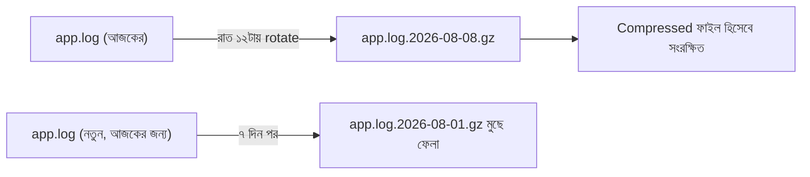
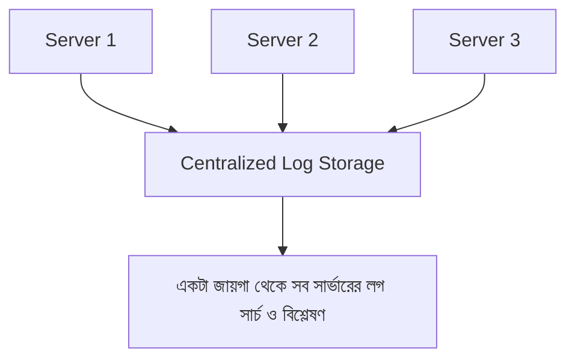

# ৩২.০৫. Log Rotation and Storage Strategies

আমরা এই মডিউল জুড়ে ধরে নিয়েছিলাম লগ একটা ফাইলে (`combined.log`) লেখা হচ্ছে। কিন্তু বাস্তবে একটা প্রোডাকশন সার্ভার প্রতিদিন হাজার হাজার, এমনকি লক্ষ লক্ষ লগ লাইন তৈরি করতে পারে। যদি সবকিছু একটা ফাইলে জমতে থাকে, সেই ফাইল কিছুদিনের মধ্যেই কয়েক গিগাবাইট হয়ে যাবে — ডিস্কের জায়গা ফুরিয়ে যাবে, আর সেই বিশাল ফাইল খোলাই কষ্টকর হয়ে দাঁড়াবে। এই সমস্যার সমাধান হলো **log rotation**।

## Log Rotation-এর ধারণা: একটা ডায়েরির উপমা

কল্পনা করো তুমি প্রতিদিন ডায়েরি লেখো, কিন্তু একটাই অসীম দৈর্ঘ্যের খাতায়। কয়েক বছর পর সেই খাতা বহন করাই অসম্ভব হয়ে যাবে। এর বদলে স্বাভাবিক নিয়ম হলো — প্রতিদিন বা প্রতি মাসে একটা নতুন খাতা শুরু করা, আর পুরনো খাতাগুলো তারিখ লিখে আলাদা তাকে রেখে দেয়া, আর অনেক পুরনো হয়ে গেলে (যেমন ৫ বছরের বেশি) সেগুলো ফেলে দেয়া। Log rotation ঠিক এই কাজটাই করে — নির্দিষ্ট সময় পরপর (বা নির্দিষ্ট সাইজ পার হলে) একটা নতুন লগ ফাইল শুরু করা, পুরনোগুলো সংকুচিত (compress) করে রাখা, আর অনেক পুরনো ফাইল স্বয়ংক্রিয়ভাবে মুছে ফেলা।



## Python-এর বিল্ট-ইন Rotating Handler

আলাদা কোনো থার্ড-পার্টি প্যাকেজ ছাড়াই Python-এর `logging.handlers` মডিউলে rotation-এর জন্য দুটো বিল্ট-ইন handler আছে — `RotatingFileHandler` (সাইজ-ভিত্তিক) আর `TimedRotatingFileHandler` (সময়-ভিত্তিক)।

```python
import logging
from logging.handlers import TimedRotatingFileHandler

rotating_handler = TimedRotatingFileHandler(
    filename="logs/app.log",
    when="midnight",     # প্রতিদিন রাত ১২টায় নতুন ফাইল শুরু হবে
    interval=1,
    backupCount=14,      # ১৪ দিনের বেশি পুরনো ফাইল স্বয়ংক্রিয়ভাবে মুছে যাবে
    encoding="utf-8",
)
rotating_handler.setFormatter(
    logging.Formatter("%(asctime)s %(levelname)s %(message)s")
)

logger = logging.getLogger("order-api")
logger.setLevel(logging.INFO)
logger.addHandler(rotating_handler)
logger.addHandler(logging.StreamHandler())  # কনসোলেও দেখানো
```

সাইজ-ভিত্তিক rotation দরকার হলে (যেমন বাগের কারণে অস্বাভাবিক পরিমাণ লগ তৈরি হওয়ার নিরাপত্তা-জাল হিসেবে), `RotatingFileHandler` ব্যবহার করা হয়:

```python
from logging.handlers import RotatingFileHandler

size_handler = RotatingFileHandler(
    filename="logs/app.log",
    maxBytes=20 * 1024 * 1024,  # ২০MB পার হলেই নতুন ফাইল শুরু হবে
    backupCount=14,             # সর্বোচ্চ ১৪টা পুরনো ফাইল রাখা হবে, তার বেশি হলে সবচেয়ে পুরনোটা মুছে যাবে
    encoding="utf-8",
)
```

বাস্তব প্রোডাকশন সেটআপে প্রায়ই দুটোই একসাথে ব্যবহারযোগ্য যুক্তি মেনে বসানো হয় — সময়ভিত্তিক rotation মূল নিয়ম, আর সাইজ-ভিত্তিক maxBytes একটা অতিরিক্ত নিরাপত্তা-জাল। `structlog` ব্যবহার করলে এই হ্যান্ডলারগুলো বিল্ট-ইন `logging`-এর সাথেই বসানো হয় (structlog নিজে থেকে ফাইলে লেখে না, বরং `logging`-এর হ্যান্ডলার ব্যবহার করে), কারণ structlog মূলত ফরম্যাটিং/processor লেয়ার, ফাইল-ব্যবস্থাপনার কাজ `logging.handlers`-এর।

## কতদিন লগ রাখা উচিত

এই "কত দিন" প্রশ্নের উত্তর নির্ভর করে তোমার প্রয়োজনের উপর। ডিবাগিং-এর জন্য সাধারণত ১-৪ সপ্তাহের লগ যথেষ্ট। কিন্তু কিছু ক্ষেত্রে (financial transaction, audit trail) আইনি বা compliance কারণে মাস বা বছরের হিসেবে লগ সংরক্ষণ করা লাগতে পারে — সেক্ষেত্রে লোকাল ডিস্কে না রেখে ক্লাউড স্টোরেজে (যেমন AWS S3) archive করাই ভালো অভ্যাস, কারণ সার্ভারের নিজের ডিস্ক সীমিত।

## প্রোডাকশনের বাস্তব ঝুঁকি: Rotation ছাড়া ডিস্ক ফুরিয়ে যাওয়া

একটা সাধারণ, কিন্তু বিধ্বংসী প্রোডাকশন ভুল হলো — অ্যাপ্লিকেশন লেখার সময় rotation যুক্ত করার কথা ভুলে যাওয়া, বা `backupCount`/retention policy ছাড়া শুধু rotation বসানো (মানে rotate তো হচ্ছে, কিন্তু পুরনো ফাইল কখনো মুছছে না)। দুটো ক্ষেত্রেই ফলাফল একই — লগ ফাইল (বা ফাইলগুলোর সমষ্টি) ধীরে ধীরে সার্ভারের ডিস্ক পুরোপুরি ভরে ফেলে। ডিস্ক ফুল হয়ে গেলে যে সমস্যাগুলো হয়:

- অ্যাপ্লিকেশন নতুন লগ লিখতে না পেরে ক্র্যাশ করতে পারে, বা silent হয়ে যায়।
- ডেটাবেজ (যদি একই সার্ভারে থাকে) ডিস্ক-ফুল এররে write করতে ব্যর্থ হয় — এটা logging সমস্যা থেকে শুরু হয়ে সরাসরি ডেটা-লস সমস্যায় পরিণত হতে পারে।
- সার্ভার নিজেই OS-লেভেল অপারেশনের জন্য জায়গা না পেয়ে অস্থিতিশীল হয়ে যেতে পারে।

এই কারণেই rotation কনফিগার করার সময় দুটো জিনিস সবসময় একসাথে ভাবা উচিত — কত ঘন ঘন rotate হবে (`when`/`maxBytes`), *আর* কতদিন পর পুরনো ফাইল মুছে যাবে (`backupCount`)। শুধু প্রথমটা সেট করে দ্বিতীয়টা ভুলে গেলে rotation থাকলেও ডিস্ক-ফুল সমস্যা ঠিক আগের মতোই ঘটবে, শুধু কিছুদিন দেরিতে। প্রোডাকশনে disk-usage-এর উপর আলাদা monitoring/alert রাখাও বুদ্ধিমানের কাজ (পরের মডিউলে এটা নিয়ে আরও দেখবো), যাতে rotation কনফিগারেশনে ভুল থাকলেও সেটা ডিস্ক পুরো ভরে যাওয়ার আগেই ধরা পড়ে।

## Local ফাইলের বাইরেও ভাবা: Centralized Logging

আরেকটা বাস্তবতা হলো — আজকাল বেশিরভাগ প্রোডাকশন সিস্টেম একটা সার্ভারে চলে না, একাধিক সার্ভার/কন্টেইনারে চলে (Module 25-এ আমরা microservices নিয়ে সংক্ষেপে শুনেছিলাম)। যদি প্রতিটা সার্ভারের লগ তার নিজের ডিস্কে আলাদা থাকে, তাহলে কোনো একটা সমস্যা খুঁজতে গিয়ে ১০টা সার্ভারে আলাদা আলাদা লগইন করে ফাইল খুঁজতে হবে — অত্যন্ত অব্যবহারিক। তাই প্রোডাকশনে সাধারণত লগ একটা কেন্দ্রীয় জায়গায় (যেমন Elasticsearch, বা ক্লাউড সার্ভিসের logging system) পাঠানো হয়, যেখানে সব সার্ভারের লগ একসাথে সার্চ করা যায়।



এই মডিউলে আমরা লগিং সিস্টেম তৈরি করা শিখলাম — `logging`/`structlog` দিয়ে শুরু করা, structured format মেনে চলা, প্রতিটা request/response আর error স্বয়ংক্রিয়ভাবে ধরা, আর সেই লগকে নিয়ন্ত্রিতভাবে সংরক্ষণ করা। কিন্তু লগ ফাইল থাকলেই চলবে না — কেউ না কেউ (বা কোনো সিস্টেম) সেটা সক্রিয়ভাবে নজরে রাখতে হবে, আর সমস্যা হলে তৎক্ষণাৎ জানাতে হবে। পরের মডিউলে আমরা ঠিক সেটাই শিখবো — সিস্টেম মনিটরিং আর অ্যালার্টিং।
