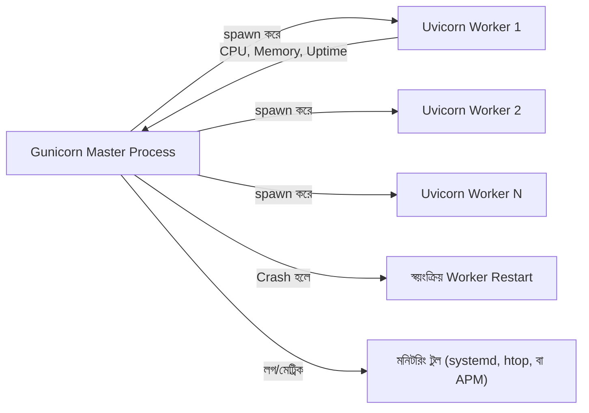

# ৩৩.০১. Real-time Monitoring with Gunicorn

Module 32-তে আমরা Loguru আর structlog দিয়ে structured logging শিখেছিলাম — মানে অ্যাপ্লিকেশনের ভেতরে কী ঘটছে সেটা ফাইলে লিখে রাখা। কিন্তু লগ ফাইল তো তখনই কাজে লাগে যখন তুমি সেটা খুলে পড়ো। প্রশ্ন হলো — সার্ভার যদি মাঝরাতে ক্র্যাশ করে, বা মেমরি হঠাৎ বেড়ে যায়, তুমি কি সেটা তখনই টের পাবে, নাকি সকালে ইউজারের অভিযোগ পেয়ে বুঝবে? এই ফাঁকটা পূরণ করে monitoring — লগ যেমন অতীতের রেকর্ড, monitoring তেমনি বর্তমানের স্পন্দন (pulse) দেখায়।

Module 21-এ (database performance) আমরা যেমন query-এর গতি মাপতে শিখেছিলাম, ঠিক তেমনি এখন আমরা পুরো FastAPI প্রসেসের "স্বাস্থ্য" মাপা শিখবো — CPU ব্যবহার কতটুকু, মেমরি কতটুকু খাচ্ছে, প্রসেস বেঁচে আছে কিনা। আর এই কাজের ভিত্তি হলো **Gunicorn** — Python-এর জগতে সবচেয়ে প্রতিষ্ঠিত প্রসেস ম্যানেজার, যেটা FastAPI-র ASGI অ্যাপকে চালানোর জন্য **Uvicorn worker** ব্যবহার করে। মনে রাখো, FastAPI নিজে শুধু একটা ASGI অ্যাপ্লিকেশন — সেটাকে প্রোডাকশনে বাঁচিয়ে রাখা, ক্র্যাশ হলে restart করা, একাধিক CPU কোরে ছড়িয়ে দেওয়া — এই কাজটা করে Gunicorn।

```bash
# Gunicorn ইনস্টল করা (uvicorn-এর সাথে)
pip install gunicorn uvicorn[standard]

# Gunicorn দিয়ে FastAPI অ্যাপ চালু করা — uvicorn worker ক্লাস দিয়ে
gunicorn main:app \
  --workers 4 \
  --worker-class uvicorn.workers.UvicornWorker \
  --bind 0.0.0.0:8000 \
  --timeout 30 \
  --max-requests 1000 \
  --max-requests-jitter 50

# প্রতিটা worker-এর অবস্থা এক নজরে (প্রসেস আইডি, মেমরি)
ps aux | grep gunicorn
```

এখানে `--worker-class uvicorn.workers.UvicornWorker` অংশটাই সবচেয়ে গুরুত্বপূর্ণ — এটা বলে দিচ্ছে, Gunicorn নিজে ASGI বোঝে না, তাই প্রতিটা worker process-এর ভেতরে একটা Uvicorn ইভেন্ট লুপ চালাতে হবে যেটা আসলে FastAPI-র async কোড রান করবে। তুলনা করলে বলা যায় — Gunicorn হলো ফ্যাক্টরির ম্যানেজার, যে ঠিক করে কতজন কর্মী (worker) কাজ করবে আর কেউ অসুস্থ (crash) হলে নতুন কর্মী নিয়োগ দেয়; আর প্রতিটা কর্মী নিজে Uvicorn, যে আসল কাজ (async request handling) করে।

`--max-requests 1000` লাইনটা লক্ষ করো — এটা একটা প্র্যাকটিক্যাল কৌশল, কারণ Python-এর memory management-এ ছোট leak জমতে জমতে worker-এর মেমরি বাড়তে থাকে। ১০০০টা request সামলানোর পর Gunicorn স্বয়ংক্রিয়ভাবে সেই worker-কে "বুড়ো" ধরে নিয়ে gracefully restart করে দেয়, ফলে ধীরে ধীরে জমতে থাকা মেমরি leak প্রতি worker-এ resest হয়ে যায়। `--max-requests-jitter` র‍্যান্ডম একটা ভ্যারিয়েশন যোগ করে, যাতে সব worker একসাথে restart না হয়ে যায়।



Gunicorn-এর একটা বিল্ট-ইন লাইভ ড্যাশবোর্ড নেই (PM2-র `monit`-এর মতো), তবে `--access-logfile` আর `--error-logfile` ফ্ল্যাগ দিয়ে সরাসরি লগ পাওয়া যায়, আর `ps aux`, `htop`, বা `gunicorn --statsd-host` দিয়ে সংক্ষিপ্ত রিয়েল-টাইম চিত্র পাওয়া যায়। যদি তোমার team lightweight প্রসেস সুপারভিশন চায় (auto-restart, লগ রোটেশন, একাধিক সার্ভিস একসাথে ম্যানেজ করা) কিন্তু ওয়েব সার্ভার-নির্দিষ্ট ফিচার দরকার নেই, তখন **`supervisord`**-ও একটা ভালো বিকল্প — এটা কোনো ভাষা-নির্দিষ্ট টুল না, বরং যেকোনো প্রসেস (Gunicorn, Celery worker, cron script) মনিটর ও restart করতে পারে একটা সাধারণ INI-স্টাইল কনফিগ ফাইল দিয়ে:

```ini
; /etc/supervisor/conf.d/myapi.conf
[program:myapi]
command=/home/deploy/venv/bin/gunicorn main:app --workers 4 --worker-class uvicorn.workers.UvicornWorker --bind 0.0.0.0:8000
directory=/home/deploy/myapi
autostart=true
autorestart=true
startretries=3
stderr_logfile=/var/log/myapi/err.log
stdout_logfile=/var/log/myapi/out.log
```

**প্রোডাকশন নুয়ান্স — worker সংখ্যা ঠিক করার সূত্র:** নতুনরা প্রায়ই ভাবে "worker যত বেশি, তত ভালো পারফরম্যান্স", আর একটা ৪-কোরের সার্ভারে ৩২টা worker চালিয়ে দেয়। এটা একটা সাধারণ ভুল, কারণ প্রতিটা Gunicorn worker আসলে একটা সম্পূর্ণ আলাদা Python প্রসেস — নিজের মেমরিতে অ্যাপের পুরো কোড, ডিপেন্ডেন্সি, আর DB connection pool আলাদাভাবে লোড করে রাখে। CPU-bound worker সংখ্যার জন্য প্রচলিত সূত্র হলো:

```
workers = (2 × CPU কোর সংখ্যা) + 1
```

মানে ৪-কোরের সার্ভারে সাধারণত ৯টা worker যথেষ্ট। এর বেশি worker চালালে CPU দিয়ে কোনো লাভ হয় না (কারণ কোরের সংখ্যা সীমিত), কিন্তু মেমরি-ব্যবহার লিনিয়ারলি বেড়ে যায় — একটা মেমরি-সীমিত (যেমন ১ GB RAM-এর) সার্ভারে ৩২টা worker চালালে প্রতিটা worker যদি ১৫০ MB নেয়, পুরো সার্ভার OOM (Out Of Memory) হয়ে ক্র্যাশ করবে, যেটা আসলে "বেশি worker = বেশি স্থিতিশীলতা" ধারণার ঠিক বিপরীত ফল দেয়। তাই worker সংখ্যা ঠিক করার আগে সবসময় সার্ভারের RAM আর প্রতিটা worker-এর গড় মেমরি ব্যবহার হিসাব করে নেওয়া উচিত।

তবে এই সেটআপের একটা সীমাবদ্ধতা আছে — Gunicorn তোমাকে বলবে একটা worker কতবার crash করেছে বা কত মেমরি খাচ্ছে, কিন্তু এটা শুধু একটা মেশিনের জন্য কাজ করে, আর কোনো ঐতিহাসিক গ্রাফ বা কেন্দ্রীয় ড্যাশবোর্ড দেয় না। প্রোডাকশনে যদি একাধিক সার্ভারে অ্যাপ চলে, তাহলে আলাদা মেশিনের প্রসেস অবস্থা আলাদাভাবে দেখতে হবে — কেন্দ্রীয় কোনো ভিউ নেই। এই সীমাবদ্ধতা পেরোতেই দরকার হয় পেশাদার Application Performance Monitoring (APM) টুল, যেটা নিয়ে আমরা পরের লেসনে কথা বলবো।
