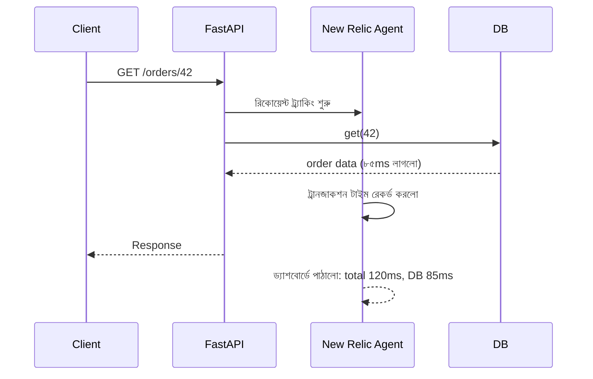

# ৩৩.০২. Application Performance Monitoring with New Relic

আগের লেসনে আমরা দেখলাম Gunicorn/Uvicorn worker-এর process-level অবস্থা (CPU, মেমরি, crash count) দেখা যায়, কিন্তু সেটা একমেশিন-কেন্দ্রিক আর সীমিত। এখন কল্পনা করো তোমার অ্যাপটা প্রতিদিন হাজার হাজার request সামলাচ্ছে, আর কোনো একটা নির্দিষ্ট API endpoint মাঝে মাঝে ধীরগতির হয়ে যাচ্ছে। Gunicorn তোমাকে বলবে "CPU বেশি ব্যবহার হচ্ছে", কিন্তু কোন endpoint, কোন query, কোন লাইন কোডে সমস্যা — সেটা বলবে না। এই গভীরতার প্রশ্নের উত্তর দেয় **Application Performance Monitoring (APM)** টুল, যার মধ্যে **New Relic** সবচেয়ে পরিচিত একটা।

APM-কে ভাবতে পারো হাসপাতালের ফুল বডি চেকআপের মতো। Gunicorn যেমন শুধু নাড়ির স্পন্দন (pulse) মাপে, APM পুরো শরীরের এক্স-রে করে দেখায় — কোন অঙ্গ (কোড path) কতটা চাপে আছে। New Relic-এর একটা অফিশিয়াল Python এজেন্ট আছে (`newrelic` প্যাকেজ), যেটা তোমার FastAPI কোডের ভেতরে ঢুকে প্রতিটা request-এর জার্নি ট্রেস করে — কোন middleware কতক্ষণ সময় নিলো, database query-তে কত মিলিসেকেন্ড গেলো, external API call-এ কত দেরি হলো — সব আলাদা করে দেখায়।

ব্যবহার করা শুরু করা বেশ সহজ। প্রথমে প্যাকেজ ইনস্টল করে অ্যাপকে wrap করতে হয়:

```bash
pip install newrelic
```

Python-এর agent Node-এর মতো একটা সিম্পল `require` দিয়ে কাজ করে না — কারণ Python-এ import-এর সময় নয়, বরং প্রসেস চালু হওয়ার মুহূর্তে (interpreter startup) এজেন্ট বসাতে হয়, যাতে সব মডিউল লোড হওয়ার আগেই instrumentation hook বসানো যায়। এটা করার দুটো সাধারণ পথ আছে — একটা হলো কোডেই এজেন্ট initialize করা, আর ASGI middleware যোগ করা:

```python
# newrelic.ini ফাইলে লাইসেন্স কী আর অ্যাপের নাম বসাতে হয়
# main.py এর একদম প্রথমে
import newrelic.agent
newrelic.agent.initialize('newrelic.ini')

from fastapi import FastAPI
import uvicorn

app = FastAPI()
app = newrelic.agent.ASGIApplicationWrapper(app)

@app.get('/orders/{order_id}')
async def get_order(order_id: int):
    order = await Order.get(order_id)  # New Relic এটাও ট্রেস করবে
    return order
```

আরেকটা, বেশি প্রচলিত পথ হলো — Gunicorn চালানোর সময় `NEW_RELIC_CONFIG_FILE` এনভায়রনমেন্ট ভ্যারিয়েবল সেট করে `newrelic-admin` র‍্যাপার দিয়ে প্রসেসটাই চালু করা, তাহলে কোডে কিছু পরিবর্তন করতেই হয় না:

```bash
NEW_RELIC_CONFIG_FILE=newrelic.ini \
  newrelic-admin run-program \
  gunicorn main:app --workers 4 --worker-class uvicorn.workers.UvicornWorker
```

এরপর New Relic নিজে থেকেই FastAPI/Starlette-এর route handler, database driver (যেমন SQLAlchemy বা asyncpg) — এসবের ভেতরে "hook" বসিয়ে দেয়, তোমাকে ম্যানুয়ালি প্রতিটা জায়গায় কোড লিখতে হয় না। এই কৌশলটাকে বলে **auto-instrumentation**।



New Relic-এর ওয়েব ড্যাশবোর্ডে গেলে তুমি দেখবে "Transaction Trace" নামে একটা ভিউ, যেখানে প্রতিটা ধীরগতির request-এর সম্পূর্ণ breakdown পাওয়া যায় — ঠিক যেমন Module 32-এ আমরা structured log দিয়ে একটা request-এর গল্প ফলো করতে পারতাম, এখানে সেই গল্পটা সময়ের সাথে ভিজ্যুয়ালি দেখা যায়। এখানেই APM-এর আসল শক্তি — সমস্যাটা "কোথায়" আছে সেটা অনুমান না করে, সরাসরি নির্দিষ্ট করে দেখানো।

**সাধারণ ভুল — async কোডে blocking call:** FastAPI-র async endpoint-এর ভেতরে যদি ভুলবশত কোনো sync/blocking লাইব্রেরি কল করো (যেমন `requests.get()` async ফাংশনের ভেতরে সরাসরি, `await` ছাড়া), তাহলে সেটা পুরো ইভেন্ট লুপ ব্লক করে ফেলে, আর New Relic-এর ট্রান্স্যাকশন ট্রেসে দেখবে একটা "External" span অস্বাভাবিকভাবে সময় নিচ্ছে অথচ ওই একই সময়ে অন্য সব request-ও ধীর হয়ে গেছে। এই প্যাটার্নটা চেনা গুরুত্বপূর্ণ, কারণ শুধু ওই একটা endpoint অপ্টিমাইজ করলে সমস্যা যায় না — পুরো worker-এর throughput কমে যায়, যেটা সিঙ্গল-থ্রেডেড ইভেন্ট লুপ মডেলের একটা নির্দিষ্ট edge case। এজন্য blocking কল করতে হলে `run_in_executor` বা async-native লাইব্রেরি (যেমন `httpx` sync-এর বদলে `httpx.AsyncClient`) ব্যবহার করা উচিত।

তবে New Relic একটা নির্দিষ্ট কোম্পানির পণ্য, তাদের নিজস্ব ফরম্যাট আর ড্যাশবোর্ডে আটকে থাকতে হয়। পরের লেসনে আমরা দেখবো Datadog দিয়ে কীভাবে metrics আরও নমনীয়ভাবে, নিজের পছন্দমতো সংগ্রহ ও বিশ্লেষণ করা যায়।
