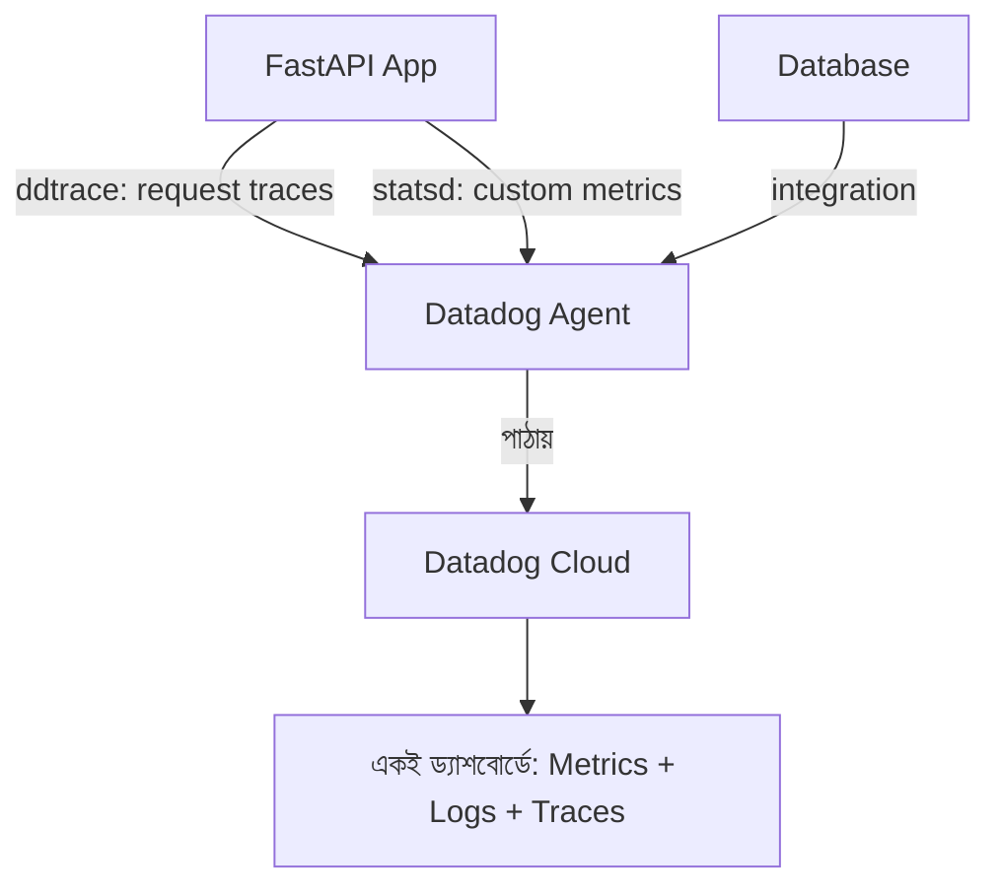

# ৩৩.০৩. Metrics Collection with Datadog

New Relic আমাদের শিখিয়েছে APM কীভাবে একটা request-এর ভেতরের যাত্রা দেখায়। কিন্তু কখনো কখনো তোমার দরকার হয় আরও বিস্তৃত ছবি — শুধু একটা অ্যাপ না, তোমার পুরো সিস্টেম (একাধিক সার্ভার, ডাটাবেজ, কিউ, cache — সব মিলিয়ে) একসাথে দেখা। এই কাজে **Datadog** সবচেয়ে জনপ্রিয় টুলগুলোর একটা, কারণ এটা শুধু APM না, বরং **metrics, logs, আর traces** — তিনটাকেই এক জায়গায় নিয়ে আসে।

এখানে একটা নতুন শব্দ বোঝা দরকার — **metric**। Metric মানে সময়ের সাথে বদলানো একটা সংখ্যা, যেটা তুমি নিজে বেছে নাও কী মাপবে। যেমন — "প্রতি মিনিটে কতগুলো অর্ডার তৈরি হলো", বা "লগইন ফেইল হওয়ার সংখ্যা"। Module 32-তে আমরা log লিখতাম টেক্সট আকারে ("User login failed for user123"), কিন্তু metric হলো সেই একই ঘটনার সংখ্যাগত রূপ, যেটা গ্রাফে আঁকা যায়, threshold বসানো যায়।

Datadog-এর Python লাইব্রেরি **`ddtrace`** দিয়ে auto-instrumentation পাওয়া যায়, আর সেই একই লাইব্রেরির `ddtrace.statsd` দিয়ে custom metric পাঠানো যায় (Node-এর জগতে `dd-trace` আর `hot-shots`-এর কাজটা Python-এ একটাই প্যাকেজ করে দেয়):

```bash
pip install ddtrace
```

```python
# main.py

from fastapi import FastAPI
from ddtrace import tracer, patch_all
from ddtrace.contrib.asgi import TraceMiddleware

# FastAPI/Starlette, SQLAlchemy ইত্যাদির জন্য auto-instrumentation চালু
patch_all()

app = FastAPI()
app.add_middleware(TraceMiddleware)

from datadog import statsd  # datadogpy প্যাকেজের StatsD ক্লায়েন্ট

@app.post('/orders')
async def create_order(payload: dict):
    order = await Order.create(payload)

    # কাস্টম মেট্রিক পাঠানো — কতগুলো অর্ডার তৈরি হলো তার কাউন্টার
    statsd.increment('orders.created')

    # response time নিজে থেকেই মাপা (gauge/histogram)
    statsd.histogram('orders.create.duration_ms', order.duration_ms)

    return order
```

চালানোর সময় `ddtrace-run` র‍্যাপার দিয়ে Gunicorn চালু করলে tracing আরও নিরবচ্ছিন্নভাবে বসে যায়, কারণ এটা প্রতিটা worker প্রসেস চালু হওয়ার আগেই instrumentation বসিয়ে দেয়:

```bash
ddtrace-run gunicorn main:app --workers 4 --worker-class uvicorn.workers.UvicornWorker
```

এখানে `increment` একটা **counter** metric — শুধু গুনতে থাকে। আর `histogram` মাপে একটা সংখ্যার বিতরণ (distribution) — যেমন response time-এর p50, p95, p99 (Module 31-এ আমরা response time নিয়ে কথা বলেছিলাম, এখানে সেই একই ধারণা metric হিসেবে সংরক্ষিত হচ্ছে)।



Datadog-এর আসল সুবিধা হলো **correlation** — তুমি একটা গ্রাফে দেখলে orders.created হঠাৎ কমে গেছে, এক ক্লিকে সেই একই সময়ের logs আর traces দেখতে পারো, বুঝতে পারো কারণটা কী ছিলো। এটা অনেকটা গোয়েন্দার কাজের মতো — একটা সূত্র (metric-এর অস্বাভাবিকতা) থেকে শুরু করে, সংশ্লিষ্ট সব প্রমাণ (logs, traces) এক জায়গায় জড়ো করে সমস্যাটা ধরা।

**এজ কেস — worker সংখ্যার সাথে ট্রেসিং overhead-এর সম্পর্ক:** `ddtrace` প্রতিটা request-এর জন্য span তৈরি করে আর সেগুলো ব্যাচে করে Datadog Agent-এর কাছে পাঠায়। যদি Gunicorn-এ (আগের লেসনের সূত্র মেনে) অনেকগুলো worker চালানো হয়, প্রতিটা worker আলাদাভাবে নিজের span buffer আর background thread রাখে — ফলে worker সংখ্যা বাড়ালে ট্রেসিং-এর মেমরি ও CPU overhead-ও লিনিয়ারলি বেড়ে যায়। কম-ট্রাফিকের সার্ভিসে খুব বেশি worker-এ পুরো instrumentation চালু রাখলে দেখা যায় CPU-র একটা লক্ষণীয় অংশ শুধু ট্রেস পাঠানোর কাজেই চলে যাচ্ছে, অ্যাপের আসল কাজে না। এই কারণে প্রোডাকশনে `DD_TRACE_SAMPLE_RATE` ব্যবহার করে ট্রেসের একটা অংশ (যেমন ২০%) sample করে পাঠানো একটা প্রচলিত অনুশীলন, যাতে পুরো ছবি না হারিয়েও overhead কমানো যায়।

মেট্রিক সংগ্রহ করাই যথেষ্ট নয় অবশ্য — সেগুলো দেখে রাখারও দরকার নেই যদি কেউ সমস্যা হলে সাথে সাথে না জানে। পরের লেসনে আমরা দেখবো কীভাবে এই মেট্রিকগুলোর উপর ভিত্তি করে alert threshold বসিয়ে, সমস্যা হলে সাথে সাথে notification পাওয়া যায়।
