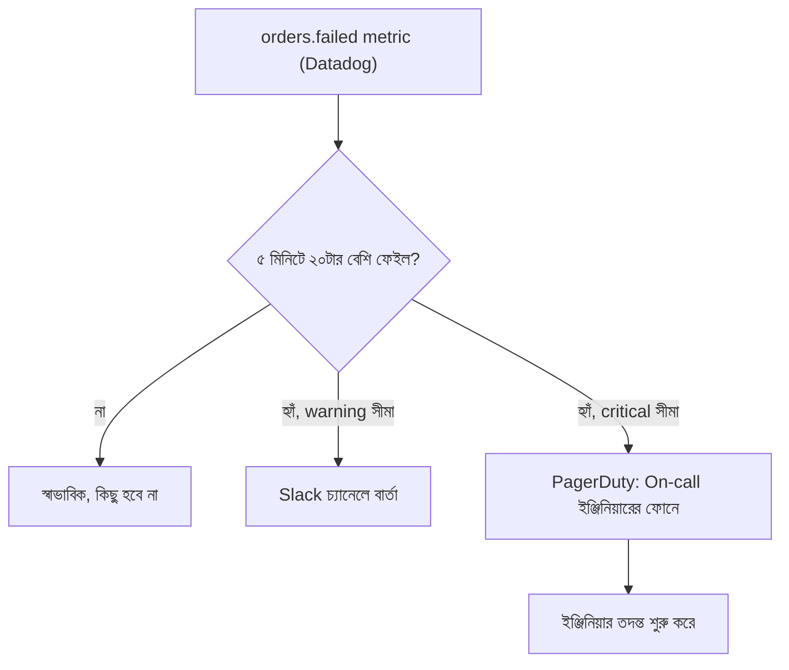

# ৩৩.০৪. Setting up Alert Thresholds and Notifications

এই মডিউলের প্রথম তিনটা লেসনে আমরা তিন ধরনের চোখ বসিয়েছি — Gunicorn/Uvicorn দিয়ে প্রসেসের নাড়ির স্পন্দন, New Relic দিয়ে request-এর ভেতরের যাত্রা, আর Datadog দিয়ে পুরো সিস্টেমের metrics। কিন্তু এই সব ড্যাশবোর্ড যদি তুমি সারাক্ষণ তাকিয়ে না থাকো, তাহলে এগুলোর কোনো মূল্য নেই। বাস্তবে কেউ ২৪ ঘণ্টা ড্যাশবোর্ডের দিকে তাকিয়ে থাকে না — তাই দরকার হয় **alerting**, যেটা মনিটরিংকে একজন প্যাসিভ দর্শক থেকে একজন সক্রিয় প্রহরীতে (active guard) পরিণত করে।

Alerting-এর মূল ধারণা সহজ, আর এটা যেকোনো ভাষা বা ফ্রেমওয়ার্কের ঊর্ধ্বে — তুমি একটা **threshold** (সীমা) নির্ধারণ করো একটা মেট্রিকের উপর, আর যখন সেই সীমা লঙ্ঘিত হয়, সিস্টেম নিজে থেকে তোমাকে জানিয়ে দেয়। এটা অনেকটা বাসার স্মোক ডিটেক্টরের মতো — তুমি সারাক্ষণ বাতাসে ধোঁয়ার পরিমাণ মাপো না, কিন্তু ডিটেক্টর সেটা মাপে, আর একটা সীমা পার হলেই অ্যালার্ম বাজায়।

Datadog-এ একটা মনিটর তৈরি করতে গেলে তিনটা জিনিস ঠিক করতে হয় — কোন metric দেখা হবে, থ্রেশহোল্ড কত, আর লঙ্ঘন হলে কাকে জানানো হবে। Datadog-এর ওয়েব UI দিয়েও এটা করা যায়, কিন্তু প্রোডাকশন প্র্যাকটিসে এটা সাধারণত কোড/কনফিগ দিয়ে (Infrastructure as Code) define করা হয়, যাতে version control-এ ট্র্যাক থাকে। Python-এ Datadog-এর অফিসিয়াল API ক্লায়েন্ট দিয়ে:

```python
# create_monitor.py
from datadog_api_client import Configuration, ApiClient
from datadog_api_client.v1.api.monitors_api import MonitorsApi
from datadog_api_client.v1.model.monitor import Monitor
from datadog_api_client.v1.model.monitor_type import MonitorType
from datadog_api_client.v1.model.monitor_options import MonitorOptions
from datadog_api_client.v1.model.monitor_thresholds import MonitorThresholds

configuration = Configuration()

with ApiClient(configuration) as api_client:
    monitors_api = MonitorsApi(api_client)

    monitor = Monitor(
        name="High Order-Failure Rate",
        type=MonitorType("metric alert"),
        query="sum(last_5m):sum:orders.failed{*}.as_count() > 20",
        message=(
            "গত ৫ মিনিটে ২০টার বেশি অর্ডার ফেইল হয়েছে।\n"
            "@slack-backend-alerts @pagerduty-oncall"
        ),
        options=MonitorOptions(
            thresholds=MonitorThresholds(critical=20, warning=10),
            notify_no_data=True,
            renotify_interval=15,
        ),
    )

    monitors_api.create_monitor(body=monitor)
```

আবার — যদি Terraform ব্যবহার করে পুরো ইনফ্রাস্ট্রাকচার (সার্ভার, ডেটাবেজ, মনিটর — সব) একসাথে ম্যানেজ করা হয় (ভাষা-নির্ভরতা নেই, Python বা Node দুটো stack-এর জন্যই একইভাবে কাজ করে), তাহলে সেই একই মনিটর `.tf` ফাইলে সংজ্ঞায়িত করা যায়:

```hcl
resource "datadog_monitor" "high_order_failure" {
  name    = "High Order-Failure Rate"
  type    = "metric alert"
  query   = "sum(last_5m):sum:orders.failed{*}.as_count() > 20"
  message = "গত ৫ মিনিটে ২০টার বেশি অর্ডার ফেইল হয়েছে। @slack-backend-alerts @pagerduty-oncall"

  monitor_thresholds {
    critical = 20
    warning  = 10
  }

  notify_no_data    = true
  renotify_interval = 15
}
```

লক্ষ্য করো — `message` ফিল্ডে `@slack-backend-alerts` লেখা মানে এই অ্যালার্ট সরাসরি Slack চ্যানেলে চলে যাবে, আর `@pagerduty-oncall` মানে যিনি সেই মুহূর্তে "on-call" (দায়িত্বে আছেন), তার ফোনে সরাসরি নোটিফিকেশন যাবে। এখানে দুটো লেভেলের থ্রেশহোল্ড আছে — `warning` (১০, মানে "নজর রাখো") আর `critical` (২০, মানে "এখনই ব্যবস্থা নাও")। এই দুই স্তরের সিস্টেম গুরুত্বপূর্ণ, কারণ প্রতিটা ছোট ওঠানামায় জরুরি অ্যালার্ম পাঠালে মানুষ ধীরে ধীরে সেটা উপেক্ষা করা শুরু করে — একে বলে **alert fatigue**।



থ্রেশহোল্ড ঠিক করাটাও একটা শিল্প। খুব সংবেদনশীল থ্রেশহোল্ড (যেমন "১টা error হলেই অ্যালার্ম") মানুষকে ক্লান্ত করে ফেলবে, আর খুব শিথিল থ্রেশহোল্ড (যেমন "১০০০টা error হলে অ্যালার্ম") হয়তো ইউজাররা সমস্যা টের পাওয়ার অনেক পরে তোমাকে জানাবে। ভালো অভ্যাস হলো ধীরে ধীরে থ্রেশহোল্ড টিউন করা — শুরুতে একটু শিথিল রেখে, সময়ের সাথে সাথে ডেটা দেখে ঠিক করা।

**কমন মিসটেক — worker restart-কে false alert ধরা:** আগের লেসনে আমরা দেখেছি Gunicorn `--max-requests` অতিক্রম করলে worker নিজেই gracefully restart হয়ে যায় মেমরি leak এড়ানোর জন্য। যদি তোমার alert থ্রেশহোল্ড "process restart count" বা "5xx error rate" এর উপর খুব সংবেদনশীলভাবে বসানো থাকে, তাহলে এই স্বাভাবিক, পরিকল্পিত restart-টাও একটা critical alert ট্রিগার করতে পারে, কারণ restart-এর সময় কয়েক মিলিসেকেন্ডের জন্য request drop হতে পারে। এটা প্রকৃত ইনসিডেন্ট নয়, তাই alert query-তে সাধারণত একটা ছোট গ্রেস উইন্ডো (যেমন "৫ মিনিটে একাধিকবার হলেই সতর্ক করো, একবার হলে না") রাখা হয় যাতে পরিকল্পিত restart আর আসল সমস্যার মধ্যে পার্থক্য করা যায়।

মনিটরিং আর অ্যালার্টিং দিয়ে আমরা এখন জানি *কখন* কিছু ভুল হচ্ছে। কিন্তু জানার পরে আসল কাজ শুরু হয় — সমস্যাটা *কেন* হচ্ছে সেটা প্রোডাকশনেই বসে খুঁজে বের করা। পরের মডিউলে আমরা ঠিক সেই বিষয়ে যাবো — Production Debugging।
