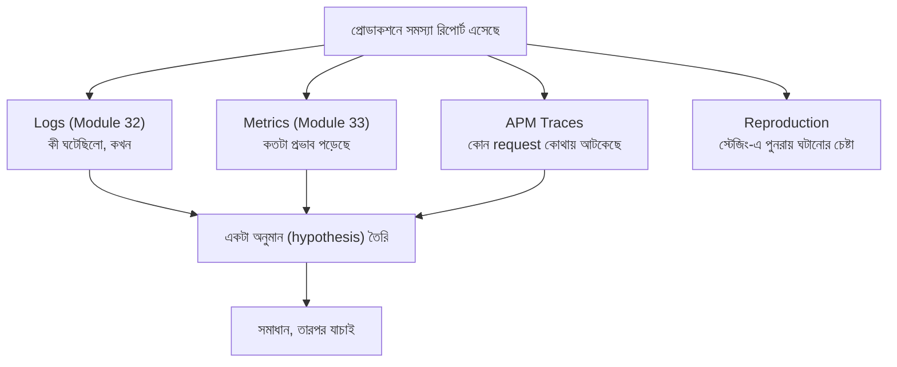

# ৩৪.০১. Production Debugging Techniques

Module 33-তে আমরা মনিটরিং আর অ্যালার্টিং দিয়ে শিখেছি *কখন* একটা সমস্যা হচ্ছে সেটা টের পাওয়া। কিন্তু অ্যালার্ম বেজে ওঠার পর আসল যুদ্ধ শুরু হয় — সমস্যাটা *কেন* হচ্ছে সেটা খুঁজে বের করা, আর সেটাও এমন এক পরিবেশে, যেখানে তুমি নিজের লোকাল মেশিনের মতো ব্রেকপয়েন্ট বসিয়ে থামিয়ে থামিয়ে দেখতে পারবে না। এটাই **production debugging**-এর মূল চ্যালেঞ্জ।

লোকাল ডেভেলপমেন্টে ডিবাগিং অনেকটা শান্ত ল্যাবরেটরিতে পরীক্ষা করার মতো — তুমি যা খুশি থামাতে পারো, ভেরিয়েবলের মান বদলে দেখতে পারো, আবার চালাতে পারো। কিন্তু প্রোডাকশন সার্ভার এমন এক রোগীর মতো, যাকে অস্ত্রোপচার টেবিলে শুইয়ে রাখা যাবে না — সে চলমান, হাজার হাজার real ইউজার তার সাথে interact করছে। তুমি চাইলেই পুরো সিস্টেম থামিয়ে দিতে পারো না।

তাই প্রোডাকশন ডিবাগিং-এর নীতি হলো — **পর্যবেক্ষণ করো, থামিও না** (observe, don't halt)। এর জন্য আমরা মূলত চারটা উৎস থেকে তথ্য জড়ো করি:



এই প্রক্রিয়াটা অনেকটা গোয়েন্দা তদন্তের মতো — তুমি সরাসরি অপরাধী (bug) কে দেখতে পাচ্ছো না, কিন্তু আশেপাশের প্রমাণ (logs, metrics, traces) জড়ো করে একটা অনুমান বানাচ্ছো, তারপর সেটা যাচাই করছো। প্রথম ধাপ সবসময় হওয়া উচিত **timeline তৈরি করা** — ঠিক কখন সমস্যাটা শুরু হয়েছে, তার ঠিক আগে কোনো deploy, কনফিগ পরিবর্তন, বা ট্রাফিক বৃদ্ধি হয়েছিলো কিনা।

```python
# একটা সাধারণ কৌশল: request-এর সাথে একটা correlation ID জুড়ে দেওয়া,
# যাতে logs আর traces-এ একই request খুঁজে পাওয়া সহজ হয়
import uuid
from fastapi import FastAPI, Request

app = FastAPI()

@app.middleware("http")
async def add_correlation_id(request: Request, call_next):
    correlation_id = request.headers.get("x-correlation-id", str(uuid.uuid4()))
    request.state.correlation_id = correlation_id
    response = await call_next(request)
    response.headers["x-correlation-id"] = correlation_id
    return response

@app.get("/orders/{order_id}")
async def get_order(order_id: str, request: Request):
    logger.info("Fetching order", extra={"correlation_id": request.state.correlation_id, "order_id": order_id})
    # ...
```

এই `correlation_id` টা প্রোডাকশন ডিবাগিং-এর সবচেয়ে গুরুত্বপূর্ণ হাতিয়ারগুলোর একটা — একজন ইউজার যখন বলে "আমার অর্ডার লোড হচ্ছে না", আর সে যদি error message-এর সাথে একটা ID দেখতে পায়, তুমি সরাসরি সেই ID দিয়ে লগ আর ট্রেস খুঁজে পুরো ঘটনা reconstruct করতে পারো, হাজার হাজার লগ লাইনের মধ্যে হাতড়াতে হয় না।

লোকাল ডেভেলপমেন্টে Python-এ ডিবাগিং করার সময় তুমি নিশ্চয়ই `breakpoint()` (বা পুরনো `import pdb; pdb.set_trace()`) ব্যবহার করেছো — কোডের যেকোনো লাইনে এটা বসিয়ে দিলে প্রোগ্রাম সেখানে থেমে যায়, আর তুমি একটা ইন্টারেক্টিভ শেলে ভেরিয়েবল দেখতে, বদলাতে পারো। কিন্তু প্রোডাকশনে `breakpoint()` বসানো একটা সাধারণ **common mistake** — একটা লাইভ request-handling প্রসেসের ভেতরে এটা থামলে, সেই ওয়ার্কার পুরোপুরি hang হয়ে যায় এবং তার ওপর আসা বাকি সব request timeout খায়, কারণ প্রসেসটা কোনো টার্মিনালের অপেক্ষায় বসে থাকে যা কেউ কখনো attach করবে না। তাই `breakpoint()`/`pdb` শুধু লোকাল বা স্টেজিং-এ; প্রোডাকশনে "থামিয়ে দেখা"-র বদলে সবসময় logs, metrics, আর traces থেকে "পর্যবেক্ষণ করে অনুমান বানানো"-র নীতি মেনে চলতে হয়।

এই লেসনে আমরা বড় ছবিটা দেখলাম। পরের লেসনে আমরা এই "logs জড়ো করে অনুমান বানানো" প্রক্রিয়াটাকে আরও কার্যকরভাবে করার কৌশল শিখবো — Debug Logs Effectively।
