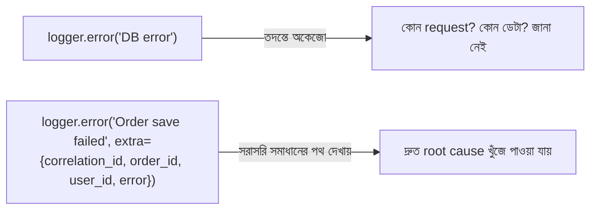

# ৩৪.০২. Using Debug Logs Effectively

আগের লেসনে আমরা বলেছিলাম logs হলো প্রোডাকশন ডিবাগিং-এর সবচেয়ে প্রাথমিক প্রমাণ। কিন্তু শুধু লগ থাকলেই চলবে না — Module 32-তে আমরা Python-এর `logging` module আর `structlog` দিয়ে structured logging সেট আপ করতে শিখেছিলাম, এখন শিখবো কীভাবে সেই লগগুলোকে *ডিবাগিং-এর জন্য কার্যকরভাবে* ব্যবহার করতে হয়। একটা খারাপভাবে লেখা লগ লাইন, আর একটা ভালোভাবে লেখা লগ লাইনের মধ্যে পার্থক্য হতে পারে ৫ মিনিট বনাম ৫ ঘণ্টার ডিবাগিং সময়ের।

প্রথম সমস্যা হলো **log level** ঠিকভাবে ব্যবহার না করা। অনেকে সবকিছু `info` দিয়ে লেখে, ফলে প্রোডাকশনে হাজার হাজার লাইনের মধ্যে আসল সমস্যাটা হারিয়ে যায়। সঠিক নিয়ম হলো:

```python
import logging

logger = logging.getLogger("orders")  # Module 32-এর logging/structlog সেটআপ

logger.debug("Cache lookup attempted", extra={"key": cache_key})  # শুধু ডেভেলপমেন্টে দরকার
logger.info("Order created", extra={"order_id": order.id})  # স্বাভাবিক ঘটনা, রেকর্ড রাখার জন্য
logger.warning("Payment retry triggered", extra={"order_id": order.id, "attempt": 2})  # সন্দেহজনক, কিন্তু ভাঙেনি
logger.error("Payment failed permanently", extra={"order_id": order.id, "error": str(err)}, exc_info=True)
```

প্রোডাকশনে সাধারণত `debug` লেভেল বন্ধ রাখা হয় (পারফরম্যান্সের জন্য), কিন্তু যখন একটা নির্দিষ্ট সমস্যা তদন্ত করছো, সাময়িকভাবে সেই লেভেল চালু করে দেখা যায় — একে বলে **dynamic log level**:

```python
# একটা প্রোটেক্টেড admin endpoint, যেটা রানটাইমে log level বদলাতে দেয়
from fastapi import Depends

@app.post("/admin/log-level")
async def change_log_level(level: str, _: None = Depends(require_admin)):
    logging.getLogger("orders").setLevel(level.upper())  # যেমন "DEBUG"
    return {"message": f"Log level changed to {level.upper()}"}
```

এভাবে পুরো অ্যাপ redeploy না করেই, সন্দেহজনক সময়ে বেশি বিস্তারিত তথ্য পাওয়া যায়, আর সমস্যা মিটে গেলে আবার `info`-তে ফিরিয়ে আনা যায় — একটা ডাক্তারের মতো, যিনি সাধারণ চেকআপে হালকা পরীক্ষা করেন, কিন্তু সন্দেহ হলে বিস্তারিত টেস্ট করান।

দ্বিতীয় গুরুত্বপূর্ণ অভ্যাস হলো **প্রাসঙ্গিক তথ্য (context) যোগ করা**। শুধু `logger.error("Something failed")` লেখা প্রায় অকেজো — কোন request, কোন ইউজার, কোন ডেটা নিয়ে fail হলো, সেটা ছাড়া তদন্ত করা অসম্ভব। আগের লেসনের `correlation_id` এখানেই কাজে লাগে:



তৃতীয় অভ্যাস — **error object পুরোটা লগ করা**, শুধু exception-এর message না, পুরো traceback-ও রাখা। Python-এ এটা সহজ — `logger.error(...)`-এ `exc_info=True` পাস করলেই logging module নিজে থেকে পুরো stack trace ফরম্যাট করে জুড়ে দেয়, কারণ traceback বলে দেয় ঠিক কোন ফাইলের কোন লাইনে সমস্যাটা শুরু হয়েছিলো। আর চতুর্থ, প্রায়ই ভুলে যাওয়া অভ্যাস — sensitive data (পাসওয়ার্ড, টোকেন, কার্ড নম্বর) কখনো লগে না রাখা, কারণ লগ ফাইল অনেক মানুষ দেখতে পারে, আর এটা নিরাপত্তার নীতির সরাসরি লঙ্ঘন।

একটা common mistake যেটা প্রায়ই দেখা যায় — `logger.error(f"Order save failed: {err}")` এর মতো f-string দিয়ে ম্যানুয়ালি মেসেজ বানানো। এতে structured logging-এর সুবিধাই নষ্ট হয়ে যায়, কারণ তখন `order_id` বা `user_id` টেক্সটের ভেতরে গুঁজে থাকে, আলাদা ফিল্ড হিসেবে থাকে না — ফলে log aggregator (যেমন Module 32-এ দেখা ELK/Datadog) দিয়ে সেগুলোর ওপর filter বা query করা যায় না। তাই সবসময় `extra={}` দিয়ে আলাদা key-value পাস করাই ভালো অভ্যাস।

লগ যত ভালোভাবেই লেখা হোক না কেন, কখনো কখনো সমস্যাটা এত জটিল হয় যে শুধু লগ দিয়ে ধরা যায় না — তখন দরকার হয় সরাসরি চলমান প্রসেসের ভেতরে উঁকি দেওয়া। পরের লেসনে আমরা শিখবো কীভাবে নিরাপদে remote debugging করা যায়।
