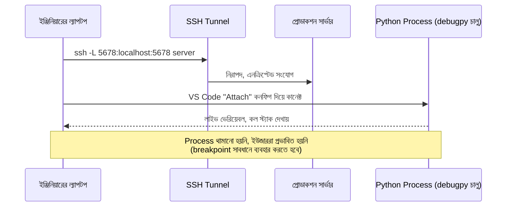

# ৩৪.০৩. Remote Debugging in Production

কখনো কখনো logs আর metrics মিলিয়েও বোঝা যায় না সমস্যাটা ঠিক কোথায়। এমন সময় মনে হয় — "যদি লোকাল মেশিনের মতো এই প্রসেসের ভেতরে গিয়ে সরাসরি দেখতে পারতাম!" ভালো খবর হলো, Python-এও এটার একটা উপায় আছে — **remote debugging**, যেখানে তুমি প্রোডাকশন প্রসেসের ভেতরে (থামিয়ে না দিয়ে) উঁকি দিতে পারো, দূর থেকে।

এর জন্য সবচেয়ে বহুল-ব্যবহৃত টুল **`debugpy`** — মাইক্রোসফটের তৈরি, VS Code-এর remote debugging ফিচারের পেছনের ইঞ্জিন, যেটা Debug Adapter Protocol (DAP) দিয়ে কাজ করে। এটা দিয়ে যেকোনো চলমান Python প্রসেসকে একটা নির্দিষ্ট পোর্টে "attachable" বানানো যায়:

```python
# server.py-তে, শুধু নির্দিষ্ট শর্তে (যেমন একটা env var চেক করে) debugpy চালু করা
import os
import debugpy

if os.environ.get("ENABLE_REMOTE_DEBUG") == "true":
    debugpy.listen(("127.0.0.1", 5678))  # localhost-এ বাইন্ড, বাইরের কেউ সরাসরি পৌঁছাতে পারবে না
    print("debugpy: waiting for debugger attach on 127.0.0.1:5678")
```

লক্ষ করো, আমরা `127.0.0.1` ব্যবহার করেছি, `0.0.0.0` না — এটা অত্যন্ত গুরুত্বপূর্ণ নিরাপত্তা সিদ্ধান্ত। debugpy চালু থাকলে যে কেউ সেই পোর্টে কানেক্ট করে তোমার প্রসেসের ভেতরের যেকোনো ভেরিয়েবল দেখতে পারবে, এমনকি আর্বিট্রারি কোড execute করতেও পারবে — এটা কার্যত একটা backdoor। তাই প্রোডাকশনে debugpy শুধু SSH tunnel-এর মাধ্যমে, শুধু নির্দিষ্ট সময়ের জন্য, শুধু বিশ্বস্ত ইঞ্জিনিয়ারের জন্য খোলা রাখা উচিত।



VS Code-এ `.vscode/launch.json`-এ একটা "Python Debugger: Remote Attach" কনফিগ (host: `localhost`, port: `5678`) যোগ করে, SSH tunnel-এর ভেতর দিয়ে তুমি সরাসরি VS Code-এর ডিবাগার দিয়ে প্রোডাকশন প্রসেসে breakpoint বসাতে, ভেরিয়েবল inspect করতে পারো। তবে এখানে সাবধানতা জরুরি — যদি তুমি breakpoint বসিয়ে প্রসেসটা থামিয়ে রাখো, তাহলে সেই মুহূর্তে আসা সব real request আটকে যাবে, ইউজাররা timeout পাবে। তাই breakpoint ব্যবহার শুধু কম-ট্রাফিকের সময়ে, খুব অল্প সময়ের জন্য করা উচিত।

**একটা গুরুত্বপূর্ণ production nuance** — সবচেয়ে বড় ঝুঁকিটা আসলে টেকনিক্যাল ব্যবহার নয়, বরং **ভুলে debug পোর্ট খোলা রেখে দেওয়া**। ধরো একজন ইঞ্জিনিয়ার incident-এর সময় তাড়াহুড়োয় `debugpy.listen()` চালু করে দিলো, সমস্যা সমাধান হয়ে গেলো, কিন্তু deploy revert করা বা পোর্ট বন্ধ করা ভুলে গেলো — এখন প্রোডাকশন সার্ভারে একটা অরক্ষিত পোর্ট খোলা থেকে গেলো, যেটা দিয়ে যে কেউ (যদি নেটওয়ার্কে পৌঁছাতে পারে) সরাসরি কোড execute করতে পারবে। এটা এড়াতে: (১) `ENABLE_REMOTE_DEBUG`-এর মতো env var দিয়ে সবসময় গার্ড রাখা, কখনো default-এ চালু না রাখা, (২) firewall/security group-এ শুধু SSH bastion থেকে ওই পোর্টে অ্যাক্সেস দেওয়া, বাইরের কোনো ইন্টারনেট থেকে না, আর (৩) debugging শেষ হলে সাথে সাথেই সেই instance রিস্টার্ট করে ফেলা যাতে flag রিসেট হয়, ম্যানুয়ালি বন্ধ করার ওপর ভরসা না করা।

একটা তুলনামূলক নিরাপদ বিকল্প হলো `debugpy`-র বদলে শুধু read-only ডায়াগনস্টিক নেওয়া, যেমন একটা admin endpoint দিয়ে চলমান থ্রেডগুলোর স্ট্যাক ডাম্প নেওয়া:

```python
# একটা admin-only endpoint, প্রয়োজনে চলমান থ্রেডগুলোর স্ট্যাক ডাম্প জেনারেট করে
import sys
import traceback

@app.post("/admin/diagnostic-report")
async def diagnostic_report(_: None = Depends(require_admin)):
    frames = sys._current_frames()
    dump = "\n".join(
        "".join(traceback.format_stack(f)) for f in frames.values()
    )
    return {"threads": dump}
```

এই পদ্ধতিতে প্রসেস থামে না, শুধু সেই মুহূর্তের একটা স্ন্যাপশট নেওয়া হয় — লাইভ অস্ত্রোপচারের বদলে একটা এক্স-রে ছবি তোলার মতো। এই ধরনের স্ন্যাপশটই আমাদের পরের লেসনের বিষয়ের সাথে সরাসরি যুক্ত — memory leak কীভাবে ধরা যায়, সেটা এবার দেখবো।
