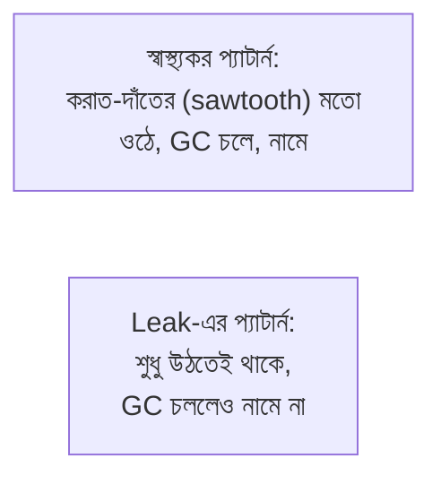

# ৩৪.০৪. Memory Leak Detection and Analysis

আগের লেসনের শেষে আমরা থ্রেড ডাম্পের মতো একটা read-only ডায়াগনস্টিক দেখেছিলাম। এই লেসনে আমরা বুঝবো কেন মেমরির দিকে নজর রাখা এত জরুরি — কারণ Python অ্যাপ্লিকেশনের সবচেয়ে ছলনাময় (sneaky) সমস্যাগুলোর একটা হলো **memory leak**। Module 33-তে আমরা যখন বারবার crash আর restart দেখার কথা বলেছিলাম, তার একটা সবচেয়ে সাধারণ কারণ এই memory leak।

Memory leak বুঝতে হলে আগে বুঝতে হবে **garbage collection (GC)** কী। Python-এ তোমাকে ম্যানুয়ালি মেমরি মুক্ত করতে হয় না (যেমন C ভাষায় করতে হয়) — CPython-এর reference counting আর generational GC নিজে থেকেই বুঝে নেয় কোন অবজেক্ট আর কেউ ব্যবহার করছে না, আর সেটা মুছে ফেলে। কিন্তু সমস্যা হয় যখন তুমি এমনভাবে কোড লেখো যে একটা অবজেক্ট, আসলে অপ্রয়োজনীয় হয়ে যাওয়ার পরেও, কোথাও না কোথাও এখনো "রেফারেন্স করা" থেকে যায় — GC ভাবে এটা এখনো দরকার, তাই মোছে না। সময়ের সাথে সাথে এরকম হাজারো অব্যবহৃত অবজেক্ট জমতে থাকে, আর মেমরি ব্যবহার ক্রমাগত বাড়তেই থাকে, কখনো কমে না।

এটা অনেকটা একটা আলমারির মতো — তুমি জিনিস ব্যবহার শেষ করেও ফেলে দাও না, শুধু আলমারিতে ভরে রাখো "যদি লাগে" ভেবে। প্রতিদিন কিছু না কিছু জমতে থাকে, একসময় আলমারি উপচে পড়ে। সবচেয়ে সাধারণ কারণগুলো হলো ভুলভাবে ব্যবহৃত module-level caches, ভুলে না-সরানো event listener/callback, বা closure-এ আটকে থাকা রেফারেন্স:

```python
# ভুল উদাহরণ: একটা module-level dict cache-এ কখনো এন্ট্রি মুছা হচ্ছে না
_cache: dict[str, "Product"] = {}

@app.get("/products/{product_id}")
async def get_product(product_id: str):
    if product_id not in _cache:
        _cache[product_id] = await Product.find_by_id(product_id)
        # প্রতিটা নতুন product ID নিয়মিত যোগ হচ্ছে, কখনো মুছছে না
    return _cache[product_id]
```

লক্ষ লক্ষ ভিন্ন product ID-এর জন্য এই cache অসীমভাবে বাড়তে থাকবে — এটাই leak। এটা Python-এ একটা খুব সাধারণ **common mistake**, কারণ module-level ভেরিয়েবল প্রসেসের পুরো জীবনকাল ধরে বেঁচে থাকে, তাই তাতে রাখা কোনো অবজেক্টই কখনো নিজে থেকে GC হয় না, যতক্ষণ না তুমি নিজে মুছছো। সমাধান হলো একটা সীমাবদ্ধ, expiry-যুক্ত cache ব্যবহার করা, যেমন `functools.lru_cache(maxsize=...)` বা `cachetools` প্যাকেজের `TTLCache`, যেগুলো পুরনো এন্ট্রি নিজে থেকে সরিয়ে দেয়।

আরেকটা কম-আলোচিত কিন্তু গুরুত্বপূর্ণ কারণ হলো **circular reference যেখানে `__del__` জড়িত**। সাধারণত CPython-এর GC circular reference (দুই অবজেক্ট একে অপরকে রেফারেন্স করছে) ঠিকই detect করে সাফ করতে পারে, কিন্তু যদি ওই চক্রের কোনো ক্লাসে `__del__` মেথড ডিফাইন করা থাকে, পুরনো Python ভার্সনে (3.4-এর আগে) GC নিশ্চিত হতে পারতো না ঠিক কোন অর্ডারে finalize করবে, তাই সেগুলোকে `gc.garbage`-এ ফেলে রাখতো, কখনো মুক্ত করতো না। আধুনিক Python-এ এই নির্দিষ্ট সমস্যা কমে গেছে, কিন্তু `__del__`-এ সাইড-ইফেক্ট (যেমন ফাইল/কানেকশন বন্ধ করা) রাখা এখনো ঝুঁকিপূর্ণ, কারণ finalization কখন ঘটবে তার নিশ্চয়তা নেই — তাই resource cleanup-এর জন্য context manager (`with`) বা `contextlib` ব্যবহার করা সবসময় ভালো, `__del__`-এর ওপর ভরসা না করে।

leak শনাক্ত করার প্রথম ধাপ হলো মেমরি ব্যবহারের গ্রাফ দেখা — যদি গ্রাফটা সময়ের সাথে ধারাবাহিকভাবে উপরের দিকে উঠতেই থাকে, কখনো নিচে না নামে (GC চললেও), সেটাই leak-এর লক্ষণ:



সন্দেহ হলে Python-এর built-in **`tracemalloc`** module ব্যবহার করে দুইটা memory snapshot নেওয়া যায় — একটা এখন, একটা কিছুক্ষণ পরে — আর দুটো তুলনা করে দেখা যায় ঠিক কোন লাইনের কোডে সবচেয়ে বেশি অবজেক্ট allocate হচ্ছে:

```python
import tracemalloc

tracemalloc.start()

# ... কিছুক্ষণ ট্রাফিক চলার পর ...

@app.post("/admin/memory-snapshot")
async def memory_snapshot(_: None = Depends(require_admin)):
    snapshot = tracemalloc.take_snapshot()
    top_stats = snapshot.statistics("lineno")[:10]
    return {"top_allocations": [str(stat) for stat in top_stats]}
```

দুইটা আলাদা সময়ে নেওয়া স্ন্যাপশট `snapshot2.compare_to(snapshot1, "lineno")` দিয়ে তুলনা করলে ঠিক বোঝা যায় কোন লাইনের allocation সবচেয়ে বেশি বেড়েছে। এর পাশাপাশি দুটো আরও ভালো টুল আছে — **`objgraph`**, যেটা দিয়ে কোন object type-এর সংখ্যা সময়ের সাথে বেড়েছে সেটা দেখা যায় (`objgraph.show_most_common_types()`) এবং কোনো একটা অবজেক্টকে কে কে রেফারেন্স করে রেখেছে তার একটা visual reference graph বানানো যায় (`objgraph.show_backrefs()`) — এটা ঠিক কোন কোড অবজেক্টটাকে আটকে রেখেছে সেটা খুঁজতে খুব কাজে দেয়; আর **`memory_profiler`**, যেটা দিয়ে লাইন-বাই-লাইন মেমরি ব্যবহার দেখা যায় (`@profile` ডেকোরেটর দিয়ে) — dev/staging-এ কোনো নির্দিষ্ট ফাংশন কতটা মেমরি নিচ্ছে সেটা বুঝতে ভালো, কিন্তু এর overhead বেশি থাকায় প্রোডাকশনে সব সময় চালু রাখা ঠিক না।

যদি দেখো `objgraph.show_most_common_types()`-এ হাজার হাজার `Product` অবজেক্ট জমে আছে, তখনই বুঝবে উপরের cache-এর মতো কোনো জায়গায় সমস্যা।

মেমরি leak ধরাটা যেমন গোয়েন্দাগিরি, ঠিক তেমনি অ্যাপের গতি কমে যাওয়ার কারণ খোঁজাও আরেক ধরনের অনুসন্ধান — যেখানে সমস্যা মেমরিতে না হয়ে CPU-তে হতে পারে। পরের, এই মডিউলের শেষ লেসনে আমরা দেখবো performance profiling দিয়ে কীভাবে সেই ধরনের সমস্যা ধরা যায়।
