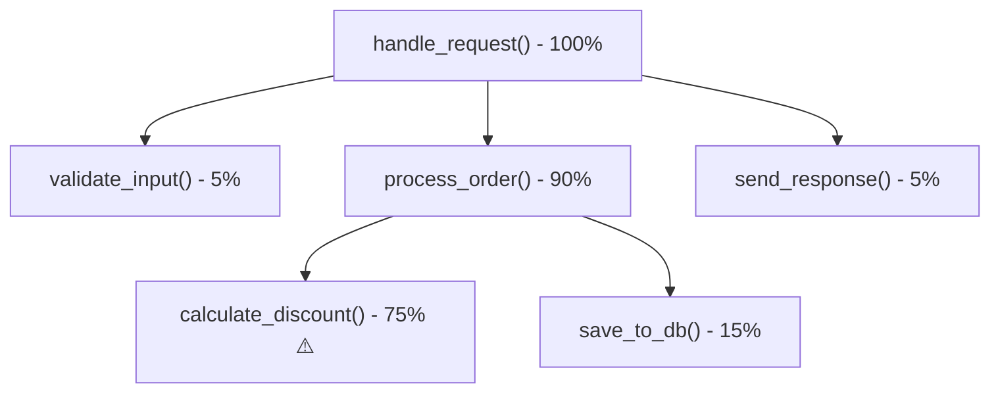

# ৩৪.০৫. Performance Profiling in Production

আমরা এই মডিউলে দেখেছি অনেক ধরনের প্রোডাকশন সমস্যা — crash, memory leak, ধীরগতির response। কিন্তু কখনো কখনো মেমরি ঠিকই আছে, লগেও অস্বাভাবিক কিছু নেই, তবু একটা নির্দিষ্ট endpoint অস্বাভাবিক ধীর। এই ধরনের সমস্যার উৎস প্রায়ই হয় CPU — কোনো একটা ফাংশন অতিরিক্ত সময় ধরে গণনা করছে, আর FastAPI-র async worker-এ কোনো ভারী synchronous (blocking) কাজ event loop-কে আটকে রাখতে পারে, বাকি সব request-কে অপেক্ষায় রেখে (Module 3-এ আমরা async/await আর event loop নিয়ে কথা বলেছিলাম)।

এই সমস্যা ধরার হাতিয়ার হলো **CPU profiling**। প্রোফাইলার একটা নির্দিষ্ট সময়ের জন্য দেখে কোন ফাংশন কতটা সময় নিচ্ছে, আর শেষে একটা রিপোর্ট বানায় — কোন ফাংশন মোট সময়ের কত শতাংশ দখল করেছে। Python-এ দুইটা প্রধান টুল আছে, আর দুটোর ব্যবহার-ক্ষেত্র আলাদা — এই পার্থক্যটা বোঝা জরুরি।

**`cProfile`** হলো Python-এর built-in deterministic profiler — এটা প্রতিটা ফাংশন কল ট্র্যাক করে, তাই ফলাফল নিখুঁত হয়:

```bash
# ডেভেলপমেন্টে/স্টেজিং-এ একটা স্ক্রিপ্ট প্রোফাইল করা
python -m cProfile -o output.prof server.py

# ফলাফল বিশ্লেষণ করা
python -c "import pstats; pstats.Stats('output.prof').sort_stats('cumulative').print_stats(10)"
```

সমস্যা হলো `cProfile` প্রতিটা function call intercept করে, তাই এর overhead অনেক বেশি — কোনো CPU-heavy অ্যাপে এটা চালু রাখলে অ্যাপ নিজেই কয়েকগুণ ধীর হয়ে যায়। এই কারণেই **`cProfile` প্রোডাকশনে সব সময় চালু রাখার জন্য উপযুক্ত নয়** — এটা মূলত dev-time টুল, যেখানে তুমি নির্দিষ্ট একটা স্ক্রিপ্ট বা টেস্ট কেস ইচ্ছাকৃতভাবে ধীর করে বিস্তারিত বিশ্লেষণ করতে চাও।

প্রোডাকশনে লাইভ ট্রাফিকের ওপর প্রোফাইল করতে হলে দরকার একটা **sampling profiler**, যেটা প্রতিটা কল ট্র্যাক না করে বরং প্রতি কয়েক মিলিসেকেন্ডে একবার "উঁকি দিয়ে" দেখে কোন লাইনে execution আটকে আছে — এতে overhead অনেক কম থাকে। এই কাজের জন্য সবচেয়ে জনপ্রিয় টুল **`py-spy`** — এটা বাইরে থেকে, প্রসেসের কোড এক লাইনও পরিবর্তন না করে, PID ধরে সরাসরি প্রোফাইল করতে পারে:

```bash
# চলমান একটা FastAPI প্রসেসের PID ধরে ৩০ সেকেন্ড স্যাম্পল নেওয়া, flame graph বানানো
py-spy record -o profile.svg --pid <PID> --duration 30

# অথবা টার্মিনালে live view (htop-এর মতো, কিন্তু ফাংশন লেভেলে)
py-spy top --pid <PID>
```

`py-spy record` থেকে পাওয়া `profile.svg`-টা একটা ইন্টারেক্টিভ **Flame Graph**, ব্রাউজারে খুলে দেখা যায়:



এখানে `calculate_discount()` স্পষ্টভাবে দোষী — মোট সময়ের ৭৫% এখানেই যাচ্ছে। এটা flame graph-এর আসল শক্তি — চোখে দেখেই বোঝা যায় কোথায় "আগুন" সবচেয়ে চওড়া (সবচেয়ে বেশি সময় খাচ্ছে), ম্যানুয়ালি প্রতিটা লাইন গণনা করতে হয় না।

`py-spy` প্রোডাকশনের জন্য বিশেষভাবে উপযোগী কারণ এটা দুইভাবে নিরাপদ: (১) sampling-based হওয়ায় overhead খুব কম, তাই লাইভ ট্রাফিকের ওপর চালালেও ইউজার টের পায় না, আর (২) এটা কোনো কোড পরিবর্তন বা redeploy ছাড়াই বাইরে থেকে PID attach করে কাজ করে — কোনো `--prof` ফ্ল্যাগ দিয়ে প্রসেস restart করতে হয় না, তাই একটা চলমান incident-এর মাঝখানেও নিরাপদে চালানো যায়। এটাই dev-time-এর `cProfile` আর production-এর `py-spy`-র মধ্যে মূল পার্থক্য — নিখুঁত কিন্তু ভারী বনাম সামান্য কম নিখুঁত কিন্তু হালকা।

লিনাক্সে `py-spy` ব্যবহারের জন্য সাধারণত `ptrace` পারমিশন লাগে (কন্টেইনারে চালাতে হলে `--cap-add=SYS_PTRACE` দিতে হতে পারে), তাই এটা প্রোডাকশন কন্টেইনার সেটআপে আগেই যোগ করে রাখা ভালো — সমস্যা হওয়ার পর তাড়াহুড়ো করে permission ঠিক করার চেয়ে।

বড় প্রতিষ্ঠানে অনেক সময় Datadog/New Relic-এর built-in continuous Python profiler-ও ব্যবহার করা হয় (Module 33), যেগুলো `py-spy`-র মতোই sampling-based, কিন্তু ওয়েব ড্যাশবোর্ডে সরাসরি flame graph আর history দেখায়, ম্যানুয়ালি PID ধরে কমান্ড চালানো ছাড়াই।

এই লেসন দিয়ে আমরা production debugging-এর টুলবক্স সম্পূর্ণ করলাম — logs দিয়ে গল্প পড়া, `debugpy` দিয়ে সরাসরি উঁকি দেওয়া, `tracemalloc`/`objgraph` দিয়ে memory leak ধরা, আর `py-spy`/`cProfile` দিয়ে ধীরগতির কারণ খুঁজে বের করা। এই চারটা হাতিয়ার একসাথে মিলিয়েই একজন ব্যাকএন্ড ইঞ্জিনিয়ার প্রোডাকশনের যেকোনো রহস্য সমাধান করতে পারে। পরের মডিউলে আমরা এগিয়ে যাবো আরও কিছু উন্নত বিষয়ে — Advanced Topics।
