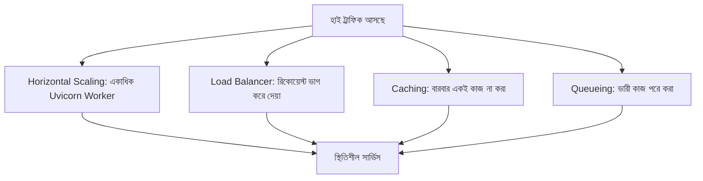

# ৩৫.১ High Traffic Management in a Backend Application

Module ৩২ আর ৩৩-এ আমরা logging আর monitoring শিখেছি — মানে এখন আমাদের হাতে সার্ভারের "স্বাস্থ্য পরীক্ষার রিপোর্ট" আছে। Module ৩৪-এ আমরা শিখেছি সেই রিপোর্ট দেখে সমস্যা কীভাবে খুঁজে বের করতে হয়। কিন্তু একটা প্রশ্ন এখনো বাকি — যদি হঠাৎ হাজার হাজার মানুষ একসাথে তোমার API-তে রিকোয়েস্ট পাঠায়, তাহলে কী হবে? এই লেসন থেকে আমরা "Advanced Topics" মডিউলে ঢুকছি, আর প্রথম আলোচনা — high traffic সামলানো।

কল্পনা করো একটা ছোট চায়ের দোকান, যেখানে একজন মাত্র কর্মচারী আছে। সাধারণ দিনে সে সবাইকে ভালোভাবে সামলাতে পারে। কিন্তু হঠাৎ একদিন এলাকায় মেলা বসলো, আর এক ঘণ্টায় ৫০০ জন কাস্টমার এলো। একজন কর্মচারী দিয়ে এটা সামলানো অসম্ভব — লাইন দীর্ঘ হবে, কাস্টমাররা বিরক্ত হয়ে চলে যাবে, কেউ কেউ ভুল অর্ডার পাবে। তোমার FastAPI সার্ভারও ঠিক এই দোকানের মতো — একটা নির্দিষ্ট ক্যাপাসিটির পর সে আর নতুন request নিতে পারে না ঠিকঠাকভাবে।

Python-এ একটা single process যতই async হোক (Module ৫-এর Event Loop মনে করো, আর Module ২৪-এর async/await), একটা মাত্র process দিয়ে সব CPU core ব্যবহার করা যায় না, আর একটা crash হলে পুরো সার্ভিস বন্ধ হয়ে যায়। তাই high traffic সামলানোর জন্য কয়েকটা মূল কৌশল আছে:



প্রথম কৌশল — **horizontal scaling**। FastAPI অ্যাপ সাধারণত Uvicorn দিয়ে চালানো হয়, কিন্তু একটা Uvicorn process মানে একটাই worker, মানে একটাই CPU core ব্যবহার হচ্ছে। Production-এ এর বদলে **Gunicorn**-কে দিয়ে একাধিক Uvicorn worker process চালানো হয়, যাতে সব CPU core ব্যবহার হয়:

```bash
# Gunicorn দিয়ে ৪টা Uvicorn worker process চালানো (৪-কোর সার্ভারের জন্য উপযুক্ত)
gunicorn app.main:app \
  --workers 4 \
  --worker-class uvicorn.workers.UvicornWorker \
  --bind 0.0.0.0:8000
```

প্রতিটা worker আসলে একটা সম্পূর্ণ আলাদা OS process, যার নিজের মেমরি আছে, নিজের event loop আছে। এটা ঠিক মেলার দিনে চায়ের দোকানে চারজন কর্মচারী নামিয়ে দেয়ার মতো — যে সংখ্যক worker, সেই সংখ্যক request একসাথে সমান্তরালে (parallel) প্রসেস হতে পারে।

দ্বিতীয় কৌশল — **load balancer**, যেটা এই একাধিক worker/instance-এর মধ্যে request ভাগ করে দেয়, ঠিক যেমন মেলার দিনে চায়ের দোকানে একজন ম্যানেজার লাইন ভাগ করে দিতো চারজন কর্মচারীর মধ্যে। Nginx বা একটা cloud load balancer (AWS ALB, ইত্যাদি) সাধারণত এই কাজ করে — একটা পাবলিক ঠিকানায় request আসে, আর সেটা ভেতরে থাকা একাধিক Gunicorn/Uvicorn instance-এর একটাতে পাঠিয়ে দেয়া হয়, round-robin বা least-connections নিয়মে।

> **প্রোডাকশন নুয়ান্স — sticky session আর in-memory state**: Module ১১-এ আমরা session বানিয়েছিলাম `session_store: dict[str, dict] = {}` দিয়ে — মানে session data সার্ভারের নিজের মেমরিতে রাখা। এখন যদি লোড ব্যালান্সারের পেছনে ৪টা Gunicorn worker/instance থাকে, আর ব্যবহারকারী প্রথম request-এ worker-১-এ লগইন করে session বানায়, কিন্তু দ্বিতীয় request load balancer ঘুরিয়ে worker-৩-এ পাঠিয়ে দেয় — worker-৩-এর মেমরিতে তো সেই session-ই নেই! ব্যবহারকারী দেখবে সে বারবার লগআউট হয়ে যাচ্ছে। এই সমস্যার দুটো সমাধান আছে: এক, "sticky session" চালু করা, যেখানে load balancer একই ব্যবহারকারীর সব request একই worker-এ পাঠায় (কিন্তু এতে load ভারসাম্য নষ্ট হয়, আর সেই worker crash করলে session হারিয়ে যায়) — দুই, আরও ভালো সমাধান, session state আর কখনো in-memory dict-এ না রেখে Redis বা ডেটাবেজে রাখা (যেমন Module ১১.৫-এ আমরা third-party session library-তে দেখেছিলাম), যাতে যেকোনো worker যেকোনো request সামলাতে পারে, কোনো worker-নির্দিষ্ট state ছাড়াই। বাস্তব production সিস্টেমে দ্বিতীয় পদ্ধতিই standard — এটাকেই বলে "stateless worker" ডিজাইন।

তৃতীয় কৌশল — **caching**, যেটা নিয়ে আমরা Module ৩১-এ বিস্তারিত দেখেছি: একই ডেটা বারবার ডেটাবেজ থেকে না এনে Redis-এ রেখে দেয়া। চতুর্থ কৌশল — **queueing**, যেখানে ভারী কাজ (যেমন ইমেইল পাঠানো, রিপোর্ট বানানো) সাথে সাথে না করে একটা লাইনে রেখে ব্যাকগ্রাউন্ডে পরে করা হয়, যাতে মূল request-response দ্রুত শেষ হয়। FastAPI-তে এর সহজ একটা রূপ হলো built-in `BackgroundTasks`:

```python
from fastapi import FastAPI, BackgroundTasks

app = FastAPI()
heavy_queue = []

def process_report(user_id: int, requested_at: float) -> None:
    heavy_queue.append({"userId": user_id, "requestedAt": requested_at})
    # আসল রিপোর্ট বানানোর ভারী কাজ এখানে হবে

@app.post("/generate-report", status_code=202)
def generate_report(user_id: int, background_tasks: BackgroundTasks):
    background_tasks.add_task(process_report, user_id, __import__("time").time())
    return {"message": "রিপোর্ট তৈরি হচ্ছে, তোমাকে notify করা হবে"}
```

লক্ষ্য করো, উপরের কোডে সার্ভার সাথে সাথে "হ্যাঁ, কাজ শুরু হয়েছে" বলে দিচ্ছে (status ২০২ — Accepted), পুরো কাজ শেষ হওয়া পর্যন্ত অপেক্ষা করাচ্ছে না। এটাই high-traffic ডিজাইনের একটা মূল নীতি: প্রতিটা request-কে যতটা সম্ভব হালকা রাখা। (সত্যিকারের production সিস্টেমে ভারী বা দীর্ঘস্থায়ী কাজের জন্য `BackgroundTasks`-এর বদলে Celery বা RQ-এর মতো dedicated task queue ব্যবহার করা হয়, কারণ `BackgroundTasks` একই process-এ চলে আর process রিস্টার্ট হলে হারিয়ে যায়।)

কিন্তু শুধু সার্ভার-সাইড কৌশল যথেষ্ট না — যদি কেউ ইচ্ছাকৃতভাবে বা ভুলবশত অস্বাভাবিক হারে request পাঠাতে থাকে, সেটাকে থামানোর ব্যবস্থাও দরকার। পরের লেসনে আমরা দেখবো কীভাবে middleware দিয়ে নিজের API-কে এই ধরনের অপব্যবহার থেকে রক্ষা করা যায়।
